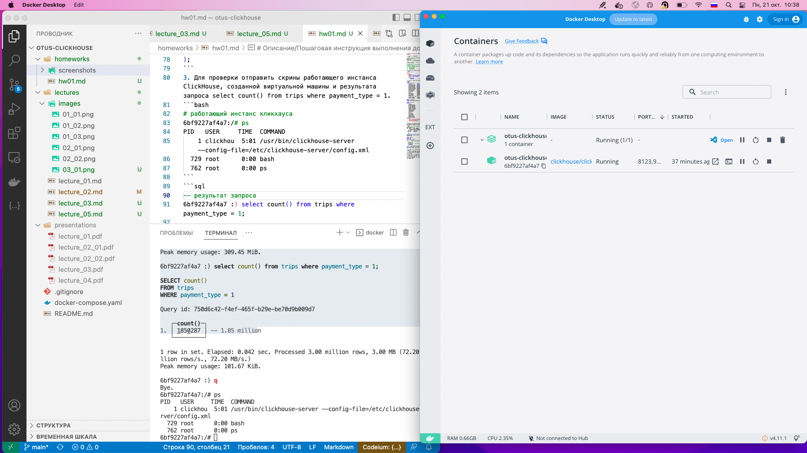

# Описание/Пошаговая инструкция выполнения домашнего задания:

1. Установить ClickHouse.
```bash
# в корне я положил компоуз файл
docker-compose up -d
docker ps
docker exec -it 6bf9227af4a7 bash

# уже в контейнере - заходим в клиент 
clickhouse-client

# 6bf9227af4a7 :) select version();
# SELECT version()
# Query id: 72fbb0f8-7244-4e5c-a3a6-4d75dfae65c7
#    ┌─version()─┐
# 1. │ 24.8.4.13 │
#    └───────────┘
```
Сам компоуз (на случай его изменений):
```yaml
version: '3.8'

services:
  clickhouse:
    image: clickhouse/clickhouse-server:24.8.4.13-alpine
    restart: unless-stopped
    ports:
      - 8123:8123
      - 9000:9000
```
2. Подгрузить датасет для примера и сделать селект из таблицы.
```sql
CREATE TABLE trips (
    trip_id             UInt32,
    pickup_datetime     DateTime,
    dropoff_datetime    DateTime,
    pickup_longitude    Nullable(Float64),
    pickup_latitude     Nullable(Float64),
    dropoff_longitude   Nullable(Float64),
    dropoff_latitude    Nullable(Float64),
    passenger_count     UInt8,
    trip_distance       Float32,
    fare_amount         Float32,
    extra               Float32,
    tip_amount          Float32,
    tolls_amount        Float32,
    total_amount        Float32,
    payment_type        Enum('CSH' = 1, 'CRE' = 2, 'NOC' = 3, 'DIS' = 4, 'UNK' = 5),
    pickup_ntaname      LowCardinality(String),
    dropoff_ntaname     LowCardinality(String)
)
ENGINE = MergeTree
PRIMARY KEY (pickup_datetime, dropoff_datetime);

INSERT INTO trips
SELECT
    trip_id,
    pickup_datetime,
    dropoff_datetime,
    pickup_longitude,
    pickup_latitude,
    dropoff_longitude,
    dropoff_latitude,
    passenger_count,
    trip_distance,
    fare_amount,
    extra,
    tip_amount,
    tolls_amount,
    total_amount,
    payment_type,
    pickup_ntaname,
    dropoff_ntaname
FROM s3(
    'https://datasets-documentation.s3.eu-west-3.amazonaws.com/nyc-taxi/trips_{0..2}.gz',
    'TabSeparatedWithNames'
);
```
3. Для проверки отправить скрины работающего инстанса ClickHouse, созданной виртуальной машины и результата запроса select count() from trips where payment_type = 1.
```bash
# работающий инстанс кликхауса
6bf9227af4a7:/# ps
PID   USER     TIME  COMMAND
    1 clickhou  5:01 /usr/bin/clickhouse-server --config-file=/etc/clickhouse-server/config.xml
  729 root      0:00 bash
  762 root      0:00 ps
```
```sql
-- результат запроса
6bf9227af4a7 :) select count() from trips where payment_type = 1;
/*
SELECT count()
FROM trips
WHERE payment_type = 1

Query id: 750d6c42-f4ef-465f-b29e-be70d9b009d7

   ┌─count()─┐
1. │ 1850287 │ -- 1.85 million
   └─────────┘

1 row in set. Elapsed: 0.042 sec. Processed 3.00 million rows, 3.00 MB (72.20 million rows/s., 72.20 MB/s.)
Peak memory usage: 101.67 KiB.
*/
```

4. Провести тестирование производительности и сохранить результаты;
```bash
echo "SELECT * FROM system.numbers LIMIT 10000000 OFFSET 10000000" | clickhouse-benchmark -i 10

# Loaded 1 queries.

# Queries executed: 6.

# localhost:9000, queries: 6, QPS: 5.655, RPS: 113093080.329, MiB/s: 862.832, result RPS: 56546540.164, result MiB/s: 431.416.

# 0.000%          0.171 sec.
# 10.000%         0.171 sec.
# 20.000%         0.171 sec.
# 30.000%         0.173 sec.
# 40.000%         0.173 sec.
# 50.000%         0.178 sec.
# 60.000%         0.178 sec.
# 70.000%         0.180 sec.
# 80.000%         0.180 sec.
# 90.000%         0.183 sec.
# 95.000%         0.183 sec.
# 99.000%         0.183 sec.
# 99.900%         0.183 sec.
# 99.990%         0.183 sec.


# Queries executed: 10.

# localhost:9000, queries: 10, QPS: 5.338, RPS: 106760910.359, MiB/s: 814.521, result RPS: 53380455.179, result MiB/s: 407.261.

# 0.000%          0.171 sec.
# 10.000%         0.171 sec.
# 20.000%         0.171 sec.
# 30.000%         0.172 sec.
# 40.000%         0.173 sec.
# 50.000%         0.178 sec.
# 60.000%         0.178 sec.
# 70.000%         0.178 sec.
# 80.000%         0.180 sec.
# 90.000%         0.180 sec.
# 95.000%         0.183 sec.
# 99.000%         0.183 sec.
# 99.900%         0.183 sec.
# 99.990%         0.183 sec.
```
5. Изучить конфигурационные файлы БД;
```bash
vi /etc/clickhouse-server/config.xml
vi /etc/clickhouse-server/users.xml
```
6. Произвести наиболее оптимальную настройку системы на основании характеристик вашей ОС и провести повторное тестирование;
```sql
select * from system.settings where name = 'max_query_size' limit 1\G;
/*
SELECT *
FROM system.settings
WHERE name = 'max_query_size'
LIMIT 1

Query id: ba3b3e51-a3c9-4236-bbc6-fa724b770160

Row 1:
──────
name:        max_query_size
value:       262144
changed:     0
description: The maximum number of bytes of a query string parsed by the SQL parser. Data in the VALUES clause of INSERT queries is processed by a separate stream parser (that consumes O(1) RAM) and not affected by this restriction.
min:         ᴺᵁᴸᴸ
max:         ᴺᵁᴸᴸ
readonly:    0
type:        UInt64
default:     262144
alias_for:   
is_obsolete: 0

1 row in set. Elapsed: 0.007 sec. Processed 1.09 thousand rows, 240.35 KB (161.32 thousand rows/s., 35.54 MB/s.)
Peak memory usage: 0.00 B.
*/
```
Теперь поменяем настройки (`vi /etc/clickhouse-server/users.d/users_query.xml`)
```xml
<clickhouse>
    <profiles>
        <default>
            <max_query_size>150000</max_query_size>
            <max_insert_threads>4</max_insert_threads>
        </default>
    </profiles>
</clickhouse>
```
Проверим результат
```sql
select * from system.settings where name = 'max_query_size' limit 1\G;
/*
SELECT *
FROM system.settings
WHERE name = 'max_query_size'
LIMIT 1

Query id: 368e1831-c695-4705-8311-e64c9141d021

Row 1:
──────
name:        max_query_size
value:       150000
changed:     1
description: The maximum number of bytes of a query string parsed by the SQL parser. Data in the VALUES clause of INSERT queries is processed by a separate stream parser (that consumes O(1) RAM) and not affected by this restriction.
min:         ᴺᵁᴸᴸ
max:         ᴺᵁᴸᴸ
readonly:    0
type:        UInt64
default:     262144
alias_for:   
is_obsolete: 0

1 row in set. Elapsed: 0.007 sec. Processed 1.09 thousand rows, 240.35 KB (148.68 thousand rows/s., 32.76 MB/s.)
Peak memory usage: 0.00 B.
*/
```
7. Подготовить отчет касательно прироста/изменения производительности системы на основе проведенных настроек.
```bash
echo "SELECT * FROM system.numbers LIMIT 10000000 OFFSET 10000000" | clickhouse-benchmark -i 10

# Loaded 1 queries.

# Queries executed: 6.

# localhost:9000, queries: 6, QPS: 5.686, RPS: 113710205.278, MiB/s: 867.540, result RPS: 56855102.639, result MiB/s: 433.770.

# 0.000%          0.171 sec.
# 10.000%         0.171 sec.
# 20.000%         0.171 sec.
# 30.000%         0.171 sec.
# 40.000%         0.171 sec.
# 50.000%         0.175 sec.
# 60.000%         0.175 sec.
# 70.000%         0.178 sec.
# 80.000%         0.178 sec.
# 90.000%         0.182 sec.
# 95.000%         0.182 sec.
# 99.000%         0.182 sec.
# 99.900%         0.182 sec.
# 99.990%         0.182 sec.


# Queries executed: 10.

# localhost:9000, queries: 10, QPS: 5.324, RPS: 106474026.759, MiB/s: 812.332, result RPS: 53237013.380, result MiB/s: 406.166.

# 0.000%          0.171 sec.
# 10.000%         0.171 sec.
# 20.000%         0.171 sec.
# 30.000%         0.171 sec.
# 40.000%         0.173 sec.
# 50.000%         0.173 sec.
# 60.000%         0.173 sec.
# 70.000%         0.175 sec.
# 80.000%         0.175 sec.
# 90.000%         0.178 sec.
# 95.000%         0.182 sec.
# 99.000%         0.182 sec.
# 99.900%         0.182 sec.
# 99.990%         0.182 sec.

```
8. Результатом выполнения работы является подготовленный отчет в формате pdf, в котором указано описание всех выполненных пунктов. Поощряется работа в отдельных гит-репозиториях

Вывод - выбранные настройки на прирост производительности не повлияли (что в целом логично, тк собирался замерять инсерт, а не селект)

