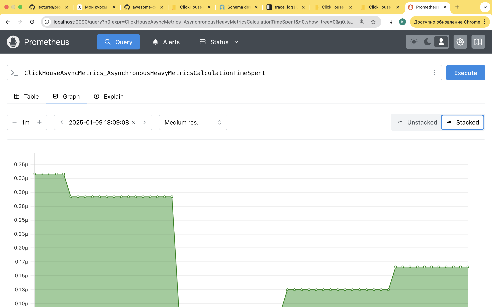

#  ДЗ по теме Метрики и мониторинг. Логирование 

## Описание/Пошаговая инструкция выполнения домашнего задания:

Вариант 1
1. Придумать 2 или более запросов для персонализированного мониторинга.
2. Создать таблицу с этими запросами в нужном формате
3. Предоставить скриншот встроенного дашборда, показывающего эти таблицы

Вариант 2
1. Развернуть Graphite/Prometheus.
2. Настроить push/pull метрик
3. Предоставить скриншот результата сбора любой метрики

По желанию, дополнительно
- Настроить для любой таблицы с логами Engine=Null
- Создать рядом дополнительную реплицируемую таблицу такой же структуры, но с любым материализованным полем идентифицирующим реплику.
- Настроить MV для захвата логов из Engine=Null таблицы в реплицируемую.
- Поднять +1 реплику, убедиться что логирование теперь реплицируемо.
- Предоставить секции конфигруации и «CREATE TABLE» таблиц для проверки.

Развернул [докер компоуз](../clusters/ch_with_monitoring/docker-compose.yml) с кликхаусом, прометеусом и графаной, все дз выполнял там. Выполнил оба варинта без дополнительного задания

### Вариант 1:

```sql
-- создание таблиц для мониторинга
create table dashboards_test
engine=MergeTree
order by tuple()
as system.dashboards;

-- первая таблица будет показывать пиковые значения потребления памяти в отдельных запросах
-- запрос, который будет выполняться (заменил подстановки rounding и seconds на цифры для дебага)
select toStartOfInterval(event_time, INTERVAL 60 SECOND)::INT AS t, max(size)
from system.trace_log 
where trace_type = 'MemoryPeak' 
and event_date >= toDate(now() - 86400) and event_date >= toDate(now() - 86400) 
GROUP BY t
ORDER BY t WITH FILL STEP 60
;

insert into dashboards_test
values
('Overview', 'memory peaks', 'select toStartOfInterval(event_time, INTERVAL {rounding:UInt32} SECOND)::INT AS t, max(size)
from system.trace_log 
where trace_type = \'MemoryPeak\' 
and event_date >= toDate(now() - {seconds:UInt32}) and event_date >= toDate(now() - {seconds:UInt32}) 
GROUP BY t
ORDER BY t WITH FILL STEP {rounding:UInt32}
;')

-- вторая таблица будет подсчитывать количество обращений к уникальным таблицам в единицу времени
select toStartOfInterval(event_time, INTERVAL 60 SECOND)::INT AS t, uniqArray(tables)
from system.query_log 
where type='QueryFinish'
and event_date >= toDate(now() - 86400) and event_date >= toDate(now() - 86400) 
GROUP BY t
ORDER BY t WITH FILL STEP 60
;

insert into dashboards_test
values
('Overview', 'count uniq tables', 'select toStartOfInterval(event_time, INTERVAL {rounding:UInt32} SECOND)::INT AS t, uniqArray(tables)
from system.query_log 
where type=\'QueryFinish\'
and event_date >= toDate(now() - {seconds:UInt32}) and event_date >= toDate(now() - {seconds:UInt32}) 
GROUP BY t
ORDER BY t WITH FILL STEP {rounding:UInt32}
;')
```

А теперь запустим какие то прожорливые запросы
```sql
SET send_logs_level='trace';

-- 
select distinct query_id
from system.trace_log;

select count()
from (select number as id from numbers(10000000, 100)) t1
left join (select number as id from numbers(10000000)) t2 using (id)
;
/*
   ┌─count()─┐
1. │     100 │
   └─────────┘
[clickhouse] 2025.01.09 18:15:10.283825 [ 64 ] {20c378c5-f26a-4df1-a49b-c8994a782008} <Debug> executeQuery: Read 10000100 rows, 76.29 MiB in 1.330706 sec., 7514883.077103432 rows/sec., 57.33 MiB/sec.
[clickhouse] 2025.01.09 18:15:10.284948 [ 64 ] {20c378c5-f26a-4df1-a49b-c8994a782008} <Debug> MemoryTracker: Peak memory usage (for query): 1.50 GiB.
[clickhouse] 2025.01.09 18:15:10.284997 [ 64 ] {20c378c5-f26a-4df1-a49b-c8994a782008} <Debug> TCPHandler: Processed in 1.332586584 sec.

1 row in set. Elapsed: 1.331 sec. Processed 10.00 million rows, 80.00 MB (7.51 million rows/s., 60.09 MB/s.)
Peak memory usage: 1.50 GiB.
*/
```

Запустим прожорливые запросы в цикле и посмотрим на графики
```bash
chmod 777 /tmp/queries/queries.sh
/tmp/queries/queries.sh
```

Скриншот дашбордов



### Вариант 2:

Развернул [докер компоуз](../clusters/ch_with_monitoring/docker-compose.yml) с кликхаусом, прометеусом и графаной, настроил забор метрик [в прометеус](../clusters/ch_with_monitoring/clickhouse/config.d/prometheus_config.xml). Скриншот работающего инстанса с произвольной метрикой:


