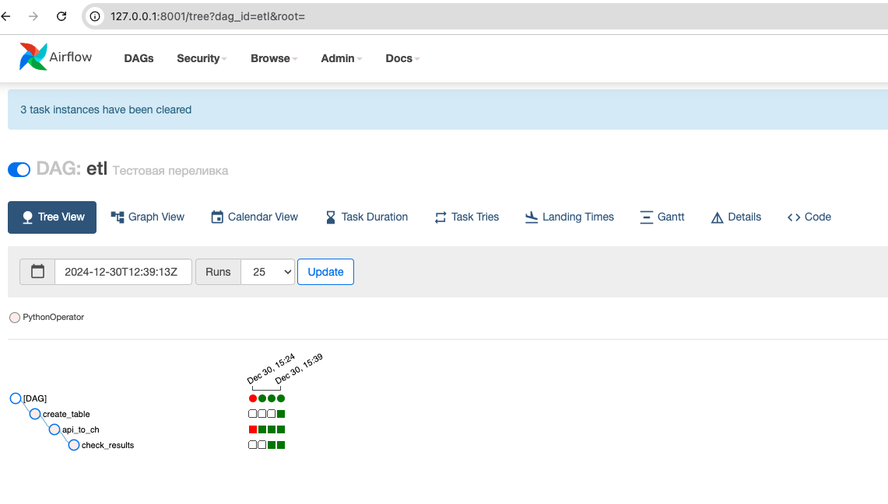

#  ДЗ по теме Оркестраторы/DI Tools 

## Описание/Пошаговая инструкция выполнения домашнего задания:

Переливка данных через ETL-инструменты

1. Развернуть инструмент для переливки данных
2. Развернуть ClickHouse
3. Выбрать любой источник (API, сервис, БД и пр.)
4. Настроить подключение инструмента к ClickHouse
5. Построить пайплайн для регулярной/разовой переливки данных в ClickHouse
6. Отобразить успешный запуск пайплайна/дага и наличие информации в БД-приемнике

Поднят эирфлоу , перекинул тестовый датасет нетфликса в кликхаус, проверил данные

