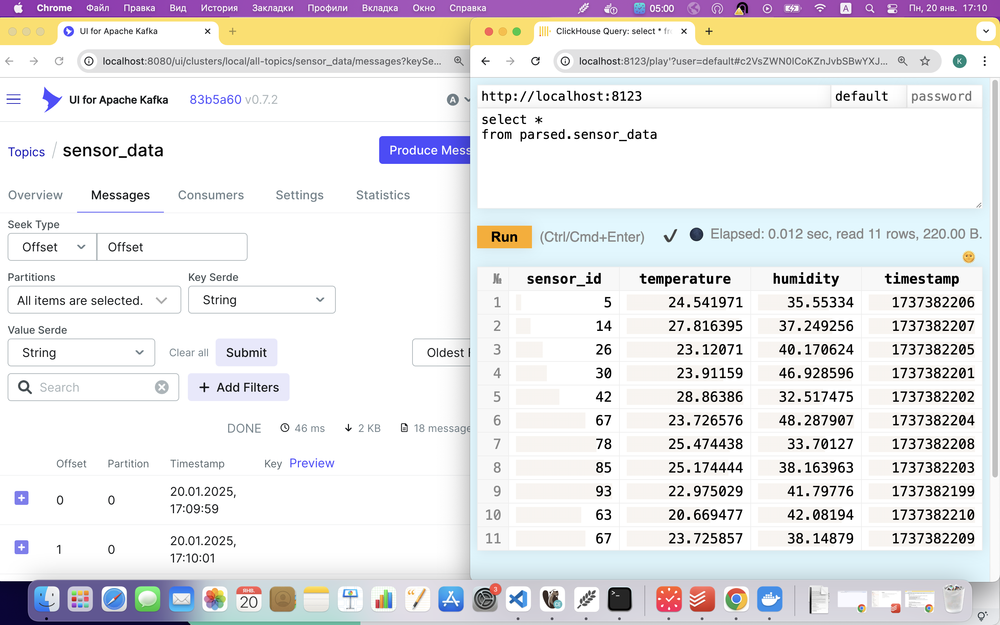
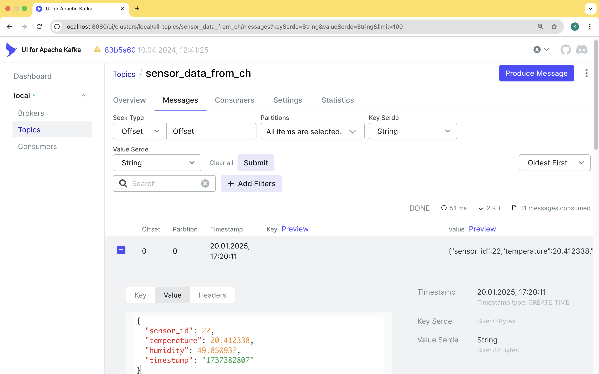

#  ДЗ по теме Интеграция с Kafka и подводные камни  

## Описание/Пошаговая инструкция выполнения домашнего задания:

Описание/Пошаговая инструкция выполнения домашнего задания:
1. Установить кафку любым удобным способом
2. Установить ClickHouse, произвести необходимые настройки
3. Записать данные в кафку, построить пайплайн чтения через kafka engine -> mv to mergetree
4. Убедиться в верном прочтении данных

Задания со звездочкой (по желанию):
1. Записать данные в кафку с помощью ClickHouse Kafka Engine (сделано, скрин ниже)
2. Построить тот же пайплайн обработки данных НЕ через Kafka Engine (не сделано, но я бы воспользовался консьюмером на питоне и вставкой через clickhouse-client в кх)

## Решение

Компоуз с кликом, кафкой и ui для кафки - здесь. Порядок действий:
1. Поднимаем [компоуз](../clusters/ch_and_kafka/docker-compose.yml)
2. Запускаем скрипт на [питоне](../clusters/ch_and_kafka/src/kafka_producer.py), который генерирует данные и пишет их в кафку 
3. проверяем данные в кликхаусе (для удобства проверки поднят UI для кафки на http://localhost:8080/) (структура БД создается при поднятии контейнера через [такие](../clusters/ch_and_kafka/db/init.sql) ддл)


```sql
SELECT *
FROM raw.sensor_data_raw
LIMIT 5
/*
Query id: b43aa616-b528-4318-b666-1755c20d61b8

   ┌─message───────────────────────────────────────────────────────────────────────────────────────────────────────┬─_topic──────┬─_offset─┬───────────_timestamp_ms─┬─_partition─┬────────────_row_created─┐
1. │ {"sensor_id": 42, "temperature": 20.637929209520728, "humidity": 32.11065477161415, "timestamp": 1737380108}  │ sensor_data │       0 │ 2025-01-20 13:35:08.700 │          0 │ 2025-01-20 13:35:14.751 │
2. │ {"sensor_id": 40, "temperature": 23.04706843514953, "humidity": 32.54672557460633, "timestamp": 1737380109}   │ sensor_data │       1 │ 2025-01-20 13:35:09.757 │          0 │ 2025-01-20 13:35:14.751 │
3. │ {"sensor_id": 88, "temperature": 22.928060666037283, "humidity": 40.80853300735107, "timestamp": 1737380110}  │ sensor_data │       2 │ 2025-01-20 13:35:10.770 │          0 │ 2025-01-20 13:35:14.751 │
4. │ {"sensor_id": 99, "temperature": 23.865006054987017, "humidity": 31.775369746570664, "timestamp": 1737380111} │ sensor_data │       3 │ 2025-01-20 13:35:11.779 │          0 │ 2025-01-20 13:35:14.751 │
5. │ {"sensor_id": 98, "temperature": 23.052491284091925, "humidity": 33.112342739222015, "timestamp": 1737380112} │ sensor_data │       4 │ 2025-01-20 13:35:12.789 │          0 │ 2025-01-20 13:35:14.751 │
   └───────────────────────────────────────────────────────────────────────────────────────────────────────────────┴─────────────┴─────────┴─────────────────────────┴────────────┴─────────────────────────┘

5 rows in set. Elapsed: 0.007 sec.
*/ 
```

Также выполнена отправка данных из клика в кафку


