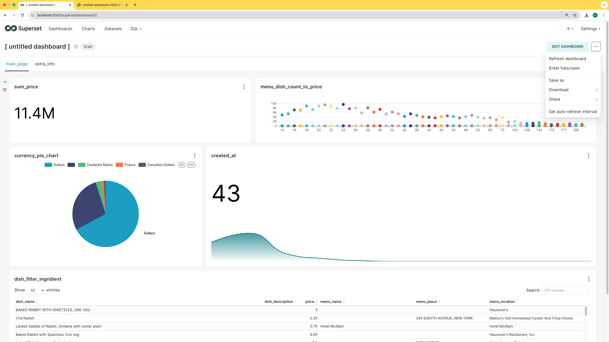

#  ДЗ по теме Интеграции с BI-инструментами 

## Описание/Пошаговая инструкция выполнения домашнего задания:

Необходимо:
- развернуть и cконфигурировать BI-решение;
- настроить подключение к источникам данных;
- рассмотреть интерактивный визуальный анализ данных (Необходимо построить дашборд с 5 различными визуализациями на основе данных в БД ClickHouse.

## Решение

Скачиваем датасеты для визуализации в специальную примонтированную директорию
```bash
cd ./clusters/ch_and_superset/ch
tar xvf 2021_08_01_07_01_17_data.tgz
rm 2021_08_01_07_01_17_data.tgz
```

Поднимаем [компоуз](../clusters/ch_and_superset/docker-compose.yaml), после чего выполняем следующие команды для старта суперсета:
```bash
docker exec -it superset superset fab create-admin \
          --username admin \
          --firstname Superset \
          --lastname Admin \
          --email admin@superset.com \
          --password admin

docker exec -it superset superset db upgrade
# docker exec -it superset superset load_examples  # по желанию
docker exec -it superset superset init
docker exec -it superset python -m pip install clickhouse-connect
docker restart superset
```

Заливаем тестовые данные в базу (команда для выполнения в контейнере с кликом)
```bash
/docker-entrypoint-initdb.d/00_create_tables.sh
```

Логинимся в суперсете и добавляем подключение к базе (справа settings -> database connections). После этого можем идти и строить наши визуализации. В качестве датасета используем денормализованную таблицу `menu.menu_item_denorm` в виде кастомного sql-запроса `select * from menu.menu_item_denorm;`. В качестве чартов у нас будут:
1. sum_price - сумма всех позиций в меню за всю историю
2. menu_dish_count_to_price - зависимость количества позиций от цены 
3. currency_pie_chart - Пай чарт с распределением по валюте
4. created_at - количество меню по дате создания (шаг год)
5. dish_filter_ingridient - таблица меню с фильтрацией по названию блюда  

После чего объединяем чарты в дашборд


Он же в браузере



Также выложил экпорт отчета в репозиторий, [тут](./scripts/dashboard_export/)