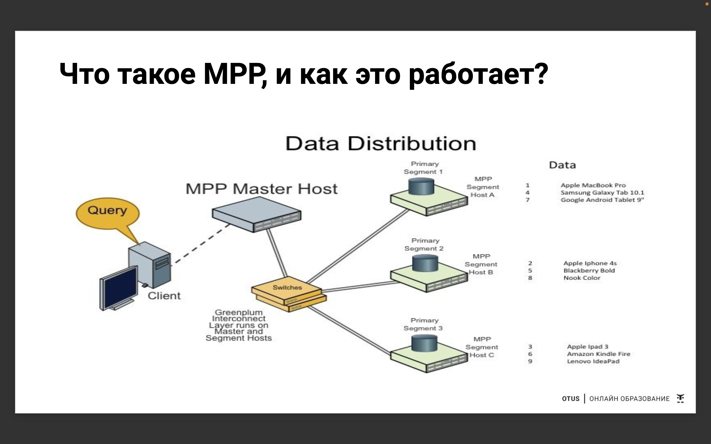
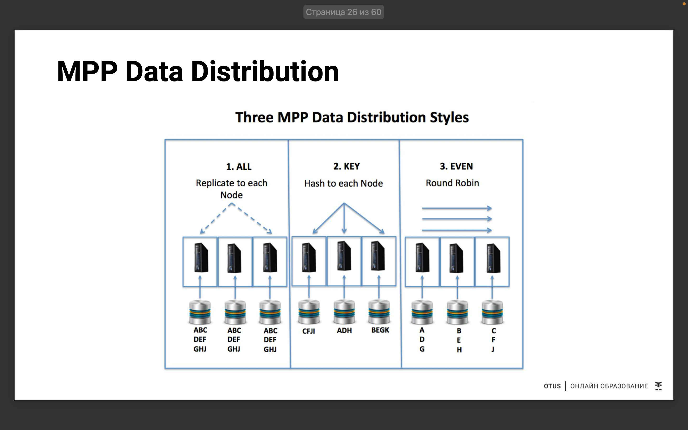
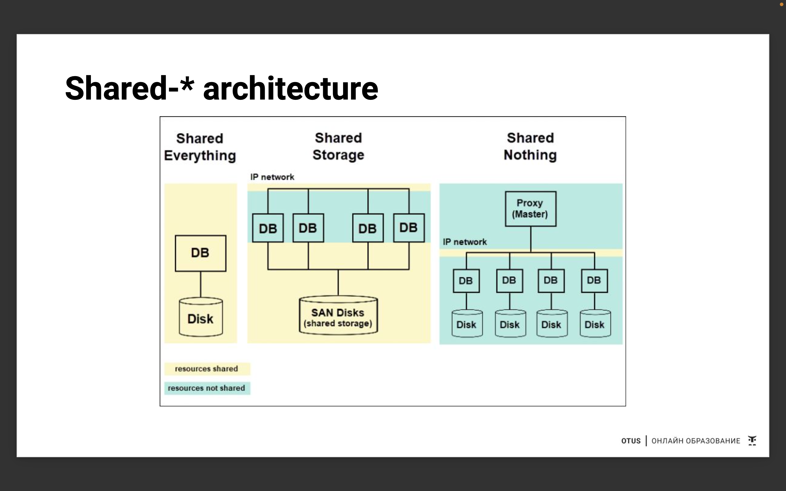

# Аналитические движки (СУБД) для работы с данными

## Аналитические СУБД как класс

Инфраструктура данных включает:
- Operational Data Systems
  - Операционные данные — это данные, которые производятся в ходе повседневной деятельности вашей организации (события, логи, действия, которые относятся к нашей организации)
  - Поддерживают доступ к OLTP 
- Analytical Data Systems:
  - Аналитические данные используются для принятия бизнес-решений (здесь анализируется информация, которую мы собрали в ходе операционной деятельности)
  - Аналитические данные лучше всего хранить в системе данных OLAP
  
OLTP = OnLine Transactional Processing - обработка транзакций в реальном времени. Реляционные БД (самый известный пример - постгрес)
- Одновременное выполнение нескольких транзакций (экономических, финансовых, цифрового взаимодействия), таких как интернет-банкинг, покупки, ввод заказов или отправка текстовых сообщений
- Задача - ввод, редактирование, удаление данных в режиме онлайн и их хранение
- Больше про нормализацию (раскалдываем данные по конкретным сущностям)
- Быстрый сбор какого то количества информации + хранение + dml операции (insert/update/delete). Так как чаще всего олтп не является mpp системой (обычно мастер+реплика) - наши апдейты/инсерты не несут большой нагрузки

Особенности OLTP
- Нормализованные данные;
- Высокая интенсивность добавления и изменения данных;
- Большое колияество одновременно активных пользователей (с другой стороны, в олапе еще больше может быть)
- Внесение данных и расчеты осуществляют пользователи системы;
- Содержат актуальные данные (*)
- OLTP использует транзакции, которые включают небольшие объемы данных.
- Индексированные данные в базе данных могут быть легко доступны
- Трехуровневая архитектура, которая обычно состоит из уровня представления,
уровня бизнес-логики и уровня хранилища данных

OLAP = OnLine Analytical Processing = аналитическая обработка данных в реальном времени. Многомерные БД
- Processing = Обрабатываются некие исходные данные...
- Analytical = ... чтобы получить какие-то аналитические отчеты или новые знания...
- OnLine = ... в реальном времени, практически без задержек на обработку. (к понятию "онлайн" следует относиться осторожно, скорее тут имеется в виду NRT - near real time)

Чаще всего OLTP и OLAP стоят рядышком!

Бизнес-смысл OLAP - Залог успешного бизнеса с точки зрения Big Data:
- Много данных (как фактовых, так и исторических)
- Проработанные механизмы сбора и обработки данных
- Крутые, мощные системы для их хранения, анализа
- Наглядные BI-системы для отображения информаыии

Все это выливается в принятие подготовленных, “правильных” бизнес-решений

Сферы применения - в анализе тенденций, финансовой отчетности, прогнозировании продаж, бюджетировании и других целях планирования

Тех-смысл OLAP
- используется для построения отчетов на основе больших объемов накопленных исторических данных за огромные промежутки времени, но эти отчеты обновляются не слишком часто (*)
- чаще всего это столбыовые СУБД (или поддерживающие column-orientation)
- выбирает данные быстро
- в центре находится таблиыа фактов, в которой находятся все показатели (сумма, кол-во) и ссылки на справочники (*)
- чем больше столбыов, тем ниже скорость выполнения операыий над строками (таких как добавление или изменение данных)
- больше про денормализацию

Особенности OLTP: OnLine Transaction Processing (OLTP) - система обработки транзакыий в реальном времени. 

Типичные операции:
- Создание (CREATE)
- Чтение (SELECT)
- Модификация (UPDATE)
- Удаление (DELETE) 

Пример: Система бронирования авиабилетов

Особенности OLAP: OnLine Analytical Processing (OLAP) - интерактивная аналитическая обработка данных. Данные суммируются, агрегируются.

Типичные операции:
- Чтение
- Агрегаыия (GROUP BY, OVER PARTITION BY)

Пример: Система отслеживания объемов продаж авиабилетов

##  Теория аналитических СУБД

Что такое MPP, и как это работает? MPP - Massive Parallel Processing ("массово" параллельная обработка данных) - выделение необходимой вычислительной мощности нескольким различным узлам.

Условно это выглядит так:

У нас есть клиент, есть мастер-хост и есть свитч (это такая сетка, которая позволяет достаточно шустро обмениваться информацией между мастером и остальными узлами). Те самые остальные узлы - это наши вычислительные ресурсы (ноды). Наши данные распределяются по этим сегментам по тем правилам, которые указаны в ддл наших таблиц. Таким образом, когда мы хотим вычислить данные в нашей таблице, они будут вычисляться в параллели по нескольким узлам. В целом вся система работает со скоростью самого медленного сегмента.

- База данных MPP — это тип базы данных или хранилища данных, в котором данные и вычислительная мощность распределяется между несколькими различными узлами (серверами) с одним ведущим узлом и одним или несколькими вычислительными узлами
- В MPP лидера (вас) называет ведущим узлом, работников библиотеки - вычислительными узлами
- Базы данных MPP можно масштабировать горизонтально, добавляя дополнительные вычислительные ресурсы (узлы)
- Плюсы — относительная быстрота обработки больших объемов данных (Shared Nothing), простота горизонтального масштабирования до сотен узлов, отказоустойчивость за счет зеркалирования и резервирования.
- Минусы — высокие требования к ресурсам, низкая производительность при большом объеме простых запросов, неоптимальное распределение сегментов

Распределение данных в MPP

Round Robin - когда хотим распределить равномерно.

Shared-архитектура - когда у нас ресурсы деляться между ОС и всем остальным. Настройка СУБД - это в том числе (на 20 процентов или даже больше) настройка той ОС в которой СУБД находится (по процам, по количеству ресурсов и тд).

Подробнее [тут](https://phoenixnap.com/kb/shared-nothing-architecture)
   
##  Показания к применение ClickHouse

- Column Oriented
- MPP, shared nothing, distributed
- Аналитическая СУБД, которую можно развернуть в облаке, Kubernetes, Docker, локально
- Open Source (Apache 2.0)

## Инструментарий разработки

На курсе разрабатываем локально/на yandex managed service. Самое важное - иметь доступ к клику и к конфигам. Версия кх не имеет значения.

Дз много, для них создать отдельную репу.

## Summary

Лекция вводная, можно скипать