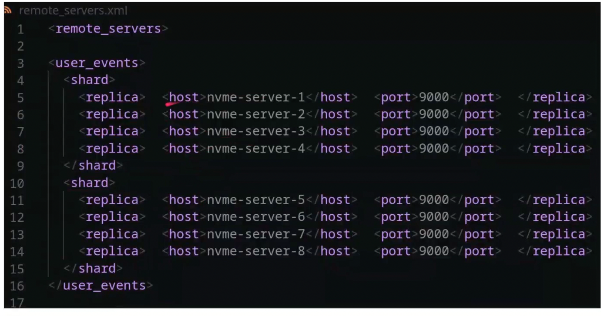
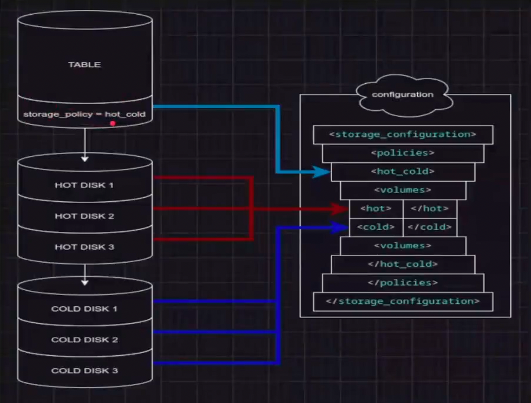

начало лекции 27:00

38:00 - про топологию (слайд "сервер может быть частью нескольких кластеров")

Чем отличается шарда от ноды: нода - это одна железка, один клик. Нода может содержать несколько шардов. Нода - затем шарды. Нода также может содержать несколько реплик или сама являться репликой. На картинке ниже хорошо описано, нода == хост



42:20 - 1:15:00 -  небольшая практика.

```bash
#  кликхаус поднят в докере
docker exec -it 2efn734rbsjd bash
```

В рамках нашего кликхауса у нас есть энное количество конфигурационных файлов. Конфигурационные файлы могут быть условно разделены на 2 различных категории - работа с пользователями (файлы для обеспечения ресурсно-ролевой модели и работы с пользователями(профили, роли. пользователи)) и настройка серверной части самого кликхауса

```bash
# изе интересных путей куда мы можем сходить в кликхаусе:
# - /var/lib/clickhouse  # и данные, и метаинформация (cd metadata)
# - /etc/clickhouse-server  # конфиги
# - /var/log/clickhouse-server/  # логи
cd /var/lib/clickhouse  # это сами наши данные
ls -la data/
```
Выдаст что то типа
```
/etc/clickhouse-server # ls -la /var/lib/clickhouse/data/
total 16
drwxr-s---    4 clickhou clickhou      4096 Oct 19 10:16 .
drwxrwsrwx   14 clickhou clickhou      4096 Oct 19 10:16 ..
drwxr-s---    2 clickhou clickhou      4096 Oct 19 10:16 default
drwxr-s---    2 clickhou clickhou      4096 Oct 19 10:17 system
```
В рамках данных у нас лежит сама описательная часть по базе данных (default - это стандартная бд, как public в постгресе), system (содержит много очень крутой вспомогательной системной информации)

Посмотрим конфигурационные файлы:
```bash
cd /etc/clickhouse-server
# тут лежат конфигурационные файлы
# /etc/clickhouse-server # ls -l
# total 100
# drwxrwxrwx    1 root     root          4096 Jul 23 09:19 config.d
# -rw-rw-rw-    1 clickhou clickhou     83100 Sep  5 20:16 config.xml
# drwxrwxrwx    2 root     root          4096 Sep  6 17:23 users.d
# -rw-rw-rw-    1 clickhou clickhou      5672 Sep  5 20:16 users.xml
```
config мы никогда не трогаем! очень не рекомендуется лезть в те конфигурационные файлы, которые для нас созданы, в любой субд чаще всего есть механизмы, которые позволяют не трогать первоначальные файлы, а перезаписать настройки, которые там хранятся. Конфигурационные файлы у кликхауса либо в формате .xml (98%), либо в .yaml

`vi config.xml` - Здесь указывается наша структура кликхауса, внутри которого уже идет вся обвязка (настройка логирования, настройка storage policy(принципов храниния), настройка аутентификации и подключения). Рекомендация - туда не лезть.

`vi users.xml` - здесь работа с профилями доступа, пользователями, дополнительная аутентификация, пароли и прочее.

Если нам нужно дополнительно что нибудь сконфигурировать - мы не лезем в эти конфиги, их остваляем как есть, AS IS. Вместо этого мы идем в директории config.d и users.d и здесь уже создаем файлы, которые перезапишут настройки из основных файлов. При этом порядок считывания настроек - алфавитный. Можем создать отдельные конфигурационные файлы для отдельных задач (но иногда такая возможность может быть выключена).

В рамках кликхауса есть отдельные xml-настройки - например, remote_servers.xml. Правила хорошего тона - сразу обозначать `<clickhouse>` `</clickhouse>`. Например: `vi /etc/clickhouse-server/config.d/localhost.xml`
```xml
<clickhouse>
    <listen_hosts>0.0.0.0</listen_hosts>
</clickhouse>
```
некоторые настройки требуют перезапуска нашего сервера (другие нет), это записано в документации! Если не нужно перезапускать сервер, но мы видим, что у нас что-то не работает: можно зайти на уровень СУБД и написать
```bash
clickhouse-client
system reload config  # такая штука читает наш конфигурационный файл еще раз
```

## Многоуровневое хранение storage policy

Мы можем описать несколько storage policy (принципы хранения) 
```bash
vi /etc/clickhouse-server/config.xml
# /storage_configuration  # для поиска 
```
Здесь мы можем указывать различные принципы хранения, используемые в рамках всего кластера. То есть есть у нас какие-то горячие/холодные данные. Мы можем указать, где хранятся холодные и где хранятся горячие данные. В storage_configuration указываются отдельно диски, в рамках которых мы можем настраивать подключения к различным базам данных, настраивать работу с данными (куда это все дело должно разгружаться). При работе с отдельными таблицами мы можем указать settings/storage и выбрать конкретный storage policy
- можно описать несколько «storage_policy»
- storage_policy состоит из набора сущностей «volume»
- volume состоит из набора сущностей «disk» - можно назначить storage_policy на таблицу
- volume имеет приоритет, данные перемещаются на нижестоящие по мере заполнения вышестоящих

поддерживается облачные диски:
- s3 / gcs / azure / hdfs / readonly web

storage_policy в том числе используются для бэкапирования - у кх есть разные варианты как это дело можно сбэкапировать.

Пример использования storage_policy:
- для таблицы задана storage_policy hot_cold
- в конфигурации hot_cold описана как 2 volume, hot и cold
- порядок указания volume имеет значение как приоритет
- данные будут записываться на HOT DISK (1,2,3), ClickHouse будет вытеснять старые данные на COLD DISK (1,2,3)



То есть то, что используется активно и имеет дату вставки ближе к нам (ближе к текущему состоянию) - мы будем держать в кликхаусе. Холодные данные будут держаться на cold диске.
 
## Хранение (1:00:00)

Посмотрим как хранятся данные. Ссылка на [датасет](https://github.com/AlexeyFerum/teaching_time/wiki/Clickhouse-init-tutorial)
```bash
cd /var/lib/clickhouse/data/default/
ls -l
# у преподавателя там лежала таблица trips (sample dataset) - команда `ls -l` выдала ссылку на настоящее место хранения таблицы
# зайдем в таблицу
cd trips
ls -la
```
Видим такую интересную штуку. 
```
/var/lib/clickhouse/data/default/trips # ls -la
total 28
drwxr-s---    6 clickhou clickhou      4096 Oct 19 11:07 .
drwxr-s---    3 clickhou clickhou      4096 Oct 19 11:05 ..
drwxr-s---    2 clickhou clickhou      4096 Oct 19 11:06 all_1_1_0
drwxr-s---    2 clickhou clickhou      4096 Oct 19 11:07 all_2_2_0
drwxr-s---    2 clickhou clickhou      4096 Oct 19 11:07 all_3_3_0
drwxr-s---    2 clickhou clickhou      4096 Oct 19 11:05 detached
-rw-r-----    1 clickhou clickhou         1 Oct 19 11:05 format_version.txt
```
У нас есть такая структура как парты. Зайдем вовнутрь - и увидим очень много файлов. Каждый из них - это отдельная колонка
```bash
/var/lib/clickhouse/data/default/trips # cd all_1_1_0/
/var/lib/clickhouse/data/default/trips/all_1_1_0 # ls -la
total 45988
drwxr-s---    2 clickhou clickhou      4096 Oct 19 11:06 .
drwxr-s---    6 clickhou clickhou      4096 Oct 19 11:07 ..
-rw-r-----    1 clickhou clickhou      2290 Oct 19 11:06 checksums.txt
-rw-r-----    1 clickhou clickhou       568 Oct 19 11:06 columns.txt
-rw-r-----    1 clickhou clickhou         7 Oct 19 11:06 count.txt
-rw-r-----    1 clickhou clickhou        10 Oct 19 11:06 default_compression_codec.txt
-rw-r-----    1 clickhou clickhou   4124098 Oct 19 11:06 dropoff_datetime.bin
-rw-r-----    1 clickhou clickhou       463 Oct 19 11:06 dropoff_datetime.cmrk2
-rw-r-----    1 clickhou clickhou   4802272 Oct 19 11:06 dropoff_latitude.bin
-rw-r-----    1 clickhou clickhou       453 Oct 19 11:06 dropoff_latitude.cmrk2
-rw-r-----    1 clickhou clickhou      4956 Oct 19 11:06 dropoff_latitude.null.bin
-rw-r-----    1 clickhou clickhou       250 Oct 19 11:06 dropoff_latitude.null.cmrk2
# и так далее
```
Это:
- файл, который содержит наши данные (только по этой колонке) - `dropoff_latitude.bin`
- файл, который хранит засечки для того, чтобы эффективнее забирать информацию `dropoff_latitude.null.cmrk2`
- дополнительные вещи - наллбл поля
- плюс есть отдельные файлики count.txt (сколько лежит строк) и columns.txt (наши поля)

Соответственно, когда нам нужно забрать информацию - кликхаус движками доходит до этих данных и обрабатывает только те файлики, которые ему нужны (другие не трогает).

Колоночное хранение обуспечивает высокую степень сжатия любыми кодеками
- однородные данные хранятся рядом
- кардинальность чаще низкая, чем высокая (уникальность наших наборов данных)
- даже на быстрых алгоритмах достигается сжатие в десятки раз

Небольшая арифметика по поводу сжатия:
- на простых запросах достигается выдача данных на скорости дисковой системы умноженной на уровень сжатия
- низкая производительность на множестве точечных запросов

Соответственно. Одна из интеграций - это BI-решения (редаш). Работа с BI-инструментами - это то еще приключение. С BI-инструментами работаем не только мы, но у наши бизнес-пользователи, а они вообще ничего не хотели знать про наш кликхаус и что там под капотом. Что означает "на простых запросах достигается выдача данных на скорости дисковой системы умноженной на уровень сжатия":
- допустим у нас есть дисковая подсистема, способная выдавать на чтение 200 MB/s
- и мы храним метрики, которые сжимаются до x40
- представим что кто-то пришел с запросом «покажи мне ВСЕ метрики»
- он получит 200x40MB/s=8GB/s поток данных, или хотя бы сколько позволит сеть
- BI-система офигевает =)

"низкая производительность на множестве точечных запросов" - здесь мы ложим не редаш, а кликхаус: здесь идет 300рпс (пришло 300 пользователей и одновременно тыкают один дашборд). Редаш - не оптимальная система (нет важных настроек, например - что при обновлении страницы убивается запрос к кликхаусу):
- важно не количество запросов в секунду, а их конкурентность
- по умолчанию количество тредов на запрос равно количеству ядер 
- 10К тредов - предел
- на сервере с 64 ядрами, предел конкурентных запросов 10000/64 = 156.25 одновременных запросов. Тут уже клик выскочит с ошибкой `DB:: Exception: no free thread`

## Терминология (1:19:00)

Engine - единая вычислительная единица в кх. Бывают database engine и table engine. В общем и целом, движок - это как данные в рамках текущей таблицы и текущей БД будут работать. database engine - чаще всего используется atomic. 

MergeTree - смысл в том, что единицей работы с данными являются парты данных. По сути, парты - это некоторая директория нашей файловой системы, куда мы можем зайти и посмотреть ту самую информацию, которая у нас есть (выше были примеры кода).

```bash
/var/lib/clickhouse/data/default/trips # ls -l
# drwxr-s---    2 clickhou clickhou      4096 Oct 19 11:06 all_1_1_0
# drwxr-s---    2 clickhou clickhou      4096 Oct 19 11:07 all_2_2_0
# drwxr-s---    2 clickhou clickhou      4096 Oct 19 11:07 all_3_3_0
# drwxr-s---    2 clickhou clickhou      4096 Oct 19 11:05 detached
# -rw-r-----    1 clickhou clickhou         1 Oct 19 11:05 format_version.txt

clickhouse-client

optimize table trips  #  
q  # выходим

/var/lib/clickhouse/data/default/trips # ls -l
total 24
drwxr-s---    2 clickhou clickhou      4096 Oct 19 11:06 all_1_1_0
drwxr-s---    2 clickhou clickhou      4096 Oct 19 11:41 all_1_3_1
drwxr-s---    2 clickhou clickhou      4096 Oct 19 11:07 all_2_2_0
drwxr-s---    2 clickhou clickhou      4096 Oct 19 11:07 all_3_3_0
drwxr-s---    2 clickhou clickhou      4096 Oct 19 11:05 detached
-rw-r-----    1 clickhou clickhou         1 Oct 19 11:05 format_version.txt
```
с таблицей ничего не изменится (с клиентской части), при этом наши данные помещаются в новую парту all_1_3_1 , а старые становятся неактивными и будут удалены в течении какого-то времени. Парты - это директория с набором данных. В таблице MergeTree каждый инсерт будет создавать директорию наподобие all_3_3_0 и туда складывать часть наших данных. После этого по принципу merge (слияния), наши данные сольются в некоторый набор других партов
```sql
-- clickhouse-client
select * from system.parts where table='trips'\G
```
выдаст что то типа
```sql
634d37c7bebe :) select * from system.parts where table='trips'\G

SELECT *
FROM system.parts
WHERE `table` = 'trips'

Query id: 76f3ae8b-89a0-4455-9cae-4269da0ba1c2

Row 1:
──────
partition:                             tuple()
name:                                  all_1_1_0
uuid:                                  00000000-0000-0000-0000-000000000000
part_type:                             Wide
active:                                0  -- является неактивной
marks:                                 137
rows:                                  1111953  -- сколько данных содержала
bytes_on_disk:                         46911528
data_compressed_bytes:                 46901426
data_uncompressed_bytes:               80372008
primary_key_size:                      1007
marks_bytes:                           8197
secondary_indices_compressed_bytes:    0
secondary_indices_uncompressed_bytes:  0
secondary_indices_marks_bytes:         0
modification_time:                     2024-10-19 11:06:27
remove_time:                           2024-10-19 11:41:55
refcount:                              1
min_date:                              1970-01-01
max_date:                              1970-01-01
min_time:                              1970-01-01 00:00:00
max_time:                              1970-01-01 00:00:00
partition_id:                          all
min_block_number:                      1
max_block_number:                      1
level:                                 0
data_version:                          1
primary_key_bytes_in_memory:           1096
primary_key_bytes_in_memory_allocated: 1352
is_frozen:                             0
database:                              default
table:                                 trips
engine:                                MergeTree
disk_name:                             default
path:                                  /var/lib/clickhouse/store/79b/79b6956f-201a-4931-952e-31ba411c082d/all_1_1_0/
hash_of_all_files:                     db394eda8917243a3e633a45e608a45f
hash_of_uncompressed_files:            4f37299ede06c083dd39dba47067d56b
uncompressed_hash_of_compressed_files: ab2f2bf2a5715114fe0a5e340a205f4e
delete_ttl_info_min:                   1970-01-01 00:00:00
delete_ttl_info_max:                   1970-01-01 00:00:00
move_ttl_info.expression:              []
move_ttl_info.min:                     []
move_ttl_info.max:                     []
default_compression_codec:             LZ4
recompression_ttl_info.expression:     []
recompression_ttl_info.min:            []
recompression_ttl_info.max:            []
group_by_ttl_info.expression:          []
group_by_ttl_info.min:                 []
group_by_ttl_info.max:                 []
rows_where_ttl_info.expression:        []
rows_where_ttl_info.min:               []
rows_where_ttl_info.max:               []
projections:                           []
visible:                               0
creation_tid:                          (1,1,'00000000-0000-0000-0000-000000000000')
removal_tid_lock:                      15317705874040209379
removal_tid:                           (1,1,'00000000-0000-0000-0000-000000000000')
creation_csn:                          0
removal_csn:                           0
has_lightweight_delete:                0
last_removal_attempt_time:             1970-01-01 00:00:00
removal_state:                         Cleanup thread hasn't seen this part yet
```

По движкам баз - почти всегда используется atomic, реже - для интеграции с другими субд. Раньше использовался движок ordinary. Разница между ними в том, что atomic не блокирует операции удаления партов. То есть раньше мы говорили `drop part` и ждали пока завершится текущий инсерт, и только тогда он дропнется. В atomic - сделали эти операции неблокирующие. Replicated - будет следующим движок по умолчанию. Разница в том что сейчас не подразумевается репликации самого запроса создания таблиц. То есть мы создаем на каждой нашей реплике одинаковые таблицы - и они становятся реплицируемыми (но тем не менее, мы создаем на каждой реплике!). Replicated: говорим на одной реплике `create table`, и запрос выполняется на всех репликах.
