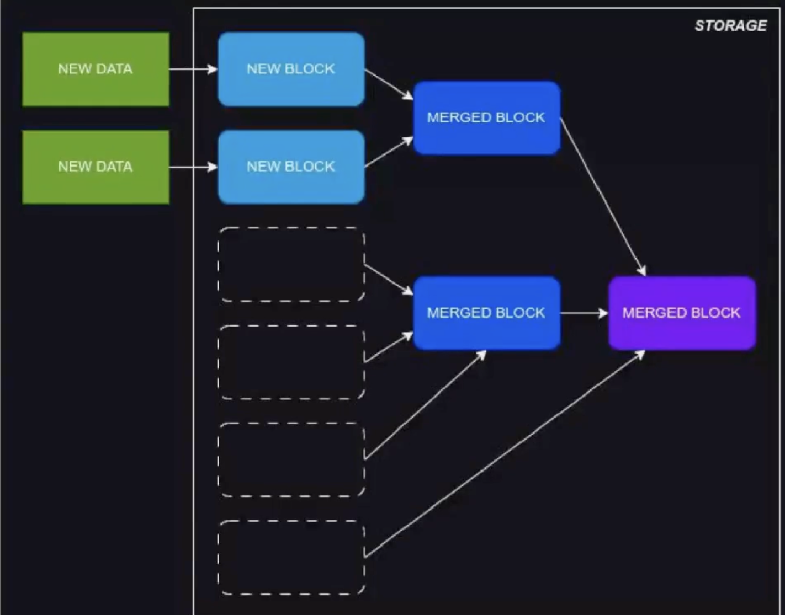
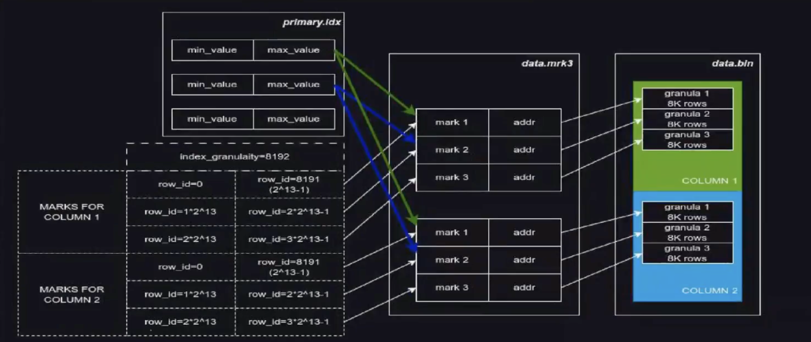
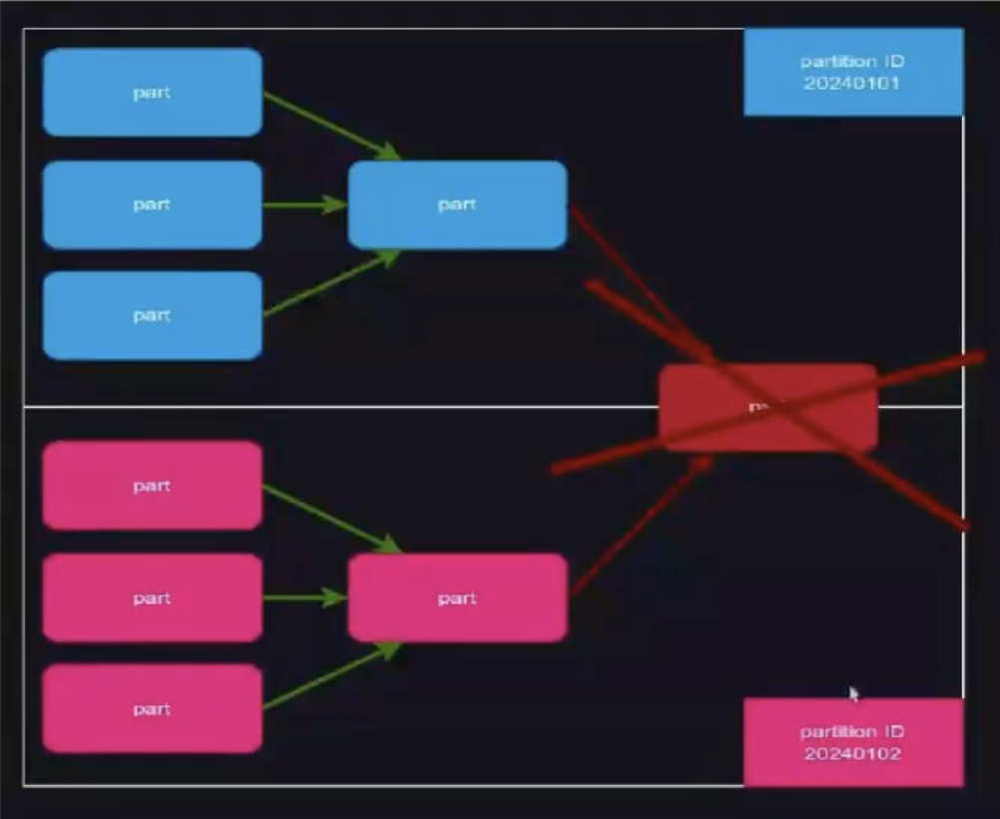

# Merge Tree

MergeTree - алгоритм объединения данных, вставленных частями. Новые данные при добавлении на хранение, добавляются блоками. Блоки объединяются в фоновом режиме, в более крупные блоки (а не единичными строками). В ClickHouse такой блок называется Part (по умочланию 2^20 - ближайшая к миллиону степень двойки). Объединение называется Merge. Концепция визуально напоминает дерево.

Сам алгоритм, если смотреть таймлайн, напоминает дерево. Именно поэтому и называется MergeTree - дерево объединений



В кликхаусе это реализовано следующим образом:
1. Данные поступают в запрос на инсерт в кликхаус ( при этом обязательно указывается формат, например, JSONEachRow), эта пачка приходит на вход парсера ( Clickhouse format parser) - встроенного механизма, который будет превращать наши данные в том формате, в котором мы их принесли - уже в блоки под кликхаусом.
2. Данные нарезаются на блоки (исходя из значения `max_insert_block_size`, можно менять в качестве параметра подключения в урле строки подключения (можно указывать и в байтах)) и сортируются по Primary Key, таким образом у нас появляются парты. (сжатие происходит именно на этом моменте - после сортировки)
3. Фоном происходит объединение блоков (Merge), объединяемые парты также сортируются между собой в новый парт

## Структура Part

Парт - это некий каталог на файловой системе, который имеет следующие наименования:
- PARTITION ID - строковое представление значения ключа партиционирования (например, если ключ партиционирования - наша дата, то в строковом представлении она будет максимально похожа на то какая дата и есть; в случае более сложэного партиционирования - кх умеет к строке приводить практически все)
- min_block - порядковый номер блока, для каждого нового блока уникальный. Когда у нас таблица реплицирована, то уникальность таких блоков обеспечивается от зукипера
- max_block - изначально равный min_block, после слияний будет номером максимального блока учавствовашего в слиянии
- level - количество слияний, произошедшее для образования Part-а. Именно после этого количества слияний у нас и получатся min_block и max_block разные

Примеры:
- 20240101_1_1_0 - Part, образованый самым первым блоком поступившим в таблицу
- 20240101_1_2_1 - Part, полученый слиянием Part-ов 20240101_1_1_0 и 20240101_2_2_0
- 20230101_1012_7238_18 - Part, полученный в результате 18 слияний, разных партов с 1012 номера блока по 7238

Когда у нас реплицированная таблица - у нас есть 2 дополнительных аргумента к этой таблице, которые и отвечают за реплицируемость (путь в зукипере и имя нашей реплики). Таблицы с одинаковвым путем в зукипере, но при этом разным именем реплики - между собой и реплицируются. Каждый шард - это самостоятельный набор реплицируемых таблиц.

## Структура Part

Как парты выглядят на файловой системе (на примере ordinary db) : у нас есть некоторый каталог в нашей файловой системе. Мы создаем нашу базу данных и в нашем `/var/lib/clickhouse/data` появляется одноименная с базой данных директория. И уже в ней появляются одноименные с именами таблиц директории. В директории таблиц у нас появляются директории партов, с названиями из примеров выше. В движке atomic все то же самое, но к именам добавляется ууид (еще один дополнительный уровень вложенности - это ускоряет поиск по файловой системе). 

Основные файлы которые там лежат:
- primary.idx - хранит значение Primary Key для каждой «засечки» - адреса на диске в файле data.bin для колонки.
- data.mrk3 - хранит сами «засечки», т.е. номер засечки и адрес в файле data.bin, для каждой колонки, для каждой гранулы (есть mrk3, mrk2 в зависимости от версии кликхауса mrk == mark, засечка)
- data.bin - хранит сами данные колонок (до 22 версии кликхауса было много директорий, каждая по имени файла. Сейчас они объединены в одну, но внутри все равно они хранятся поколоночно. Упрощенно можно считать что это тар архив)

## Primary Key - minmax index

Основная задача индекса - эффективная выборка данных, прочитать с диска только те данные, которые были запрошены (чтобы не читать лишнее). С этой целью индексы постоянно держатся в оперативной памяти. В ClickHouse классические индексы (где на одно значение ключа - одно значение в индексе), в силу объема данных, не применимы. Значение Primary Key для каждой строки, при работе с десятками терабайт данных на жестком диске, может занимать сотни гигабайт в оперативной памяти, кроме того, проход всех элементов такого индекса будет дорогим по CPU. Поэтому в ClickHouse применяется в качестве Primary Key разряженный индекс, так же называемый minmax индекс, так же называемый sparse индекс. Индексы в ClickHouse позволяют выбирать не конкретные строки, а гранулы по index_granularity строк (на каждые 8к строк одна запись в индексе).

Значение 8к - не случайно, оно соотносится с блоками (со страницами файловой системы) в оперативной памяти, ноэтому менять не стоит, но уж если менять - то делать это кратно.

Посмотрим как у нас все это хранится



У нас есть `primary.idx` - там просто идут минимальные и максимальные значения (для каждой гранулы, по очереди). Здесь даже нет необходимости иметь какую то дополнительную колонку вроде номера по порядку потому что просто номер следования в файле уже выполняет как раз эту роль. В `data.mrk3` файлы мы записываем уже непосредственно адреса в нашем `data.bin`. Причем отдельный файл засечек у нас есть для каждой колонки.

`primary.idx` у нас всегда подгружается целиком в память! Сами засечки - подгружаются по необходимости.

Кликхаус никогда не изменяет данные, которые уже создал! Когда у нас объединяются 2 парта - они вычитываются полностью и сортируются заново! Как будто они снова попали на вход парсера. То есть клик пересортирует и рожает заново груналы, индекс, засечки и дата файлы. Так порлучается новый парт и он кладется на файловую систему, старый парт при этом просто отбрасывается. Когда мы данные наинсертили и у нас получился какой то набор партов, они лежат на диске, пока их не тронут. Даже когда придет мердж - он не будет менять существующие файлы; он их вычитает, пересортирует между собой и родит новый парт рядом, с новым набором данных и снова отсортированный между собой по primary ключу. Старые парты просто удалятся, не изменяя их. Это очень важно понимать, тк вокруг этого строятся артефакты резервного копирования (такие как `alter freeze`, снэпшоты и так далее).

Primary key, order by - это два сходных понятия. Когда то в кликхаусе они означали одно и то же, но сейчас это не так. При create table они могут друг в друга дефолтиться, но на самом деле это 2 разных ключа, мы столкнемся с ээтим когда дойдем до AggregatingMT. Дело в том что Primary key - это то, вокруг чего строятся засечки и то, что у нас подымается в память. При этом по Primary key данные должны быть отсортированы чтобы мы могли в нашей отсортированной грануле видеть минимальное и максимальное значение. Да и в принципе, чтобы данные шли друг за другом по нашему минимальному и максимальному значению чтобы мы могли на весь парт иметь минмакс, быстро откидывать парты и брать только нам нужное. Ключ сортировки - это дополнительная сущность, он должен начинаться с Primary key, но не обязан им ограничиваться. Это нужно если мы не хотим иметь в памяти все колонки нашего ключа, но при этом при испльзовании каких то движком с суммированием хотим чтобы какой то дополнительный столбец, который мы добавили - не суммировался , а просто использовался как ключ.

Как посмотреть путь до файла:
```sql
SELECT COLUMNS('path')
FROM system.parts
where `table` = 'table_name'
;
```

Что из себя представляет классический джоин (55:00) - это произведение каждого на каждого, в процессе собирается какая то хэш таблица, чтобы это произведение хранить. Проблема в том, что когда мы в реляционных БД джоиним 100к строк на 100к строк - это еще как то помещается в память. В клике же приходится делать 10млн строк на 10млн строк. Проблема как правило в объеме данных! А не в проблемах кликхауса с джоинами. В кликхаусе чаще джоин используется как инструмент объединения 2 подзапросов!

Словарь позволяет взять данные из внешней системы - для этого они используются даже чаще! Кликхаус будет по расписанию ходить в источник данных и поднимать себе его в память. Создаются словари либо через xml конфиг, либо через `create dictionary`. 
```sql
CREATE DICTIONARY example_dict
(
    user_id UInt16,
    dt DateTime
)
Primary key user_id
source(clikhouse(table example_table))
LAYOUT(HASHED())
lifetime(min 0 max 10)
;

select dictGet(
    'example_dict',  -- имя словаря
    'user_id',  -- аттрибут, который мы хотим вытащить
    user_id,  -- значение ключа
);

system reload dictionary example_dict;  -- если не хоти ждать обновления словаря, можем его дернуть вручную
```

## Partition key

Не следует использовать Partition Key в качестве индекса! Это неверно, для этого существует Primary Key.

Partition Key это не более чем логическое ограничение на Merge Part-ов. Part-ы с разным Partition Key не объединяются. Так же Partition Key используется для массового удаления данных. Пример на картинке - красного парта быть не может!



Поскольку в ClickHouse точечное удаление данных реализовано как мутация всего Part-а, удобно ограничить Merge партов логической границей, чтобы потом удалять данные целыми партами, большой пачкой, соответствующей конкретному значению Partition Key. ClickHouse умеет выполнять поиск по Partition Key, однако список функций не документирован, и поведение от версии к версии меняется.

Пример - у нас есть какой то аггрегационный движок и мы хотим чтобы данные схлопывались только в пределах суток.

Важно понимать что в документации никогда не был (и не будет) описан список функций для запросов селект (для партиций)

Допустим, мы сохраняем логи и хотим сохранять логи только за последние 7 дней. Тут и может очень хорошо пригодиться ключ партиционирования

## Типы данных (1:13:00)

- String - произвольный набор байт, как мы его положили - так и забираем.
- FixedString (размер ограничивается N байт, не символов) - чуть более производителен, но не настолько, чтобы из-за этого пытаться загнуть данные в конкретные рамки. Недостающие байты заменятся на нулевые байты.
- Числовые 
  - Float32, Float64 (с плавающей запятой, аналоги float и double из языка C)
  - Decimal(P, S) - знаковые дробные, при делении лишние знаки отбрасываются, не округляются (P - сколько всего знаков, S - сколько из них дробных), десимал привязан не в двойке в степени, а к котнкретному числу знаков после запятой!
- Enum (хранится как Int8 или Int16 для Enum16) (можно вставлять строками согласно объявлению типа) , нужно чтобы экономно хранить какую то низкокардинальную колонку или чтобы ограничить диапазон допустимых значений для этой колонки

Есть служебный тип данных AggregateFunction(function, Type) - применяется для сохранения промежуточных результатов аггрегации в материализованных представлениях (то есть мы часть вычислений делаем заранее, для промежуточных результатов). Нельзя объявить явным образом. Можно объявить при создании таблицы. Можно получить, добавив суффикс -State к аггрегационной функции
```sql
SELECT uniqState(column) FROM table
```
Схлопнуть все состояния можно с помощью приставки Merge
```sql
select uniqMerge(MyAggFunc) from (select uniqState(column) AS MyAggFunc from ...)
```