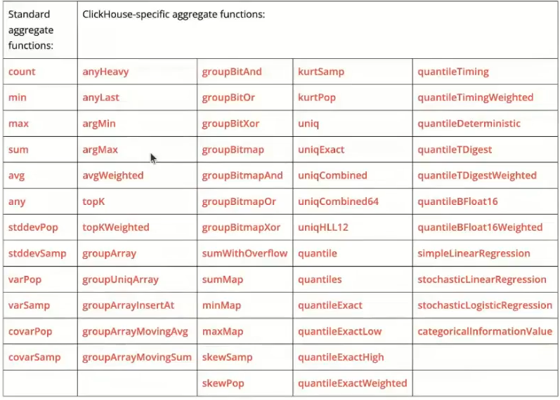

Есть [блокнот](https://colab.research.google.com/drive/1slsCJhU34RzlviHwCqIbwb8_7W4PayYA?usp=sharing#scrollTo=BWAQdy5NevBd) в гугл коллабе с набором команд, которые устанавливают кликхаус. Когад мы устанавливаем кликхаус, он просит ввести пароль по умолчанию.

Через коллаб иногда неудобно работать с кликхаусом, поэтому можно использовать такой сервис как pyngrok - это сервис, который позволяет открыть доступ к внутренним ресурсам машины, на которой он запущен (в данном случае - к коллабовской), из внешней сети, путем создания публичного адреса, все запросы на который будут переброшены на локальный адрес и заданный порт. Мы там регаемся, находим свой токен.

## Введение (12:00)

Существует как минимум два типа функций - обычные функции (регулярные функции, функции) и агрегатные функции.
- Регулярные функции работают так, как будто они применяются к каждой строке отдельно (для каждой строки результат функции не зависит от других строк).
- Агрегатные функции накапливают набор значений из разных строк (то есть они зависят от всего набора строк).

Особенности
- multiIf и case - одинаковы по производительности!
- toStartOfWeek(dt, 1) - тут 1 нужен тк иначе неделя будет начинаться с вскр 
- по массивам: 
  - функция arrayEnumerate выдаст нам массив с порядковыми номерами, удобно использовать с arrayJoin
  - arrayMap позволяет применять ко всем элементам массива функцию
  - arrayJoin - увеличивает количество строк (распаковывает массив), если используем не одна ее - может сделать декартово произведение! В этом случае бывает удобнее использовать array join:
```sql
-- декартово произведение
select 
    arrayJoin(colors) as color
    , arrayJoin(sizes) as size
from
( 
    select ['37', '38', '39'] as sizes
    , ['red', 'green', 'black'] as colors
)
;
-- построчный джоин
select 
    size
    , centimetre
from
( 
    select ['37', '38', '39'] as sizes
    , ['23', '24', '25'] as centimetres
)
array join
    sizes as size
    centimitres as centimetre
```

## JSON (39:00)

Выкатили только в июле как экспериментальную фичу (чтобы работать, может потребоваться включить `SET allow_experimental_object_type = 1;`), при этом все отлино работает и когда мы джсон передаем как строку! То есть храним в типе String.

## Агрегатные функции

в кликхаусе есть очень много агрегатных функций

очень полезные из них - argMax, argMin, позволяют избежать огромного количества джоинов.



нулл в кликхаусе равен нуллу! (мб там было 0, я не услышал)

существуют параметрические агрегатные функции (не часто используются):
- Некоторые агрегатные функции могут принимать не только столбцы аргументов (используются для сжатия), но и набор параметров - констант для инициализации.
- Синтаксис - две пары скобок вместо одной. Первая - для параметров, вторая - для аргументов.

А вот комбинаторы используются часто!
- uniqExact - позволяет очень быстро получить ПРИБЛИЗИТЕЛЬНОЕ количество уникальных значений, используется для примерной оценки, когда нужно понимать размер таблицы
- argMax - прокидываем какой столбец мы хотим получить по какому столбцу (отличная замена оконки!)
```sql
select date,
    argMax(name, score),
    argMaxIf(name, score, mod(id,2))
from table1
group by date
```

(1:05:00) Модификатор WITH ROLLUP применяется для подсчета подытогов для ключевых выражений. При этом учитывается порядок следования ключевых выражений в списке GROUP BY. Подытоги подсчитываются в обратном порядке: сначала для последнего ключевого выражения в списке, потом для предпоследнего и так далее вплоть до самого первого ключевого выражения. Строки с подытогами добавляются в конец результирующей таблицы. В колонках, по которым строки уже сгруппированы, указывается значение 0 или пустая строка.
```sql
select date, name, count(1)
from table1
group by date, name with ROLLUP
```


## UDF (1:11:00)

Прежде чем написать собственную функцию - стоит поискать ее в кликхаусе! Скорее всего она уже есть.

А так есть 2 типа пользовательских функций - исполняемые (реализованы через скрипт и xml) и просто пользовательские функции (через скрипт sql).


[Исполняемые функции](https://clickhouse.com/docs/en/sql-reference/functions/udf), определяемые пользователем
- ClickHouse может вызывать любую внешнюю исполняемую программу или скрипт для обработки данных.
- Конфигурация исполняемых функций, определяемых пользователем, может быть расположена в одном или нескольких xml-файлах. Путь к конфигурации указывается в параметре `user_defined_executable_functions_config`.

Команда должна считывать аргументы из STDIN и выводить результат в STDOUT. Команда должна обрабатывать аргументы итеративно. То есть после обработки фрагмента аргументов она должна дождаться следующего фрагмента.

Как написать:
- Файл с именем вида *_function.xm* кладем в `/etc/clickhouse-server/` (файл есть на скрине)
- Файл с функцией с именем вида *_function.py кладем в `/var/lib/clickhouse/user_scripts/` и для всех пользователей даем права на исполнение
```bash
chmod a+x /var/lib/clickhouse/user_scripts/test_function.py
clickhouse-client --user default --password 12345 --query "SELECT test_function_python(toUInt64(200));"
```

SQL User Defined Functions
- Создает функцию, определяемую пользователем (UDF), из лямбда-выражения. Выражение должно состоять из параметров функции, констант, операторов или других вызовов функций.
- Функция может иметь произвольное количество параметров.

Существует несколько ограничений:
- Имя функции должно быть уникальным среди пользовательских и системных функций.
- Рекурсивные функции не допускаются.
- Все переменные, используемые функцией, должны быть указаны в ее списке параметров.

```sql
CREATE FUNCTION linearEquation AS (x, k, b) -> k*x + b;
SELECT number, linearEquation(number, 2, 1) FROM numbers(3);
-- просмотр всех udf
SELECT name, create_query FROM system.functions
WHERE origin = 'SQLUserDefined';
-- не забываем дропать функции!
DROP FUNCTION linearEquation;
```