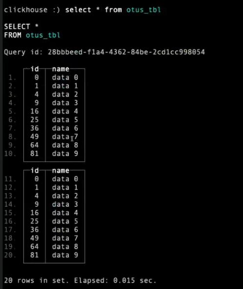
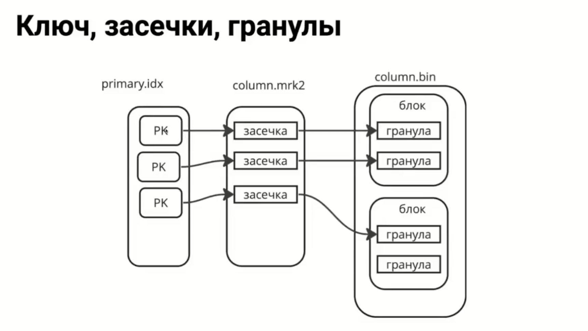

# Движки семейства MT

Основные особенности движка MergeTree
- данные записываются по частям, маленькими кусочками (parts). Единичные инсерты не делать! Это самый главный и самый больной момент в производительности кликхауса
- данные объединяются в фоновом режиме, процесс называется Merge (слияние)
- хранит данные, отсортированные по первичному ключу (или ключу сортировки)
- используется разреженный индекс, который не обеспечивает уникальности
- поддерживает репликацию данных с помощью движка ReplicatedMergeTree (репликация - это свойство движка! Это не свойство субд в целом!)
- Поддерживает семплирование данных.
- Используется сжатие данных

Атрибуты таблицы:
- ORDER BY - ключ сортировки, обязательный параметр
- PARTITION BY - ключ партицирования, например функция toYYYYMM, toYYYYMMDD от поля содержащего дату
- PRIMARY KEY - первичный ключ, если он отличается от ключа сортировки (он может быть меньше, но не может быть больше и не может менять порядок)
- SAMPLE BY – выражение для семплирования.
- TTL - список правил, определяющих длительности хранения записей, а также задающих правила перемещения частей на определённые тома или диски спустя некоторое время (допустим, можно скидывать данные на с3!
  - SYSTEM [STOP|START] MOVES [[db.]tbl_name]
- SETTINGS - раздел в котором можно указать настройки таблицы (гранулярность, расположение таблицы на диске определяемое параметром storage_policy и т.д.)
- MATERIALIZED <expression>. Значение не передается при вставке, а вычисляется и сохраняется как физический столбец (на ходу на основании каких то данных вычисляется значение и сохраняется в таблице)
- ALIAS <expr>. Вычисляемое выражение, не сохраняется. (каждый раз алиас будет пересчитываться заново)
- Также в описании поля может быть указан кодек сжатия данных.
- TTL колонки определяет, когда значения будут сброшены в дефолтное состояние (когда сбрасывается на дефолтное значение - оно практически ничего не весит на диске, сжимается до буквально пары байт). Если срок действия ВСЕХ значений в КУСКЕ истек, то ClickHouse УДАЛЯЕТ столбец из куска данных на файловой системе.
  - TTL не может быть применен к полям входящим в ключ сортировки
  - Отрабатывается при слияниях
  - SYSTEM [STOP|START] TTL MERGES [[db.]tbl_name] (форсированный запуск)

Партиция - это часть имени директории партса!

## Практика:

Создаем табличку и в ней создаем 2 партса - потому что мы делаем 2 инсерта
```sql
CREATE TABLE otus_tbl
(
	id UInt64,
	name String
)
ENGINE MergeTree()
ORDER BY id;
---

INSERT INTO otus_tbl(id, name)
select number * number, 'data ' || toString(number),
FROM numbers(10);

INSERT INTO otus_tbl(id, name)
select number * number, 'data ' || toString(number),
FROM numbers(10);
```

Если сейчас сделать `select * from otus_tbl;` (в терминале) - у нас выдаст как бы 2 партса, 2 квадрата в формате отображения по умолчанию:



теперь обратимся к системной таблице и посмотрим некоторые системные поля:
```sql
select name, uuid, engine, data_paths, metadata_path
from system.tables
where database = 'default' and name = 'otus_tbl'
FORMAT Vertical;

/*
Query id: 3285d772-7767-4165-b9c8-2f25ad4d0d97

Row 1:
──────
name:          otus_tbl
uuid:          8f9ae1a2-a6fe-49a5-82e1-640e0fb96347
engine:        MergeTree
data_paths:    ['/var/lib/clickhouse/store/8f9/8f9ae1a2-a6fe-49a5-82e1-640e0fb96347/']
metadata_path: /var/lib/clickhouse/store/f89/f89784aa-6c33-4cdf-ac51-47a80e2404a0/otus_tbl.sql
*/

SELECT *
FROM system.parts
WHERE (database = 'default') AND (table = 'otus_tbl')
ORDER BY name ASC
FORMAT Vertical;
-- выдаст 2 записи!
```
Посмотрим, что нам выдал кликхаус в первом запросе:
```bash
# что выдает: metadata_path
cat /var/lib/clickhouse/store/f89/f89784aa-6c33-4cdf-ac51-47a80e2404a0/otus_tbl.sql
# ATTACH TABLE _ UUID '8f9ae1a2-a6fe-49a5-82e1-640e0fb96347'
# (
#     `id` UInt64,
#     `name` String
# )
# ENGINE = MergeTree
# ORDER BY id
# SETTINGS index_granularity = 8192
# Мы видим что по факту у нас вместо `create table` - `attach table`, вместо имени таблицы ууид прописан и проставился сеттинг

ls -la /var/lib/clickhouse/store/8f9/8f9ae1a2-a6fe-49a5-82e1-640e0fb96347/
# total 24
# drwxr-s---    5 clickhou clickhou      4096 Nov 10 04:49 .
# drwxr-s---    3 clickhou clickhou      4096 Nov 10 04:49 ..
# drwxr-s---    2 clickhou clickhou      4096 Nov 10 04:49 all_1_1_0
# drwxr-s---    2 clickhou clickhou      4096 Nov 10 04:49 all_2_2_0
# drwxr-s---    2 clickhou clickhou      4096 Nov 10 04:49 detached
# -rw-r-----    1 clickhou clickhou         1 Nov 10 04:49 format_version.txt
# Это директория ууида, который соответствует нашей таблице. А внутри него - 2 партса
```

Теперь посмотрим на данные из таблицы `system.parts`. Здесь очень много информации и здесь мы видим информацию о 2 партах:
```sql
-- min_block_number:                      2
-- max_block_number:                      2
-- Это - части нашего названия! (name: all_2_2_0)
```

Также мы можем посмотреть инфу через ссылку
```bash
ls -la /var/lib/clickhouse/data/default/
# total 32
# drwxr-s---    2 clickhou clickhou      4096 Nov 10 04:49 .
# drwxr-s---    5 clickhou clickhou      4096 Nov  8 15:53 ..
# lrwxrwxrwx    1 clickhou clickhou        67 Nov  8 16:06 dish -> /var/lib/clickhouse/store/df1/df185cc5-5bc1-423e-b4c3-9d11e62683b4/
# lrwxrwxrwx    1 clickhou clickhou        67 Nov  8 16:06 menu -> /var/lib/clickhouse/store/c05/c05627d6-6f9f-4fec-acee-9a47cae7820b/
# lrwxrwxrwx    1 clickhou clickhou        67 Nov  8 16:06 menu_item -> /var/lib/clickhouse/store/f91/f91f1ecc-655b-47f7-bcf9-5c92074b264f/
# lrwxrwxrwx    1 clickhou clickhou        67 Nov  8 16:10 menu_item_denorm -> /var/lib/clickhouse/store/51f/51f4a306-2356-4e3c-8691-a0ef4a718447/
# lrwxrwxrwx    1 clickhou clickhou        67 Nov  8 16:06 menu_page -> /var/lib/clickhouse/store/5f8/5f866ac2-1a1e-46dc-a5bf-c859c7647cae/
# lrwxrwxrwx    1 clickhou clickhou        67 Nov 10 04:49 otus_tbl -> /var/lib/clickhouse/store/8f9/8f9ae1a2-a6fe-49a5-82e1-640e0fb96347/
```

## Хранение данных на диске. Куски. (23:00)

Что такое кусок? Это директория с файлом. Она создается при каждом инсерте.

- Кусок (part) - ето директория с файлами, которая создается при каждом INSERT. Aормат имени: `partitionId_minBlock_maxBlock_mergeLevel_<mutation>` (если таблица не партиционирована - у партса имя начинается на all)
- Куски могут обüединяться с помощью слияний (merges) в фоновом режиме либо форсированно с помощью OPTIMIZE TABLE
- файлы внутри директории могут хранится в 2х форматах: wide (каждый столбец в отдельном файле) и compact (все столбцы в одном файле), регулируется параметрами `min_rows_for_wide_part` и `min_bytes_for_wide_part`

Слияние - это когда 2 куска объединяются в один. Это происходит в основном фоном. Теперь по поводу compact:
```bash
cd /var/lib/clickhouse/store/8f9/8f9ae1a2-a6fe-49a5-82e1-640e0fb96347/all_1_1_0
ls -la
# total 44
# drwxr-s---    2 clickhou clickhou      4096 Nov 10 04:49 .
# drwxr-s---    5 clickhou clickhou      4096 Nov 10 04:49 ..
# -rw-r-----    1 clickhou clickhou       261 Nov 10 04:49 checksums.txt
# -rw-r-----    1 clickhou clickhou        63 Nov 10 04:49 columns.txt
# -rw-r-----    1 clickhou clickhou         2 Nov 10 04:49 count.txt
# -rw-r-----    1 clickhou clickhou       142 Nov 10 04:49 data.bin
# -rw-r-----    1 clickhou clickhou        58 Nov 10 04:49 data.cmrk3
# -rw-r-----    1 clickhou clickhou        10 Nov 10 04:49 default_compression_codec.txt
# -rw-r-----    1 clickhou clickhou         1 Nov 10 04:49 metadata_version.txt
# -rw-r-----    1 clickhou clickhou        50 Nov 10 04:49 primary.cidx
# -rw-r-----    1 clickhou clickhou       151 Nov 10 04:49 serialization.json
```
Здесь data.bin - это один файл, в котором сейчас содержатся все столбцы. В формате wide данные каждого столбца будут храниться каждый в своем файле.

Файлы при формате compact
- checksums.txt - содержит контрольные суммы всех файлов
- columns.txt - информация о колонках, имена и типы колонок в текстовом формате
- count.txt - число строк в куске
- data.bin - данные всех колонок в одном файле
- data.сmrk3 – файл засечек
- default_compression_codec.txt – содержит описание кодека сжатия по умолчанию (LZ4)
- primary.cidx – содержит данные первичного ключа в сжатом виде

Теперь начнем более сложную часть - создадим более большую таблицу:
```sql
DROP TABLE IF EXISTS tbl_wide;
CREATE TABLE tbl_wide 
(
    col_default UInt64 DEFAULT 42,
    col_materialized UInt64 MATERIALIZED col_default * 10,
    col_alias UInt64 ALIAS col_default + 1,
    col_codec String CODEC(ZSTD(10)),
    col_dt DateTime COMMENT 'Some comment',
    col_ttl UInt64 TTL col_dt + INTERVAL 1 MONTH
)
ENGINE MergeTree()
ORDER BY (col_default, col_dt)
PARTITION BY toYYYYMM(col_dt) 
PRIMARY KEY (col_default)
SETTINGS
	min_bytes_for_wide_part = 0;

INSERT INTO tbl_wide (
	col_default,
	col_codec,
	col_dt,
	col_ttl
)
	select
		number,
		'text value ' || toString(number),
		toDateTime('2023-10-01 00:00:00') + number * 3153600,
		rand(1) % 100000
	FROM numbers(10);

DESCRIBE TABLE tbl_wide;
-- мы партиционированы по столбцу col_dt, он у нас является частью ключа. Посмотрим, как у нас происходит поиск:
explain description=1, indexes=1 select * from tbl_wide where col_dt='2024-07-19';
/*
    ┌─explain───────────────────────────────────────────────────┐
 1. │ Expression ((Project names + Projection))                 │
 2. │   Expression                                              │
 3. │     ReadFromMergeTree (default.tbl_wide)                  │
 4. │     Indexes:                                              │
 5. │       MinMax                                              │
 6. │         Keys:                                             │
 7. │           col_dt                                          │
 8. │         Condition: (col_dt in [1721347200, 1721347200])   │
 9. │         Parts: 1/10                                       │
10. │         Granules: 1/10                                    │
11. │       Partition                                           │
12. │         Keys:                                             │
13. │           toYYYYMM(col_dt)                                │
14. │         Condition: (toYYYYMM(col_dt) in [202407, 202407]) │
15. │         Parts: 1/1                                        │
16. │         Granules: 1/1                                     │
17. │       PrimaryKey                                          │
18. │         Condition: true                                   │
19. │         Parts: 1/1                                        │
20. │         Granules: 1/1                                     │
    └───────────────────────────────────────────────────────────┘
*/
-- мы видим, что у нас 10 партсов, но нам достаточно 1 куска и 1 гранулы из них!
-- еще момент - клик у нас ищет по части индекса, но так же успешно!

explain description=1, indexes=1 select * from tbl_wide where col_ttl=276;    
-- это поле уже не является частью индекса! Так что здесь приходится сконировать все
```

Алгоритм поиска в кликхаусе у нас всегда такой: сначала минмакс, потом партишн, потом primary key !!!

Посмотрим наши партсы:
```bash
ls -l /var/lib/clickhouse/data/default/tbl_wide
# lrwxrwxrwx    1 clickhou clickhou        67 Nov 10 05:27 data/default/tbl_wide -> /var/lib/clickhouse/store/5ea/5ea16ccf-b0f2-47fa-9d8e-40d8aace8fa3/
ls -la /var/lib/clickhouse/store/5ea/5ea16ccf-b0f2-47fa-9d8e-40d8aace8fa3/
# total 56
# drwxr-s---   13 clickhou clickhou      4096 Nov 10 05:36 .
# drwxr-s---    3 clickhou clickhou      4096 Nov 10 05:27 ..
# drwxr-s---    2 clickhou clickhou      4096 Nov 10 05:28 202310_1_1_1
# drwxr-s---    2 clickhou clickhou      4096 Nov 10 05:28 202311_2_2_1
# drwxr-s---    2 clickhou clickhou      4096 Nov 10 05:28 202312_3_3_1
# drwxr-s---    2 clickhou clickhou      4096 Nov 10 05:28 202401_4_4_1
# drwxr-s---    2 clickhou clickhou      4096 Nov 10 05:28 202402_5_5_1
# drwxr-s---    2 clickhou clickhou      4096 Nov 10 05:28 202403_6_6_1
# drwxr-s---    2 clickhou clickhou      4096 Nov 10 05:28 202405_7_7_1
# drwxr-s---    2 clickhou clickhou      4096 Nov 10 05:28 202406_8_8_1
# drwxr-s---    2 clickhou clickhou      4096 Nov 10 05:28 202407_9_9_1
# drwxr-s---    2 clickhou clickhou      4096 Nov 10 05:28 202408_10_10_1
# drwxr-s---    2 clickhou clickhou      4096 Nov 10 05:27 detached
# -rw-r-----    1 clickhou clickhou         1 Nov 10 05:27 format_version.txt
```
Мы видим что часть партсов стало с 1 на конце (в моем output нулей нет, так как мердж уже прошел). Посмотрим информацию по партсам:
```sql
select name, uuid, engine, data_paths, metadata_path
from system.tables
where database = 'default' and name = 'tbl_wide'
FORMAT Vertical;

SELECT
    name,
    partition,
    active,
    part_type,
    marks,
    rows
FROM system.parts
WHERE table = 'tbl_wide';
/*
Query id: 8742c58d-2366-40cc-823c-0929afca6de4

    ┌─name───────────┬─partition─┬─active─┬─part_type─┬─marks─┬─rows─┐
 1. │ 202310_1_1_1   │ 202310    │      1 │ Wide      │     2 │    1 │
 2. │ 202311_2_2_1   │ 202311    │      1 │ Wide      │     2 │    1 │
 3. │ 202312_3_3_1   │ 202312    │      1 │ Wide      │     2 │    1 │
 4. │ 202401_4_4_1   │ 202401    │      1 │ Wide      │     2 │    1 │
 5. │ 202402_5_5_1   │ 202402    │      1 │ Wide      │     2 │    1 │
 6. │ 202403_6_6_1   │ 202403    │      1 │ Wide      │     2 │    1 │
 7. │ 202405_7_7_1   │ 202405    │      1 │ Wide      │     2 │    1 │
 8. │ 202406_8_8_1   │ 202406    │      1 │ Wide      │     2 │    1 │
 9. │ 202407_9_9_1   │ 202407    │      1 │ Wide      │     2 │    1 │
10. │ 202408_10_10_1 │ 202408    │      1 │ Wide      │     2 │    1 │
    └────────────────┴───────────┴────────┴───────────┴───────┴──────┘
*/
```
Неактивные файлы (директории, партсы) фоном удаляет джоба! 

Мы 1 запросом вставляли 10 записей. По идее у нас должен был вставиться 1 партс. Но мы указали `partition by`. Когда мы разделяем что то на партиции - у нас разные имена директорий. Партиции НИКОГДА между собой не сливаются. Это кардинальная фишка. То есть даже если сделать `select * from tbl_wide;` - у нас в терминале будет 10 окошек.

В нашем ддл мы указали `min_bytes_for_wide_part = 0;`, поэтому сейчас у нас для каждой колонки свои файлы .bin и .cmrk2:
```bash
pwd
# /var/lib/clickhouse/data/default/tbl_wide/202310_1_1_1
ls -la
# total 88
# drwxr-s---    2 clickhou clickhou      4096 Nov 10 05:28 .
# drwxr-s---   13 clickhou clickhou      4096 Nov 10 05:36 ..
# -rw-r-----    1 clickhou clickhou       659 Nov 10 05:28 checksums.txt
# -rw-r-----    1 clickhou clickhou        47 Nov 10 05:28 col_codec.bin
# -rw-r-----    1 clickhou clickhou        47 Nov 10 05:28 col_codec.cmrk2
# -rw-r-----    1 clickhou clickhou         0 Nov 10 05:28 col_default.bin
# -rw-r-----    1 clickhou clickhou        46 Nov 10 05:28 col_default.cmrk2
# -rw-r-----    1 clickhou clickhou        35 Nov 10 05:28 col_default.sparse.idx.bin
# -rw-r-----    1 clickhou clickhou        47 Nov 10 05:28 col_default.sparse.idx.cmrk2
# -rw-r-----    1 clickhou clickhou        30 Nov 10 05:28 col_dt.bin
# -rw-r-----    1 clickhou clickhou        47 Nov 10 05:28 col_dt.cmrk2
# -rw-r-----    1 clickhou clickhou         0 Nov 10 05:28 col_materialized.bin
# -rw-r-----    1 clickhou clickhou        46 Nov 10 05:28 col_materialized.cmrk2
# -rw-r-----    1 clickhou clickhou        35 Nov 10 05:28 col_materialized.sparse.idx.bin
# -rw-r-----    1 clickhou clickhou        47 Nov 10 05:28 col_materialized.sparse.idx.cmrk2
# -rw-r-----    1 clickhou clickhou       121 Nov 10 05:28 columns.txt
# -rw-r-----    1 clickhou clickhou         1 Nov 10 05:28 count.txt
# -rw-r-----    1 clickhou clickhou        10 Nov 10 05:28 default_compression_codec.txt
# -rw-r-----    1 clickhou clickhou         1 Nov 10 05:28 metadata_version.txt
# -rw-r-----    1 clickhou clickhou         8 Nov 10 05:28 minmax_col_dt.idx
# -rw-r-----    1 clickhou clickhou         4 Nov 10 05:28 partition.dat
# -rw-r-----    1 clickhou clickhou        42 Nov 10 05:28 primary.cidx
# -rw-r-----    1 clickhou clickhou       301 Nov 10 05:28 serialization.json
# -rw-r-----    1 clickhou clickhou        83 Nov 10 05:28 ttl.txt
```
При этом col_ttl тут отсутствует! Так как он схлопнулся - то он и удалился (но в предыдущей версии, до мерджа, он был). Можно сделать инсерт с датой побольше чтобы ттл не отработал и убедиться, что директории появятся.

## Партиции (46:00)

Партиции
- Определяются произвольным ключом партиционирования (не рекомендуется делать слишком гранулированным)
- Оптимизируют работу с данными (искать по одной директории проще, чем бегать по всем)
- [Имеется](https://clickhouse.com/docs/ru/sql-reference/statements/alter/partition) большой набор операций для манипуляций с партициями
- Директория detached содержит куски, отсоединенные от таблицы с помощью запроса DETACH. Поврежденные куски также попадают в ету директорию – они не удаляются с сервера.

Теперь поговорим о том, что же такое отдельный .bin (то есть данные для каждого столбца):
- данные разбиты на блоки отсортированные по первичному ключу 
- блок содержит данные в сжатом виде
- блок состоит из гранул
- гранула - минимальный неделимый набор данных, считываемый при выборке
  - размер гранул ограничен настройками
  - первая строка гранулы помечается засечкой

отдельный файл засечек .cmrk2 (compressed mark 2) для каждого столбца хранит засечки в виде
- смещение блока в bin-файле
- смещение в разжатом блоке
- количество строк в грануле.

Ключ сортировки, первичный ключ
- ключ сортировки должен быть обязательно указан
- первичный ключ может быть не указан
  - первичным ключом будет ключ сортировки
  - если указан то должен быть префиксом кортежа ключа сортировки
  - ПК имеет смысл при использовании движков SummingMergeTree и AggregatingMergeTree.
- первичный ключ не обеспечивает уникальности
- позволяет поиск по любой части ключа
- для хранения используется разреженный индекс в файле primary.cidx
  - каждое хранимое значение адресует засечку
  - количество значений равно количеству гранул

У нас есть директория, в ней - первичный ключ, в нем - 10 значений. Выглядит это так:



У нас есть primary.idx, каждое значение определяет что мы где-то. Мы нашли засечку, по засечке нашли гранулу и считали какой-то блок данных. К занятию приложена классная преза от яндекса, где объясняется, что это такое.

## Слияние (54 00)

- Процесс слияния запускается в фоновом режиме для оптимизации хранения
- Один кусок участвует только в одном слиянии
- Куски из разных партиций не сливаются вместе
- Обработанные куски становятся неактивными
- Неактивные куски впоследствии удаляются из файловой системы и system.parts
- Чтение происходит ТОЛЬКО из активных кусков (поэтому слияние не мешает чтению)
- Ключ сортировки является ключом для слияния и является первичным ключом по умолчанию.

В связи с этим у нас появляется классная опреация [optimize table](https://clickhouse.com/docs/ru/sql-reference/statements/optimize) , по факту она запускает внеплановое слияние. Есть опции `deduplicate`, `final`, они очень важны. По внеплановому слиянию:
- создает внеочередное задание на merge (то есть это асинхронная операция - работает в фоне)
- по умолчанию не оповещается если merge выполнить не удалось (регулируется опцией optimize_throw_if_noop.)
- PARTITION - только для одной партиции
- DEDUPLICATE - удаляет полные дубли строк (либо по набору BY)
- FINAL - принудительное слияние даже при наличии только одного куска (не рекомендуется , может вести к деградации производительности)
- слияние на репликах регулируется опцией alter_sync

Настройки МТ:
- можно указать для каждой таблицы при создании
- `select * from system.merge_tree_settings`
- [документация](https://clickhouse.com/docs/ru/engines/table-engines/mergetree-family/mergetree#mergetree-query-clauses)

Стоит обратить внимание ВСЕГДА на гранулярность и политики хранения !!!!

Выполним еще раз инсерт:
```sql
INSERT INTO tbl_wide (
	col_default,
	col_codec,
	col_dt,
	col_ttl
)
	select
		number,
		'text value ' || toString(number),
		toDateTime('2023-10-01 00:00:00') + number * 3153600,
		rand(1) % 100000
	FROM numbers(10);

SELECT
    name,
    partition,
    active,
    part_type,
    marks,
    rows
FROM system.parts
WHERE table = 'tbl_wide';
OPTIMIZE TABLE tbl_wide;
```
После этого мы увидим, что где то имя парта стало заканчиваться на 2. Задержка очистки по дефолту составляет 8 минут и отдельно не настраивается.

Самое главное - настройки `select * from system.merge_tree_settings`.

## Семейство МТ (1 07 00)

"под капотом" движок MergeTree для хранения данных
- SummingMergeTree
- AggregatingMergeTree
- ReplacingMergeTree
- CollapsingMergeTree(sign)
- VersionedCollapsingMergeTree
- GraphiteMergeTree
- Replicated*MergeTree

МТ хорош тем что в него удобно вставлять и хранить данные, но при этом удалять и обновлять - не очень удобно. Для этого и существуют другие движки семейства. Очень важно понимать принцип работы этих движков для правильной работы.

SummingMergeTree - постобработка, где мы суммируем имеющиеся данные
- группировка по первичному ключу
- суммируются значения в полях, заданных как параметры движка
- все остальные поля агрегируются выбором произвольного (!!!!) значения
- группировка происходит ИСКЛЮЧИТЕЛЬНО во время слияний

```sql
DROP TABLE IF EXISTS summing_tbl;
CREATE TABLE summing_tbl
(
id UInt32,
val UInt32,
val2 UInt32
)
ENGINE = SummingMergeTree(val) -- сумма будет применяться к полю val
ORDER BY (id); -- записи по этому ключу будут группироваться

-- вставим данные
INSERT INTO summing_tbl 
SELECT 1, (number + 1) * 10, number from numbers(10);
INSERT INTO summing_tbl SELECT 1, 100, 5;

SELECT * FROM summing_tbl;
/*
Query id: 879e78dc-4f23-434e-89dd-5532d9b5f48c

   ┌─id─┬─val─┬─val2─┐
1. │  1 │ 550 │    0 │
   └────┴─────┴──────┘
   ┌─id─┬─val─┬─val2─┐
2. │  1 │ 100 │    5 │
   └────┴─────┴──────┘

2 rows in set. Elapsed: 0.010 sec. 
*/
SELECT * FROM summing_tbl FINAL;
/*
Query id: 2216ee81-8c63-4bf4-99d9-53a125b9026b

   ┌─id─┬─val─┬─val2─┐
1. │  1 │ 650 │    0 │
   └────┴─────┴──────┘

1 row in set. Elapsed: 0.004 sec. 
*/
-- read without FINAL
SELECT id, sum(val)
FROM summing_tbl
GROUP BY id

-- если сделаем оптимайз - то больше final не требуется!
OPTIMIZE TABLE summing_tbl;
SELECT * FROM summing_tbl;

-- можем посмотреть что происходило через системную таблицу
select event_time, event_type, part_name, partition_id
from system.part_log
where table = 'summing_tbl';

-- с другим айди слияния не будет
INSERT INTO summing_tbl SELECT 2, 10, 5;
OPTIMIZE TABLE summing_tbl;
SELECT * FROM summing_tbl;
```

AggregatingMergeTree (у нас есть множество агрегирующих функций, которыми хотелось бы пользоваться. Для них и существует этот движок)
- группировка по первичному ключу (который может быть задан отдельно и быть меньше ключа сортировки)
- агрегируются значения в полях с типами данных:
  - AggregateFunction - хранит промежуточное состояние
    - Для вставки данных используйте INSERT SELECT с агрегатными -State-функциями.
    - При выборке данных из таблицы AggregatingMergeTree, используйте GROUP BY и те же агрегатные функции, что и при вставке данных, но с суффиксом -Merge.
    - для чтения сырых данных используйте finalizeAggregation
  - SimpleAggregateFunction - хранит текущее состояние
```sql
DROP TABLE IF EXISTS aggr_tbl;
CREATE TABLE aggr_tbl 
(
    id UInt64, 
    val_uniq AggregateFunction(uniq, UInt64), 
    val_max AggregateFunction(maxIf, String, UInt8), 
    val_avg AggregateFunction(avg, UInt64) 
) 
ENGINE=AggregatingMergeTree 
ORDER BY id;
-- AggregateFunction - тип данных, затем задаем параметры

-- произведем вставку - в нашу агрегирующую таблицу вставим те же функции, что и типы данных
INSERT INTO aggr_tbl 
SELECT 1, 
uniqState(toUInt64(rnd)), 
maxIfState(toString(rnd),rnd%2=0), 
avgState(toUInt64(rnd)) 
FROM (SELECT rand(1) % 100000 as rnd from numbers(10));

-- данные хранятся в промежуточном виде! поэтому селектить приходится именно через функции
select * from aggr_tbl;
select 
    finalizeAggregation(val_uniq), 
    finalizeAggregation(val_avg), 
    finalizeAggregation(val_max) 
from aggr_tbl;

select 
uniqMerge(val_uniq), 
avgMerge(val_avg), 
maxIfMerge(val_max) 
from aggr_tbl;

-- повторим вставку и выборку
-- запрос выдаст уже другие значения!
select 
    uniqMerge(val_uniq), 
    avgMerge(val_avg), 
    maxIfMerge(val_max) 
from aggr_tbl;

-- finalizeAggregation в отличие от мердж показывает состояние данных в каждом куске в текущий момент, если сделать optimize table aggr_tbl; -  то finalizeAggregation покажет опять те же результаты, что и мердж
```

Следующие 2 движка - про обновление и удаление.(Предыдущие были про то чтобы выбирать быстрее)

ReplacingMergeTree
- подходит в случае необходимости частых обновлений
- удаляет дублирующиеся записи с одинаковым значением ключа сортировки. (правильным значением является последнее)
- остается самая последняя строка из самой последней вставки (или с наибольшей версией)
- ENGINE = ReplacingMergeTree([ver [, is_deleted]])
  - ver - столбец с номером версии (необязательный параметр).
  - is_deleted - для управления удалением (необязательный параметр).
- удаление дублирующихся записей происходит при слиянии (Некоторая часть данных может оставаться необработанной. Когда данные сольются и уже останутся в одном куске - вот уже тогда останется одна запись)
- подходит для хранения данных без дубликатов, но не гарантирует отсутствие дубликатов при чтении без модификатора FINAL.

```sql
DROP TABLE IF EXISTS replacing_tbl;
CREATE TABLE replacing_tbl
(
    id UInt32,
    val UInt32
)
ENGINE = ReplacingMergeTree
ORDER BY (id);

INSERT INTO replacing_tbl SELECT 1, (number + 1) * 10 from numbers(3);
INSERT INTO replacing_tbl SELECT 2, (number + 1) * 100 from numbers(3);
SELECT * FROM replacing_tbl;

INSERT INTO replacing_tbl SELECT 1, 100;
INSERT INTO replacing_tbl SELECT 2, 100;
SELECT * FROM replacing_tbl;
-- 4 rows in set. Elapsed: 0.009 sec. 
SELECT * FROM replacing_tbl FINAL;

-- посмотрим более наглядно как это работает под капотом
SELECT
	id, val,
	_part, _partition_id,
	row_number() over (partition by id 
						order by _partition_id desc, _part desc) as lvl
FROM replacing_tbl
order by lvl asc;
/*
Query id: be80bc0e-aaea-444f-af99-ee58f707384b

   ┌─id─┬─val─┬─_part─────┬─_partition_id─┬─lvl─┐
1. │  1 │ 100 │ all_3_3_0 │ all           │   1 │
2. │  2 │ 100 │ all_4_4_0 │ all           │   1 │
3. │  1 │  30 │ all_1_1_0 │ all           │   2 │
4. │  2 │ 300 │ all_2_2_0 │ all           │   2 │
   └────┴─────┴───────────┴───────────────┴─────┘

4 rows in set. Elapsed: 0.016 sec. 
*/

select * from (
	SELECT
		id, val,
		_part, _partition_id,
		row_number() over (partition by id order by _partition_id desc, _part desc) as lvl
	FROM replacing_tbl
	order by lvl asc
) T WHERE T.lvl = 1;
/*
Query id: 64d9b9af-c98f-47de-99aa-b74f54b4fc5e

   ┌─id─┬─val─┬─_part─────┬─_partition_id─┬─lvl─┐
1. │  1 │ 100 │ all_3_3_0 │ all           │   1 │
   └────┴─────┴───────────┴───────────────┴─────┘
   ┌─id─┬─val─┬─_part─────┬─_partition_id─┬─lvl─┐
2. │  2 │ 100 │ all_4_4_0 │ all           │   1 │
   └────┴─────┴───────────┴───────────────┴─────┘

2 rows in set. Elapsed: 0.011 sec. 
*/

OPTIMIZE TABLE replacing_tbl;
SELECT * FROM replacing_tbl;

--- replacing with version
DROP TABLE IF EXISTS replacing_mt_v;
CREATE TABLE replacing_mt_v
(
    id UInt32,
    val UInt32,
    version Int32
)
ENGINE = ReplacingMergeTree(version)
ORDER BY (id);

SELECT 1, (number + 1) * 10, number * (-1)
from numbers(3);
/*
   ┌─1─┬─multiply(plus(number, 1), 10)─┬─multiply(number, -1)─┐
1. │ 1 │                            10 │                    0 │
2. │ 1 │                            20 │                   -1 │
3. │ 1 │                            30 │                   -2 │
   └───┴───────────────────────────────┴──────────────────────┘
*/

-- вставится только последняя версия
INSERT INTO replacing_mt_v SELECT 1, (number + 1) * 10, number * (-1)
from numbers(3);
SELECT * FROM replacing_mt_v;

INSERT INTO replacing_mt_v SELECT 1, 100, 1;
SELECT * FROM replacing_mt_v;  -- до мерджа будут 2 версии
/*
Query id: aac40576-44e5-4141-8bad-efb39e82f2a6

   ┌─id─┬─val─┬─version─┐
1. │  1 │ 100 │       1 │
   └────┴─────┴─────────┘
   ┌─id─┬─val─┬─version─┐
2. │  1 │  10 │       0 │
   └────┴─────┴─────────┘

2 rows in set. Elapsed: 0.009 sec. 
*/
SELECT * FROM replacing_mt_v FINAL;
/*
Query id: 2d1b8c14-f554-4cf7-a233-831747279e1c

   ┌─id─┬─val─┬─version─┐
1. │  1 │ 100 │       1 │
   └────┴─────┴─────────┘

1 row in set. Elapsed: 0.006 sec. 
*/
OPTIMIZE TABLE replacing_mt_v;

```

CollapsingMergeTree(sign) (со знаком)
- подходит в случае необходимости частых обновлений
  - удаляем предыдущее значение с помощью sign = -1
  - вставляем новое значение с помощью sign = 1
- ENGINE = CollapsingMergeTree(sign)
  - удаляет строки с одинаковыми значениями ключа сортировки, но разными sign (1 и -1)
  - за значениями sign должно следить приложение
  - строки без пары сохраняются
  - удаление происходит во время слияний

```sql
DROP TABLE IF EXISTS table_collapsing;
CREATE TABLE table_collapsing
(
    id UInt32,
    pageViews UInt8,
    duration UInt8,
    sign Int8
)
ENGINE = CollapsingMergeTree(sign)
ORDER BY id;

-- вставляем актуальную запись
INSERT INTO table_collapsing VALUES (1, 7, 100, 1);
-- в какой то момент решаем обновить значение и вставляем 2 записи:
-- ужаляем предыдущую, вставляя те же параметры ключа и sign -1
-- вставляем новую запись
INSERT INTO table_collapsing VALUES (1, 7, 100, -1), (1, 8, 150, 1);

SELECT * FROM table_collapsing;
/*
Query id: ea9dc369-2a61-4378-968f-01bc148a1170

   ┌─id─┬─pageViews─┬─duration─┬─sign─┐
1. │  1 │         7 │      100 │   -1 │
2. │  1 │         8 │      150 │    1 │
   └────┴───────────┴──────────┴──────┘
   ┌─id─┬─pageViews─┬─duration─┬─sign─┐
3. │  1 │         7 │      100 │    1 │
   └────┴───────────┴──────────┴──────┘

3 rows in set. Elapsed: 0.010 sec. 
*/
SELECT * FROM table_collapsing FINAL;
/*
Query id: 55e83c00-6151-46dc-a066-499e8ab7c5a1

   ┌─id─┬─pageViews─┬─duration─┬─sign─┐
1. │  1 │         8 │      150 │    1 │
   └────┴───────────┴──────────┴──────┘

1 row in set. Elapsed: 0.004 sec. 
*/

OPTIMIZE TABLE table_collapsing;
SELECT * FROM table_collapsing;
```

VersionedCollapsingMergeTree 
- подходит в случае необходимости частых обновлений
  - удаление с помощью sign оптимизирует хранение
  - версионирование позволяет работать с многопоточной вставкой
- ENGINE = VersionedCollapsingMergeTree(sign, version)
  - удаляет каждую пару строк, которые имеют один и тот же первичный ключ + версию и разный sign
```sql
DROP TABLE IF EXISTS vcollapsing_otus;
CREATE TABLE vcollapsing_otus
(
    id UInt32,
    val String,
    sign Int8,
    version UInt8
)
ENGINE = VersionedCollapsingMergeTree(sign, version)
ORDER BY (id);

INSERT INTO vcollapsing_otus
VALUES (1, 'state_1', 1, 1), (1, 'state_2', 1, 1), (1, 'state_3', 1, 1);
SELECT * FROM vcollapsing_otus;
SELECT * FROM vcollapsing_otus FINAL;

INSERT INTO vcollapsing_otus VALUES (1, 'cancel state', -1, 1);
SELECT * FROM vcollapsing_otus;
SELECT * FROM vcollapsing_otus FINAL;
/*
Query id: 830d9657-18f3-484c-b45a-6537bdd6ca8d

   ┌─id─┬─val─────┬─sign─┬─version─┐
1. │  1 │ state_1 │    1 │       1 │
2. │  1 │ state_2 │    1 │       1 │
   └────┴─────────┴──────┴─────────┘

2 rows in set. Elapsed: 0.011 sec. 
*/

INSERT INTO vcollapsing_otus
VALUES (1, 'state_1', 1, 5), (1, 'state_2', 1, 4), (1, 'state_3', 1, 3);
INSERT INTO vcollapsing_otus VALUES (1, 'cancel state', -1, 5);
/* final
Query id: 4847ba73-25fc-4945-af34-b9289d31b7ed

   ┌─id─┬─val─────┬─sign─┬─version─┐
1. │  1 │ state_1 │    1 │       1 │
2. │  1 │ state_2 │    1 │       1 │
3. │  1 │ state_3 │    1 │       3 │
4. │  1 │ state_2 │    1 │       4 │
   └────┴─────────┴──────┴─────────┘

4 rows in set. Elapsed: 0.005 sec. 
*/
```


GraphiteMergeTree (для задач хранения мониторинга. Graphite - система для сбора метрик) подходит для настройки прореживания и агрегирования/усреднения (rollup) данных Graphite. В таблице должны быть столбцы для следующих данных:
- Название метрики. Тип данных: String.
- Время измерения метрики. Тип данных DateTime.
- Значение метрики. Тип данных: любой числовой.
- Версия метрики. Тип данных: любой числовой

Названия столбцов указываются в конфиге для rollup, либо используются имена по умолчанию (Path, Time, Value, Timestamp), конфиг для rollup указывается в config.xml (можно подглядеть пример `/graphite_rollup_example`)

```sql
DROP TABLE IF EXISTS GraphiteTable;
CREATE TABLE GraphiteTable
(        
    Path String, 
    Time DateTime, 
    Value Float64, 
    Timestamp UInt64
)
ENGINE = GraphiteMergeTree('graphite_rollup_example')
ORDER BY (Path,Time);

INSERT INTO GraphiteTable  SELECT
'my_metric', toDateTime('2023-10-01 00:00:00') + number*10,
toFloat64(randUniform(5.5, 10)), 1 FROM numbers(10000);

SELECT * from GraphiteTable;
```