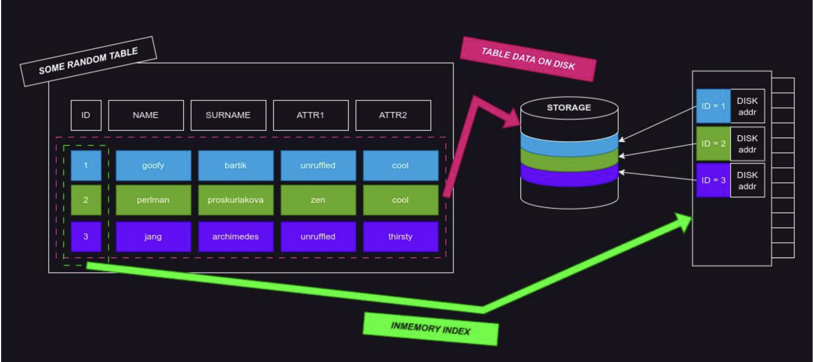
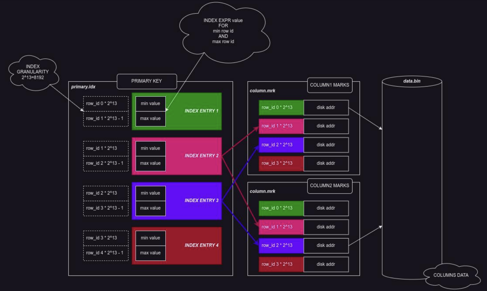
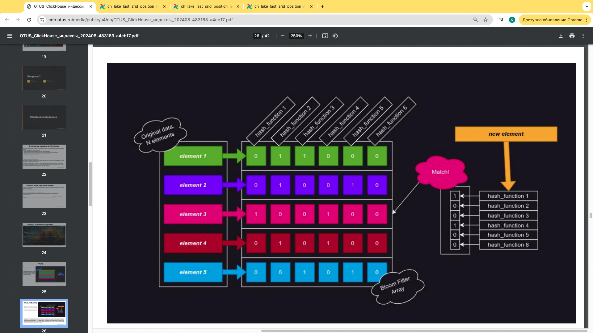
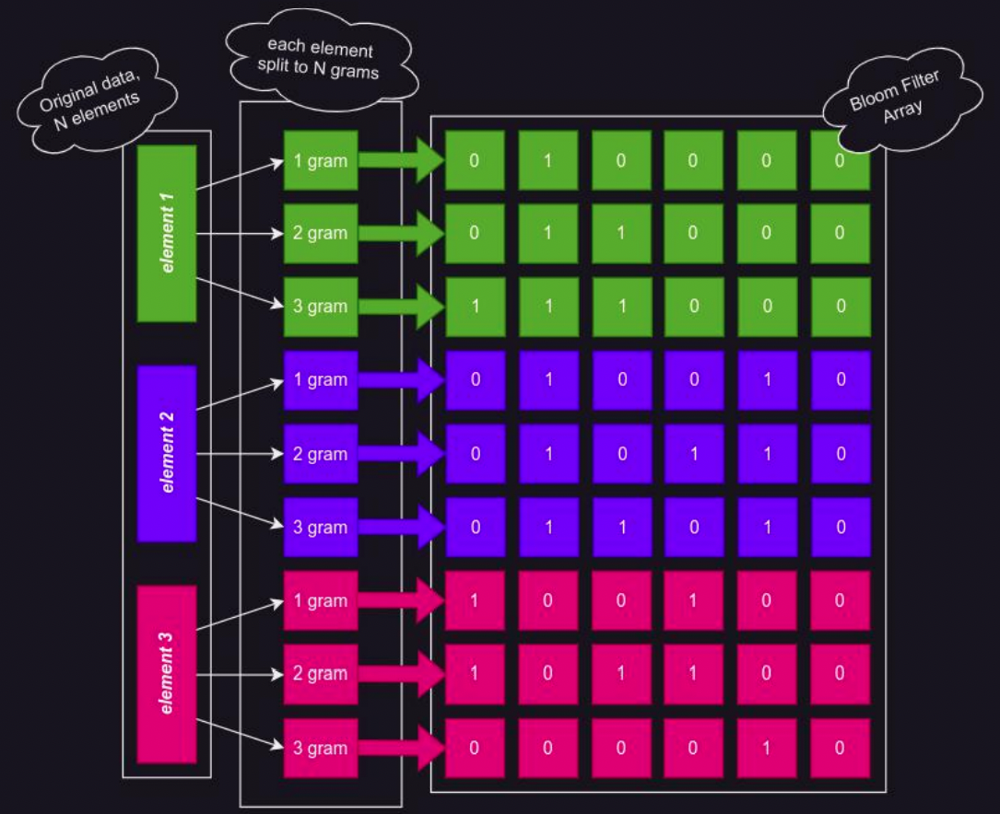
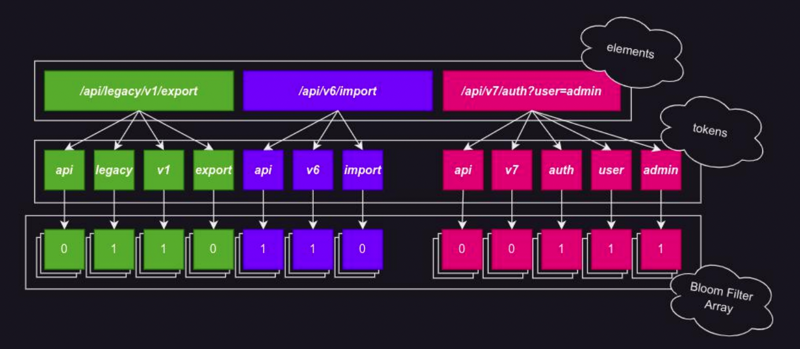

# Индексы

## Зачем нужен индекс

Когда хранить данные на диске файлами становится неоптимально и неудобно, и/или характер работы с данными требует структурированого хранения, данные огранизуются в таблицы, а таблицы в БД. Индекс - центральное понятие такой структуры хранения, обеспечивающее скорость доступа к данным. Индекс располагается оперативной памяти, данные на диске. В зависимости от типа индекса, могут налагаться требования, такие как уникальность каждой «координаты», и наоборот, ограничения на кардинальность (количество уникальных значений) индекса, в зависимости от устройства и назначения индекса.

Индекс в базах данных - карта области (как оглавление в книге), где хранятся данные таблицы, где в качестве координат используются значение произвольного выражения, чаще всего просто значения конкретного столбца, для ускорения получения данных по этим координатам.



Справа на картинке - память, посередине - диск

Индексы бывают первичными (основными), задаваемыми при создании таблиц, жестко фиксируемые в структуре таблицы, и не подлежащие после этого изменению. А так же индексы бывают вторичными, добавляемыми и удаляемыми уже на готовой таблице. Основной индекс чаще всего называют «первичный ключ».

Партиции - организация хранения, индексы - оптимизация доступа к данным!

## Первичный индекс в ClickHouse - Разреженный minmax индекс

Хранит не единичные значения ключевого поля в единичной строке, а вместо этого минимальное и максимальное значения этого поля на N строк. Последовательность N таких строк называется гранулой, размерность N - гранулярностью индекса. В ClickHouse по умолчанию размер такой гранулы 8192 строк. Используется в качестве первичного ключа (основного индекса) для таблиц в ClickHouse. Допускает неуникальные значения, допускает более 8192 строк (или гранулы) одинаковых значений.

Почему такой индекс основной? ClickHouse - аналитическая база данных, это предполагает OLAP профиль нагрузки - не точечные запросы, обрабатывающие миллионы и миллиарды строк, для подсчета итоговых значений за долгий период или выявления на этом периоде закономерностей в данных. Объем данных, типичных для хранения в такой системе, измеряется как правило в терабайтах и петабайтах. Классический индекс в таком сценарии будет очень расточителен по оперативной памяти, и показывать низкую производительность из за необходимости пробегать весь ключ, и даже бинарное дерево не спасает. Вместо этого, разреженный индекс позволяет ClickHouse быстро найти перечень гранул, в которых будут содержаться нужные значения. Не нужные значения будут отсеяны в дальнейших этапах выполнения запроса.

Пробег по индексу в кликхаусе происходит в 1 поток! Поэтому перебирать с индексами не стоит, тк нельзя указывать КХ, какой индекс использовать

### Реализация в кликхаус: (29:00)



Поскольку кликхаус - колоночная база данных, структура индекса здесь будет несколько сложнее чем просто карта. У нас появляется еще один дополнительный уровень такой как засечки. То есть мы в нашем `primary.idx` храним минимальное и максимальное значение на каждую гранулу (первые 8к, вторые 8к и тд). Мы их храним и затем для каждого столбца мы зраним еще один дополнительный файл `column.mrk`, в котором уже для каждого столбца именно на эту конкретную гранулу у нас будут адреса на диске в нашем `data.bin`. Раньше таких файлов было много (на каждую колонку отдельно), теперь файл один, но данные там лежат подряд, а не вперемешку. Ну и для каждой колонки у нас есть файл отсечек, в которой для каждой гранулы есть адреса на диске. Таким образом реализован минмакс индек 

ClickHouse, что типично для аналитики - колоночная база данных. Ключом индекса по прежнему являются min/max, а в качестве значения индекса используется row_id, кроме того, строгий размер гранулы позволяет хранить только её номер, поскольку row_id вычисляются из этого номера. Для каждой колонки существует набор «засечек», которые хранят уже непосредственно адреса на диске для каждой гранулы в колонке.

Для построения такого индекса, данные при вставке в ClickHouse сортируются по основному ключу. В качестве ключа допускается только последовательный список столбцов ключа, задается как “PRIMARYKEY(column1,column2, ... columnN)”, произвольное выражение не допускается. На каждую вставку данных рождается собственный набор файлов с индексами и данными (с сортировкой в пределах `max_insert_block_size`), такой набор называется part, и эти part в фоновом режиме объединяются между собой для непрерывной оптимизации поступающих данных. В процессе объединения основной ключ пересчитывается заново. Алгоритм называется MergeTree, и подробно разобран в основном курсе. Разряженный индекс позволяет эффективно работать с большими объемами данных, что и стало главной причиной его выбора в качестве основного в ClickHouse. Однако, такой индекс не позволяет покрыть потребности в поиске регулярными выражениями, и неэффективен в проверках на вхождение (массив, часть урла, полнотекстовый поиск), для этого есть вторичные индексы.

При мердже партов кликхаус сортирует одну-вторую пачку данных и в том числе пересчитывает индекс и перестраивает вторичные индексы, если они у нас есть.

Создать Primary Index в отрыве от создания таблицы нельзя!

Primary Key, Order By - связанные, но самостоятельные сущности!

Когда мы задаем первичный ключ, ключ сэмплирования обязательно должен ему принадлежать! Если мы хотим закладываться на сэмплирование данных в нашей таблице, обязательно нужно подумать об этом на этапе создания данных. Сэмплирование - размен точности на скорость.

## Сэмплирование

Помимо наших засечек, мы также можем иметь ключ сэмплирования. Это дополнительный ключ пропуска данных, который позволяет уже в пределах в том числе гранулы отбросить часть данных. Таким образом мы отбрасываем часть данных, которые попадают под наш запрос. И кликхаус отдает результаты запроса так, как будто эти данные там были на основании тех данных, что мы подняли.

Практика: 
```sql
-- как заселектить сэмпл
select ... sample by 0.1;

-- создадим 2 таблицы и посмотрим разницу между первичным ключом и ордер бай
-- при создании одного из них - второй создается по умолчанию 
create table t1 
(
    date Date,
    userId UInt32,
    ts DateTime,
    data String,
    data2 String,
    data3 String,
)
Engine=MergeTree
PRIMARY KEY (date, userId);
create table t2 
(
    date Date,
    userId UInt32,
    ts DateTime,
    data String,
    data2 String,
    data3 String,
)
Engine=MergeTree
ORDER BY (date, userId);

select columns('key') from system.tables where name in ('t1','t2');
/*
Query id: 9373e290-8ca4-47e4-95dd-9bc6cdf3efe6

   ┌─partition_key─┬─sorting_key──┬─primary_key──┬─sampling_key─┐
1. │               │ date, userId │ date, userId │              │
2. │               │ date, userId │ date, userId │              │
   └───────────────┴──────────────┴──────────────┴──────────────┘

2 rows in set. Elapsed: 0.004 sec. 
*/
-- sorting_key == order by

-- при манипуляциях с данными и создании вторичных индексов нам иногда нужно менять ORDER BY - он будет повышать эффективность использования нашего индекса
-- изменить ORDER BY можно только одновременно добавив столбец
alter table t1 add column dspId UInt16, MODIFY ORDER BY (date, userId, dspId);

-- очень важная штука!!!!
-- https://clickhouse.com/docs/ru/engines/table-engines/mergetree-family/mergetree#functions-support
-- таблица, по которой мы можем гарантировать, что с этим первичным ключом эти фукнкци будут работать, а другие не будут. 
```

Вторичные индексы можно добавлять на существующую таблицу. Это позволяет повысить скорость выборки данных. ClickHouse поддерживает вторичные индексы: 
- MinMax, как вторичный индекс, индекс того же вида как и основной ключ (будет работать не как праймари, но очень близко по производительности)
- set, простой и быстрый индекс на все уникальные значения, с ограничением на кардинальность (максимально близок к обычным индексам)
- bloom filter индексы, когда ограничения на кардинальность не приемлимы, по мы все равно хотим ходить какими то регулярками
  - bloom_filter - классический фильтр Блума
  - ngrambf_v1 - фильтр Блума по разбитым на N-частей ключам
  - tokenbf_v1 - тоже самое, но разбиение по не-букво-численным символам

Общий синтакис для добавления индекса:
```sql
ALTER TABLE [db.]table_name [ON CLUSTER cluster] ADD INDEX [IF NOT EXISTS] name expression TYPE type [GRANULARITY value] [FIRST|AFTER name]
```
Под гранулярностью здесь понимается не то что в первичном ключе - здесь имеется в виду количество гранул (GRANULARITY 2 - 1 индекс на 2 гранулы).

Также можно удалить индекс -  `ALTER TABLE ... DROP INDEX` или очистить индекс `ALTER TABLE ... CLEAR INDEX`. После добавления вторичный индекс начинает собираться для вновь поступающих данных. Для уже существующих необходимо сделать `ALTER TABLE ... MATERIALIZE INDEX`.

## MinMax как вторичный индекс

Наряду с использованием такого типа индекса в качестве основного ключа, можно создавать и вторичные индексы такого же типа. От основного индекса отличается: 
- можно использовать произвольное выражение (когда используем выражение в where - jмжем попасть в поиск по индексу)
- не включает сортировку данных по ключу выражения. Дополнить ключ сортировки можно, и рекомендуется, когда ключ аналогичного основному вида(column1,column2 ... ). Ключ сортировки меняется отдельной операцией изменения ключа сортировки «ALTER TABLE table MODIFY ORDER BY», можно выполнять только одновременно с добавлением самого столбца.

есть слайд с созданием индекса (59:00)

```sql
show create table t1;
alter table t1 add column projectId String, modify order by (date, userId, dspId, projectId);
-- теперь можем вокруг этого поля строить индексы
alter table t1 add index minmaxDsp modulo(dspId,30) TYPE minmax;
-- материализуем индекс (чтобы пересчитались имеющиеся данные)
alter table t1 materialize index minmaxDsp;
-- процесс материализации индекса мы можем увидеть в мутациях
select command, table, is_done from system.mutations;
/*
Query id: 99c215f1-7b91-4484-b8e1-c23229070683

   ┌─command───────────────────────────────┬─table─┬─is_done─┐
1. │ MATERIALIZE INDEX minmaxDsp           │ t1    │       1 │
2. │ UPDATE category = 'рагу' WHERE id = 1 │ menu  │       1 │
3. │ DELETE WHERE id = 1                   │ menu  │       1 │
4. │ UPDATE category = 'рагу' WHERE id = 1 │ menu  │       1 │
5. │ DROP COLUMN category                  │ menu  │       1 │
6. │ DROP COLUMN calories                  │ menu  │       1 │
   └───────────────────────────────────────┴───────┴─────────┘

6 rows in set. Elapsed: 0.014 sec. 
*/

-- чистка индекса тоже будет идти как мутация
alter table t1 clear index minmaxDsp;
alter table t1 drop index minmaxDsp;
```

## set(N) 

Простой индекс, хранит заданный N уникальных ключей на гранулу. То есть у нас есть гранула, в ней 8192 строки и множество повторяющихся значений. В индекс у нас пойдут только уникальные, что нам позволит отсеивать гранулы по уникальным значениям. То есть в where мы сможем использовать практически любые функции и они будут работать с нашим индексом поскольку по индексу мы сможем пробежаться практически любыми функциями. При превышении N количества уникальных ключей в индексе на гранулу, гранула остается неиндексированной. Можно указать set(0) - и тогда у нас не будет ограничения (делать так не рекомендуется! При высокой кардинальности мы можем прийти к той ситуации, когда у нас индекс очень сильно распухает).

## Фильтр Блума

Что представляет из себя фильтр Блума как концепция - это некоторая хитрость чтобы проверять есть ли у нас уже некоторый элекмент, когда он поступает на вход. Поэтому мы используем хэширующие функции для ускорения этого поиска. Мы по нашим имеющимся данным мы применяем хэширующую функцию и записываем на результат хэширующей функции просто 1 байтом - 0 или 1. Эффективнее взять множество дешевых хэш функций чем одну дорогую. Результаты сохраняются как битовый массив. Так нам нажно хранитьне целиком строку, а небольшую последовательность битовых результатов. Это намого дешевле.



Метод получения битового массива из результатов хеширования множества ключей, и последующее использование этого массива для проверки ключей на вхождение в множество. Хешируется множество ключей. Сохраняется битовый массив. При необходимости проверить ключ на вхождение, он подвергается аналогичному хешированию, и битовый массив накладывается на результат хеширования теми же функциями. Если наложение дает совпадение по всем хеширующим функциям хотя бы для одного элемента массива, элемент может принадлежать множеству. Возможны ложно-положительные срабатывания, ложно-отрицательные исключены.

Можно регулировать количество хэширующих функций, таким образом пробег по индексу будет дороже (если их будет больше). Это влияет только на скорость прохода.

Фильтра Блума может нам быть недостаточно для регулярных выражений и полнотекстового поиска. Поэтому есть 2 вариации от фильтра Блума:
- ngrambf_v1 - Каждый элемент делится на N частей, именуемых «gram», фиксированного размера. Массив для фильтра Блума собирается из таких «gram», вместо оригинальных элементов. (собирается не из всей строки, а из энного количества грам ). Тоже могут быть ложноположительные срабатывания на регулярные выражения и это зависит от размерности граммы (выше размерность - дороже индекс - меньше ложноположительных значений и наоборот). Так нам становится доступен поиск регулярными выражениями ( в классическом блумфильтре можем только проверить целиком наличие полного совпадения).

- tokenbf_v1 (деление на цифробуквенные последовательности) - Каждый элемент делится на N токенов. Токеном является непрерывная цифро-буквенная последовательность, например строка «/api/v1/import» будет содержать токены api, v1, import. Массив для фильтра Блума собирается из токенов. В отличие от ngrambf_v1, размер токена не константный. За это есть цена - поиск регулярными выражениями становится дороже (хоть еще и остается доступным), точность падает, но становится более дешевым полнотекстовый поиск



ngrambf_v1 - Каждый элемент делится на N частей, именуемых «gram», фиксированного размера. Массив для фильтра Блума собирается из таких «gram», вместо оригинальных элементов.

Каждый элемент делится на N токенов. Токеном является непрерывная цифро- буквенная последовательность, например строка «/api/v1/import» будет
содержать токены: - api - v1
- import
Массив для фильтра Блума собирается из токенов. В отличие от ngrambf_v1, размер токена не константный

## Использование индексов

* MinMax хорошо подходит для поиска данных по: 
  - прямому совпадению ( `column == ‘value’` )
  - совпадению по маске ( `column LIKE ‘%some%pattern%’` )
  - лексиграфическому и алгебраическим сравнениям ( `<, > , <=, >=, between`)
* Bloom Filter позволяет: 
  - эффективнее чем MinMax проверять на вхождение ( `column in (‘value1’,’value2’), has(array, column)` )
* ngrambf_v1 расширяет возможности Bloom Filter полнотекстовым поиском
* tokenbf_v1 тоже самое, более эффективен например для URL-ов и других данных со структурированным логическим разделением не-цифро-буквенными символами
* важное отличие ngrambf_v1 и tokenbf_v1 от MinMax: позволяют использовать регулярные выражения
* Set(N) сочетает возможности всех индексов, но только на низкокардинальных данных, с не более чем N уникальных ключей.

## Получение информации о доступных индексах

Проверьте доступные вам индексы в таблице:
```sql
/* основной ключ */
SELECT primary_key
FROM system.tables
WHERE table = 't2'; 
/*
Query id: 250fe18b-95e1-4325-a177-d1960611afe3

   ┌─primary_key──┐
1. │ date, userId │
   └──────────────┘

1 row in set. Elapsed: 0.018 sec. 
*/
/* вторичные индексы */
SELECT
    type_full, expr
FROM system.data_skipping_indices
WHERE table = 't2' 
/*
Query id: 96911aa7-3708-4fc8-9a4f-05891f7212fd

   ┌─type_full────────────────────────────────────┬─expr─┐
1. │ ngrambf_v1(8, 1024, 12, 5472725000237720429) │ data │
2. │ tokenbf_v1(1024, 12, 5472725000237720429)    │ data │
   └──────────────────────────────────────────────┴──────┘

2 rows in set. Elapsed: 0.007 sec. 
*/
-- Так же можно получить специальным запросом «SHOW INDEXES FROM table» или из «SHOWCREATETABLE»
```

## Практика ( 1:25:00)

```sql
-- создадим ngrambf_v1
alter table t2 add index idxngram data TYPE ngrambf_v1(8, 1024, 12, 5472725000237720429);  -- 5472725000237720429 - это randomSeed
--что такое randomSeed:
select * from generateRandom('a UInt64') limit 1;
-- в документации есть набор udf функций, который позволяет обсчитать параметры ngrambf_v1 в зависимости от желаемого процента ложноположительных срабатываний

-- допустим, хотим использовать какие то урлы. Тогда для урлов создаем:
alter table t2 add index idxtoken data TYPE tokenbf_v1(1024, 12, 5472725000237720429);  -- 5472725000237720429 - это randomSeed
alter table t2 materialize index idxtoken;  -- материализуем индекс (пересчитываем данные)
```

ВАЖНО! ОПТИМИЗАТОР НЕ ВЫБИРАЕТ САМ КАКОЙ ИНДЕКС ИСПОЛЬЗОВАТЬ В ЗАВИСИМОСТИ ОТ ЗАПРОСА
```sql
insert into default.t2 (date, userId, data) values (today(), 287364 , 'sadfhbli');
set send_logs_level='trace';  -- подробней про это будет в лекции по профилированию запросов
-- Valid values: 'trace', 'debug', 'information', 'warning', 'error', 'fatal', 'none'
select * from t2 where data='dnbcswi';
/*
Query id: 0bae9008-58ad-400a-a4ae-fc542ec3706f

[bedd228ee7e4] 2024.11.14 13:41:45.223260 [ 65 ] {0bae9008-58ad-400a-a4ae-fc542ec3706f} <Debug> executeQuery: (from 127.0.0.1:44600) select * from t2 where data='dnbcswi'; (stage: Complete)
[bedd228ee7e4] 2024.11.14 13:41:45.226459 [ 65 ] {0bae9008-58ad-400a-a4ae-fc542ec3706f} <Trace> Planner: Query to stage Complete
[bedd228ee7e4] 2024.11.14 13:41:45.228246 [ 65 ] {0bae9008-58ad-400a-a4ae-fc542ec3706f} <Trace> Planner: Query from stage FetchColumns to stage Complete
[bedd228ee7e4] 2024.11.14 13:41:45.231551 [ 65 ] {0bae9008-58ad-400a-a4ae-fc542ec3706f} <Trace> QueryPlanOptimizePrewhere: The min valid primary key position for moving to the tail of PREWHERE is -1
[bedd228ee7e4] 2024.11.14 13:41:45.231778 [ 65 ] {0bae9008-58ad-400a-a4ae-fc542ec3706f} <Trace> QueryPlanOptimizePrewhere: Condition equals(data, 'dnbcswi'_String) moved to PREWHERE
[bedd228ee7e4] 2024.11.14 13:41:45.232275 [ 65 ] {0bae9008-58ad-400a-a4ae-fc542ec3706f} <Debug> default.t2 (abe12940-aa6c-42ef-a3d5-15fc4b56ce7d) (SelectExecutor): Key condition: unknown
[bedd228ee7e4] 2024.11.14 13:41:45.232890 [ 65 ] {0bae9008-58ad-400a-a4ae-fc542ec3706f} <Trace> default.t2 (abe12940-aa6c-42ef-a3d5-15fc4b56ce7d) (SelectExecutor): Filtering marks by primary and secondary keys
[bedd228ee7e4] 2024.11.14 13:41:45.243176 [ 65 ] {0bae9008-58ad-400a-a4ae-fc542ec3706f} <Debug> default.t2 (abe12940-aa6c-42ef-a3d5-15fc4b56ce7d) (SelectExecutor): Index `idxngram` has dropped 0/1 granules.
[bedd228ee7e4] 2024.11.14 13:41:45.243333 [ 65 ] {0bae9008-58ad-400a-a4ae-fc542ec3706f} <Debug> default.t2 (abe12940-aa6c-42ef-a3d5-15fc4b56ce7d) (SelectExecutor): Index `idxtoken` has dropped 1/1 granules.
[bedd228ee7e4] 2024.11.14 13:41:45.243500 [ 65 ] {0bae9008-58ad-400a-a4ae-fc542ec3706f} <Debug> default.t2 (abe12940-aa6c-42ef-a3d5-15fc4b56ce7d) (SelectExecutor): Selected 1/1 parts by partition key, 0 parts by primary key, 1/1 marks by primary key, 0 marks to read from 0 ranges
[bedd228ee7e4] 2024.11.14 13:41:45.248039 [ 65 ] {0bae9008-58ad-400a-a4ae-fc542ec3706f} <Debug> TCPHandler: Processed in 0.026425 sec.
Ok.

0 rows in set. Elapsed: 0.026 sec. 
*/
```
Тут мы видим - `Filtering marks by primary and secondary keys`. То есть он всегда использует и те, и другие! 

Также мы видим сколько мы дропнули гранул по индексу.

Индекс может и замедлить запрос!
```sql
alter table t2 add index aaa data2 TYPE set(0);  
-- теперь в колонке data2 у нас будут очень высококардинальные данные
-- тогда этот индекс станеть огромным в памяти (смотреть на data_compressed_bytes, data_uncompressed_bytes)
select * from system.data_skipping_indices format vertical;
/*
Row 1:
──────
database:                default
table:                   t2
name:                    idxngram
type:                    ngrambf_v1
type_full:               ngrambf_v1(8, 1024, 12, 5472725000237720429)
expr:                    data
granularity:             1
data_compressed_bytes:   104
data_uncompressed_bytes: 1024
marks:                   50

Row 2:
──────
database:                default
table:                   t2
name:                    idxtoken
type:                    tokenbf_v1
type_full:               tokenbf_v1(1024, 12, 5472725000237720429)
expr:                    data
granularity:             1
data_compressed_bytes:   104
data_uncompressed_bytes: 1024
marks:                   50

Row 3:
──────
database:                default
table:                   t2
name:                    aaa
type:                    set
type_full:               set(0)
expr:                    data2
granularity:             1
data_compressed_bytes:   0
data_uncompressed_bytes: 0
marks:                   0
*/


-- здесь еще более подробная инфа
-- здесь интересуют: primary_key_bytes_in_memory, primary_key_bytes_in_memory_allocated и тд
select * from system.parts_columns limit 1 format Vertical;
/*
Row 1:
──────
partition:                             tuple()
name:                                  all_1_2_1
uuid:                                  00000000-0000-0000-0000-000000000000
part_type:                             Compact
active:                                1
marks:                                 2
rows:                                  1
bytes_on_disk:                         417
data_compressed_bytes:                 214
data_uncompressed_bytes:               109
marks_bytes:                           66
modification_time:                     2024-11-12 12:20:21
remove_time:                           2106-02-07 06:28:15
refcount:                              1
min_date:                              1970-01-01
max_date:                              1970-01-01
min_time:                              1970-01-01 00:00:00
max_time:                              1970-01-01 00:00:00
partition_id:                          all
min_block_number:                      1
max_block_number:                      2
level:                                 1
data_version:                          1
primary_key_bytes_in_memory:           16
primary_key_bytes_in_memory_allocated: 144
database:                              default
table:                                 aggr_tbl
engine:                                AggregatingMergeTree
disk_name:                             default
path:                                  /var/lib/clickhouse/store/4a6/4a6b044e-9ea3-4c6a-a222-55c1c7c3696d/all_1_2_1/
column:                                id
type:                                  UInt64
column_position:                       1
default_kind:                          
default_expression:                    
column_bytes_on_disk:                  0
column_data_compressed_bytes:          0
column_data_uncompressed_bytes:        0
column_marks_bytes:                    0
column_modification_time:              2024-11-12 12:20:21
column_ttl_min:                        ᴺᵁᴸᴸ
column_ttl_max:                        ᴺᵁᴸᴸ
serialization_kind:                    Default
substreams:                            ['id']
filenames:                             ['']
subcolumns.names:                      []
subcolumns.types:                      []
subcolumns.serializations:             []
subcolumns.bytes_on_disk:              []
subcolumns.data_compressed_bytes:      []
subcolumns.data_uncompressed_bytes:    []
subcolumns.marks_bytes:                []
*/
```

## Выявление потребности

Изучаем секцию WHERE нашего запроса:
1. получаем информцию об индексах как на предыдущем слайде
2. выявляем поля, не присутсвующими в основном ключе, или обрабатываемые регулярными выражениями. проверяем покрытие полей вторичными индексами
3. добавляем вторичные индексы
Пример:
Допустим, у нас есть селект из какой то таблицы, где мы испльзуем регулярное выражение по какому то джсону  `SELECT .... FROM table WHERE match(json_payload,’ ... validation_regex ... ’)`, ngrambf_v1 индекс на поле json_payload отсутствует. Требуется добавить такой индекс

## Резюме

Специальные индексы в колоночных БД отличаются от классического индекса, направленностью на анализ большого количества данных наиболее эффективным способом, работая не с точными значениями ключевого столбца, а с диапазонами Min/Max на N строк. Вторичные индексы покрывают дополнительную потребность в полнотекстовом поиске, и более дешевой проверки на вхождение, алгоритмом фильтра Блума.