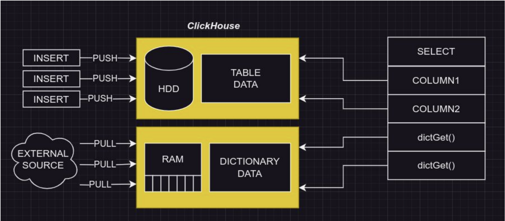
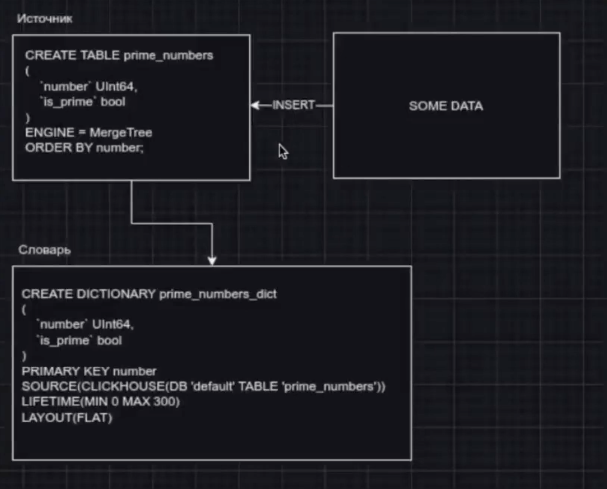

# Словари, оконные и табличные функции

Словарь - данные из внешних систем, которые регулярно забираются ClickHouse-ом в оперативную память (как правило в оперативную, но не только), для использования совместно с собственными данными в запросах. 



Словарь представляет собой KEY-value хранилище, ключ может быть простым или составным. Ключ при обращении к словарю указывается целиком. Атрибутов может быть от 1 и больше, их значения можно получать по ключу. По сути, ключ должен быть того же типа, что и поле ключа, когда мы вытягиваем данные (?)


Зачем нужны словари?

1. Мутабельные данные
   В ClickHouse сохраняются события, например действия пользователя, за долгий период. События не подлежат изменению, они уже произошли, поэтому они отлично подходят для хранения и анализа в ClickHouse. Однако, у пользователя есть так же меняющиеся свойства, такие как статус активности, баланс, семейное положение, и другие. Такие свойства в силу изменчивости не подходят к хранению в ClickHouse, однако так же относятся к этому пользователю. Для совместного использования тех и других данных и применяются словари. Отличный пример - курс валют
2. Интеграции с другими системами
   Описаный в п.1 сценарий, подразумевает хранение мутабельных данных в других системах, и как правило там они изначально и находятся, словари подходят для интеграции этих данных с данными ClickHouse.
3. Производительная альтернатива JOIN 
   Даже если данные уже в ClickHouse, однако в разных таблицах, построение словаря вокруг меньшей таблицы или вокруг её агрегата является более производительным решением. В реляционных системах мы привыкли JOIN-ить сотни и тысячи строк, иногда десятки тысяч, не принимая в расчет накладные расходы на построение hash-таблицы JOIN-а, и размер оперативной памяти и издержки по CPU необходимые для такой операции. Работая в ClickHouse с миллионами и миллиардами строк, очень быстро становится очевидна дороговизна такого подхода.

Как выглядит запрос
```sql
-- с использованием джоина
select
    p.Id AS PostId,
    p.Title,
    u.username AS AuthorName
FROM (
    SELECT * FROM posts
    where date between ‘2024-01-01’ and today()
) p
INNER JOIN users u ON p.OwnerUserId = u.id;

-- с использованием дикта
SELECT
    Id AS PostId,
    Title,
    dictGet('users_dict', 'username', toUInt64(OwnerUserId)) AS AuthorName
FROM posts
WHERE date between ‘2024-01-01’ and today()
```

## Как создать словарь

Есть 2 варинта создания словаря - xml конфигурация и sql синктаксис

### xml

```xml
<dictionary>
    <name>
        ИМЯ СЛОВАРЯ
    </name>
    <structure>
        КЛЮЧ И АТРИБУТЫ
    </structure>
    <source>
        ИСТОЧНИК
    </source>
    <layout>
        СХЕМА ХРАНЕНИЯ (ОБЫЧНО В ПАМЯТИ)
    </layout>
    <lifetime>
        КАК ЧАСТО ОБНОВЛЯТЬ
    </lifetime>
</dictionary>

<clickhouse>
    <dictionary>
        <name>users_dict</name>
        <structure>
            <id>
                <name>id</name>
            </id>
            <attribute>
                <name>username</name>
                <type>String</type>
                <null_value></null_value>
            </attribute>
        </structure>
        <source>
            <clickhouse>
                <host>localhost</host>
                <port>9000</port>
                <user>default</user>
                <password></password>
                <db>default</db>
                <table>users</table>
            </clickhouse>
        </source>
        <layout>
            <flat />
        </layout>
        <lifetime>
            <min>300</min>
            <max>360</max>
        </lifetime>
    </dictionary>
</clickhouse>
```
- Требует доступа к файловой системе сервера и может потребовать перезагрузки конфигурации сервера. 
- Требует прав на чтение файлов конфигурации на сервере 
- Если доступ к серверу ограничен, то этот вариант безопаснее со стороны иб. 
- Изменения требуют редактирования файла и перезагрузки конфигурации.
- Можно автоматизировать создание словарей через ansible

Как создать ключ словаря:
Простой ключ: одно поле, тип всегда UInt64. Объявляется в XML как `<id><name>имя</name></id>`
Составной ключ: несколько полей, заданные типы. Объявляется в XML как <key>несколько полей</key>, где каждое поле объявляется так же как атрибут:
```xml
<attribute>
    <name>поле</name>
    <type>тип</type>
</attribute>
```

### sql

```sql
CREATE DICTIONARY users_dict_1
(
 `id` UInt64,
 `username` String
)
PRIMARY KEY id
SOURCE(CLICKHOUSE(HOST 'localhost' PORT 9000
USER 'default' TABLE 'users' PASSWORD '' DB
'default'))
LIFETIME(MIN 300 MAX 360)
LAYOUT(FLAT())
```
- Управляется как обычный объект базы данных, не требует доступа к файловой системе.
- Управляется через систему прав доступа SQL, как для других объектов базы данных
- Можно изменять и обновлять словарь с помощью SQL-команд, как обычные объекты базы данных.
- Работает в Clickhouse Cloud

### Как создать ключ словаря

Для XML: так же, как и атрибуты составного ключа, но уровнем выше:
```xml
<structure>
<key>
 <attribute><name>ключ</name><type>тип</type></attribute>
 ...
</key>
<attribute><name>атрибут1</name><type>тип</type></attribute>
<attribute><name>атрибут2</name><type>тип</type></attribute>
...
</structure>
```

Для SQL простой и составной ключи объявляются одинаково в списке полей и дополнительно перечисляются в PRIMARY KEY:
```sql
CREATE DICTIONARY имя (
    key1 String,
    key2 String
    ...
)
PRIMARY KEY key1, key2
```

### Источники

В качестве источников поддерживается:
1. файл на файловой системе:
   - для XML:
```xml
<source>
<file>
<path>/opt/dictionaries/os.tsv</path>
<format>TabSeparated</format>
</file>
</source>
```
    - для SQL: `SOURCE(FILE(path './user_files/os.tsv' format 'TabSeparated'))`

2. файл доступный по http/https
    - XML:
```xml
<source>
 <http>
 <url>http://url/os.tsv</url>
 <format>TabSeparated</format>
 необязательно: <credentials><user>...</user><password>...</password></credentials>
 необязательно: <headers> одна или несколько секций <header><name>...</name><value>...</value></header>
 </http>
</source>
```
    - SQL: 
```sql
SOURCE(HTTP(
 url 'http://[::1]/os.tsv'
 format 'TabSeparated'
 credentials(user 'user' password 'password')
 headers(header(name 'API-KEY' value 'key'))
))
```
3. другие базы данных - здесь конфигурация через SQL и XML однотипна
   1. odbc коннектор
```sql
SOURCE(
    ODBC(
        db 'DatabaseName' -- db — имя базы данных. Не указывать, если имя базы задано в параметрах. <connection_string>.
        table 'SchemaName.TableName' -- table — имя таблицы и схемы, если она есть.
        connection_string 'DSN=some_parameters' -- connection_string — строка соединения.
        invalidate_query 'SQL_QUERY'  -- invalidate_query — запрос для проверки статуса словаря. Необязательный параметр.
        query 'SELECT id, value_1, value_2 FROM db_name.table_name'  -- query – пользовательский запрос. Необязательный параметр.
        -- Поля table и query не могут быть использованы вместе. Также обязательно должен быть один из источников данных: table или query
    )
)
```
   2. mysql - тут уже не нужен odbc коннектор
```sql
SOURCE(
    MYSQL(
        port 3306  -- порт сервера MySQL. Можно указать для всех реплик или для каждой в отдельности (внутри <replica>).
        user 'clickhouse'  -- имя пользователя MySQL. Можно указать для всех реплик или для каждой в отдельности (внутри <replica>).
        password 'qwerty'  -- пароль пользователя MySQL. Можно указать для всех реплик или для каждой в отдельности (внутри <replica>).
        replica(host 'example01-1' priority 1)  -- блок конфигурации реплики. Блоков может быть несколько.
        replica(host 'example01-2' priority 1)
        db 'db_name'  -- имя базы данных.
        table 'table_name'  -- имя таблицы.
        where 'id=10'  -- условие выбора. Синтаксис условия совпадает с синтаксисом секции WHERE в MySQL, например, id > 10 AND id < 20. Необязательный параметр.
        invalidate_query 'SQL_QUERY'  -- запрос для проверки статуса словаря. Необязательный параметр. Читайте подробнее в разделе Обновление словарей.
        fail_on_connection_loss 'true'  -- параметр конфигурации, контролирующий поведение сервера при потере соединения. Если значение true, то исключение генерируется сразу же, если соединение между клиентом и сервером было потеряно. Если значение false, то сервер повторно попытается выполнить запрос три раза прежде чем сгенерировать исключение. Имейте в виду, что повторные попытки могут увеличить время выполнения запроса. Значение по умолчанию: false.
        query 'SELECT id, value_1, value_2 FROM db_name.table_name'  -- пользовательский запрос. Необязательный параметр.
    )
)
```
   3. postgresql - параметры как у mysql
```sql
SOURCE(
    POSTGRESQL(
        port 5432
        host 'postgresql-hostname'
        user 'postgres_user'
        password 'postgres_password'
        db 'db_name'
        table 'table_name'
        replica(host 'example01-1' port 5432 priority 1)
        replica(host 'example01-2' port 5432 priority 2)
        where 'id=10'
        invalidate_query 'SQL_QUERY'
        query 'SELECT id, value_1, value_2 FROM db_name.table_name'
    )
)
```
    4. ClickHouse - аналогично mysql и postgresql, можно включить ssl флагом secure, нельзя указать несколько реплик, предлагается вместо этого использовать Distributed-таблицу. Скорее всего будет самый частый спопоб создания словарей
```sql
SOURCE(
    CLICKHOUSE(
        host 'example01-01-1'
        port 9000
        user 'default'
        password ''
        db 'default'
        table 'ids'
        where 'id=10'
        secure 1
        query 'SELECT id, value_1, value_2 FROM default.ids'
    )
)
```

## Схема хранения 30:00

Объявляется через layout . Схема хранения - очень важно! и зависит от версионности.

- flat схема - предназначена для хранения словарей с простым UInt64 ключом. Параметры:
  * initial_array_size - по умолчанию 1024, под сколько ключей резервировать память сразу
  * max_array_size - по умолчанию 5000000, максимальное количество ключей, при превышении словарь не создается
  самая простая и производительная схема, не эффективна по памяти (хранится в ОЗУ, съедает много, используем для небольших табюлиц)
- hashed - строит хеш-таблицу вокруга хеша ключа (но хранит не только хэш ключи), параметров нет, несколько эффективнее по памяти (съедает меньше чем флэт, но все же довольно много) (самый оптимальный вариант по сути)
- sparse_hashed - тоже самое, но ещё меньше потребление памяти ценой большей нагрузки на CPU
- complex_key_hashed, complex_key_sparse_hashed - нет параметров, строит хеш-таблицу вокруг составного или не-UInt64 ключа (то есть то же самое, что hashed/sparse_hashed. но для составного ключа)
- cache - чуть ниже
- complex_key_cache - аналогично cache, для составных ключей
- ssd_cache, complex_key_ssd_cache - ключи в памяти, значения по ним на ssd (на самом деле не обязательно на ssd, можно хранить на любом диске), есть дополнительные параметры относящиеся к хранению на ssd:
  * block_size
  * file_size
  * read_buffer_size, write_buffer_size
  * path

hashed layout по умолчанию бронирует 128 строк. Если мы выходим за это ограничение (например, у нас 129 строк) - он удаваивается (бронирует еще 128, то есть всего будет 256). Соответственно, у нас будет забронировано довольно много лишней памяти. Это небольшой минус хэша. В таком случае оптимально использовать sparse_hashed, тк он не использует такой параметр (не хранит данные как обычная хэш таблица). По сути sparse_hashed более оптимален, но больше нагружает ЦПУ, из-за этого запрос выполняется медленнее.

cache - Словарь хранится в кэше, состоящем из фиксированного количества ячеек. Ячейки содержат часто используемые элементы. При поиске в словаре сначала просматривается кэш. На каждый блок данных, все не найденные в кэше или устаревшие ключи запрашиваются у источника с помощью `SELECT attrs... FROM db.table WHERE id IN (k1, k2, ...)`. Затем, полученные данные записываются в кэш. Наименее производительный словарь, однако позволяет держать не полный набор данных, а только часто используемые. Параметры:
* size_in_cells - размер кеша. cache тоже хранит ближайшую высушю степень двойки. то есть если мы укажем size_in_cells=100, то фактически мы будем хранить 128 (резервирует память на будущее)
* allow_read_expired_keys - возвращать устаревшие
* max_update_queue_size - очередь на обновление
* update_queue_push_timeout_milliseconds - таймаут для очереди
* query_wait_timeout_milliseconds - таймаут для обновления
* max_threads_for_updates - тредов для обновления

Пример из тех же стран и курсов валют - стран у нас много, но далеко не все нам нужны (популярны). Поэтому будем держать в кэше только самое нужное (например, валюты снг и основные валюты зарубежья). Так мы можем не тратить память на курсы стран Африки (будет подтягиваться по необходимости).

## Автообновление (52 00)

объявляется
- XML: `<lifetime>секунд</lifetime>` или `<lifetime> <min>секунд</min> <max>секунд</max> </lifetime>`
- SQL: `LIFETIME(секунд)` или `LIFETIME(MIN секунд MAX секунд)`

задает период обновления словаря, в случае задания через min/max, период обновления рандомизируется между min и max. Есть небольшой нюанс с источником-файлов на файловой системе, при обновлении проверяется последняя дата изменения файла. Если дата изменения будет меньше чем текущая дата словаря (если данные актуальны) - то он не будет обновлять. Все остальные обновляют по лайфтайму.

Также если мы вырубим и снова врубим кликхаус - он не запомнит и будет с самого начала перезаливать данные.

Как обращаться к словарю - Обращение к словарю выполняется функцией dictGet(), принимающей параметры:
- dict_name - имя словаря
- attr_names - имя атрибута, или Tuple имен атрибутов
- id_expr - значение ключа по которому хотим получить атрибуты

Но по сути, создавая словарь, мы создаем таблицу с типом dictionary, то есть мы можем работать и как с отдельной таблицей! Селектить, а не диктГет-ать

Детальная информация о существующих словарях можно узнать из таблицы `system.dictionaries`. Структуру словаря созданного через SQL запрос можно получить через команды:
```sql
show create dictionary dictionary_name;
select 
    create_table_query 
from system.tables
where name=’dictionary_name’;
```

## Пример:

Создадим словарь с простыми числами, который можно использовать в запросе
```sql
create table prime_numbers
( 
    `number` UInt64,
    `is_prime` bool
)
Engine = MergeTree
order by number;

create dictionary prime_numbers_dict
( 
    `number` UInt64,
    `is_prime` bool
)
primary key number
source(clickhouse(DB 'default' TABLE 'prime_numbers'))
lifetime(min 0 max 300)
layout(flat);

select
    dictGet('prime_numbers_dict', 'is_prime', number_column) as is_prime
from any_table_with_numbers;
```

Данные инсертятся в таблицу, на ее основе мы создаем словарь



Dictionary выполняется под юзером, под которым его создали!

Информацию по использованию памяти словарем можно посмотреть с помощью системной таблицы. Тут есть нюанс - к словарю, созданному через xml, мы обращаемся без указания базы:
```sql
select * from system.dictionaries format Vertical;
/*
Row 1:
──────
database:                           default
name:                               prime_numbers_dict
uuid:                               af1c37b2-3825-493b-9aec-8c6bb95bb6ff
status:                             NOT_LOADED
origin:                             af1c37b2-3825-493b-9aec-8c6bb95bb6ff
type:                               
key.names:                          ['number']
key.types:                          ['UInt64']
attribute.names:                    ['is_prime']
attribute.types:                    ['Bool']
bytes_allocated:                    0
hierarchical_index_bytes_allocated: 0
query_count:                        0
hit_rate:                           0
found_rate:                         0
element_count:                      0
load_factor:                        0
source:                             
lifetime_min:                       0
lifetime_max:                       0
loading_start_time:                 1970-01-01 00:00:00
last_successful_update_time:        1970-01-01 00:00:00
loading_duration:                   0
last_exception:                     
comment:                            
[bedd228ee7e4] 2024.11.18 12:45:20.975372 [ 65 ] {39194f78-bed9-4072-999c-3c84fac158fd} <Debug> executeQuery: Read 1 rows, 332.00 B in 0.008806 sec., 113.55893708834886 rows/sec., 36.82 KiB/sec.
[bedd228ee7e4] 2024.11.18 12:45:20.975597 [ 65 ] {39194f78-bed9-4072-999c-3c84fac158fd} <Debug> TCPHandler: Processed in 0.009527125 sec.

1 row in set. Elapsed: 0.009 sec. 
*/

show create dictionary prime_numbers_dict;  -- структура созданного словаря
```

При релоадинге словаря есть нюанс - он может удваиваться по памяти

Полезная [ссылка](https://kb.altinity.com/altinity-kb-dictionaries/altinity-kb-sparse_hashed-vs-hashed/) по типам

При создании словаря данные не будут загружаться если мы не настроим этого! Данные начнут обновляться либо при system reload'е, либо при дикт гете. Но тогда мы можем довольно долго ждать в первый раз, поскольку он должен сначала полностью загрузиться, а затем уже выдать результат. Желательно настроить так, чтобы при создании словаря он уже сразу же загружался.

Также совет по расчету памяти - в хэшд и всем остальном нельзя прописать лимиты. То есть может получиться так, что мы по умолчанию создадим какой то супербольшой словарь, который может положить кликхаус. То есть если у нас немного и мы уверены - то да, иначе лучше просчитать изначально.

## Табличные функции (1 15 00)

Табличная функция создает временную таблицу на лету, для выполнения над ней запроса, и может использоваться вместо таблицы в секции FROM запроса. Некоторые табличные функции позволяют так же вставку, например функция file(). Популярные табличные функции:
- `file(‘путь’, ’формат’, структура, сжатие)` - можно использовать для скидывания данных в файл (заинсертить какой то батч)
  пример: `SELECT * FROM file( ‘path/file.csv’, ’CSV’, ‘column1 UInt32, column2 UInt32’ )` делает таблицу из файла по пути относительно <user_files> каталога в конфигурации.
  - путь - относительный путь до файла
  - формат - любой из понимаемых ClickHouse (https://clickhouse.com/docs/en/interfaces/formats)
  - структура - список «имя тип» для колонок, разделенный запятыми
  - сжатие - поддерживаются «gz, br, xz, zst, lz4, bz2», если не указано то никакое
- `fileCluster(cluster_name, ... )` - то же самое что и file, но объединит файлы с каждой реплики указанного кластера. 
- `merge(['db_name',] 'tables_regexp')` - позволяет поработать с несколькими таблицами отобранных по tables_regexp, из указанной базы, как с единой таблицей Базу можно не указывать, тогда будет текущая. Можно указать в место базы так же regexp.
- `url(URL [,format] [,structure] [,headers])` - то же, что и file(), но позволяет получить по http, можно передавать свои заголовки в формате 'headers('key1'='value1', 'key2'='value2')' 
- `s3(URL, [NOSIGN | access_key_id, secret_access_key, [session_token]], [format] [,structure] [,compression_method]) )` - как URL, только позволяет работать с s3
- `hdfs(URI, format, structure)` - то же самое для HDFS
- `remote(addresses_expr, [db, table, user [, password], sharding_key])` - позволяет подключиться к другому ClickHouse или нескольким, объединив результаты с таблиц из нескольких ClickHouse. Полезная штука - допустим, когда из многих кликов нужно взять что то из оджной и той же таблицы (например, логи пользователей)
  addresses_expr - разделенный запятыми список host:port строк
- `cluster`, `clusterAllReplicas` - то же самое, но вместо addresses_expr топология кластера из <remote_servers> конфигурации. Для cluster берется одна реплика каждого шарда, для clusterAllReplicas все реплики.

## Оконные функции (1 23 00)

Что такое оконная функция - Функция, позволяющая вычислять значения относительно диапазона других строк. Диапазон называется окном. В ClickHouse объявляется конструкцией вида любая агретаная функция (например sum) и окно OVER:
```sql
agg_func(столбец) OVER (
 PARTITION BY category
 ORDER BY purchases
 ROWS BETWEEN UNBOUNDED PRECEDING AND CURRENT ROW
)
```
позволяющая вывести результат аггрегации в пределах OVER, где каждое уникальное значение
- PARTITION BY - самостоятельное окно, ORDER BY сортировка окна, ROWS диапазон. PARTITION BY и ROWS можно не указывать.
- ROWS можно смотреть в диапазоне между «UNBOUNDED PRECEDING», «UNBOUNDED FOLLOWING», «CURRENT ROW»
- Вместо UNBOUNDED можно указать количество строк вперед/назад
