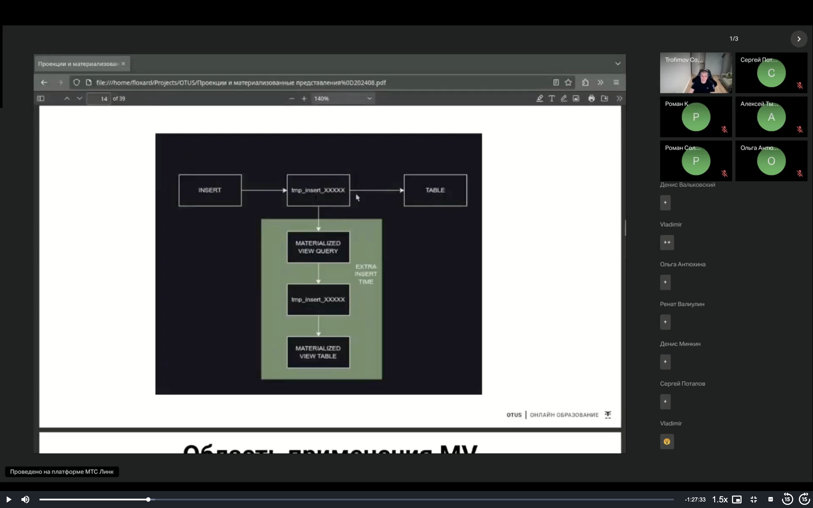

# Проекции и материализованные представления

https://presentations.clickhouse.com/meetup47/materialized_views.pdf

## Что понимается под материализованным представлением в ClickHouse

В других системах - Материализованное представление (materialized view, сокращенно MV) является набором данных, преобразованных к новому виду на основании данных оригинальной таблицы. При модификации данных, изменяются так же данные в материализованном представлении.

В ClickHouse - MV является триггером на INSERT, и дообработчиком данных, с записывающим результат в другую таблицу. При добавлении новых данных посредством INSERT, они помимо вставки в целевую таблицу, так же дообрабатываются MV, и результат дообработки записывается ещё в одну таблицу. Возможны каскады, сбор аггрегатов с нескольких таблиц в одну, или с одной таблицы в несколько. При этом мы никак не взаимодействуем с данными в таблице, которые уже есть (ну и не доагрегируем их с данными, которые в таблице уже есть)

Цена за MV
1) Увеличение времени вставки в таблицу. Вставка в MV будет произведена рамках выполнения INSERT в оригинальную таблицу. (в логах в марках инсерта увидим запись `pushing to mat view` - это и будет обозначать вставку через мв; все это происходит в контексте изначального инсерта)
2) Повышение комплексной сложности миграций. При выполнении миграций по оригинальной таблице, необходимо учитывать применимость материализованных представлений к новой схеме таблицы. 
   Когда мы добавляем/удаляем какие то столбцы - если эти столбцы были использованы в мв, то оно поломается. Причем сделает это неявным образом. Вставка в изначальную таблицу будет блокироваться по причине мв
3) Необходимость учитывать MV при раздаче прав доступа. Пользователь, выполняющий INSERT в таблицу, так же должен иметь право на INSERT во все таблицы, в которые этот INSERT принесет данные посредством MV.



Здесь каталог tmp_insert_XXXX - это каталог на файловой системе, где у нас рождаются наши парты внутри таблицы

Область применения MV
1) Сборка агрегатов и статистики для конечного пользователя. Применяя Engine таблиц с дополнительной логикой аггрегации данных, такие как AggregatingMergeTree, CollapsingMergeTree, SummingMergeTree ( вебинар 3 (7). Движки MergeTree Family ) можно достичь значительного ускорения запросов по сравнению с выборкой по оригинальным данным. MV будет заниматься наполнением таких таблиц, из данных оригинальной таблицы, помере их вставки.
2) Обогащение данных. При объявлении MV можно использовать dictGet, доставая таким образом данных из других систем. 
3) Интеграция с другими системами, специальными Engine таблиц, ( вебинар 5 (9). Другие движки ) где есть аналог INSERT, например Engine=Kafka. Можно использовать MV как consumer, и сохранять данные из Kafka в ClickHouse. Можно использовать MV как producer, и сохранять данные из ClickHouse в Kafka.

## EXPLICIT и IMPLICIT материализованные представления

IMPLICIT MATERIALIZED VIEW - Таблица для хранения результирующих данных создается вместе с MV «mvName» как «.inner.mvName» Таблица .inner дропается вместе с MV, но можно её переименовать и тогда она не дропнется вместе с MV.

Минусы IMPLICIT
1) Недокументированные, сложные методы изменения таблицы под MV
2) Синтаксис изменения запроса под MV требует включения экспериментальной функции
3) Примеры удалены из документации, это легаси

EXPLICIT MATERIALIZED VIEW - Таблицу для хранения результирующих данных необходимо создать заранее и отдельно.

Здесь уже нет необходимости указывать список колонок, поскольку мы просто занимаемся перекладыванием данных: `CREATE MATERIALIZED VIEW name TO tableName AS query`

Плюсы EXPLICIT
1) Можно менять запрос, пересоздавая MV (DROP+CREATE), не затрагивая данные
2) Таблица с результирующими данными независима, альтериться как обычно
3) Можно делать несколько MV в одну результирующую таблицу

## Практика 37 00

```sql
-- docker exet -it ch52 clickhouse-client -nm  
-- здесь флаг m означает multiquery (возможность выполнить несколько запросов)
-- флаг n означает multiline - можно делать переносы строк на enter
-- также их можно ввести в конфиг
-- vi /etc/clickhouse-client/config.xml
-- <multiline>1</multiline>
-- если забыл - можно воспользоваться хэлпом
-- clickhouse-client -help | grep multi


-- у нас есть таблица и мы хотим что то делать со значением а при вставке
drop table if exists t1;
create table t1 (a String, b String) Engine=MergeTree order by a;
select toTypeName(uniqState(a)) from t1; -- такой нам нужен будет тип столбца
/*
┌─toTypeName(uniqState(a))────────┐
│ AggregateFunction(uniq, String) │
└─────────────────────────────────┘
*/
-- целевая таблица
create table t2 (a String, b AggregateFunction(uniq, String)) Engine=AggregatingMergeTree order by a;
-- мв
create materialized view t1_to_t2 TO t2 as select a, uniqState(b) from t1 group by a;

-- вставим данные
insert into t1 values ('project1', 'user1');
insert into t1 values ('project1', 'user2');
insert into t1 values ('project1', 'user3');
select * from t1;
/*
┌─a────────┬─b─────┐
│ project1 │ user3 │
└──────────┴───────┘
┌─a────────┬─b─────┐
│ project1 │ user2 │
└──────────┴───────┘
┌─a────────┬─b─────┐
│ project1 │ user1 │
└──────────┴───────┘
*/
select a, uniqMerge(b) from t2 group by a;
/*
┌─a────────┬─uniqMerge(b)─┐
│ project1 │            0 │
└──────────┴──────────────┘
*/
select a, uniqExact(b) from t2 group by a;
```

Как конвертировать impliced -> expliced

```sql
create materialized view implicit_mv (a String, b AggregateFunction(uniq, String)) Engine=AggregatingMergeTree order by a
as
select a, uniqState(b) from t1 group by a;
show tables;
-- видим что у нас в таблице появляется  inner_id
/*
┌─name───────────────────────────────────────────┐
│ .inner_id.d2d26360-c811-4e72-9543-3cd4d686670c │
│ implicit_mv                                    │
│ t1                                             │
│ t1_to_t2                                       │
│ t2                                             │
└────────────────────────────────────────────────┘
*/
-- при удалении мв удалится и иннер таблица
drop table implicit_mv;
/*
┌─name─────┐
│ t1       │
│ t1_to_t2 │
│ t2       │
└──────────┘
*/
-- можно обойти через 
rename table .inner_id.d2d26360-c811-4e72-9543-3cd4d686670c to t3;

-- explicit
create materialized view explicit_mv to t3
as
select a, uniqState(b) from t1 group by a;
```

Пример по мв из доки
```sql
CREATE DATABASE test;
CREATE TABLE test.visits
 (
    StartDate DateTime64 NOT NULL,
    CounterID UInt64,
    Sign Nullable(Int32),
    UserID Nullable(Int32)
) ENGINE = MergeTree ORDER BY (StartDate, CounterID);
CREATE TABLE test.agg_visits (
    StartDate DateTime64 NOT NULL,
    CounterID UInt64,
    Visits AggregateFunction(sum, Nullable(Int32)),
    Users AggregateFunction(uniq, Nullable(Int32))
)
ENGINE = AggregatingMergeTree() ORDER BY (StartDate, CounterID);
CREATE MATERIALIZED VIEW test.visits_mv TO test.agg_visits
AS SELECT
    StartDate,
    CounterID,
    sumState(Sign) AS Visits,
    uniqState(UserID) AS Users
FROM test.visits
GROUP BY StartDate, CounterID;

set send_logs_level='trace';
INSERT INTO test.visits (StartDate, CounterID, Sign, UserID)
 VALUES (1667446031000, 1, 3, 4), (1667446031000, 1, 6, 3);
/*
[8704b1e6e8bb] 2024.11.27 15:56:09.958175 [ 46 ] {f2ca2e20-df33-4403-8ce3-e6bbcb504e39} <Trace> DiskLocal: Reserved 1.00 MiB on local disk `default`, having unreserved 8.84 GiB.
[8704b1e6e8bb] 2024.11.27 15:56:09.958978 [ 46 ] {f2ca2e20-df33-4403-8ce3-e6bbcb504e39} <Trace> MergedBlockOutputStream: filled checksums all_2_2_0 (state Temporary)
[8704b1e6e8bb] 2024.11.27 15:56:09.959499 [ 46 ] {f2ca2e20-df33-4403-8ce3-e6bbcb504e39} <Trace> test.agg_visits (ca6d62f2-bb4c-4d0e-8b5c-5fe2459c4e0c): Renaming temporary part tmp_insert_all_2_2_0 to all_2_2_0 with tid (1, 1, 00000000-0000-0000-0000-000000000000).
[8704b1e6e8bb] 2024.11.27 15:56:09.965010 [ 46 ] {f2ca2e20-df33-4403-8ce3-e6bbcb504e39} <Trace> PushingToViews: Pushing (sequentially) from test.visits (93c95b79-62e4-450c-9e0c-fd36f65625b3) to test.visits_mv (0a68f7b1-4796-4f12-9439-d80a6f5cde0d) took 9 ms.
*/
-- тут мы видим и наш парт tmp_insert_all_2_2_0, и PushingToViews

set send_logs_level='none';
SELECT
    StartDate,
    sumMerge(Visits) AS Visits,
    uniqMerge(Users) AS Users
FROM test.agg_visits
GROUP BY StartDate
ORDER BY StartDate;
/*
┌───────────────StartDate─┬─Visits─┬─Users─┐
│ 2022-11-03 03:27:11.000 │      9 │     2 │
└─────────────────────────┴────────┴───────┘

1 row in set. Elapsed: 0.013 sec. 
*/
```

Немного напомним что такое State и Merge. Это наши суффиксы к агрегационным функцциям, позволяющие забрать промежуточный результат. При помощи суффикса Merge мы аггрегируем суффиксы State.

## Проекции 1 03 00

Сущности, альтернативная МВ - создается не в отдельной таблице, а прям в той же таблице, с которой мы работаем. 
 
Проекция - ещё одна копия данных таблицы, с собственым ПК или даже промежуточными результатами аггрегации. Используется прозрачно для пользователя, не требует изменения SELECT-запросов к таблице (как ходили к таблице, так и продолжаем ходить теми же запросами). Представляет собой подкаталог парта, с данными проекции, при Merge партов объединяются также и проекции.

В сравнении с МВ - более точенчный (даже более ограниченный) инструмент, менее гибкий - но зато более прозрачный. С мв мы можем собрать данные с нескольких таблиц, поработать с кафкой и тд. Зато проекции более прозрачны

Это еще один парт внутри нашего парта с другим ПК

Управление проекциями:

Добавление
```sql
ALTER TABLE [db.]name ADD PROJECTION [IF NOT EXISTS] name ( SELECT <COLUMN LIST EXPR> [GROUP BY] [ORDER BY] )
-- <COLUMN LIST EXPR> - произвольное выражение (список колонок, возможно какие то функции)
-- ORDER BY - новый ПК, альтернативный
-- GROUP BY - для промежуточной аггрегации, должно соответствовать <COLUMN LIST EXPR> так же, как и при обычном запросе SELECT
```
Материализация - При добавлении проекции, она начинает строиться только для вновь поступающих данных. Для существующих данных необходимо материализовать:
```sql
ALTER TABLE [db.]table MATERIALIZE PROJECTION [IF EXISTS] name [IN PARTITION partition_name]
-- IN PARTITION - материализовать в конкретной партиции, если опущено материализуется во всех
```
Удаление
```sql
ALTER TABLE [db.]name DROP PROJECTION [IF EXISTS] name
```
Удаление только для конкретной партиции
```sql
ALTER TABLE [db.]table CLEAR PROJECTION [IF EXISTS] name [IN PARTITION partition_name]
-- IN PARTITION - можно опустить, тогда удалится для всех, но продолжит собираться для вновь поступающих данных
```

### Информация о проекциях

Для просмотра свойств проекций предусмотрены два системных представления. 
- Представление `system.projection_parts` схоже с представлением system.parts, но содержит дополнительную информацию о родительских датапартах в полях, имеющих префикс parent*
- Представление `system.projection_parts_columns` позволяет по имени таблицы или проекции посмотреть поля запроса проекции и их типы.
```sql
-- проверим куски нашей таблицы
select name, active
from system.parts
where table='tbl_with_projection';

-- и проверим куски проекции
select name, parent_name, rows, active
from system.projection_parts_columns
where table='tbl_with_projection';

-- проверим типы полей проекции
select column, type, column_position
from system.projection_parts_columns
;
```

### Использование проекций в запросах 

`optimize_use_projections` - Включает или отключает поддержку проекций при обработке запросов SELECT. Возможные значения: 
- 0 — Проекции не поддерживаются. (Значение по умолчанию) (проекции по умолчанию не используются! но это можно увести в профиль пользователя)
- 1 — Проекции поддерживаются. 

Хотя явного измения запросов не требуется, чтобы включить работу с проекциями необходимо установить optimize_use_projections=1. ClickHouse будет самостоятельно определять необходимость использования проекций при выполнении запросов. 

`force_optimize_projection` - Включает или отключает обязательное использование проекций в запросах SELECT, если поддержка проекций включена (см. настройку optimize_use_projections). Возможные значения: 
- 0 — Проекции используются опционально.  (Значение по умолчанию)
- 1 — Проекции обязательно используются. 

Проекции используются принудительно, если проекции использовать нельзя, запрос выполнен не будет.

При ихменении структуры таблицы с проекцией ничего не происходит. Чтобы проекция пересчиталась, ее необходимо материализовать. Если же мы добавили колонку, которая у нас в проекции не использовалась, то и пересчитывать ничего не нужно.

## Практика 1 13 00

```sql
use test;

create table test.visits
(
    StartDate DateTime64(3),
    CounterID UInt64,
    Sign Nullable(Int32),
    UserID Nullable(Int32)
)
Engine=MergeTree
order by (StartDate,CounterID);
INSERT INTO test.visits (StartDate, CounterID, Sign, UserID)
 VALUES (1667446031000, 1, 3, 4), (1667446031000, 1, 6, 3);

alter table visits add projection userUniq (select StartDate, CounterID, uniq(UserID) group by StartDate, CounterID );
-- мы создали проекцию. Теперь, когда мы будем использовать uniq(UserID) - у нас будут переиспользоваться данные, существующие в проекции.
-- материализуем проекцию:
alter table visits materialize projection userUniq;
set optimize_use_projections=1;

set send_logs_level='trace';
select StartDate, CounterID, uniq(UserID) 
from test.visits
group by StartDate, CounterID ;  -- при этом запросе мы использовали проекцию
/*
[4c149cc68762] 2024.12.01 09:50:55.283003 [ 48 ] {3db26d75-94ce-4066-a4d5-4b2cf96cba43} <Debug> executeQuery: (from 127.0.0.1:45570) select StartDate, CounterID, uniq(UserID) from test.visits group by StartDate, CounterID ; (stage: Complete)
[4c149cc68762] 2024.12.01 09:50:55.286197 [ 48 ] {3db26d75-94ce-4066-a4d5-4b2cf96cba43} <Trace> ContextAccess (default): Access granted: SELECT(StartDate, CounterID, UserID) ON test.visits
[4c149cc68762] 2024.12.01 09:50:55.286603 [ 48 ] {3db26d75-94ce-4066-a4d5-4b2cf96cba43} <Trace> InterpreterSelectQuery: FetchColumns -> Complete
[4c149cc68762] 2024.12.01 09:50:55.289028 [ 48 ] {3db26d75-94ce-4066-a4d5-4b2cf96cba43} <Debug> test.visits (cdbcbc67-78f9-4c98-8012-ef8d185268e6) (SelectExecutor): Key condition: unknown
[4c149cc68762] 2024.12.01 09:50:55.289229 [ 48 ] {3db26d75-94ce-4066-a4d5-4b2cf96cba43} <Debug> test.visits (cdbcbc67-78f9-4c98-8012-ef8d185268e6) (SelectExecutor): Key condition: unknown
[4c149cc68762] 2024.12.01 09:50:55.289571 [ 48 ] {3db26d75-94ce-4066-a4d5-4b2cf96cba43} <Debug> test.visits (cdbcbc67-78f9-4c98-8012-ef8d185268e6) (SelectExecutor): Selected 1/1 parts by partition key, 1 parts by primary key, 1/1 marks by primary key, 1 marks to read from 1 ranges
[4c149cc68762] 2024.12.01 09:50:55.289637 [ 48 ] {3db26d75-94ce-4066-a4d5-4b2cf96cba43} <Trace> test.visits (cdbcbc67-78f9-4c98-8012-ef8d185268e6) (SelectExecutor): Spreading mark ranges among streams (default reading)
[4c149cc68762] 2024.12.01 09:50:55.289898 [ 48 ] {3db26d75-94ce-4066-a4d5-4b2cf96cba43} <Trace> test.visits (cdbcbc67-78f9-4c98-8012-ef8d185268e6) (SelectExecutor): Reading 1 ranges in order from part userUniq, approx. 1 rows starting from 0
[4c149cc68762] 2024.12.01 09:50:55.301294 [ 877 ] {3db26d75-94ce-4066-a4d5-4b2cf96cba43} <Trace> AggregatingTransform: Aggregating
[4c149cc68762] 2024.12.01 09:50:55.301630 [ 877 ] {3db26d75-94ce-4066-a4d5-4b2cf96cba43} <Trace> Aggregator: Aggregation method: keys128
[4c149cc68762] 2024.12.01 09:50:55.301914 [ 877 ] {3db26d75-94ce-4066-a4d5-4b2cf96cba43} <Trace> AggregatingTransform: Aggregated. 1 to 1 rows (from 104.00 B) in 0.011655083 sec. (85.799 rows/sec., 8.71 KiB/sec.)
[4c149cc68762] 2024.12.01 09:50:55.301999 [ 877 ] {3db26d75-94ce-4066-a4d5-4b2cf96cba43} <Trace> Aggregator: Merging aggregated data
┌───────────────StartDate─┬─CounterID─┬─uniq(UserID)─┐
│ 2022-11-03 03:27:11.000 │         1 │            2 │
└─────────────────────────┴───────────┴──────────────┘
[4c149cc68762] 2024.12.01 09:50:55.304974 [ 48 ] {3db26d75-94ce-4066-a4d5-4b2cf96cba43} <Debug> executeQuery: Read 1 rows, 104.00 B in 0.022176 sec., 45.093795093795094 rows/sec., 4.58 KiB/sec.
[4c149cc68762] 2024.12.01 09:50:55.305150 [ 48 ] {3db26d75-94ce-4066-a4d5-4b2cf96cba43} <Debug> MemoryTracker: Peak memory usage (for query): 178.09 KiB.
[4c149cc68762] 2024.12.01 09:50:55.305172 [ 48 ] {3db26d75-94ce-4066-a4d5-4b2cf96cba43} <Debug> TCPHandler: Processed in 0.022830625 sec.

1 row in set. Elapsed: 0.023 sec. 
*/
-- а именно
-- Reading 1 ranges in order from part userUniq, approx. 1 rows starting from 0
-- то есть она забрал данные не с парта оригинальной таблицы, а с парта userUniq, поскольку это у нас наша проекция, таким образом посчитав быстрее (переиспользовав результат из проекции)
alter table visits drop projection userUniq;
```

Индексы на проекции создавать нельзя! В качестве индекса уже идет минмакс ключ. Вторичные индексы навесить нельзя.

Посмотрим, как при помощи диктГета в материализованном представлении мы можем дообогащать данные.
```sql
-- у нас есть таблица с показами, там у нас есть айди события (impressionId) и айди системы, которая позволила этому событию произойти (dspId)
create table shows (
    timestamp DateTime MATERIALIZED now(), 
    date Date MATERIALIZED toDate(timestamp),
    impressionId UInt32,
    dspId UInt32
)
engine=MergeTree
order by (date, dspId);
show create table shows format TSVRaw;

-- мы можем подтянуть значения айди из словарей
-- создадим источник для словаря и словарь и вставим в них данные
create table dspIds (
    dspId UInt32,
    company String
)
engine=MergeTree
order by dspId;
create dictionary dsp_to_company (
    dspId UInt32,
    company String
)
primary key dspId
source(clickhouse(table dspId))
layout(flat)
lifetime(min 0 max 5);
insert into dspIds values
(
    1, 'vk'
),
(
    2, 'yandex'
),
(
    3, 'adsniper'
);
select * from dspIds;

-- теперь создадим обогащеннную таблицу
create table shows_extra_info (
    timestamp DateTime , 
    date Date,
    impressionId UInt32,
    dspId UInt32,
    company String
)
engine=MergeTree
order by (date, dspId);
-- наполнять мы ее будет при помощи МВ
create materialized view add_company to shows_extra_info as
select *, dictGet('dsp_to_company', 'company', dspId)
from shows;
-- теперь при вставке в таблицу shows у нас МВ будет опрашивать словарик dsp_to_company, забирать оттуда значение нашего company и вставлять в shows_extra_info
-- можно делать и джоин, но это будет очень дорого - на каждый инсерт мы будет подгружать в оперативную память всю таблицу.
-- в другие таблицы обратиться можно, но это будет не очень эффективно!
```

Engine=Null - можно использоватиь чтобы не хранить исходные данные! Например, при чтении из кафки - чтобы не хранить много лишнего, можно просто сохранять в нулл (аналог /дев/нулл), при этом навесить мв чтобы часть нужных данных попадала в нужную нам таблицу. Таким образом мы можем принять много данных и забрать из них только нужные и положить куда то еще!