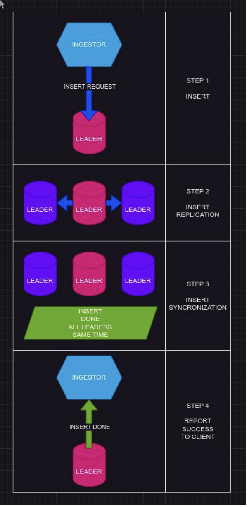
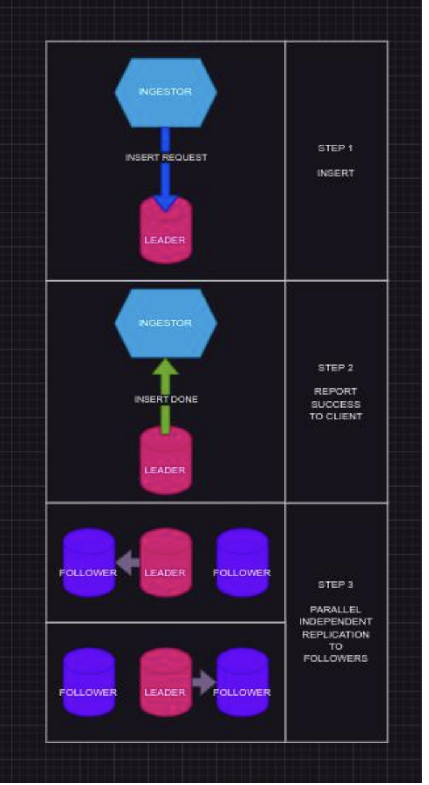
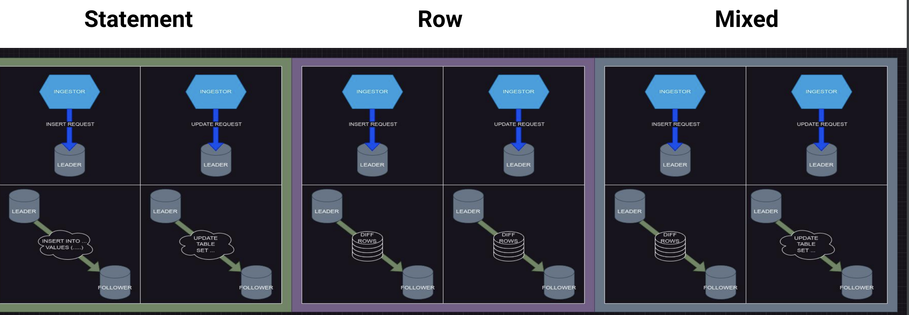
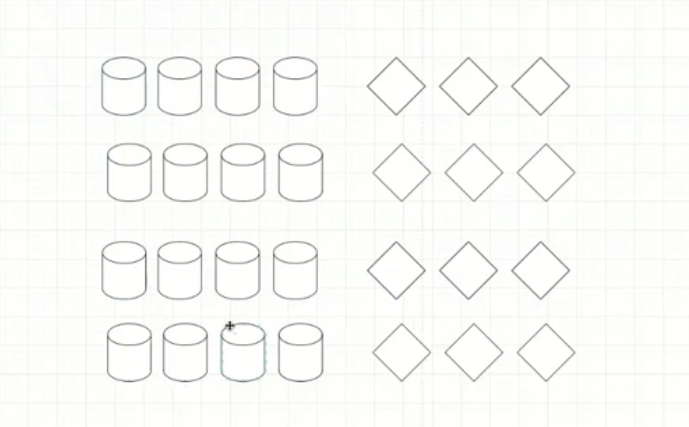

# Репликация и другие фоновые процессы

https://chistadata.com/data-replication-in-clickhouse-docker-based-setup/

## Виды репликации в разных системах

С репликацией можно было встречаться еще в постгресе. С точки зрения репликации выделяют 2 варианта:
- синхронная - запрос считается выполненным тогда, когда он выполнен на всех репликах, как правило, все реплики лидеры. Дополнительные механизмы синхронизации выполнения запроса на репликах (от примитичных - условный health-check на передачу информации, - до более продвинутых).
- асинхронная - запрос считается выполненым тогда, когда он выполнен на принимающей запрос реплике. Репликация запроса выполняется независимо на все реплики, в фоновом режиме. Как правило, один лидер, остальные реплики. Однако мульти-лидер также возможен с дополнительными механизамами обеспечения консистентности. Тут мы отзыва не ждем - просто запускаем фоновые процессы, которые будут рассылать сигналы, процессы ничего не блокируют.

В зависимости от того, как каждая из них происходит, ее применяют в разных юз-кейсах. Условно говоря про какой нибудь большой распределенный постгрес (гринплам) мы будем говорить про систему, которая испльзует mirror-link (зеркалирование) по принципу физической репликации. То есть по сути передача файлов изменений (на постгресе это называется write-ahead логи) с одной ноды на другую ноду. При этом при передаче такой информации нода мастер, с которой происходит передача информации на реплику блокируется на какое то время для того чтобы получить сигнал о том, что эта нода либо приняла, либо приняла и применило на уровне ОС, либо приняла и применила на уровнях ОС и SQL этот запрос. ПОка такой сигнал не придет на мастер-ноду, она не производит дополнительных штук.

Также у нас есть такое понятие как лаг-репликация, то есть отставание.

 

Репликация - это что то, что должно идти до бэкапирования! То ечть в целом для построения нашей большой системы - это построение кластера самой субд, мониторинг, алертинг, репликация, бэкапирование. Бэкапирование - это что то, до чего мы не должны дойти, тк у нас есть репликация и она должна быть настроена!

Типы передаваемой информации в рамках репликации:
- Statement - Реплицируются запросы на выполнение; данные есть, мы говорим, что нужно сделать над этими данными чтобы привести их в то же самое состояние
- Row - реплицируются сами данные и изменения этих данных (некоторый блок измененных строк, который мы можем передавать от мастера к реплике для того, чтобы реплика в таком вот смысле приводила себя к общему состоянию)
- Mixed - совмещение подходов (передаем и сами запросы на выполнение, и сами измененные строки)



В клике используется асинхронный мульти-лидер. Каждая реплика самостоятельно принимает данные
- данные о новых партах записываются в метаданные в zookeeper/clickhouse-keeper (далее *keeper), и в очередь *keeper как событие GET_PART ; Зукипер - дополнительный инструмент, необходимый нам в клике для репликации. Конкретик по версии зукипера нет, все удобноваримые. Кликхаускипер - тот же самый зукипер, но разработанный на плдюсах и оптимизированный специально для кликхауса. У зукипера есть буквально две хорошие версии - 3.5.4 и 3.7.х
- каждая реплика слушает http-порт заданный в конфигурации как interserver_http_port И/ИЛИ interserver_https_port, а так же анонсирует себя в *keeper. Эту информацию можно посмотреть в наших системных представлениях
- каждая реплика разбирает очередь и выполняет GET_PART, скачивая с соседних реплик недостающие данные

Архитектурно исключены проблемы с асинхронной репликацией
- нет требований к уникальности Primary Key
- нет автоинкремента

Кластеры зукипера могут быть в зависимости от размера шарда разные - может быть один отдельный большой кластер зукипера (есть кластер клика на энное количество нод, а рядом с ним кластенр зукипера), а бывате так что нагрузка на передачу метаинформации между нодами достаточно высокая и отдельные шарды (достаточно жирные) будут перекрывать полностью загруженность зукипера, в таком случае настраивается кластер зукипера для отдельных шардов клика. Как правило, кластер зукипера - это 3 ноды. При этом даже если клик является нодами железными, которые расположены на железе, то ресурсы для зукипера не должны быть высокими! Поэтому их можно делать на виртуалках, железки обычно на них не заказываются! 

На каждую из групп шардов может быть свой кластер зукипера:



Но тут может быть следующее неудобство для работы - запрос на класетр. В таком случае мы не можем создавать удобную `create table on cluster` - в такой конфигурации нам требуется один единый зукипер на весь кликхаус. Из за этого могут быть ошибки, так что лучше такую возможность заблокировать (чтобы on cluster мы не могли делать)!

Ближайший аналог для репликации данных - ROW. Репликация данных происходит партами, их можно считать блоками строк, но правильнее будет их называть блоками колонок, а репликацию PART-Based. Кроме результатов фоновой операции MERGE_PARTS, можно однако настроить и эти данные перевыкачиваться готовыми с реплик, а не пересчитываться

Для репликации метаданных - Statement. Для репликации мутаций - Statement.

В рамках домашки можно развернуть кластер кликхауса в докере - там 3 ноды кликхауса и 1 нода зукипера. [Докер компоуз](https://chistadata.com/data-replication-in-clickhouse-docker-based-setup/). Надо зайти на каждую ноду чтобы произвести опереденные настойки. НО!!!! конфиг.xml не менять! (в инструкции он меняется)

Требования к репликации:
1. работающий зукипер
2. секция в конфигурации, смотрящая на живой зукипер
3. Replicated к движку таблицы
4. Дополнительные параметры для движка
   - path - genm d perbgtht
   - replica - уникальное имя текущей реплики
5. уникальный путь в зукипере

Макросы - применяются для упрощения задания параметров репликации. Конфигурация
```xml
<macros>
    <ma>
</macros>
```
Наиболее часто используемые <shard> и <replica> либо <host>.

Встроенные макросы, которые не нужно дополнительно определять

Пример:

## Практика 42 00

```bash
# заходим на каждый из контейнеров кликхауса
apt-get update
apt-get install vim

vi /etc/clickhouse-server/config.d/z_config.xml
# и вставляем туда конфиг
:q

show clusters  # если видется наш кластер - значит все ок
```

Конвертация таблиц в реплицируемую

https://clickhouse.com/docs/en/sql-reference/statements/alter/partition

Еще  одна полезная ссылка 

https://habr.com/ru/companies/digitalleague/articles/759316/


## TTL  (1 22 00)

ТТЛ - отложенное удаление данных. Главный кейс - удаление

По сути ТТЛ - это обычный крон с alter table drop partition / alter table move partition

## Мутации (1 30 00)

## Merge операции