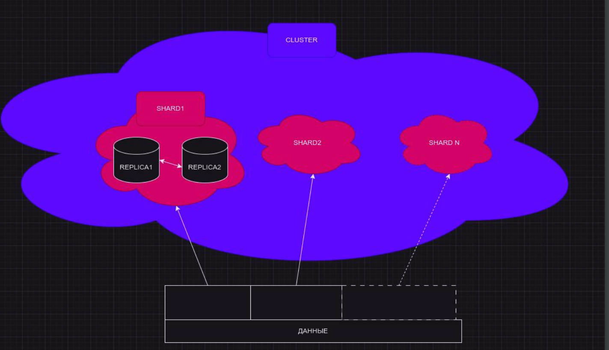

# Шардирование и распределенные запросы

Репликация - это по сути создание отдельной копии наших данных на отдельных узлах. И по сути, мы не будем распределять наши запросы - они могут ходить на каждую ноду и выполняться там. 

## Шардирование

Шардирование - расширение доступного места под данные, за счет разделения данных по определенному ключу на несколько экземпляров приложения с независмым хранением. Как правило за счет размещения экземпляров приложения на разные сервера. Чаще всего мы стараемся чтобы эти куски были одинаковые по размеру, максимально приближенные по размеру (тк мы хотим чтобы наши ноды примерно одинаково работали по нагрузке).

Также у нас может быть огромная таблица, которую в одну ноду может быть проблематично впихнуть по объему. Мы можем куски этой таблицы распределить на несколько шардов для того чтобы на каждую из нод мы положили некоторый небольшой набор этих данных и потом мы могли собрать всю информацию.



Для того чтобы нам делать такую топологию, мы используем Distributed движок, который является единой точкой входа и для вставки данных, и для селекта

Engine=Distributed - Виртуальная таблица выступающая в роли «агрегирующего прокси»: 
- Принимает запросы
- Повторяет запросы в таблицы с данными согласно топологии кластера (таблица с типом Distributed не содержит никакой информации!)
- Объединяет результаты с шардов
- Возвращает результат объединения

Создается:  
`CREATE TABLE имя таблицы ( колонки ) Engine=Distributed( аргументы)`

### Engine=Distributed аргументы  

`Distributed( cluster_name, database, table, sharding_key )`  
- cluster_name - топология описаная в конфигурации в секции <remote_servers> как секция <cluster_name> (это отдельная секция, в которой мы прописываем названия кластера), можно выбрать любое имя, можно описывать несколько топологий и использовать с разными Distributed-таблицами
- database, table - таблица, в которую будет повторен запрос в одну реплику каждого шарда (таблица является условно локальной (префикс local), еще есть префикс all - это распределенная таблица)
- sharding_key - необязательный для SELECT-запросов к таблице параметр, можно не указывать, необходим для INSERT-запросов. Должен быть числовым типом, можно использовать хеширующие функции от других колонок. Нарезает данные на шарды по номеру шарда получаемого как остаток от деления ключа шардирования наколичество шардов. По умолчанию подставляется rand()
- (есть еще policy, но он используется сильно редко)

секция internal_replication - означает что при работе с кластером (при подключении к любому шарду), если это подключение происходит при создании/заборе данных в одну из реплик - репликация в дальнейшем может осуществляться за счет забора данных из нашего лидера (чтобы не дублировать запросы, не раскидывать эти запросы по всем репликам, - а делать это централизованно, из реплики-лидера)

Дистрибьютед таблица может быть сделана как на одной ноде, так и на всех нодах. Для того, чтобы не сужать способ взаимодействия со всеми нашими данными.

## настройка топологии (22 00)

На прошлом занятии мы делали полностью репликетед кластер. Сейчас сделаем полностью шардированный кластер (sharded_cluster). Названия могут быть какие угодно - преподаватель часто делает all_replicated / all_sharded. 

Каждую реплику мы делаем отдельным шардом. У каждого куска будет одна реплика (одна нода).

Engine=Distributed описание топологии кластера  
Выполняется через конфигурационный файл: (на серверах с Distributed-таблицами)
```xml
<remote_servers>
    <cluster_name>
        <shard>
            <replica> 
                <host>ch-server-1.zone</host> 
                <port>9000</port> 
            </replica>
            ... replica 2 ...
            ... replica 3 ... 
        </shard>
        ... one more shard ...
        ... more shards ... 
    </cluster_name>
    ... more clusters ... 
</remote_servers>
```

Пример , который делали на занятии - в clusters/distributed_cluster_ch  
поднимаем компоуз и смотрим состояние кластера
```sql
show clusters;
/*
   ┌─cluster────────────┐
1. │ default            │
2. │ replicated_cluster │
3. │ sharded_cluster    │
   └────────────────────┘

3 rows in set. Elapsed: 0.004 sec. 
*/
create table example on cluster sharded_cluster
(
    id UInt32,
    name String
)
engine=MergeTree()
order by id;

create table example_all as example  -- для сохранения конфигурации по нашим колонкам
engine = Distributed(sharded_cluster, default, example, rand());
-- дистрибьютед таблицы на всех шардах!

-- теперь мы можем обращаться как к локальной таблице, так и к общем
select * from example_all;

insert into example_all values (1, 'hello');
insert into example_all values (2, 'world');
insert into example_all values (3, '!');
select * from example_all;
/*
   ┌─id─┬─name──┐
1. │  1 │ hello │
   └────┴───────┘
   ┌─id─┬─name──┐
2. │  2 │ world │
   └────┴───────┘
   ┌─id─┬─name─┐
3. │  3 │ !    │
   └────┴──────┘

3 rows in set. Elapsed: 0.018 sec. 
*/
--  в рамках дз лучше постараться сделать пример с равномерных распределением

drop table example_all; 
create table example_all as example  -- для сохранения конфигурации по нашим колонкам
engine = Distributed(sharded_cluster, default, example, id);
-- так у нас распределится равномерно!
```

Помимо хоста-порта в конфиге (причем порт можно не прописывать - он по умолчанию будет ходить по 9000) можно прописать флаги secure, пользователя (по умолчанию дефолтный), пароль (можно и засунуть в переменную окружения), weight - вес конкретного шарда.

На одну локальную таблицу можно навеситть бесконечно много дистрибьютед! Но лучше это регламентировать. Лучше сохранять соотношение один-к-одному (одна дистрибьютед ко множеству локальных таблиц) (а не 2 дистрибьюетд и тд).

### Доступы  

Если Distributed-таблица расположена не на том же сервере (на отдельном), что и таблица с данными, дублировать пользователей на сервера с данными не обязательно. Distributed-таблица породит запросы в реплики с пользователем default, или с указаным <user>пользователь</user> в секции <replica>...</replica> конфигурации кластера. Однако для row-policy всё ещё необходимо наличие пользователя, он передается как initital_user на реплики и проверяется по row-policy (подробнее в модуле «Управление  ресурсами», лекции «RBAC контроль доступа, квоты и ограничения»).

Удаление и добавление шардов/реплик 

При такой топологии у нас становится очень легким горизонтальное масштабирование. Добавление новые реплик сводится к тому что мы поменяли свою топологию. Но с точки зрения решардинга есть определенные вопросики.

Достигается редактированием конфигурационного файла. На всех серверах с Distributed-таблицами. В конфугирационный файл добавляются/удаляются готовые к эскплуатации сервера с нужным набором таблиц, подготовленные заранее (в том числе в ддл-ками локальных таблиц). Важно, чтобы до раскатки конфигурации, были заранее созданы целевые таблицы, к которым будет обращаться Distributed-таблица, ClickHouse не создаст их самостоятельно. В противном случае будет получен DB::Exception: нет таблицы на remote реплика на запрос к Distributed таблице.

Замена отказавшей реплики
1) в system.replicas живой реплики подсмотреть имя мертвой реплики и списоктаблиц
2) запрос SYSTEM DROP REPLICA ‘отказавшая реплика’ FROM table таблица, длякаждойтаблицы
3) введение в эксплуатацию новой реплики на замену старой, создание на ней всех таблиц.
4) дождаться репликации таблиц
5) заменить реплику в remote_servers

```sql
create table test on cluster replicated_cluster
(
    id UInt8
)
engine=ReplicatedMergeTree
order by id;
insert into test 
select number
from numbers(5);

select * from system.replicas \G;
/*
Row 1:
──────
database:                    default
table:                       test
engine:                      ReplicatedMergeTree
is_leader:                   1
can_become_leader:           1
is_readonly:                 0
is_session_expired:          0
future_parts:                0
parts_to_check:              0
zookeeper_name:              default
zookeeper_path:              /clickhouse/tables/33c0108f-1038-426e-972b-97227afb2f57/01
replica_name:                ch2
replica_path:                /clickhouse/tables/33c0108f-1038-426e-972b-97227afb2f57/01/replicas/ch2
columns_version:             -1
queue_size:                  0
inserts_in_queue:            0
merges_in_queue:             0
part_mutations_in_queue:     0
queue_oldest_time:           1970-01-01 00:00:00
inserts_oldest_time:         1970-01-01 00:00:00
merges_oldest_time:          1970-01-01 00:00:00
part_mutations_oldest_time:  1970-01-01 00:00:00
oldest_part_to_get:          
oldest_part_to_merge_to:     
oldest_part_to_mutate_to:    
log_max_index:               0
log_pointer:                 1
last_queue_update:           2024-12-14 10:44:25
absolute_delay:              0
total_replicas:              3
active_replicas:             3
lost_part_count:             0
last_queue_update_exception: 
zookeeper_exception:         
replica_is_active:           {'ch3':1,'ch1':1,'ch2':1}

1 row in set. Elapsed: 0.016 sec. 
*/
-- здесь будет указатель на реплики, которые у нас неактивны
```

## Распределенные запросы 52 00

### GLOBAL IN/JOIN

Чаще всего мы включаем этот параметр или отдаем на откуп пользователю.
Запрос вида `SELECT ... FROM distributed_table WHERE IN ( SELECT ... )` Будет передан на каждый шард как `SELECT ... FROM local_table WHERE IN ( SELECT ... )`  
Где local_table - это таблица заданная в аргументах distributed_table. Таким образом, например при выполнении на кластере из 100 шардов, подзапрос ( SELECT ... ) будет выполнен 100 раз (причем тут нету оптимизаторов которые позволят не обращаться к локальным таблицам, которые априори не содержат какую-либо информацию). 

Модификатор GLOBAL меняет это поведение. GLOBAL IN ( подзапрос ) сначала выполнит подзапрос, потом передаст его  результат на все шарды как временную таблицу переиспользуемую для основного запроса (мы посчитаем результат, выведем - и передадим далее). Аналогично работает с JOIN.

есть 4 варианта как мы можем глобал использовать: `distributed_product_mode` (Настройка сервера, меняет поведение по умолчанию для IN/JOIN запросов), следующим образом:
- deny - по умолчанию, возвращает DB::EXCEPTION при попытке использовать GLOBAL- запросы
- local - всё ещё запращает GLOBAL, но в подзапросах отправляемых на шарды заменяет distributed-таблицы на их local-таблицы
- global - заменяет IN/JOIN на GLOBAL IN/JOIN
- allow - разрешает пользователю выбирать самостоятельно (чаще всего оставляют его)

`prefer_global_in_and_join` - при использовании distributed_product_mode = global не учитываются таблицы с Engine для доступа к внешним ресурсам, например Engine=mysql. Это очень важно, поскольку если внешку пойдут распределенные запросы - это будет очень нехорошо. Любая mpp-шная система не сможет отдать результаты распределенного запроса до тех пор, пока все зависимые системы не отдадут результат своего запроса. То есть скорость будет по самой медленной ноде, самому медленному запросу.
- prefer_global_in_and_join=1 включает такое же поведение для таких Engine. 
- prefer_global_in_and_join=0 по умолчанию, отключено

Использование нескольких реплик одного шарда для запроса включается ручкой `max_parallel_replicas > 1`  
Требует наличия ключа семплирования “SAMPLE BY ключ” на MergeTree таблицах. Существенно ускоряет выполнения запроса, разбивая его на N реплик, используя ключ семплирования SAMPLE 1/N OFFSET (N-1)/N. Часть запросов мы вешаем на одну реплику, часть запросов - на другую.  
Важно! Если таблицы не имеют ключа семплирования, будет получен некорректный результат(выборка будет осуществлена по задублированным данным).

## Особенности шардирования

**Взаимосвязь с репликацией** - взаимосвязи нет. В описании топологии кластера вы можете назначать сервера репликами, а группы серверов шардами, но ClickHouse никак не будет проверять что ваша топология соответствует заданной при создании таблиц репликации. Набор взаимореплицирумых таблиц шарда, это самостоятельный набор таблиц, никак не зависящий от такого же набора для другого шарда. Для того, чтобы на разных шардах эти наборы были самостоятельными, удобно использовать макрос <shard> в *keeper-пути при создании таблицы, для уникализации этого пути для шарда.

Кликхаус никак не проверяет что наша топология закончена для ее применения! Он что увидит - то и прочитает. Так что нужно аккуратно править все топологии.

**Очередь Distributed таблиц** - Под капотом очень не оптимальный недокументированный одноименный формат Distributed (это просто тип как наши данные хранятся на уровне таблиц), на него нарезается приходящая в Engine=Distributed таблицы вставка (в дистрибьютед не хранится, но для того чтобы в дальнейшем распределить его по нашим локальным таблицам - она все еще сохраняется). Может быть узким местом и причиной поддержки топологии кластера в клиентах, с собственной реализацией шардирования, записью в обход Distributed-таблиц. Отслеживать очередь можно в таблице system.distribution_queue, важно рисовать метрики на основании этой таблицы.

```sql
-- в этой таблице есть очередь на дистрибьюцию конкретных таблиц, конкретных значений. 
select * from system.distribution_queue \G;
/*
Row 1:
──────
database:                     default
table:                        example_all
data_path:                    /var/lib/clickhouse/store/e28/e28d9c27-6ec5-44ef-b32c-8cfa64a8fdee/shard3_replica1/
is_blocked:                   0
error_count:                  0
data_files:                   0
data_compressed_bytes:        0
broken_data_files:            0
broken_data_compressed_bytes: 0
last_exception:               
last_exception_time:          1970-01-01 00:00:00

Row 2:
──────
database:                     default
table:                        example_all
data_path:                    /var/lib/clickhouse/store/e28/e28d9c27-6ec5-44ef-b32c-8cfa64a8fdee/shard2_replica1/
is_blocked:                   0
error_count:                  0
data_files:                   0
data_compressed_bytes:        0
broken_data_files:            0
broken_data_compressed_bytes: 0
last_exception:               
last_exception_time:          1970-01-01 00:00:00

2 rows in set. Elapsed: 0.008 sec. 
*/


-- чаще всего проверки и настройки навешивают на last_exception, broken_data_files
```

**Не досхлопывать результаты аггрегации с реплик** - Некоторые запросы, выполняющие аггрегацию по ключу шардирования, при условии что данные действительно шардированы по этому ключу, не требуют дополнительной аггрегации. Можно выставить настройку `distributed_group_by_no_merge=1`, значительно ускорив скорость таких запросов. Например, uniq() в группировке по ключу, при условии что на разных шардах нет повторяющихся между шардами ключей, даст корректный результат даже при пропуске операции дополнительной аггрегации. Если такие повторения между шардами есть, вернется несколько результатов по каждому такому повторению (по результату с шарда).

**Решардинг** - Его НЕТ. Предлагаемый в документации способ - создание нового кластера и переливка данных припомощи clickhouse-copier, под капотом которого конструктор `INSERT SELECT` запросов из конфига утилиты. То есть операция очень и очень тяжеловесная, поскольку нам нужно все наши данные достать, с учетом нового ключа перераспределить и записать. В больших системах вроде гринплама и клика обычно перед этим отключают все дополнительные механизмы, констрэинты, которые могут навесить еще какой то логики. Так что использование clickhouse-copier не очень оптимально. Альтернативы:
1. первый вариант:
   - копирование таблиц как `CREATE TABLE AS` + `ALTER TABLE ATTACH PARTITION FROM`
   - дублирование данных по репликации на новые шарды 
   - спил лишнего через “ALTER TABLE DELETE WHERE”
   - переключение на новые таблицы
2. на скриптах DETACH PART/PARTITION, перенос в новое место, ATTACH
3. переливка inplace через INSERT SELECT (самый медленный способ из всех перечисленных)

А как шардируются в yandex? Много маленьких кластеров используя макрос shard, сверху них distributed таблицы, кластера называются layer. Общий кластер используя макрос layer, ещё distributed таблицы сверху distributed таблицу ровня layer. В такой концепции становится применима переливка layer-ов утилитой clickhouse-copier

## Примеры

Distributed и Local таблицы
```sql
CREATE TABLE default.events (
    date Date MATERIALIZED toDate(timestamp), 
    ts DateTime, 
    event_id UInt64, 
    host IPv4, 
    response_time_ms UInt32, 
    headers Map(String, String), 
    another_column String, 
    one_more_column Array(String)
)
ENGINE=Distributed(cluster_name, default, events_local)

CREATE TABLE default.events_local (
    date Date MATERIALIZED toDate(timestamp), 
    ts DateTime, 
    event_id UInt64, 
    host IPv4, 
    response_time_ms UInt32, 
    headers Map(String, String), 
    another_column String, 
    one_more_column Array(String)
)
ENGINE=ReplicatedMergeTree(‘/ch/{database}/{table}/{shard}’,’{replica}’)
PARTITION BY date
ORDER BY (date,event_id)
SAMPLE by event_id;
```

```xml
<remote_servers>
    <!-- 2 shards 2 replicas -->
    <2sh2rep>
        <shard>
            <replica> <host>ch-server-1.zone</host> <port>9000</port> </replica>
            <replica> <host>ch-server-2.zone</host> <port>9000</port> </replica>
        </shard>
        <shard>
            <replica> <host>ch-server-3.zone</host> <port>9000</port> </replica>
            <replica> <host>ch-server-4.zone</host> <port>9000</port> </replica>
        </shard>
    </2sh2rep>

    <!-- 1 shards 4 replicas -->
    <1sh4rep>
        <shard>
            <replica> <host>ch-server-1.zone</host> <port>9000</port> </replica>
            <replica> <host>ch-server-2.zone</host> <port>9000</port> </replica>
            <replica> <host>ch-server-3.zone</host> <port>9000</port> </replica>
            <replica> <host>ch-server-4.zone</host> <port>9000</port> </replica>
        </shard>
    </1sh4rep>

    <!-- 3 shards 3 replicas -->
    <3sh3rep>
        <shard>
            <replica> <host>ch-server-1.zone</host> <port>9000</port> </replica>
            <replica> <host>ch-server-2.zone</host> <port>9000</port> </replica>
            <replica> <host>ch-server-3.zone</host> <port>9000</port> </replica>
        </shard>
        <shard>
            <replica> <host>ch-server-4.zone</host> <port>9000</port> </replica>
            <replica> <host>ch-server-5.zone</host> <port>9000</port> </replica>
            <replica> <host>ch-server-6.zone</host> <port>9000</port> </replica>
        </shard>
        <shard>
            <replica> <host>ch-server-7.zone</host> <port>9000</port> </replica>
            <replica> <host>ch-server-8.zone</host> <port>9000</port> </replica>
            <replica> <host>ch-server-9.zone</host> <port>9000</port> </replica>
        </shard>
    </3sh3rep>
</remote_servers>
```

bash-скрипт для создания таблиц как на другой реплике
```bash
#!/bin/bash
source_replica=один хост
dest_replica=другой хост
for database in $(
clickhouse-client --host “${source_replica}” -q “show databases”
) ; do
clickhouse-client --host “${dest_replica}” -q “create database if not exists ${database}”
for table in $(
clickhouse-client --host “${source_replica}” -d “${database}” -q “show tables”
); do
table_sql=”$(
clickhouse-client --host “${source_replica}” -d “${database}” -q “show create table ${table} format TSVRaw”)”clickhouse-client --host “${dest_replica}” -n -d “${database}” <<<”${table_sql}” done
done
```

## Homework

1) запустить N экземпляров clickhouse-server
2) описать несколько (2 или более) топологий объединения экземпляров в шарды в конфигурации clickhouse на одном из экземпляров. Фактор репликации и количество шардов можно выбрать на свой вкус. 
3) предоставить xml-секцию <remote_servers> для проверки текстовым файлом
4) создать DISTRIBUTED-таблицу на каждую из топологий. Можно использовать системную таблицу system.one, содержащую одну колонку dummy типа UInt8, в качестве локальной таблицы.
5) предоставить вывод запроса `SELECT *, hostName(), _shard_num from distributed-table` для каждой distributed-таблицы, можно добавить group by и limit по вкусу если тестовых данных много. или 
6) предоставить `SELECT * FROM system.clusters; SHOW CREATE TABLE` для каждой Distributed-таблицы. п.5 можно любой из на ваш выбор из «или», можно оба