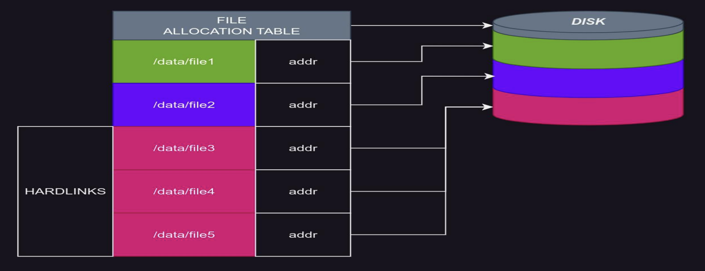

# Мутация данных и манипуляции с партициями

- Парт (part) - минимальный атомарный наборный данных, в контексте репликации, фоновых процессов, записи, изменения данных. Это каталог с самостоятельным разряженным индексом, со своими самостоятельными проекциями, с которым кликхаус делает какие то операции (объединение и тд)
- Партиция (partition) - набор part-ов с одинаковым значением ключа партиционирования (логическое разграничение). Подробнее: см. вебинар «4 (4). MergeTree и типы данных», слайды «Структура Part» и «Partition key». Имя парта состоит из имени партиции, минимального и максимального блоков и сколько раз уже объединялсиь парты. В качестве ключа партиционирования обычно используют просто дату.

Где находятся парты? Теперь, когда нам необходимо с ними работать, - нам нужно понимать, где их искать. У каждой *MergeTree-таблицы есть «data_paths» (можно найти в system.tables таблице), это каталог таблицы. В каталоге таблицы находятся каталоги партов. Каталог таблицы создается при создании таблицы, путь зависит от применяемого storage_policy или storage_policy по умолчанию (`default`), таковых каталогов может быть несколько если несколько дисков. (еще есть опция в кликхаусе `data_path`, по умолчанию - `/var/lib/clickhouse`, от нее и строится путь). Айдишник (ууид) (например, `431dc971-a083-4ba4-a1a9-d324239f108c`) представляет собой айдишник из атомик движка баз данных. Еще один дополнительный уровень (431, 816, ce1) - просто для ускорения поиска по файловой системе.
```sql
SELECT
    table,
    data_paths
FROM system.tables
WHERE data_paths != []
LIMIT 5;
/*
┌─table───────────────────┬─data_paths──────────────────────────────────────────────────────────────┐
│ asynchronous_metric_log │ ['/var/lib/clickhouse/store/431/431dc971-a083-4ba4-a1a9-d324239f108c/'] │
│ metric_log              │ ['/var/lib/clickhouse/store/816/816deaf4-4085-4984-8cfc-3f06b5a2a5c7/'] │
│ part_log                │ ['/var/lib/clickhouse/store/ce1/ce114d31-6aeb-4b60-8529-57bafb44b54e/'] │
│ query_log               │ ['/var/lib/clickhouse/store/8c5/8c524ad1-c0bd-4d3c-9235-6e5de4934d34/'] │
│ trace_log               │ ['/var/lib/clickhouse/store/cf1/cf178271-6b62-4de4-98e2-bc4c5ada30e3/'] │
└─────────────────────────┴─────────────────────────────────────────────────────────────────────────┘
*/
```
Почему data_paths (во множественном числе) - потому что если у нас storage_policy с несколькими дисками, то здесь соответственно будет количество путей по количеству дисков (на каждом диске будет путь для этой таблицы). Посмотрим содержимое каталога:
```bash
ls /var/lib/clickhouse/store/431/431dc971-a083-4ba4-a1a9-d324239f108c/

202411_1_8936_2924      202412_12529_12529_0    202412_12554_12554_0    202412_9661_12505_2198  202412_9661_12530_2223  202412_9661_12555_2248
202411_8937_9660_145    202412_12530_12530_0    202412_12555_12555_0    202412_9661_12506_2199  202412_9661_12531_2224  202412_9661_12556_2249
202412_12506_12506_0    202412_12531_12531_0    202412_12556_12556_0    202412_9661_12507_2200  202412_9661_12532_2225  202412_9661_12557_2250
202412_12507_12507_0    202412_12532_12532_0    202412_12557_12557_0    202412_9661_12508_2201  202412_9661_12533_2226  202412_9661_12558_2251
202412_12508_12508_0    202412_12533_12533_0    202412_12558_12558_0    202412_9661_12509_2202  202412_9661_12534_2227  202412_9661_12559_2252
202412_12509_12509_0    202412_12534_12534_0    202412_12559_12559_0    202412_9661_12510_2203  202412_9661_12535_2228  202412_9661_12560_2253
202412_12510_12510_0    202412_12535_12535_0    202412_12560_12560_0    202412_9661_12511_2204  202412_9661_12536_2229  202412_9661_12561_2254
202412_12511_12511_0    202412_12536_12536_0    202412_12561_12561_0    202412_9661_12512_2205  202412_9661_12537_2230  202412_9661_12562_2255
202412_12512_12512_0    202412_12537_12537_0    202412_12562_12562_0    202412_9661_12513_2206  202412_9661_12538_2231  202412_9661_12563_2256
202412_12513_12513_0    202412_12538_12538_0    202412_12563_12563_0    202412_9661_12514_2207  202412_9661_12539_2232  202412_9661_12564_2257
202412_12514_12514_0    202412_12539_12539_0    202412_12564_12564_0    202412_9661_12515_2208  202412_9661_12540_2233  202412_9661_12565_2258
202412_12515_12515_0    202412_12540_12540_0    202412_12565_12565_0    202412_9661_12516_2209  202412_9661_12541_2234  202412_9661_12566_2259
202412_12516_12516_0    202412_12541_12541_0    202412_12566_12566_0    202412_9661_12517_2210  202412_9661_12542_2235  202412_9661_12567_2260
202412_12517_12517_0    202412_12542_12542_0    202412_12567_12567_0    202412_9661_12518_2211  202412_9661_12543_2236  202412_9661_12568_2261
202412_12518_12518_0    202412_12543_12543_0    202412_12568_12568_0    202412_9661_12519_2212  202412_9661_12544_2237  202412_9661_12569_2262
202412_12519_12519_0    202412_12544_12544_0    202412_12569_12569_0    202412_9661_12520_2213  202412_9661_12545_2238  202412_9661_12570_2263
202412_12520_12520_0    202412_12545_12545_0    202412_12570_12570_0    202412_9661_12521_2214  202412_9661_12546_2239  202412_9661_12571_2264
202412_12521_12521_0    202412_12546_12546_0    202412_12571_12571_0    202412_9661_12522_2215  202412_9661_12547_2240  202412_9661_12572_2265
202412_12522_12522_0    202412_12547_12547_0    202412_12572_12572_0    202412_9661_12523_2216  202412_9661_12548_2241  202412_9661_12573_2266
202412_12523_12523_0    202412_12548_12548_0    202412_12573_12573_0    202412_9661_12524_2217  202412_9661_12549_2242  detached
202412_12524_12524_0    202412_12549_12549_0    202412_12574_12574_0    202412_9661_12525_2218  202412_9661_12550_2243  format_version.txt
202412_12525_12525_0    202412_12550_12550_0    202412_12575_12575_0    202412_9661_12526_2219  202412_9661_12551_2244
202412_12526_12526_0    202412_12551_12551_0    202412_12576_12576_0    202412_9661_12527_2220  202412_9661_12552_2245
202412_12527_12527_0    202412_12552_12552_0    202412_12577_12577_0    202412_9661_12528_2221  202412_9661_12553_2246
202412_12528_12528_0    202412_12553_12553_0    202412_12578_12578_0    202412_9661_12529_2222  202412_9661_12554_2247
```
Помимо каталогов партов, в каталоге таблицы так же лежит: 
- файл format_version.txt - используется для обратной совместимости при обновлении КХ. Мы обновляем кликхаус, там парты в старом формате и кликхаус об этом знает благодаря этому файлу. Вне контекста обновления этот файл нам не очень интересен (да и даже в контексте обновления - мы в него посмотрим только если у нас что то пойдет не так)
- каталог detached, с неиспользуемыми партами. При старте кликхаус вообще не будет ни читать их засечки, ни подгружать их к таблице. Можно даже записать туда какие то случайные данные - ничего страшного не произойдет. Это что то вроде корзины в виндоусе

Парты из detached каталога не используются таблицей, каталог detached нужен для импорта данных в формате партов, или как хранилище партов убранных из таблицы вручную или при восстановлении данных распознанных как поврежденные. Содержимое каталогов detached можно смотреть прямо из ClickHouse, таблица system.detached_parts. Там будет список с размерой, а также причиной, по которой там парт оказался (не только ввиду ручных манипуляций (тогда поле reason будет пустое), но и причина кликхауса (например, в процессе восстановления данных, мутаций и нештатных ситуациях)). За detached_parts желательно следить и мусор оттуда подчищать.

Список part-ов можно получить из system.parts, там же можно получить и список партиций, а так же дополнительную информацию об их размере, участии в фоновых процессах, размеру до сжатия, и так далее. (базово нас интересуют их количество, размер и принадлежность к какой то партиции)
```sql
select 
    table,
    partition,
    formatReadableSize(sum(bytes_on_disk)) AS size,
    groupArray(name) AS parts
from system.parts
where table = 'asynchronous_metric_log'
group by all
format Vertical;
/*
Row 1:
──────
table:     asynchronous_metric_log
partition: 202412
size:      133.28 MiB
parts:     ['202412_9661_12606_2299','202412_9661_12607_2300','202412_9661_12608_2301','202412_9661_12609_2302','202412_9661_12610_2303','202412_9661_12611_2304','202412_9661_12612_2305','202412_9661_12613_2306','202412_9661_12614_2307','202412_9661_12615_2308','202412_9661_12616_2309','202412_9661_12617_2310','202412_9661_12618_2311','202412_9661_12619_2312','202412_9661_12620_2313','202412_9661_12621_2314','202412_9661_12622_2315','202412_9661_12623_2316','202412_9661_12624_2317','202412_9661_12625_2318','202412_9661_12626_2319','202412_9661_12627_2320','202412_9661_12628_2321','202412_9661_12629_2322','202412_9661_12630_2323','202412_9661_12631_2324','202412_9661_12632_2325','202412_9661_12633_2326','202412_9661_12634_2327','202412_9661_12635_2328','202412_9661_12636_2329','202412_9661_12637_2330','202412_9661_12638_2331','202412_9661_12639_2332','202412_9661_12640_2333','202412_9661_12641_2334','202412_9661_12642_2335','202412_9661_12643_2336','202412_9661_12644_2337','202412_9661_12645_2338','202412_9661_12646_2339','202412_9661_12647_2340','202412_9661_12648_2341','202412_9661_12649_2342','202412_9661_12650_2343','202412_9661_12651_2344','202412_9661_12652_2345','202412_9661_12653_2346','202412_9661_12654_2347','202412_9661_12655_2348','202412_9661_12656_2349','202412_9661_12657_2350','202412_9661_12658_2351','202412_9661_12659_2352','202412_9661_12660_2353','202412_9661_12661_2354','202412_9661_12662_2355','202412_9661_12663_2356','202412_9661_12664_2357','202412_9661_12665_2358','202412_9661_12666_2359','202412_9661_12667_2360','202412_9661_12668_2361','202412_9661_12669_2362','202412_9661_12670_2363','202412_9661_12671_2364','202412_9661_12672_2365','202412_9661_12673_2366','202412_9661_12674_2367','202412_12607_12607_0','202412_12608_12608_0','202412_12609_12609_0','202412_12610_12610_0','202412_12611_12611_0','202412_12612_12612_0','202412_12613_12613_0','202412_12614_12614_0','202412_12615_12615_0','202412_12616_12616_0','202412_12617_12617_0','202412_12618_12618_0','202412_12619_12619_0','202412_12620_12620_0','202412_12621_12621_0','202412_12622_12622_0','202412_12623_12623_0','202412_12624_12624_0','202412_12625_12625_0','202412_12626_12626_0','202412_12627_12627_0','202412_12628_12628_0','202412_12629_12629_0','202412_12630_12630_0','202412_12631_12631_0','202412_12632_12632_0','202412_12633_12633_0','202412_12634_12634_0','202412_12635_12635_0','202412_12636_12636_0','202412_12637_12637_0','202412_12638_12638_0','202412_12639_12639_0','202412_12640_12640_0','202412_12641_12641_0','202412_12642_12642_0','202412_12643_12643_0','202412_12644_12644_0','202412_12645_12645_0','202412_12646_12646_0','202412_12647_12647_0','202412_12648_12648_0','202412_12649_12649_0','202412_12650_12650_0','202412_12651_12651_0','202412_12652_12652_0','202412_12653_12653_0','202412_12654_12654_0','202412_12655_12655_0','202412_12656_12656_0','202412_12657_12657_0','202412_12658_12658_0','202412_12659_12659_0','202412_12660_12660_0','202412_12661_12661_0','202412_12662_12662_0','202412_12663_12663_0','202412_12664_12664_0','202412_12665_12665_0','202412_12666_12666_0','202412_12667_12667_0','202412_12668_12668_0','202412_12669_12669_0','202412_12670_12670_0','202412_12671_12671_0','202412_12672_12672_0','202412_12673_12673_0','202412_12674_12674_0','202412_12675_12675_0','202412_12676_12676_0','202412_12677_12677_0','202412_12678_12678_0','202412_12679_12679_0','202412_12680_12680_0']

Row 2:
──────
table:     asynchronous_metric_log
partition: 202411
size:      6.50 MiB
parts:     ['202411_1_8936_2924','202411_8937_9660_145']

2 rows in set. Elapsed: 0.049 sec. 
*/
```

Чтобы стянуть system.parts со всего кластера, можно использовать следующий запрос
```sql
select ...
from clusterAllReplicas(имя из конфига, system.parts);

-- если нас интересует запрос с одной реплики каждого шарда - то просто переписываем этот запрос как ремоту
select ...
from remote(имя из конфига, system.parts);
```

## Что такое хардлинк и зачем нам знать что такое хардлинк (25 00)

ClickHouse использует хардлинки при копировании партов, и создает с их (хардлинков) помощью копии данных таблиц для систем резервного копирования, поскольку это несравнимо дешевле и быстрее обычного копирования. Хардлинк - ещё одно отображение того же самого файла в файловой системе, по дополнительному пути. У нас есть файл1 и он появился еще раз в файловой системе под другим именем, файл2. А на самом деле они на диске лежат в одной и том же месте. Это и называется хардлинк.

Файл будет окончательно удален тогда, когда будет удалено последнее отображение. Отображения файла равнозначны.



У любой файловой системы есть file allocation table, то есть список где какой фа йл как хранится на диске. Именно таким образом мы в файловой системе получаем доступ к файлам, по строке из нашей таблицы размещения файлов мы находим где находится этот файл на диске. Так работают файловые системы в самом первом (базовом) приближении. Вот в этой вот таблиц несколько записей разных файлов, ссылающихся на одно и то же место на диске - это и есть хардлинк. То есть файлы `/data/file3`, `/data/file4`, `/data/file5` равнозначны. Это просто файл на диске, отображенный в несколько мест. Недостаток тут в том, что если мы изменияем один из этих файлов, то меняются все (тк на самом деле есть всего 1 файл).

С кликхаусом (и подобными системами) это не проблема, тк кликхаус, единожды записав свой парт, потом уже его изменять не будет. Когда он будет объединять его с другим партом - он просто родит третий, который будет их объединением. Изменений в самих файлах происходить не будет! За счет этого работают бэкапы на хардлинках. Поскольку парт - это просто набор файлов, мы просто создаем на все эти файлы хардлинки и, когда кликхаус их удалит, они сбоку продолжат лежать, место из под них не высвободится. Потом мы можем обратно эти файлы загнать в кликхаус через detached_parts или просто восстановление таблицы (`system.restore_data`). Это артефакт для резервного копирования. Кроме того, это позволяет сделатиь снимок состояния базы данных. С помощью этого можно восстановиться в случае какого то disaster'а. (29-30 минуты)

Хардлинк сравнивают с симлинком (это противоположные сущности). Симлинк - это подобие ярлыка в виндоус. У нас лежит файлик, в котором лижит путь на другой файлик. А хардлинк - это когда один и тот же файл отображается в несколько мест на файловой системе (его видно и как файл1, и как файл2, и как файл3, но на самом деле это один и тот же файл)

## Операции над партами и партициями 31 00

что можно делать с партициями и партами. ClickHouse позволяет: 
- удалять partition/part
- перемещать partition/part между таблицей и detached каталогом
- скачать партицию с другого шарда (с любого другого инстанса клика, при условии что у них один кипер)
- перемещать, копировать, заменять partition между таблицами одинаковой структуры
  - между Replicated и не-Replicated можно! 
  - с меньшим набором тех же колонок можно!
  - с другими ключами нельзя (потому что мы не можем с другим порядком сортировки переключать партиции) (ключ сэмплирования тоже может мешать)
- создавать на хардлинках копии данных таблиц (именно данных, но не метаданных!), используется как артефакт утилит резервного копирования (ВСЕ утилиты резервного копирования для кликхауса работают вокруг хардлинков).

Важно! Операции с партициями являются реплицируемыми (то есть если мы дропнем/реплейснем партицию на одной реплике - она дропнется и на соседних тоже). На реплике-инифиаторе реплейс пройдет мнгновенно, а на соседних будет еще выкачиваться замена. Все операции над партициями имеют синтаксис «ALTER TABLE database.table ОПЕРАЦИЯ». (чтобы подсветить, что это не обычный дроп, а именно операция, которая относится к такому контексту)

Когда мы добавляем колонку - в старые парты они не добавляется! Ведь если в колонке ничего не написано, то и зачем парту вообще знать что она у него есть. Таким образом, парт с меньшим набором колонок прекрасно совместим с партом с бОльшим набором колонок. Поэтому, если колонок меньше - то мы прекрасно можем перемещать, копировать, заменять partition между таблицами одинаковой структуры.

Удаление
```sql
ALTER TABLE table_name DROP PARTITION|PART partition_expr  -- удаляет парт/партицию из таблицы

-- Переместить из/в detached
ALTER TABLE table_name DETACH PARTITION|PART partition_expr;  -- если мы хотим убрать данные от пользователя, но не уверены, что хотим окончательно от них избавляться
-- или хотим унести данные в другой кликхаус/ на анализ / или что то с ними потом поделать - можем забрать из каталога детачед
ALTER TABLE table_name ATTACH PARTITION|PART partition_expr;
ALTER TABLE table_name DROP DETACHED PARTITION|PART ALL|partition_expr;  -- подчищает парт из detached без захождения в файловую систему
```
Желательно сходить на файловую систему и как то проверять фактическое наличие, что у нас там творится (но базово достаточно и system.detached_parts таблицы).

Перемещение партиций между таблицами
```sql
-- переместить:
ALTER TABLE table_source MOVE PARTITION partition_expr TO TABLE table_dest;
-- заменить:
ALTER TABLE table_source REPLACE PARTITION partition_expr FROM TABLE table_dest;
-- cкопировать:
ALTER TABLE table_source ATTACH PARTITION partition_expr FROM TABLE table_dest;
```

Важно! Когда мы переносим данные с помощью ATTACH PARTITION - убедиться что у нас в детачд-каталоге не лежат уже парты этой партиции по какой то причине. Потому что когда мы скажем ATTACH PARTITION - партишн это просто набор партов по ключу партиционирования, - то кликхаус захватит еще и парты из числа детачед. То есть когда мы положили что то в каталог детачед партс - важно убедиться что там только то, что мы положили (и на соседних репликах тоже!)

Работа с хардлинками
```sql
ALTER TABLE table_name FREEZE [PARTITION partition_expr] [WITH NAME 'backup_name']
ALTER TABLE table_name UNFREEZE [PARTITION 'part_expr'] WITH NAME 'backup_name' 
-- под FREEZE понимается то что он на файловой системе каждого диска где лежит эта таблица в каталоге `shadow` создаст еще один подкаталог с номером по порядку и в этот подкаталог он созаст всю структуру каталогов нашей таблицы и все файлы прохардлинкает. WITH NAME 'backup_name': вместо того чтобы отдать на откуп кликхаусу имя подкаталога - мы можем задать сами. Это удобно когда мы захотим из кликхауса эти бэкапы удалить.
-- FREEZE - нереплицируемая операция! Это откладывание хардлинков именно на том сервере, на котором мы работаем.

-- Скачать с другого сервера
ALTER TABLE users FETCH PARTITION 201902 FROM '/clickhouse/tables/01-01/visits';  -- указываем путь зукипера
-- если наш кликхаус висит на том же кипере, что и другая тачка, на которой эта таблица - он из этого пути самостоятельно достанет нужную реплику, ее адрес и партицию и на этот адрес (http порт другого сервера) придет ее скачает. Между кликхаусами репликация настроена по http. Кликхаус гет-запросами друг друга опрашивает для скачивания этих партов. Подобным гет-запросом можно и стащить парт не в рамках репликации, а просто так, самостоятельно
-- скачивает партицию в каталог detached, после этого её надо сделать ATTACH
```

Где брать айдишник, который используется в ALTER TABLE (partition_expr, part_expr). Этот айди можно брать из таблицы system.parts, он лежит в колонке name (или partition, partition_id (partition_id - строковое представление нашего ключа партиционирования если вдруг он какого то особого типа (тупл и тд))).

Если знаем диапазон данных, то найти нужные парты очень просто - мы делаем селект из систем.партс, где клюм_партиционирования больше этого значения. Также есть виртуальный столбец `_partition`, `_partition_id`. Он выдаст нам имя партиции, к которой относятся эти данные.

## Мутация данных 54 00

Реализована более тяжело, чем в системах, более для этого предназначенных. Дело в том что мы строим индекс вокруг гранул, гранулы у нас лежат в партах и такая структура хранения + деление на колонки не позволяет нам точечно изменять данные. Поэтому данные у нас изменяются большими пачками. Это работает через ALTER TABLE (опять же выделяем именно в такой контекст)

Мутация данных - изменение данных в ClickHouse. Работает как фоновая задача, создающая новую копию всех данных партиции (или всех партиций если не указана конкретная), изменяющая в ходе копирования данные уже в копии. После завершения старые данные заменяются новыми. 
```sql
-- Удаление данных:
ALTER TABLE [db.]table DELETE [IN PARTITION partition_id] WHERE filter_expr  -- обязательно нужно указывать, в какой партиции мы это будем делать!
-- достаточно распространенная ошибка, когда человек хочет удалить данные за какую то дату с каким то признаком. Он идет и удаляет 'alter table delete .. where data = '...', ожидая что кликхаус будет копировать только ту партицию, которая у нас в date он указал. Но на самом деле, поскольку он не указал, в какой партиции он работает, кликхаус пойдет и сделает это по всем партициям (несмотря на то что WHERE казалось бы должен был попадать в ключ партиционирования)

-- Обновление данных:
ALTER TABLE [db.]table UPDATE column1 = expr1 [, ...] [IN PARTITION partition_id] WHERE filter_expr
```
Мутация выглядит так - кликхаус рядом рожает новую копию данных, в ходе копирования применяюю наши DELETE и UPDATE. После того как он все скопировал, на ходу поменяв, старые данные поменяются на новые. При этом в ходе копирования заблокируются по этим данным мерджи. Апдейт данных - именно массовая операция, а не точечная!

При этом в WHERE может быть все что угодно, включая даже диктГет! Разве что агрегатные функции не сможет использовать (тк это уже относится к having).

Операция тяжелая и дорогая настолько, насколько объемная наша таблица или партиция! Пока кластер маленький и данных немного - это будет работать более-менее шустро. С накоплением данных это будет работать медленней и медленней

### Статус мутации и прогресс

После выполнения команды на запуск мутации (delete/update), ClickHouse добавляет необходимые операции в `system.replication_queue`, а общий прогресс мутации можно наблюдать в `system.mutations`. В момент выполнения задачи из `system.replication_queue`, относящейся к мутации, можно так же увидеть эту операцию в `system.merges` (там даже есть колонка `is_mutations`). Если у нас нереплицируемая таблица, когда дойдет очередь до мутаций - средствами кликхауса понять будет достаточно сложно. В `system.replication_queue` он ее фиксирует, а в остальных случаях - миы просто в `system.mutations` будем наблюдать прогресс, но если вдруг мутация приостановится - мы не узнаем чего он ждет и что встало в очередьт (может висеть какой то мердж или может блочить другая мутация (раньше можно было запустить 2 мутации)). Желательно мутации запускать последовательно!

Если что то пошло не так - можно выполнить `kill mutation`! Промежуточные результаты отбросятся и мутация отменится

LIGHTWEIGHT DELETE (появился в 24 году) - Физически не удаляет данные, только помечает их как удаленные (_row_exists виртуальный столбец, пишется в отдельном файлике). Данные затем удаляются при следующих мержах. Не работает с проекциями. Синтакис:
```sql
DELETE FROM [db.]table [IN PARTITION partition_expr] WHERE expr;
```
Это можно считать отложенным удалением с некоторым маскированием данных. Лучше, чем выполнять классическую для клика "альтер тейбл делит"

После этого наши запросы будут дополняться `where _row_exists != 0`, запросы это ускорять не будет пока данные не перемерджатся.

## Вопросы

Есть ли какие то аналоги блокировок? Есть неявные аналоги блокировок, больше относится к ordinary движку. Раньше, когда мы делали селект в наш парт, при этом пытались удалить этот парт и еще пытались инсертить туда - то понятно что дроп партишн у нас просто будет висеть и ждать выполнение этих запросов. Теперь же операция удаления партов асинхронная - то есть парт просто помечается как удаленный путем помещения в другой каталог, по нему все еще продолжают довыполняться те запросы, котоыре выполнились с ним. Следующие запросы (которые даже в то же время произойдут) - пойдут уже по новому набору партов. Сам парт из каталога `deleted_*` (отдельный каталог, куда кликхаус удаленное скидывает) фоном подчищается. Если мы хотим старое поведение парта, синхронное - может просто указать дописать модификатор `SYNC` (чтобы это делалось с блокировками)

Хардлинки ничего не весят на диске! Они занимают место на айнодах (это более современный аналог FAT-таблиц), как раз счетчик айнод ограничен на файловую систему. Если делаем фриз больше чем раз в сутки - желательно еще мониторить заполненность файловой системы и по айнодам. Занятость по айнодам можно посмотреть командой `df -i`

```sql
-- Как быстро скопировать данные в соседнюю таблицу, удалить данные поусловию where user=’jhon’, и заменить оригинальные данные?
show create table system.asynchronous_metric_log format TSVRaw;
-- она у нас не пустая - тк туда коипируются наши метрики
/*
CREATE TABLE system.asynchronous_metric_log
(
    `hostname` LowCardinality(String) CODEC(ZSTD(1)),
    `event_date` Date CODEC(Delta(2), ZSTD(1)),
    `event_time` DateTime CODEC(Delta(4), ZSTD(1)),
    `metric` LowCardinality(String) CODEC(ZSTD(1)),
    `value` Float64 CODEC(ZSTD(3))
)
ENGINE = MergeTree
PARTITION BY toYYYYMM(event_date)
ORDER BY (metric, event_date, event_time)
SETTINGS index_granularity = 8192
*/

-- создадим такую же таблицу
CREATE TABLE system.tmp_asynchronous_metric_log as system.asynchronous_metric_log;
-- посмотрим, какие вообще есть партиции
select partition from system.parts where table='asynchronous_metric_log' group by partition;
/*
┌─partition─┐
│ 202412    │
│ 202411    │
└───────────┘

2 rows in set. Elapsed: 0.021 sec. 
*/
-- убедимся что в нашей новой таблице пусто
select count() from system.tmp_asynchronous_metric_log;

alter table system.tmp_asynchronous_metric_log replace partition '202411' from system.asynchronous_metric_log;
-- replace используется когда у нас есть какие то данные
/*
Ok.

0 rows in set. Elapsed: 0.029 sec. 

4c149cc68762 :) select count() from system.tmp_asynchronous_metric_log;
*/
SELECT count()
FROM system.tmp_asynchronous_metric_log
/*
Query id: 7c58c0aa-751d-458d-a88f-aebb2f16fa0f

┌──count()─┐
│ 30296438 │
└──────────┘

1 row in set. Elapsed: 0.017 sec. 
*/
-- то есть мы успешно на хардлинках моментально скопировали 30млн строк

-- теперь попробуем исправить данные

```