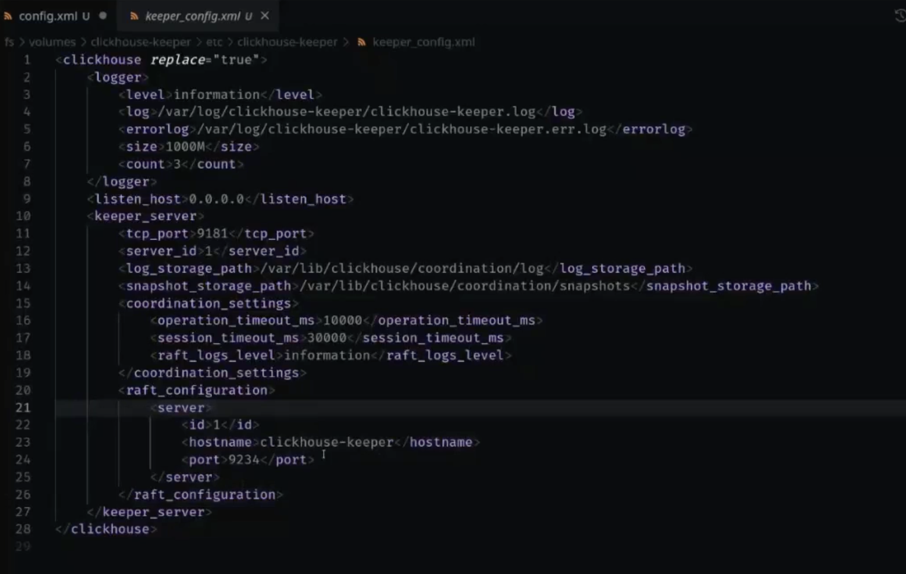

# Сессия Q&A

## Доступ до базы MySQL в другом сетевом контуре

Кликхаус не умеет ходить по ssh за какими то данными. Однако у него есть такая возможность как executable словари, и есть такая возможность как сделать ssh туннель.
```bash
ssh 127.0.0.1 -l root
# вот у нас есть стандартный инструмент ssh
# в ssh есть такая возможность как port-forwarding
server=127.0.0.1
port=22
# мы можем прокидывать порт и мы еще можем добавить флаг, который опустит его в бэкграунд
ssh -L 8888:$server:8888 
# с помощью такой нехитрой команды, при установке ssh сессии, помимо сессии у нас еще начинает слушаться порт. Первый порт - наш локальный, второй - на удаленном сервере. Таким образом мы можем прокинуть наш порт

# этой командой мы убеждаемся что порт слушается
ss -l | grep 8888
# порт будет слушаться из-под ssh демона. Когда мы придем в этот порт - у нас сорединение прокинется как раз на порт на удаленном сервере. Таким образом, мы можем по ssh просто прокинуть порт.

# Кроме того, существют балансировщики нагрузки. Можно через них прокинуть
```
Кроме того, в самом кликхаусе есть еще такая возможность. Конфигурация кликхауса, секция где мы указываем наши словари ( dictionaries), для нашего словаря мы можем сделать конфиг 
```xml
<dictionary>
    <name>hostname</name>
    <source>
        <executable>
            <command>/etc/clickhouse-server/dictionaries/test_function.py</command>
            <format>TabSeparated</format>
        </executable>
    </source>
    <layout><complex_key_direct/></layout>
    <structure>
        <id>
            <name>id</name>
        </id>
        <attribute>
            <name>value</name>
            <type>String</type>
        </attribute>
    </structure>
    <lifetime>
        <min>300</min>
        <max>360</max>
    </lifetime>
</dictionary>
```
Это словарь с источником executable. Этот источник позволяет забрать содержимое словаря просто путем выполнения какого то бинарника (может быть любой, главное чтобы были права доступа - право на запуск). То есть клик будет выполнять бинарник и таким образом заполнять словарь. Что происходит - он кормит ключ на stdin и ожидает на stdout словаря содержимое. Таким образом можно такой командой сходить по ssh, сделать еще что то. В зависимости от layout он будет ходить каждый раз (директ), либо выполнять один раз и ждать.

Но вообще лучше это решить инфрактруктурно и дать доступ клику до mysql.

Если часто масштабируемся (добавляются реплики, кластера), то чтобы не перегружать источник (условный MySQL) большим количеством запросов, можно предусмотрительно вытащить куда то на с3/хдфс/куда то еще, чтобы клики смотрели туда. Идея выгружать сбоку и ходить туда - достаточно хорошая!

Кроме того, в клике есть еще такая штука как executable pool. Объявляется отдельно. Работает с бинарниками. Если мы выберем подходящий лэйаут хранения (например, кэш), можем запустить сразу пачку бинарников для словарей. Тогда обращения к словарям будет балансироваться на уровне работающего инстанса этого пула (если необходимо в несколько потоков это делать).
 
## просмотр логов 21 00

ТТЛ на текстовые логи обычно оставляют 2 недели - и этого хватает. А send_logs_level='trace' - это то же самое, что пишется в табличку text_log. Трейс лог в кликхаусе который именно трейс - это немного не то, это именно профилирование треда с сохранением контекста запроса, еще и сохраняющийся на какой то один из на настроенной частоте этого лога. Нужно будет раскоментировать секцию text_log, там настроить уровень логирования. Если у нас уровень логирования в секции text_log не уступающий - мы сможем увидеть там все то же самое, что и в клиенте. Там у нас есть query_id , по нему мы и сможем выбрать строчки, которые относятся именно к этому запросу. По http query_id можно задавать самостоятельно. Там просто стринга, поэтому мы можем прописать там что угодно. Также мы можем в таблице text_log по уровню логов отфильтроваться. Плюс там оно будет более разложенно структурированно по колонкам

```sql
show table system.text_log format TSVRaw;
/*
CREATE TABLE system.text_log
(
    `hostname` LowCardinality(String) COMMENT 'Hostname of the server executing the query.',
    `event_date` Date COMMENT 'Date of the entry.',
    `event_time` DateTime COMMENT 'Time of the entry.',
    `event_time_microseconds` DateTime64(6) COMMENT 'Time of the entry with microseconds precision.',
    `thread_name` LowCardinality(String) COMMENT 'Name of the thread from which the logging was done.',
    `thread_id` UInt64 COMMENT 'OS thread ID.',
    `level` Enum8('Fatal' = 1, 'Critical' = 2, 'Error' = 3, 'Warning' = 4, 'Notice' = 5, 'Information' = 6, 'Debug' = 7, 'Trace' = 8, 'Test' = 9) COMMENT 'Entry level. Possible values: 1 or \'Fatal\', 2 or \'Critical\', 3 or \'Error\', 4 or \'Warning\', 5 or \'Notice\', 6 or \'Information\', 7 or \'Debug\', 8 or \'Trace\'.',
    `query_id` String COMMENT 'ID of the query.',
    `logger_name` LowCardinality(String) COMMENT 'Name of the logger (i.e. DDLWorker).',
    `message` String COMMENT 'The message itself.',
    `revision` UInt32 COMMENT 'ClickHouse revision.',
    `source_file` LowCardinality(String) COMMENT 'Source file from which the logging was done.',
    `source_line` UInt64 COMMENT 'Source line from which the logging was done.',
    `message_format_string` LowCardinality(String) COMMENT 'A format string that was used to format the message.',
    `value1` String COMMENT 'Argument 1 that was used to format the message.',
    `value2` String COMMENT 'Argument 2 that was used to format the message.',
    `value3` String COMMENT 'Argument 3 that was used to format the message.',
    `value4` String COMMENT 'Argument 4 that was used to format the message.',
    `value5` String COMMENT 'Argument 5 that was used to format the message.',
    `value6` String COMMENT 'Argument 6 that was used to format the message.',
    `value7` String COMMENT 'Argument 7 that was used to format the message.',
    `value8` String COMMENT 'Argument 8 that was used to format the message.',
    `value9` String COMMENT 'Argument 9 that was used to format the message.',
    `value10` String COMMENT 'Argument 10 that was used to format the message.'
)
ENGINE = MergeTree
PARTITION BY toYYYYMM(event_date)
ORDER BY (event_date, event_time)
SETTINGS index_granularity = 8192
COMMENT 'Contains logging entries which are normally written to a log file or to stdout.'

1 row in set. Elapsed: 0.003 sec. 
*/

select * from system.text_log limit 1 \G;
/*
Row 1:
──────
hostname:                4f0b0737d379
event_date:              2024-12-28
event_time:              2024-12-28 07:03:08
event_time_microseconds: 2024-12-28 07:03:08.494439
thread_name:             clickhouse-serv
thread_id:               1
level:                   Information
query_id:                
logger_name:             SentryWriter
message:                 Sending crash reports is disabled
revision:                54493
source_file:             src/Daemon/SentryWriter.cpp; SentryWriter::SentryWriter(Poco::Util::LayeredConfiguration &)
source_line:             144
message_format_string:   Sending crash reports is disabled
value1:                  
value2:                  
value3:                  
value4:                  
value5:                  
value6:                  
value7:                  
value8:                  
value9:                  
value10:                 

*/
```

В кликхаусе есть ручки, контролирующие размер джоина и размер where in. Это наиболее сценарии контроля сложности запроса. Выставляем ограничение на пользователя и когда пользователь приходит с ошибкой DBException - идти и разбираться. Если хочется смотреть постфактум, что же произошло - то лучше идти в query_log, там есть колонка profile_events, где есть счетчики - сколько он натыкал io по диску, сколько он микросекунд провел в цпу неймспейсе и иные счетчики производительности. В реалтайме эти счетчики недоступны, только постфактум.

## Настройки keeper_config



Визуально похожа на зукипер - список серверов для кворума, таймауты, лог диры и тд.

Еще есть особенность - кликхаус умеет получать настройки из зукипера. В нужной секции конфигурации прописываем replace и из какого пути подтягивать. Можем внешними средствами эту конфигурацию регулировать
```xml
<remote_servers> replace="true" from_zk="/clickhouse/config/remote_servers" </remote_servers>
```
Очень удобно при объявлении remote серверов. То есть просто как общее хранилище конфигураций можно использовать зукипер и переиспользвать в кликхаусе.

Есть конвертер - мы можем взять наш зукипер-снэпшот (отрестартить лидера чтобы он отложил снэпшот на нашем зукипере или даже потушить на время подмены) и конвертировать в кликхаус-кипер с помощью утилиты clickhouse keeper convert. При этом при отключенном зукипере кликхаус продолжает работать, разве что таблицы переходят в read-only. То есть у нас будет даунтайм на запись, но не на чтение.

## есть ли какие-то ограничения по количеству/объему словарей? или отталкиваться от памяти?

Отталкиваться надо от памяти и от времени обновления. То есть когда мы выкачиваем какой то словарь, например на 60гб - сможет ли источник отдавать его быстрей чем лайфтайм этого словаря? Как правило это чаще является бутылочным горлышком. А так ограничений нет - на практике преподавателя самый большой словарь был на 70Гб. Обязательно учитывать, что словари в памяти хранятся непожатые! Так что размер словаря может существенно превышать его размер в исходной системе.

Если упираемся в память - можно сделать другой лэйаут хранения, например, кэш.

## как конфигурируется кластер зукипера (40 00)

Сделаем конфиг и разберем его. Достаточный для работы конфиг зукипера выглядит таким образом:
```cfg
# /etc/zookeeper/zoo.cfg

tickTime=2000
initLimit=30000
syncLimit=10
dataDir=/var/lib/zookeeper/data
dataLogDir=/var/lib/zookeeper/data
dataLogDir=/var/lib/zookeeper/log
maxClientCnxns=2000
maxSessionTimeout=60000000

autopurge.snapRetainCount=4
autopurge.purgeInterval=6

server.1=address:3102:3103:participant;
server.2=address:3102:3103:participant;0.0.0.0:3101
server.3=address:3102:3103:observer;0.0.0.0:3101

4lw.commands.whitelist=*
```
За что отвечают опции snapRetainCount и purgeInterval. Дело в том что по умолчанию зукипер откладывает откладывает снэпшоты и никак их не чистит за собой. Таким образом место может закончиться. Об этом есть даже заметка в документации кликхауса. Так что эти настройки отвечают за внутреннюю ротацию снапшотов (оставлять n последних).

`dataDir=/var/lib/zookeeper/data` - здесь будут храниться 2 каталога - с валами (некоторые подобия бин-логов; то, что  откладывается от снэпшота до снэпшота), а также каталог со снэпшоами. Также в этом каталоге зукипер ищет файл `myId` - это файл, в котором лежит цифра из `server.1`. У каждого из членов кластеру зукипера есть какой-то порядковый номер. Мы можем этот порядковый номер взять из `myId`

В секции `server.1=address:3102:3103:participant;` дублируется сам инстанс зукипера и его соседи (полный список серверов). Указывается порт репликации (порт чтобы оди друг с другом синкались - following port) и порт элекции (для кворума - чтобы они выбирали лидера). Также есть режимы работы participant (нода, которая может стать мастером) и observer (мастером не станет, может лагать, является репликой сбоку). В кликхаусе обзерверы не нужны! Из-за них могут возникнуть проблемы с репликацией. Поэтому мы просто берем кворум зукиперов, дублируем одну и ту же конфигурацию на все сервера и в файлик `myId` пишем каждому свою цифру. Этого достаточно чтобы поднять зукипер.

Кроме того, у зукипера (да и у кипера) есть 4буквенные команды: ruok, stat, ... Ruok - are you ok, мы можем послать команду `nc 127.0.0.1 3101 <<< "ruok"`, придет ответ `imok`. Это используется для healthcheck'ов. Также мы используем "stat" - выдаст `Mode leader/follower` и количество установленных сессий и еще оперделенную инфу.

Также можно добавить metricsProvider для зукипера и скрэппить потом его с этого порта (в новых версиях этот джавовский класс сразу вшит, а в старых версиях его нужно припиливать сбоку). Так можно организовать мониторинг зукипера (в кипере прометейные митрики вшиты по умолчанию)
```cfg
metricsProvider.className=org.apache.zookeeper.metrics.prometheus.PrometheusMetricsProvider
metricsProvider.httpPort=7072
reconfigEnabled=true
```

## метрики и мониторинг

метрики и мониторинг нужно делать с помощью кастомных запросов. В кликхаусе есть такая штука как HTTPHandler - мы можем объявить хттп путь и объявить, что кликхаус будет по нему делать. То есть на конкретнуй урл нашего хттп интерфейса мы можем повесить захардкоженный запрос, прямо в конфиге. То есть в конфиг мы можем закинуть какой то группирующий запрос, сказать ему - формат прометеус, и этот запрос слать на хттп хендлер. Мы будем приходить на этот урл, кликхаус будет выполнять запрос и просто отдавать нам результат этого запроса. Таким образом можно делать мониторинг прямо из конфига кликхауса. При этом удобно делать запрос в какую-то вьюшку, которая будет ходить сразу в пачку таких таблиц, в какой то merge engine, чтобы опрашивать сразу несколько таблиц чтобы не редактировать запрос (чтобы при добавлении новых таблиц ничего не менять, а просто продолжать делать запрос в merge engine )

Главные моменты которые нужно мониторить - в занятии по логированию и метрикам. Базово будут интересовать бэкграунд пулы (это количество мерджей, не захлебывается ли кликхаус под фоновой работой) плюс по квари логу можно собирать статистику, с какой скоростью выполняются конкретные запросы, попадающие под какое то условие выборки.

также необходимо мониторить общие метрики производительности сервера:
- загруженность процессора
- памяти
- сети
- диска  
Если вдруг нет такой возможности - приятная новость что в кликхаусе есть asyncronus_metric_log табличка, где кликхаус сам частично тоже может отджавать эти показатели. Полный набор метрик можно посмотреть прямо с этой таблице

## резервное копирование

Резервное копирование кластеров выполняется либо каким-то самописным скриптом, либо утилитой clickhouse-backup . Не храним бэкапы на с3/хдфс - если кластер большой, то забэкапить такой кластер сравнимо с какой то частью его стоимости (как треть этого кластера)! Это выходит достаточно дорого. Можно перейти на снэпшоты. В кликхаус-бэкапе это называют local backup'ами - это те самые бэкапы на хардлинках. Кликхаус-бэкап умеет хранить их n последних штук и его можно запускать на кроне чтобы он раз в сутки ходил и делал все эти запросы `alter table ... freeze`. Таким образом, несмотря на то что бэкап подразумевает что мы унесли куда то в другую систему - как правило, у нас в кликхаусе несколько реплик и даже если у нас вышла из строя какая-то одна из них - кластер продолжит работу. 

Кликхаус разделяет бэкапы на локал и ремоут. В качестве ремоут он поддерживает всякие с3 хранилища и даже кастомный скрипт (пишем туда мв - и клик будет заниматься перекладыванием).