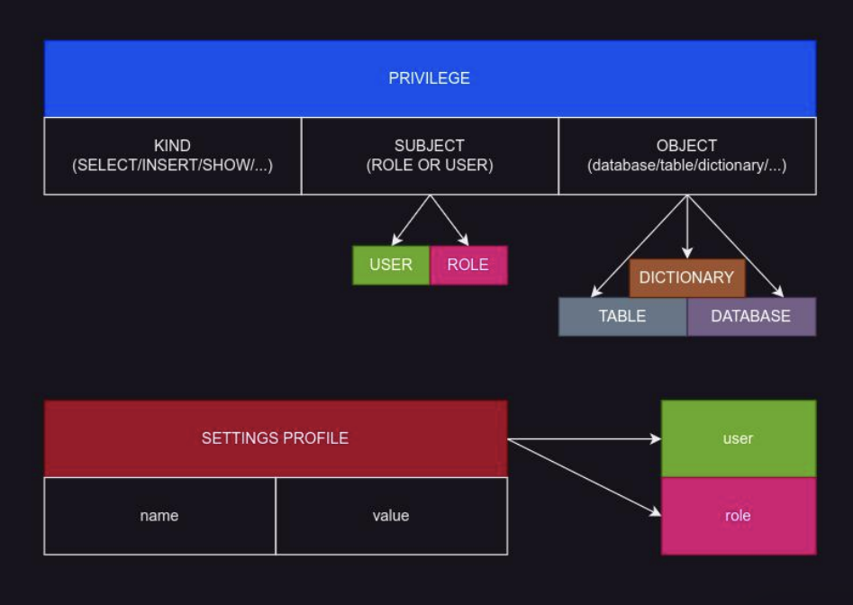

# RBAC контроль доступа, квотыи ограничения

## Обзор сущностей RBAC

RBAC в ClickHouse - Модель доступа, управляемая из SQL, включающая 6 взаимосвязанных типов сущностей: 
- пользователь (user)
- роль (role)
- право (он же грант, он же привилегия) (privilege)
- профиль (settings_profile) (коллекция настроек для этого пользователя или группы пользователей)
- квота (quota) (нарисованные вокруг временного интервала)
- политика (row-policy) (политики доступа к данным таблицы на основании фильтра)


Пользователь (user) - способ доступа к ClickHouse, используя имя, и некоторый из способов авторизации. Обладает свойствами: 
- имя пользователя (username)
- список сетей, адресов, с которых разрешен доступ, в том числе можно указывать DNS-именами (network access list) (это некий встроенный файервол - с каких сетей мы можем приходить этим пользователем)
- способ авторизации (auth type), например, и наиболее часто используется вариант авторизации паролем

Пользователь нужен для того чтобы им можно было приходить в кликхаус и чтобы к нему можно было применять права доступа, профили настроек, квоты, которые являются самостоятельными сущностями. 

Роль (role) не обладает собственными свойствами (ближайший аналог - группа пользователей), только именем, однако к роли можно применять то же самое что и к пользователю, и потом роль применять на ряд пользователей. Роль используется для логического объединения доступов в группы. После создания ролей мы можем выдавать доступы пачками (прям целиком ролью). По сути, такого же эффекта можно достичь и без ролей - это просто для удобства выдачи доступов.


Право доступа (privilege) - разрешающее правило, применяемое к пользователю или роли, дающее возможнось делать конкретный вид операций (INSERT/SELECT/ALTER/и т.д.), над конкретным объектом, таким как база данных, таблица, словарь. Это сам грант, это некий субъект (кому она выдается, пользователь или роль) и некий объект, на который выдаем это право (словарь, таблица, схема), есть и общий контекст, в котором можем выдать права на репликацию, выдачу других прав. 

Неплохой пример - грант SHOW , с ним пользователь может посмотреть структуру таблиц, при этом не смотря данные в них (например, посмотреть, что есть в таблице, чтобы потом более точечно запросить доступ к нужным таблицам). Можно выдать доступ на просмотр схем, но не на взаимодействие с этими схемами.

Профиль настроек (SETTINGS PROFILE) - коллекция настроек, применямых к роли или пользователю, набор пар ключ-значение, позволяет например включить/выключить логирование запросов, или наложить ограничения на сложность запросов. Регулирует не права, а именно настройки этого пользователя, как он с этой базой данных может взаимодействовать. Одна из первых штук, которые нужно сделать - включить всем логирование запросов, чтобы пользователь не мог сделать `set log_queries=0;`. Если мы в профиле настроек поставим `set log_queries=1;` - пользователь не сможет этого переопределить. Они представлены просто парами ключ-значение. Применяются к пользователям и к ролям.



Квота (quota) - ограничение в потреблении ресурсов за интервал времени. Задается интервал, например 1 час. В пределах этого интервала задается ограничение, например на количество запросов. Пользователь, сделавший запросов в количестве равном ограничению, на очередной запрос получит ошибку «квота исчерпана», и так до конца часа. С начала нового часа счетчик сделанных запросов сбрасывается и пользователь снова может расходовать свою квоту. Применяется к ролям и пользователям. Каждая квота - это самостоятельный временной интервал. Квоты бывают на количество запросов, количество строк, поднятых с базы и тд.

Политика (row-policy) - префильтр, срабатывающий при выборке данных, пропускающий данные не попадающие под фильтр, ещё до аггрегации. Позволяет скрыть данные от пользователей по условию, например ‘колонка_отдел’=’менеджер’ покажет только те строки, в которых соблюдается такое условие. Поведение кликхауса будет таким как будто строк там и нет вовсе - селект будет возвращать 0 строк. То есть этой просто некий маскирующий фильтр. Применяется к ролям и пользователям.


## Пользователь (User)

Пользователь (user) - способ доступа к ClickHouse, используя имя, и некоторый из способов авторизации. 
```sql
-- Создание пользователя
CREATE USER [IF NOT EXISTS | OR REPLACE] name1 [, name2 [,...]];  -- + параметры пользователя 

-- изменение пользователя
ALTER USER [IF NOT EXISTS] name1 [, name2 [,...]] ;  -- + параметры пользователя

-- удаление пользователя
DROP USER [IF EXISTS] name [,...] ;  -- можем создавать/менять/удалять сразу по несколько пользователей

-- список пользователей
SHOW USERS;  -- покажет И пользователей созданных через xml-конфигурацию 
-- или
SELECT name FROM system.users WHERE storage = 'local_directory';  -- покажет только RBAC-пользователей
```

У RBAC пользователей пароли не хранятся в базе вообще. У RBAC пользователей пароли хранятся в виде хэшей, хэши хранятся прям на файловой системе в дата каталоге кликхаус ( по умолчанию это `/var/lib/clickhouse`), там будет каталог `access`. Там будут ууиды пользователей .sql. В этих файлах будет хэш. В самой базе мы даже хэш никак не достанем!
```bash
create user test_user IDENTIFIED WITH no_password;

ls -la /var/lib/clickhouse/access/
# total 28
# drwxr-s---    2 clickhou clickhou      4096 Dec  5 10:34 .
# drwxrwsrwx   14 clickhou clickhou      4096 Dec  5 10:34 ..
# -rw-r-----    1 clickhou clickhou        23 Dec  6 14:37 c14ec548-c3e0-1a71-1499-784ec0cabc99.sql
# -rw-r-----    1 clickhou clickhou         1 Dec  5 10:34 quotas.list
# -rw-r-----    1 clickhou clickhou         1 Dec  5 10:34 roles.list
# -rw-r-----    1 clickhou clickhou         1 Dec  5 10:34 row_policies.list
# -rw-r-----    1 clickhou clickhou         1 Dec  5 10:34 settings_profiles.list
# -rw-r-----    1 clickhou clickhou         1 Dec  5 10:34 users.list
```

Список доступных параметров пользователя для CREATE USER и ALTER USER :
1. авторизация  
   `IDENTIFIED WITH plaintext_password` - (или другой способ авторизации)  
   `BY 'my secret password'` - (или WITH ‘другой идентификатор’)  
2. список разрешенных сетей  
   `HOST IP 'address'`  -- сюда же можно вписать и маску сетей, таким образом указав несколько сетей
3. необязательные параметры  
   `[VALID UNTIL datetime]` - будет недействителен после заданного времени  
   `[IN access_storage_type]` - пока не используется, можно не указывать, это как раз users.xml, local_directory  
   `[DEFAULT ROLE role [,...]]` - роль, если не назначено никаких ролей  
   `[DEFAULT DATABASE database | NONE]` - бд для подключения по умолчанию  
   `[GRANTEES {user | role | ANY | NONE} [,...] [EXCEPT {user | role} [,...]]]` - кому может передавать свои права  
   `[SETTINGS variable [= value] [MIN [=] min_value] [MAX [=] max_value]` - настройки встроенного в пользователь профиля. Дефолтный профиль никак не отображается, его видно все равно в system.settings_profiles  
   `[SETTINGS PROFILE 'profile_name']` - применение к пользователю готового профиля настроек  

Авторизация
1. без авторизации, пустит с любым паролем  
   `NOT IDENTIFIED`  
   `IDENTIFIED WITH no_password` - пустит не только без пароля, но и вообще с любым  
2. парольная авторизация, при создании передается пароль, в ClickHouse хранится sha256 хеш
   `IDENTIFIED BY 'qwerty'`  
   `IDENTIFIED WITH plaintext_password BY 'qwerty'` - абсолютно то же самое, что и в предыдущей строке  
   `IDENTIFIED WITH sha256_password BY 'qwerty'` - мы передаем пароль, но кликхаус к себе sha256 кладет; по сути, все 3 варианта приводят к одному и тому же результату  
   или другой хеш для хранения  
   `IDENTIFIED WITH double_sha1_password BY 'qwerty'`  
   `IDENTIFIED WITH bcrypt_password BY 'qwerty'`  
   _password - означает что мы кликхаусу передаем пароль и уже он за нас считает хэш и кладет себе
3. парольная авторизация, при создании передается хеш, хранится он же  
   `IDENTIFIED WITH sha256_hash BY 'hash'` - в секции BY пишем не пароль, а сам хэш  
   `IDENTIFIED WITH sha256_hash BY 'hash' SALT 'salt'` - SALT используется при создании хэшей для бОльшей рандомизации, чтобы были более безопасные хэши  
   `IDENTIFIED WITH double_sha1_hash BY 'hash'`  
   `IDENTIFIED WITH bcrypt_hash BY 'hash'`  
4. авторизация по ssh-ключу (взаимодействие с ssh-agent в Linux)  
   `IDENTIFIED WITH ssh_key BY KEY 'public_key' TYPE 'ssh-rsa', KEY 'another_public_key' TYPE 'ssh-ed25519'`  
5. авторизация по SSL CN сертификата, с которым подключается клиент (требует openssl настроек сервера, включая CA-верификацию)  
   `IDENTIFIED WITH ssl_certificate CN 'mysite.com:user'`  
6. авторизация при помощи популярных служб авторизации  
   `IDENTIFIED WITH ldap SERVER 'server_name'`  
   `IDENTIFIED WITH kerberos or IDENTIFIED WITH kerberos REALM 'realm'`  
7. авторизация внешним сервисом авторизации (только http basic, требует настройки <http_authentication_servers> в конфигурации ClickHouse)  
   `IDENTIFIED WITH http SERVER 'http_server'`  
   `IDENTIFIED WITH http SERVER 'http_server' SCHEME 'basic'`

список разрешенных сетей
1. только локалхост (ipv4 и ipv6)  
   `HOST LOCAL`  
2. по IP адресу (можно использовать подсети)  
   `HOST IP ‘address’`  
   `HOST IP ‘network/mask’`  
3. по PTR-записи  
   `HOST NAME ‘name’`  
   `HOST REGEXP ‘regexp’`  
   `HOST LIKE ‘pattern’`  
4. отовсюду и ни откуда  
   `HOST [ANY | NONE]`  

можно использовать несколько через запятую, например
`HOST LOCAL, IP ‘10.0.12.0/24’, LIKE ‘%.developers-xxx.deparment.my.org`

Как получить список текущих RBAC-пользователей
```sql
-- насоздаем пользаков
CREATE USER developer IDENTIFIED WITH ssh_key BY KEY
`AAAAB3NzaC1yc2EAAAADAQABAAABAQDtaNeHbX0pIoNNeCjKCfXAhFf/wLzsdR+IZ8ujsGIlu4/gP1UH8PDr61x7/5KrCkycuR/kIqSePCt56lmHlLxvurhWR4VITuZC427GtuF4c8b+pEDulam7r/dmuYvcsjIVFywg0KMilNwN575OCJZiZU/5TTJRqe7uZipPV87my2D7R5PUVfS1OrvmphS/YF2aepd5V8aheGuHgEeOcrUB0B2lsAUVBahUahN7my+QFpv6zJDr3hsdl8d/zS1P3W/jNAieQxbMW4oWuyXJZCbt7ded5oIEzVHsJtOTgP6ok31uOyy20dJbuE9ReqCYdifgOQvkmG3mcyl7Ixiod7GF` TYPE `ssh-rsa`;

CREATE USER backend IDENTIFIED WITH plaintext_password BY 'qwerty'; 
CREATE USER `partner-project.zone` IDENTIFIED WITH ssl_certificate CN 'partner-project.zone' ;
CREATE USER anonymous NOT IDENTIFIED;

-- и посмотрим
select 
    name,
    auth_type
    auth_params
from system.users
where storage='local_directory';
/*
   ┌─name─────────────────┬─auth_params────────┐
1. │ backend              │ plaintext_password │
2. │ developer            │ ssh_key            │
3. │ anonymous            │ no_password        │
4. │ partner-project.zone │ ssl_certificate    │
5. │ test_user            │ no_password        │
   └──────────────────────┴────────────────────┘

5 rows in set. Elapsed: 0.003 sec. 
*/
```

Несколько типов авторизации для одного пользователя быть не может! Нужно создавать несколько пользователей.

## Роль (Role) 49 00 

Роль (role) не обладает собственными свойствами, только именем, однако к роли можно применять тоже самое что и к пользователю, и потом роль применять на ряд пользователей. Роль используется для логического объединения доступов в группы. 

ВАЖНО! Пользователь получает права роли только после выполнения `SET ROLE ‘роль’`, для роли по умолчанию выполняется `SET ROLE DEFAULT` автоматически. То есть мы можем выдать пользователю 9 ролей с разными доступами, но пока он не сделает set role - доступа он не получит.  
Синтаксис SET ROLE:
```sql
SET ROLE DEFAULT -- взять роль по умолчанию
SET ROLE NONE -- отказаться от всех ролей
SET ROLE ALL -- взять все роли
SET ROLE role [,...] -- список ролей
... EXCEPT role [,...] -- кроме ролей

-- Создать роль: 
CREATE ROLE name;
-- Удалить роль: 
DROP ROLE role;
-- Назначить роль пользователю: 
GRANT role TO user
-- Отозвать роль у пользователя: 
REVOKE role FROM user
-- установить роль по умолчанию пользователю
SET DEFAULT ROLE {NONE | role [,...] | ALL | ALL EXCEPT role [,...]} TO {user|CURRENT_USER} [,...]

-- можно создать пользователя сразу с дефолтной ролью!

-- список текущих ролей можно посмотреть в таблице
select * from system.roles;
-- список кому выдана роль
select * from system.role_grants;
```

Если мы хотим отключить пользователя - можно либо дропнуть пользователя, либо можно поальтерить ему и сказать `valid until {{какая-то дата в прошлом}}` - и он станет неактивным. ЧТобы грамматно сделать revoke - нужно будет сходить в табличку system.role_grants и посмотреть, что вообще ему награнтано. После revoke еще раз сходить туда и сделать select * - должно вернуться 0 строк для этого пользователя. Так мы поймем что все роли у него отозвали. При этом гранты не пострадают - что уже роздано, то не пострадает.

## Право (Privilege)

```sql
-- Выдача прав:
GRANT [ON CLUSTER cluster_name] privilege[(column_name [,...])] [,...] ON {db.table|db.*|*.*|table|*} TO {user | role | CURRENT_USER} [,...] [WITH GRANT OPTION] [WITH REPLACE OPTION]
-- можно выдавать гранты на конкретные колонки! column_name
-- WITH REPLACE OPTION - может ли он переопределять гранты

-- Отзыв прав:
REVOKE [ON CLUSTER cluster_name] privilege[(column_name [,...])] [,...] ON {db.table|db.*|*.*|table|*} FROM {user | CURRENT_USER} [,...] | ALL| ALLEXCEPT {user | CURRENT_USER}

-- Полный список для текущей версии можно получить из типа колонки access_type таблицы system.grants, запросом
SELECT privilege
FROM system.columns
ARRAY JOIN extractAll(type, `'\'[^\']+\''`) AS privilege
WHERE (database = 'system') AND (table = 'grants') AND (name = 'access_type')
ORDER BY privilege DESC;
-- type является енумом, из этого енума мы можем посмотреть все доступные
/*
     ┌─privilege───────────────────────────────┐
  1. │ 'displaySecretsInShowAndSelect'         │
  2. │ 'dictGet'                               │
  3. │ 'demangle'                              │
  4. │ 'addressToSymbol'                       │
  5. │ 'addressToLineWithInlines'              │
  6. │ 'addressToLine'                         │
  7. │ 'URL'                                   │
  8. │ 'UNDROP TABLE'                          │
  9. │ 'TRUNCATE'                              │
 10. │ 'TABLE ENGINE'                          │
 11. │ 'SYSTEM'                                │
 12. │ 'SYSTEM WAIT LOADING PARTS'             │
 13. │ 'SYSTEM VIRTUAL PARTS UPDATE'           │
 14. │ 'SYSTEM VIEWS'                          │
 15. │ 'SYSTEM UNLOAD PRIMARY KEY'             │
 16. │ 'SYSTEM UNFREEZE'                       │
 17. │ 'SYSTEM TTL MERGES'                     │
 18. │ 'SYSTEM THREAD FUZZER'                  │
 19. │ 'SYSTEM SYNC TRANSACTION LOG'           │
 20. │ 'SYSTEM SYNC REPLICA'                   │
 21. │ 'SYSTEM SYNC FILESYSTEM CACHE'          │
 22. │ 'SYSTEM SYNC FILE CACHE'                │
 23. │ 'SYSTEM SYNC DATABASE REPLICA'          │
 24. │ 'SYSTEM SHUTDOWN'                       │
 25. │ 'SYSTEM SENDS'                          │
 26. │ 'SYSTEM RESTORE REPLICA'                │
 27. │ 'SYSTEM RESTART REPLICA'                │
 28. │ 'SYSTEM RESTART DISK'                   │
 29. │ 'SYSTEM REPLICATION QUEUES'             │
 30. │ 'SYSTEM REPLICATED SENDS'               │
 31. │ 'SYSTEM REPLICA READINESS'              │
 32. │ 'SYSTEM RELOAD'                         │
 33. │ 'SYSTEM RELOAD USERS'                   │
 34. │ 'SYSTEM RELOAD MODEL'                   │
 35. │ 'SYSTEM RELOAD FUNCTION'                │
 36. │ 'SYSTEM RELOAD EMBEDDED DICTIONARIES'   │
 37. │ 'SYSTEM RELOAD DICTIONARY'              │
 38. │ 'SYSTEM RELOAD CONFIG'                  │
 39. │ 'SYSTEM RELOAD ASYNCHRONOUS METRICS'    │
 40. │ 'SYSTEM PULLING REPLICATION LOG'        │
 41. │ 'SYSTEM MOVES'                          │
 42. │ 'SYSTEM MERGES'                         │
 43. │ 'SYSTEM LISTEN'                         │
 44. │ 'SYSTEM JEMALLOC'                       │
 45. │ 'SYSTEM FLUSH'                          │
 46. │ 'SYSTEM FLUSH LOGS'                     │
 47. │ 'SYSTEM FLUSH DISTRIBUTED'              │
 48. │ 'SYSTEM FLUSH ASYNC INSERT QUEUE'       │
 49. │ 'SYSTEM FETCHES'                        │
 50. │ 'SYSTEM FAILPOINT'                      │
 51. │ 'SYSTEM DROP UNCOMPRESSED CACHE'        │
 52. │ 'SYSTEM DROP SCHEMA CACHE'              │
 53. │ 'SYSTEM DROP S3 CLIENT CACHE'           │
 54. │ 'SYSTEM DROP REPLICA'                   │
 55. │ 'SYSTEM DROP QUERY CACHE'               │
 56. │ 'SYSTEM DROP PAGE CACHE'                │
 57. │ 'SYSTEM DROP MMAP CACHE'                │
 58. │ 'SYSTEM DROP MARK CACHE'                │
 59. │ 'SYSTEM DROP FORMAT SCHEMA CACHE'       │
 60. │ 'SYSTEM DROP FILESYSTEM CACHE'          │
 61. │ 'SYSTEM DROP DNS CACHE'                 │
 62. │ 'SYSTEM DROP DISTRIBUTED CACHE'         │
 63. │ 'SYSTEM DROP CONNECTIONS CACHE'         │
 64. │ 'SYSTEM DROP COMPILED EXPRESSION CACHE' │
 65. │ 'SYSTEM DROP CACHE'                     │
 66. │ 'SYSTEM DISTRIBUTED SENDS'              │
 67. │ 'SYSTEM CLEANUP'                        │
 68. │ 'SQLITE'                                │
 69. │ 'SOURCES'                               │
 70. │ 'SHOW'                                  │
 71. │ 'SHOW USERS'                            │
 72. │ 'SHOW TABLES'                           │
 73. │ 'SHOW SETTINGS PROFILES'                │
 74. │ 'SHOW ROW POLICIES'                     │
 75. │ 'SHOW ROLES'                            │
 76. │ 'SHOW QUOTAS'                           │
 77. │ 'SHOW NAMED COLLECTIONS'                │
 78. │ 'SHOW NAMED COLLECTIONS SECRETS'        │
 79. │ 'SHOW FILESYSTEM CACHES'                │
 80. │ 'SHOW DICTIONARIES'                     │
 81. │ 'SHOW DATABASES'                        │
 82. │ 'SHOW COLUMNS'                          │
 83. │ 'SHOW ACCESS'                           │
 84. │ 'SET DEFINER'                           │
 85. │ 'SELECT'                                │
 86. │ 'S3'                                    │
 87. │ 'ROLE ADMIN'                            │
 88. │ 'REMOTE'                                │
 89. │ 'REDIS'                                 │
 90. │ 'POSTGRES'                              │
 91. │ 'OPTIMIZE'                              │
 92. │ 'ODBC'                                  │
 93. │ 'NONE'                                  │
 94. │ 'NAMED COLLECTION'                      │
 95. │ 'NAMED COLLECTION ADMIN'                │
 96. │ 'MYSQL'                                 │
 97. │ 'MOVE PARTITION BETWEEN SHARDS'         │
 98. │ 'MONGO'                                 │
 99. │ 'KILL TRANSACTION'                      │
100. │ 'KILL QUERY'                            │
101. │ 'JDBC'                                  │
102. │ 'INTROSPECTION'                         │
103. │ 'INSERT'                                │
104. │ 'HIVE'                                  │
105. │ 'HDFS'                                  │
106. │ 'FILE'                                  │
107. │ 'DROP'                                  │
108. │ 'DROP VIEW'                             │
109. │ 'DROP USER'                             │
110. │ 'DROP TABLE'                            │
111. │ 'DROP SETTINGS PROFILE'                 │
112. │ 'DROP ROW POLICY'                       │
113. │ 'DROP ROLE'                             │
114. │ 'DROP QUOTA'                            │
115. │ 'DROP NAMED COLLECTION'                 │
116. │ 'DROP FUNCTION'                         │
117. │ 'DROP DICTIONARY'                       │
118. │ 'DROP DATABASE'                         │
119. │ 'CREATE'                                │
120. │ 'CREATE VIEW'                           │
121. │ 'CREATE USER'                           │
122. │ 'CREATE TEMPORARY TABLE'                │
123. │ 'CREATE TABLE'                          │
124. │ 'CREATE SETTINGS PROFILE'               │
125. │ 'CREATE ROW POLICY'                     │
126. │ 'CREATE ROLE'                           │
127. │ 'CREATE QUOTA'                          │
128. │ 'CREATE NAMED COLLECTION'               │
129. │ 'CREATE FUNCTION'                       │
130. │ 'CREATE DICTIONARY'                     │
131. │ 'CREATE DATABASE'                       │
132. │ 'CREATE ARBITRARY TEMPORARY TABLE'      │
133. │ 'CLUSTER'                               │
134. │ 'BACKUP'                                │
135. │ 'AZURE'                                 │
136. │ 'ALTER'                                 │
137. │ 'ALTER VIEW'                            │
138. │ 'ALTER VIEW MODIFY SQL SECURITY'        │
139. │ 'ALTER VIEW MODIFY REFRESH'             │
140. │ 'ALTER VIEW MODIFY QUERY'               │
141. │ 'ALTER USER'                            │
142. │ 'ALTER UPDATE'                          │
143. │ 'ALTER TTL'                             │
144. │ 'ALTER TABLE'                           │
145. │ 'ALTER STATISTICS'                      │
146. │ 'ALTER SETTINGS'                        │
147. │ 'ALTER SETTINGS PROFILE'                │
148. │ 'ALTER SAMPLE BY'                       │
149. │ 'ALTER ROW POLICY'                      │
150. │ 'ALTER ROLE'                            │
151. │ 'ALTER RENAME COLUMN'                   │
152. │ 'ALTER QUOTA'                           │
153. │ 'ALTER PROJECTION'                      │
154. │ 'ALTER ORDER BY'                        │
155. │ 'ALTER NAMED COLLECTION'                │
156. │ 'ALTER MOVE PARTITION'                  │
157. │ 'ALTER MODIFY STATISTICS'               │
158. │ 'ALTER MODIFY COMMENT'                  │
159. │ 'ALTER MODIFY COLUMN'                   │
160. │ 'ALTER MATERIALIZE TTL'                 │
161. │ 'ALTER MATERIALIZE STATISTICS'          │
162. │ 'ALTER MATERIALIZE PROJECTION'          │
163. │ 'ALTER MATERIALIZE INDEX'               │
164. │ 'ALTER MATERIALIZE COLUMN'              │
165. │ 'ALTER INDEX'                           │
166. │ 'ALTER FREEZE PARTITION'                │
167. │ 'ALTER FETCH PARTITION'                 │
168. │ 'ALTER DROP STATISTICS'                 │
169. │ 'ALTER DROP PROJECTION'                 │
170. │ 'ALTER DROP INDEX'                      │
171. │ 'ALTER DROP CONSTRAINT'                 │
172. │ 'ALTER DROP COLUMN'                     │
173. │ 'ALTER DELETE'                          │
174. │ 'ALTER DATABASE'                        │
175. │ 'ALTER DATABASE SETTINGS'               │
176. │ 'ALTER CONSTRAINT'                      │
177. │ 'ALTER COMMENT COLUMN'                  │
178. │ 'ALTER COLUMN'                          │
179. │ 'ALTER CLEAR PROJECTION'                │
180. │ 'ALTER CLEAR INDEX'                     │
181. │ 'ALTER CLEAR COLUMN'                    │
182. │ 'ALTER ADD STATISTICS'                  │
183. │ 'ALTER ADD PROJECTION'                  │
184. │ 'ALTER ADD INDEX'                       │
185. │ 'ALTER ADD CONSTRAINT'                  │
186. │ 'ALTER ADD COLUMN'                      │
187. │ 'ALLOW SQL SECURITY NONE'               │
188. │ 'ALL'                                   │
189. │ 'ACCESS MANAGEMENT'                     │
     └─privilege───────────────────────────────┘

189 rows in set. Elapsed: 0.011 sec. 
*/
```

наиболее популярные типы:
- SELECT/INSERT/SHOW/dictGet для работы приложений и пользователей (селект на словарь не работает!)
- ALTER/DROP/CREATE для миграций (например для ci/cd)

- База, выдается как ON db.*
- Таблица, выдается как ON db.table
- Словарь, выдается как ON db.dict
- словари созданные без указания базы точечно награнтать нельзя
- ON *.* - выдать на всё, например на все словари

Специальные операции, например «SYSTEM DROP DNS CACHE», обычно на них нет необходимости в разграничении прав и они выполняются из под пользователя с полными правами командой эксплуатации. Специальные функции, например «FILE» позволяет использовать табличную функцию file(), «S3» позволяет использовать одноименную табличную функцию.

```sql
GRANT SELECT, SHOW ON public_data.* TO anonymous;
GRANT INSERT, SELECT, SHOW ON prod_data.* TO backend;
GRANT SELECT, SHOW ON stage_data.* TO developer;
GRANT dictGet ON dicts.* TO backend,developer;
```

Отдельного внимания заслуживают гранты на использование различных функций:
- URL
- S3
- file
- remote
- и тд

грант ACCESS MANAGEMENT - чтобы начать управлять нашими грантами, нам нужно в нашего пользователя сказать ACCESS MANAGEMENT=1 в настройках нашего пользователя. Когда же мы в sql хотим дать пользователю права - нужно дать ему такой грант ACCESS MANAGEMENT

Cписок текущих прав можно посмотреть в system.grants
```sql
select *
from system.grants
where user_name in (  -- данные where отфильтровывает только то, что мы создали при помощи sql
    select name
    from system.users
    where storage = 'local_directory'
);
-- гранты , которые мы навешиваем из sql - мы можем делать только на sql-ных пользователей. ИЗ xml - только на xml-ных пользователей.
```

## Профиль (settings_profile)

```sql
-- создать
CREATE SETTINGS PROFILE [IF NOT EXISTS | OR REPLACE] name1 [ON CLUSTER cluster_name1]
[, name2 [ON CLUSTER cluster_name2] ...]
-- дальше указываем настройки, которые включаем
[SETTINGS variable [= value] [MIN [=] min_value] [MAX [=] max_value]
[CONST|READONLY|WRITABLE|CHANGEABLE_IN_READONLY] | INHERIT 'profile_name'] [,...]
-- пользователь имеет право изменять все настройки, которые мы ему не указали явно в сеттингс профиле! Если мы ему не указали ограничение по памяти - он сможет выдать себе какое захочет количество памяти!
-- если мы указали мин макс - то пользователь сможет регулировать эту настройку в пределах мин и макс значений!
-- также мы можем наследовать профиль ( INHERIT 'profile_name' )

-- ALTER с таким же синтаксисом

-- удалить
DROP SETTINGS PROFILE [IF EXISTS ] name1

-- установить на пользователя/роль:
ALTER USER/ROLE ... PROFILE 'profile_name'

```

Текущие профили можно посмотреть в system.settings_profiles, а в system.settings_profile_elements можно посмотреть их значения

полезные настройки

- `log_queries=1` - логировать запросы
- `max_query_size` - максимальный размер запроса (в кликхаусе не всегда оптимальный парсинг запроса, там есть оптимизатор, анализатор. Можно получить запросы мегабайтной длины, где в where будет огромное количество)
- `max_ast_elements` - сложность запроса для парсера
- `max_bytes_before_external_group_by` - порог по памяти для группировки на диске (если запрос требует для группировки больше памяти, чем этот лимит - он начинает использовать диск для группировки и начинает выполнять запрос более медленно, зато оставляя память для других запросов)
- `max_bytes_before_external_sort` - тоже самое для сортировки
- `max_result_rows`, `max_result_bytes` - ограничения на результат запроса (больше востребовано для BI систем, например для редаша)
- `max_execution_time` - ограничение на время выполнения запроса
- `max_rows_in_join` - ограничение на размер JOIN (джоин не всегда хорошо каунтится по памяти, но зато хорошо каунтится этой настройкой)
- `max_bytes_in_set` - ограничение на размер WHERE IN (....)

## Квота (quota)

создается/удаляется/изменяется запросами: `CREATE/DROP/ALTER QUOTA name`  
запросы CREATE и ALTER имеют одинаковый синтаксис
```sql
-- Синтаксис CREATE-запроса:
CREATE QUOTA [IF NOT EXISTS | OR REPLACE] name [ON CLUSTER cluster_name]
[KEYED BY {user_name | ip_address | client_key | client_key,user_name | client_key,ip_address} | NOT KEYED]
[FOR [RANDOMIZED] INTERVAL number {second | minute | hour | day | week | month | quarter | year}
{MAX { {queries | query_selects | query_inserts | errors | result_rows | result_bytes | read_rows | read_bytes |
execution_time} = number } [,...] |
NO LIMITS | TRACKING ONLY} [,...]]
[TO {role [,...] | ALL | ALL EXCEPT role [,...]}]
```

- KEYED BY - отдельный счетчик на каждый IP-адрес/пользователя. В отличии от потребления памяти, здесь квоту можно делить (сегментировать квоту по пользователю )
- INTERVAL - как синтаксический сахар. Можно указать в количестве секунд, можно использовать специальный тип . Можно посмотреть на служебный тип INTERVAL - это именно оно
- MAX - счетчики, можно указать несоклько через «,». Можно ограничивать максимальное количество запросов, селектов, инсертов, ошибок, строк, байт, времени выполнения, попыток неудачного входа
- NO LIMITS | TRACKING ONLY - не ограничивать, но вести счетчик
- TO - к пользователи, роли, к которым применяется квота

```sql
-- список счетчиков по квотам
select * from system.quota_limits format Vertical;
/*
Row 1:
──────
quota_name:                            default
duration:                              3600
is_randomized_interval:                0
max_queries:                           ᴺᵁᴸᴸ
max_query_selects:                     ᴺᵁᴸᴸ
max_query_inserts:                     ᴺᵁᴸᴸ
max_errors:                            ᴺᵁᴸᴸ
max_result_rows:                       ᴺᵁᴸᴸ
max_result_bytes:                      ᴺᵁᴸᴸ
max_read_rows:                         ᴺᵁᴸᴸ
max_read_bytes:                        ᴺᵁᴸᴸ
max_execution_time:                    ᴺᵁᴸᴸ
max_written_bytes:                     ᴺᵁᴸᴸ
max_failed_sequential_authentications: ᴺᵁᴸᴸ

1 row in set. Elapsed: 0.009 sec. 
*/

-- список квот
select * from system.quotas format Vertical;
/*
Row 1:
──────
name:            default
id:              e66c72d8-fbd2-c174-0df3-7cbfd0c3d635
storage:         users_xml
keys:            ['user_name']
durations:       [3600]
apply_to_all:    0
apply_to_list:   ['default']
apply_to_except: []

1 row in set. Elapsed: 0.007 sec. 
*/

-- еще есть system.quota_usage - можно посмотреть, насколько квота заиспользована прямо сейчас
```

is_randomized_interval - если у нас квота размером в час, то начинаться она всегда будет с конкретного часа. Эта настройка позволит сместить (например, будет начинаться каждую 17ю секунду и тд)

Квота не сохраняется при рестарте инстанса! И еще квота никак не шарится между репликами, на каждой реплике самостоятельная квота. 

## Политика (row-policy)

```sql
-- Синтаксис CREATE
CREATE [ROW] POLICY [IF NOT EXISTS | OR REPLACE] policy_name1 [ON CLUSTERcluster_name1]ON[db1.]table1|db1.*  -- но вообще на все дать нельзя!
[, policy_name2 [ON CLUSTER cluster_name2] ON [db2.]table2|db2.* ...]
-- в condition пишем, чему равен наш столбец
USING condition
[AS {PERMISSIVE | RESTRICTIVE}]
[TO {role1 [, role2 ...] | ALL | ALL EXCEPT role1 [, role2 ...]}]
-- Синтаксис ALTER такой же

-- Синтаксис DROP:
DROP [ROW] POLICY [IF EXISTS] name [,...] ON [database.]table [,...] [ON CLUSTER cluster_name]
```

- `policy_name1 [ON CLUSTER cluster_name1] ON [db1.]table1|db1.*` - создается на таблицу или база.* 
- `USING condition` условие для показа данных, поддерживается два варианта:
  - column = константа
  - column IN (‘константа1’,’константа2’)
- `[AS {PERMISSIVE | RESTRICTIVE}]` - режим AND/OR
  - PERMISSIVE - должна быть соблюдена любая из политик (хотя бы одна, то есть как логическое ИЛИ)
  - RESTRICTIVE - должны быть соблюдены все политики (абсолютно все, логическое И)
- `[TO {role1 [, role2 ...] | ALL | ALL EXCEPT role1 [, role2 ...]}]` - к кому применяется политика

Текущие политики можно посмотреть в system.row_policies
```sql
CREATE TABLE system.row_policies
(
    `name` String,
    `short_name` String,
    `database` String,
    `table` String,
    `id` UUID,
    `storage` String,
    `select_filter` Nullable(String),
    `is_restrictive` UInt8,
    `apply_to_all` UInt8,
    `apply_to_list` Array(String),
    `apply_to_except` Array(String)
)
ENGINE = SystemRowPolicies
COMMENT 'Contains filters for one particular table, as well as a list of roles and/or users which should use this row policy.'
```

Интересная особенность: пока мы не применили никакую row policy на таблицу - мы видим все строки из таблицы. Как только применяем первую row policy - все, кто под эту row policy не попадает, перестает видеть вообще все в таблице. То есть под row policy они не попадают и поэтому они не видят. Поэтому когда мы создаем row policy , если мы не хотим абсолютно у всех забирать доступ (да еще и неявным образом), сначала лучше создать row policy с conition=1 для всех кроме пользователей, которым хотим ограничить доступ (`ALL EXCEPT role1`), и только потом создавать row policy для пользователей, кому хотим ограничить.

По производительности - это эквивалентно добавлению в prewhere

Policy - это фильтр на строки, но накладывается именно на какой то столбец! Столбцы можно скрывать при помощи грантов, грант селект