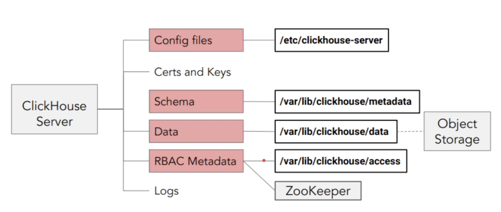
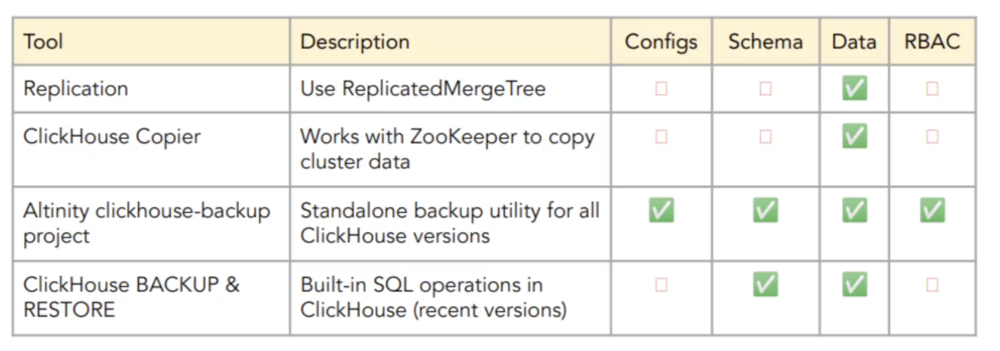
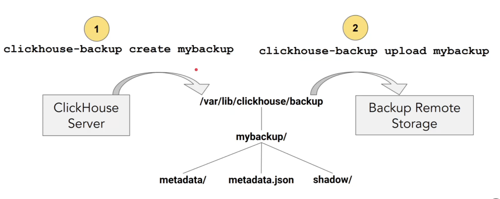
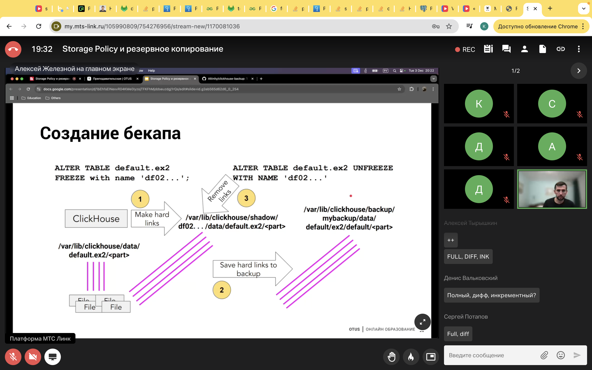
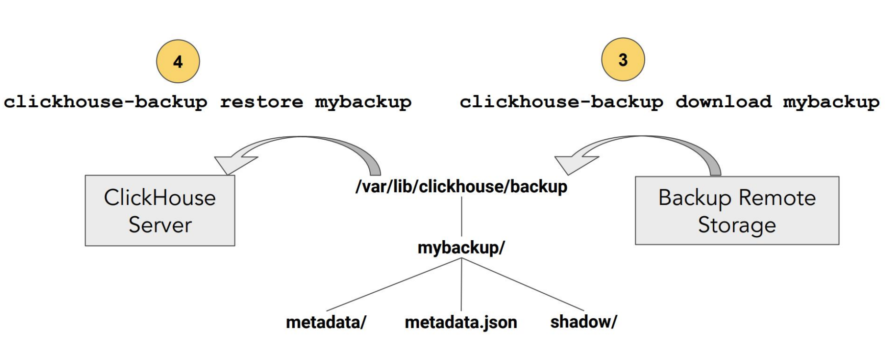
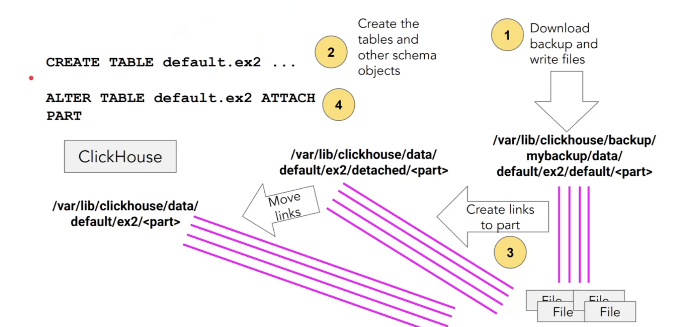
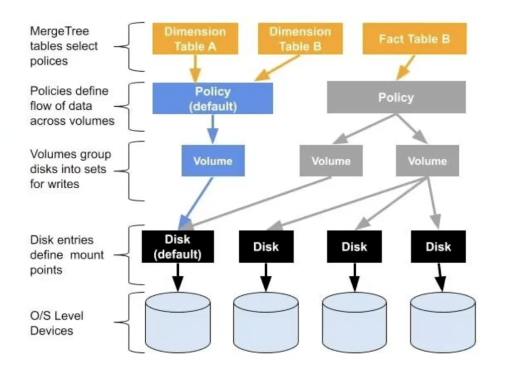
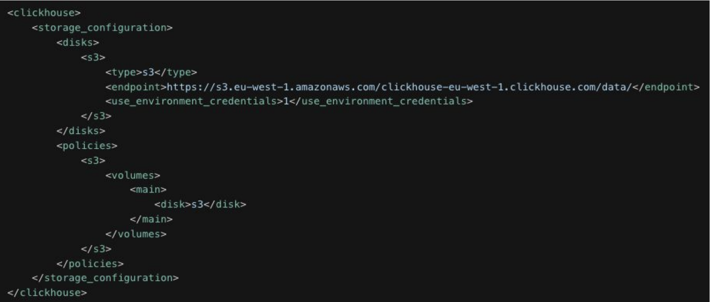

# Storage policy и резервное копирование

Бэкапы мы делаем как самый-самый последний вариант восстановления доступа, восстановления наших данных. Либо для того чтобы достаточно быстро переехать на новый кластер. Чаще всего когда мы доходим до бэкапов - это означает что мы где то уже ошиблись, так как проблемы доступности данных мы должны решить за счет репликации.

У клика есть "защита от дурака" - ограничение на максимальный размер удаляемого объекта (таблицы, базы, диска), по умолчанию 50гб.

Почему мы делаем бэкапы
- катастрофические сбои, в результате которых удаляются все данные
- случайное удаление бд или таблицы
- отладка проблем с использованием производственных данных
- тестирование обновлений перед изменением схемы или версии (обновление кликхауса может привести к проблемам, лучше тестировать)
- загрузка схемы и конфигурации для новых установок

Что нужно спасать?



В общем и целом, мы как правило спасаем метаданные, store и data, конфигурационный файлы и файлы рбак. Иногда еще отдельно спасают директорию lib. Также мы делаем бэкапы на определенные удаленные системы вроде того же object storage, который является достаточно дешевым ресурсом для хранения некоторых объемов данных, отлично подходит для бэкапирования и для инкрементального бэкапирования, а также подходит для выгрузок холодных данных на уровень с3.

Если про конфигурационные файлы мы можем сказать что изменения могут вноситься через системы контроля версий, которые частенько подключают для таких целей, то про сами данные есть определенный нюанс.

Варианты бэкапирования



- репликация - позволяет перевезти именно сами данные. Потому что для создания той или иной таблицы (для осуществления создания реплики) нам нужна отдельная ддл (это решается конструкцией `on cluster`)
- clickhouse-copier - работает с зукипером для того чтобы скопированть данные кластера. Более шустрая система
- clickhouse-backup от altinity, устанавливается как отдельный пакет. Загружает всю необходимую информацию, которую нам нужно.
- clickhouse backup & restore - запускаем в том числе из sql и используем настройки конфигурации нашего storage policy/disks/volumes для обеспечения необходимой директории по нашим данным.

## утилита clickhouse-backup (от алтинити)

Работает на го и на питоне, есть [репа](https://github.com/Altinity/clickhouse-backup). Можно поднять в докере для тестирования. Инструмент достаточно хорошо развивается.

Небольшое отступление - какие виды бэкапов существуют (по тому, сколько данных и от какого момента мы забираем):
- полный (берем и делаем снэпшот текущего состояния системы и его переливаем)
- дифференциальный (тот, который делается с последнего ПОЛНОГО бэкапа)
- инкрементальный (делается с последнего ЛЮБОГО бэкапа)  
Обычно делается полный бэкап, энное количество инкрементных, а затем они перезатираются новый полным бэкапом. В зависимости от объема данных мы можем поставить инкрементный бэкап например на раз в день, а полный бэкап - раз в неделю/месяц или около того. Кликхаус сам по себе поддерживает полный и инкрементный бэкап.

Когды мы говорим о бэкапах, появляются такие термины как RPO , RTO 
- recovery time objective - время, за которое мы должны узнать что у нас произошла какая то проблема и стартануть процессы для восстановления из бэкапов чтобы вернуть наши процессы в полностью работоспособное состояние.
- recovery point objective - точка во времени, на которую наши данные должны быть обязательно восстановлены (к этой точке нам нужно восстановить свои записи в рамках sla). 

Помимо этого, бэкапы нужно где то хранить. Есть даже отдельные правила как хранить бэкапы (придумана когда то одним фотографов, нужно хранить данные в 3 копиях на 2 различных системах, при этом одна система должна быть вне любого контура еще в одном экземпляре). Для нас же главное чтобы в кластере для устойчивости было обязательно геораспределение для создания полноценного решения (если один датацентр обвалился, все остальные могли бы подхватить его работу с точки зрения репликации). Обязательно должен быть бэкап, который создается вовне нашей системы!

clickhouse-backup - инструмент для простого резервного копирования и восстановления ClickHouse с поддержкой многих типов облачных и необлачных хранилищ
- простое создание и восстановление резервных копий всех или определенных таблиц
- эффективное хранение нескольких резервных копий в файловой системе
- загрузка и выгрузка с потоковым сжатием
- работает с aws, gcs, azure, tencent cos, ftp, sftp
- поддержка atomic database engine
- поддержка многодисковых инсталляций (размещение бэкапов на нескольких дисках)
- поддержка пользовательских типов удаленных хранилищ
- поддержка инкрементного резервного копирования на удаленное хранилище

Установка
```bash
# Grab the latest release from GitHub.
wget https://github.com/Altinity/clickhouse-backup/releases/download/v2.5.20/clickhouse-backup-linux-amd64.tar.gz
tar -xf clickhouse-backup-linux-amd64.tar.gz
# Install.
sudo install -o root -g root -m 0755 build/linux/amd64/clickhouse-backup/usr/local/bin
# Try it out.
/usr/local/bin/clickhouse-backup -v
```

Подготовка конфигов
```bash
sudo -u clickhouse mkdir /etc/clickhouse-backup
# копируем шаблон в наш конфиг и затем настраиваем. Чаще всего делаем копию чтобы мы могли затем спокойно восстановиться из этой копии.
sudo -u clickhouse clickhouse-backup \ default-config > /etc/clickhouse-backup/config.yml
sudo -u vi /etc/clickhouse-backup/config.yml
# Прописываются секции general, clickhouse, s3
```
Это не дефолтный конфиг - это шаблон

Создание бэкапа  
В целом, clickhouse-backup - это набор пользовательских команд `clickhouse-backup create mybackup`. В фоне происходит вот что:
- кликхаус сервер при запуске команды в определенную директорию загружает информацию `/var/lib/clickhouse/backup`. Там в директорию `mybackup/` он загружает `metadata/`, `metadata.json`, `shadow`.
- после создания этого бэкапа создается еще команда `clickhouse-backup upload mybackup` на те пути, которые были до этого нами прописаны в конфигурационные файлы clickhouse-backup (это yaml, не xml!)



Точно так же мы можем сделать руками - запустить те же самые команды:  
создается хардлинка. У нас есть наши данные в дата-директориях `/var/lib/clickhouse/data/default.ex2/<part>`. После того как мы их решили забэкапить - мы сохраняем эти данные в директорию бэкап `/var/lib/clickhouse/backup/mybackup/data/default/ex2/default/<part>`. Мы не копируем данные, а создаем хардлинку на данные, которые все еще лежает в дата директоирях! Но при этом при создании команды freeze (`alter table default.ex2 freeze with name 'df02...';`) наши данные еще дополнительно (первоначально, до того, как они забекапируются) делаются хардлинки в директорию shadow (`/var/lib/clickhouse/shadow/df02../data/default.ex2/<part>`), это промежуточная директория, которая используется в том числе для создания бэкапов. После этого удаляются линки (сделали линку, сохранили хардлинку, удалили хардлинку из shadow)(`alter table default.ex2 unfreeze with name 'df02...';`). shadow используется на случай каких-либо ошибок при создании, за ней нужно отдельно следить. Часто забывают про удаление линков (шаг 3 на картинке) (либо они не убираются по каким то внутренним причинам). Можно и нужно удалять эти парты, а то они будут считаться как detached. 



Восстановление из бэкапа с помощью download (по тому же самому пути, только наоборот).



Точно так же мы можем сделать руками. Закачиваются данные в ту же самую директорию backup , создается таблица и все другие объекты схемы (вручную, через ддл), затем наши данные загружаются в detached парты, после этого уже происходит attach . То есть в целом по сути все бэкапы - это перебор хардлинками.



По сути, все бэкапы - это перебор хардлинками

Примеры команд для бэкапа и восстановления из бэкапа + полезные команды
```bash
# Back up everything locally.
sudo -u clickhouse clickhouse-backup create mybackup --rbac --configs
# Back up a single table locally.
sudo -u clickhouse clickhouse-backup create mybackup_table_local -t default.ex2
# Back up and upload a database to remote backup storage.
sudo -u clickhouse clickhouse-backup create_remote mybackup_database_remote -t 'default.*'

# Примеры команд для восстановления из бекапа
# Restore all data from already downloaded backup.
sudo -u clickhouse clickhouse-backup restore mybackup
# Restore a single table from local backup.
sudo -u clickhouse clickhouse-backup restore \ mybackup -t default.ex2
# Download and restore a single database.
sudo -u clickhouse clickhouse-backup restore_remote \ mybackup -t 'default.*'

# Полезные команды
# Listing your backups.
sudo -u clickhouse clickhouse-backup list
sudo -u clickhouse clickhouse-backup list local
sudo -u clickhouse clickhouse-backup list remote
# Deleting backups. (локально и удаленно)
sudo -u clickhouse clickhouse-backup delete local mybackup
sudo -u clickhouse clickhouse-backup delete remote mybackup
```

В целом для наших действий все, что остается произвести здесь - это создать то самое удаленное хранилище и дать ему достум через наш storage policy , указанное в нашем конфигурационном файлике yaml нашего clickhouse-backup

При `attach part` кх сам создает хардлинк в data и потом удаляет хардлинк из detached

## встроенные backup/restore (27 00)

Также позволяет сделать бэкап как всей системы, так и отдельных таблиц (можно даже указать метаданные или что то еще). Можно использовать для разовых бэкапов пока не настроен полный бэкап.
```sql
-- Creating a full backup
BACKUP DATABASE my_database TO 'file:///backups/my_database_backup';
-- Creating an incremental backup
BACKUP DATABASE my_database TO 'file:///backups/my_database_backup_incremental' WITH increment;
-- Creating a differential backup
BACKUP DATABASE my_database TO 'file:///backups/my_database_backup_differential' WITH differential;
```

Для таких вещей нам нужно указывать storage policy , а также какой то крон. Но бэкапить нашу систему на ту же систему - это сомнительная идея. Но бувает удобно когда мы знаем, что у нас есть данные, которые могут затереться при обновлении. Вместо того, чтобы куда то выносить, ставить новое хранилище, мы можем определить, какие директории будут затерты, переместить наши данные в другую директорию и выгрузить оттуда с помощью рестора. но ПРОДОВЫЕ БЭКАПЫ НИКОГДА НЕ ДОЛЖНЫ ХРАНИТЬСЯ НА ТОЙ ЖЕ СИСТЕМЕ 
```bash
# Cron job for daily full backups at 2 AM
0 2 * * * clickhouse-client --query="BACKUP DATABASE my_database TO 'file:///backups/my_database_backup'"
```

Восстановление из бекапа
```sql
-- Restoring a full backup
RESTORE DATABASE my_database FROM 'file:///backups/my_database_backup';
-- Restoring an incremental backup
RESTORE DATABASE my_database FROM
'file:///backups/my_database_backup_incremental';
-- Restoring a differential backup
RESTORE DATABASE my_database FROM
'file:///backups/my_database_backup_differential';
```


## Storage policy (29 00)

В рамках кликхауса это по сути наименование правил хранения, которые в кх у нас используются.
- правила хранения и управления данными (Storage policy определяет, как и где хранятся данные)
- контроллирует, где и как хранятся данные (Определяет места и методы хранения данных)
- оптимизирует производительность и использование ресурсов (Правильные политики хранения повышают производительность запросов и оптимизируют затраты на хранение данных.)

Самые частые кейсы использования Storage policy:
- настройка подключения к внешним источникам (начиная от с3, заканчивая гуглом) (можно указать несколько, можно указать шифрованное/не шифрованное). Storage policy может быть определено на уровне таблицы (создали таблицу, указали, где именно должны храниться данные этой таблицы).



Компоненты Storage policy
- Тома (Volumes) - Логическая группировка дисков. (наборы дисков)
- Диски (Disks) - Физические или логические единицы хранения, используемые для хранения данных. (диски могут перекликаться, зависит от наших настроек)
- Конфигурация хранилища (Storage Configuration) - Настройка, определяющая, как используются диски и тома.
- Диаграмма, показывающая взаимосвязь между этими компонентами. (*)

Тома:
- Cостоят из нескольких дисков.
- Данные могут быть распределены по дискам одного volume для балансировки нагрузки. (может быть использовано для distributed таблицы в том числе)

Диски:
- Диски могут быть физическими дисками или логическими единицами, например сетевыми хранилищами.

Различные типы вольюмов (томов)
- Локальные: высокоскоростные SSD или HDD.
- Сетевые хранилища (NAS).
- Хранилище S3 для масштабируемого облачного хранения данных.



## Практика (34 00)

Чаще на сервере с кликхаусом под отдельные действия делаютсся отдельные пользователи: под админские действия один пользователь, под выгрузки - другой, под мониторинг - третий. Заходим под своим пользователем, который имеет право на редактирование тех или иных конфигурационных файлов и выполняем ту или иную работу.  Обычно бэкап делается системным пользователем, у которого все права (и на просмотрм, и на создание бэкапа). Для кликхаус-бэкапа не нужна отдельная аутентификация. Нам нужен просто пользователь, у которого будет доступ до этой утилиты (из-под которого будет вся эта штука запускаться).

Зайдем в `/etc/clickhouse-server/config.xml`
```xml
<!-- Multi-disk configuration example: -->
<storage_configuration>
    <disks>
        <default>
            <keep_free_space_bytes>0</keep_free_space_bytes>
        </default>
        <data>
            <path>/data/</path>
            <keep_free_space_bytes>0</keep_free_space_bytes>
        </data>
        <s3>
            <type>s3</type>
            <endpoint>http://path/to/endpoint</endpoint>
            <access_key_id>your_access_key_id</access_key_id>
            <secret_access_key>your_secret_access_key</secret_access_key>
        </s3>
        <blob_storage_disk>
            <type>azure_blob_storage</type>
            <storage_account_url>http://account.blob.core.windows.net</storage_account_url>
            <container_name>container</container_name>
            <account_name>account</account_name>
            <account_key>pass123</account_key>
            <metadata_path>/var/lib/clickhouse/disks/blob_storage_disk/</metadata_path>
            <skip_access_check>false</skip_access_check>
        </blob_storage_disk>
    </disks>

    <policies>
        <all>
            <volumes>
                <main>
                    <disk>default</disk>
                    <disk>data</disk>
                    <disk>s3</disk>
                    <disk>blob_storage_disk</disk>

                    <max_data_part_size_bytes></max_data_part_size_bytes>
                    <max_data_part_size_ratio></max_data_part_size_ratio>
                    <perform_ttl_move_on_insert>true</perform_ttl_move_on_insert>
                    <load_balancing>round_robin</load_balancing>
                </main>
            </volumes>
            <move_factor>0.2</move_factor>
        </all>
    </policies>
</storage_configuration>
```
Мы видим отдельные настройки на диск и отдельные настройки на полиси. Здесь по умолчани стандартные используются, но это все дело нужно еще раскомментировать. При этом в файле можно еще поискать какие нибудь s3. В storage_configuration указываем тип диска (помимо с3 поддерживается еще гугловый и еще несколько, чаще всего используется с3), после диска указываем конфигурацию на полиси (место и какие настройки/вольюмы мы здесь применим).

Различные типы дисков:
- Локальные диски: Высокая скорость, ограниченная емкость.
  - Плюсы: Низкая задержка, высокая производительность.
  - Минусы: ограниченная масштабируемость, более высокая стоимость за ГБ. Также локальные диски могут свалиться и мы ничего не достанем.
- Сетевые диски: Умеренная скорость, общие ресурсы.
  - Плюсы: Возможность совместного использования, умеренная масштабируемость, возможность вынести все за пределы системы.
  - Минусы: задержки в сети, возможные перегрузки.
- Облачные хранилища (S3, HDFS): Масштабируемое, экономичное.
  - Плюсы: Практически неограниченное хранилище, экономичность.
  - Минусы: большая задержка, зависимость от интернет-соединения.

С3 славится тем что по определенному айдишнику мы можем запросить данные из конкретного блока. То есть просто конкретный файл, не проходить через по всем файлам в директории.

| Тип диска | Скорость | Масштабируемость | Стоимость |
|----------|----------|-----------------|----------|
| Локальные | Высокий  | Низкий          | Высокий  |
| Сетевые   | Средний  | Средний         | Средний  |
| S3        | Низкий   | Высокий         | Низкий   |


### создание Storage policy

- Укажите диски, доступные для хранения.
- Сгруппируйте диски в тома.
- Создайте политику, обüединяющую тома.

плюсы использования Storage policy
- эффективный поиск данных и выполнение запросов
- оптимизация затрат на хранение данных за счет использования соответствующих типов дисков
- масштабируемость

Рекомендуется делать шифрованные диски. Можно сделать это усилиями клика - зашифровать сторадж полиси и его подключить. Либо сделать это вовне - создать отдельную директорию, куда мы наши данные будем закладывать.

## еще практика 44 00

В качестве примера будет использоваться с3 от яндекс облака. Помимо яндекс облака и других популярных облачных провайдеров можно заиспользовать open-source решения (minio, ceph), разворачиваются они достаточно просто.

Полезные запросы
```sql
SELECT 
    name, 
    path,
    formatReadableSize(free_space) AS free,
    formatReadableSize(total_space) AS total,
    formatReadableSize(keep_free_space) AS reserved
FROM system.disks;
/*
   ┌─name────┬─path─────────────────┬─free──────┬─total─────┬─reserved─┐
1. │ default │ /var/lib/clickhouse/ │ 48.80 GiB │ 58.42 GiB │ 0.00 B   │
   └─────────┴──────────────────────┴───────────┴───────────┴──────────┘

1 row in set. Elapsed: 0.011 sec. 
*/
-- помимо этого рекомендуется следить за нашими директориями через консоль
-- du -lh /var/lib/clickhouse


select policy_name, volume_name, disks from system.storage_policies;
/*
   ┌─policy_name─┬─volume_name─┬─disks───────┐
1. │ default     │ default     │ ['default'] │
   └─────────────┴─────────────┴─────────────┘

1 row in set. Elapsed: 0.006 sec. 
*/
SELECT name, disk_name, table, path FROM system.parts limit 1 \G;
/*
Row 1:
──────
name:      all_1_1_0
disk_name: default
table:     test_with_pk
path:      /var/lib/clickhouse/store/463/463cdbb8-8454-437d-bd3c-22747fb0c6b9/all_1_1_0/

1 row in set. Elapsed: 0.012 sec. 
*/

SELECT name, data_paths, metadata_path, storage_policy
FROM system.tables 
WHERE name LIKE 'trips%' \G;
/*
Row 1:
──────
name:           trips
data_paths:     []
metadata_path:  /var/lib/clickhouse/store/3e7/3e7e3932-018e-422a-a8ef-93b91654e9ad/trips.sql
storage_policy: 

1 row in set. Elapsed: 0.003 sec. 
*/
```

Полезные запросы для проверки наших дисков
```bash
du -lh /var/lib/clickhouse
```

## список материалов для изучения

## separation of storage and compute (clickhouse, s3) (51 00 ) [Source](https://clickhouse.com/docs/en/guides/separation-storage-compute)

Разделение `storage` и `compute` означает, что вычислительные ресурсы и ресурсы хранения управляются (и масштабируются) независимо друг от друга, что обеспечивает лучшую масштабируемость, экономическую эффективность и гибкость.

Использование ClickHouse на базе S3 особенно полезно в тех случаях, когда производительность запросов к "холодным" данным менее критична. ClickHouse поддерживает использование S3 в качестве хранилища для механизма MergeTree с помощью S3BackedMergeTree. Этот движок включается без нашего ведома, мы даже его не увидим в `show create`. Этот табличный механизм позволяет пользователям использовать преимущества масштабируемости и стоимости S3, сохраняя при этом производительность вставки и запросов механизма MergeTree.

### 1. Use S3 as a ClickHouse disk

Создание диска - cоздайте новый файл в каталоге ClickHouse `config.d` для хранения конфигурации хранилища:

Скопируйте следующий XML во вновь созданный файл (`/etc/clickhouse-server/config.d/storage_config.xml`), заменив `BUCKET` (для YC https://storage.yandexcloud.net/bucket-name/), `ACCESS_KEY_ID`, `SECRET_ACCESS_KEY` на данные вашего object storage бакета, в котором вы хотите хранить свои данные:
```xml
<clickhouse>
  <storage_configuration>
    <disks>
      <s3_disk>
        <type>s3</type>
        <endpoint>$BUCKET</endpoint>
        <access_key_id>$ACCESS_KEY_ID</access_key_id>
        <secret_access_key>$SECRET_ACCESS_KEY</secret_access_key>
        <metadata_path>/var/lib/clickhouse/disks/s3_disk/</metadata_path>
      </s3_disk>
      <s3_cache>
        <type>cache</type>
        <disk>s3_disk</disk>
        <path>/var/lib/clickhouse/disks/s3_cache/</path>
        <max_size>10Gi</max_size>
      </s3_cache>
    </disks>
    <policies>
      <s3_main>
        <volumes>
          <main>
            <disk>s3_disk</disk>
          </main>
        </volumes>
      </s3_main>
    </policies>
  </storage_configuration>
</clickhouse>
```

После создания файла конфигурации необходимо изменить владельца файла на пользователя и группу clickhouse и перезагрузить сервис:
```bash
chown clickhouse:clickhouse /etc/clickhouse-server/config.d/storage_config.xml

service clickhouse-server restart

service clickhouse-server status
```

У каждого с3 хранилища есть 3 важных конфигурационных параметра, которые нужно использовать в своей деятельности:
- бакет (эндпоинт доступа до данных - откуда данные должны до нас поступать) (54 30 демо создания бакета) , пример
  `BUCKET=https://storage.yandexcloud.net/sample-data1/`
- SECRET_ACCESS_KEY - это правило доступа. Создаются для сервисного аккаунта, указываются идентивфикаторы (при создании ключа генерируются как access_key_id, так и secret_access_key). Эти настройки можно вынести вовне файла настроек! SECRET_ACCESS_KEY появляется 1 раз и больше не отображается


## 2. Create a table backed by S3

Обратите внимание, что нам не нужно указывать движок `S3BackedMergeTree`. `ClickHouse` автоматически преобразует тип движка, если обнаружит, что таблица использует S3 для хранения.

```sql
CREATE TABLE my_s3_table
  (
    `id` UInt64,
    `column1` String
  )
ENGINE = MergeTree
ORDER BY id
SETTINGS storage_policy = 's3_main'; 

INSERT INTO my_s3_table (id, column1)
VALUES (1, 'abc'), (2, 'xyz');

--  после этого на с3 появятся файлики

SELECT * FROM my_s3_table;
```

Если все прошло успешно, в консоли вашего s3-провайдера вы должны увидеть созданные файлы.


## Вспомогательные запросы:

```sql
SELECT name, path,
formatReadableSize(free_space) AS free,
    formatReadableSize(total_space) AS total,
    formatReadableSize(keep_free_space) AS reserved
FROM system.disks;

select policy_name, volume_name, disks from system.storage_policies;
-- появится policy_name=s3_main, disks=s3_disk

SELECT name, disk_name, path FROM system.parts;

SELECT name, data_paths, metadata_path, storage_policy
FROM system.tables WHERE name LIKE 'sample%';
```

### Локальный бекап
```bash
vi /etc/clickhouse-server/config.d/storage_config_backups.xml
```
```xml
<clickhouse>
    <storage_configuration>
        <disks>
            <backups>
                <type>local</type>
                <path>/tmp/backups/</path>
            </backups>
        </disks>
    </storage_configuration>
    <backups>
        <allowed_disk>backups</allowed_disk>
        <allowed_path>/tmp/backups/</allowed_path>
    </backups>
</clickhouse>
```

```sql
BACKUP database default TO Disk('backups', 'default');

BACKUP table default.trips TO Disk('backups', 'default_trips');

RESTORE table default.trips FROM Disk('backups', 'default_trips');

select *
from system.backups;
```

## вопросы

А можем рассмотреть пример с настройкой ттл на выгрузку на с3 вместо удаления?

еще к вопросам (можем на q&a, если долго настраивать) - А можем рассмотреть пример с настройкой ттл на выгрузку на с3 вместо удаления? ну и пример селекта этих данных с с3

https://clickhouse.com/docs/en/operations/backup

Создаем следующий xml - просто указав нужный путь, мы можем успешно делать бэкапы!
```xml
<clickhouse>
    <storage_configuration>
        <disks>
            <backups>
                <type>local</type>
                <path>/tmp/backups/</path>
            </backups>
        </disks>
    </storage_configuration>
    <backups>
        <allowed_disk>backups</allowed_disk>
        <allowed_path>/tmp/backups/</allowed_path>
    </backups>
</clickhouse>
```  
После этого в system.disks появится еще один диск. Делаем на него бэкап
```sql
BACKUP TABLE test.table TO Disk('backups', '1.zip')

-- проверим с помощью системных представлений:
select * from system.backups;
```
Проверим что у нас в созданной папке (там должен быть тот самый файл `1.zip`)
```bash
ls -la /tmp/backups
```

Можно создавать и не в зип файл, а просто в директорию! (тогда указываем безз расширения).  Там будет файлик default.sql - содержит информацию для всяких ддл-ек. 

Далее мы создали таблицу трипс и забекапили ее (только таблицу!), удалили и восставновили (1 13 00)
```sql
BACKUP TABLE default.trips TO Disk('backups', 'default_trips');
select * from system.backups;

drop table trips;

restore TABLE default.trips from Disk('backups', 'default_trips');
select * from system.backups;  -- появится запись restored
show tables;
```

Бэкапы можно сжимать - прям в команде указываем формат который подразумевает сжатие

Можно делать и инрементальный бэкап. Это достигается с помощью `SETTINGS base_backup`. The setting base_backup causes data since a previous backup to Disk('backups', 'd.zip') to be stored to Disk('backups', 'incremental-a.zip'):
```sql
BACKUP TABLE test.table TO Disk('backups', 'incremental-a.zip')
  SETTINGS base_backup = Disk('backups', 'd.zip')
```
При этом смотрится инкремент относительно той версии, которая локально есть. 

По поводу инкрементального бэкапа есть в презе от алтинити

По дз - нужно именно испортить данные с помощью мутации (удалить/изменить часть строки)