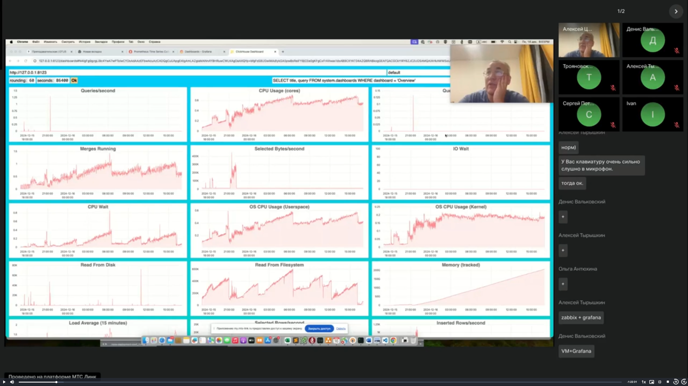

# Мониторинг и логирование

## Мониторинг

Кликхаус и сам себя прекрасно мониторит. У клика есть встроенный дашборд. Доступен по url http://clickhouse-server:port/dashboard (например, http://127.0.0.1:8123/dashboard ), где 
- clickhouse-server это адрес сервера
- а port - http port сервера, по умолчанию 8123  

Что дашборд из себя представлят:



Показывает графики на базе запросов, возвращающих две колонки:
- DateTime, 
- любой-числовой-тип  
Есть встроенный пресет запросов, в system.dashboards. Можно добавлять свои запросы, но они не сохраняются, а кодируются прямо в URL. Можно создавать свои таблицы с такой же структуры как system.dashboard, и загружать запросы оттуда.

Работает это следующим образом. Есть вот такой запрос. В дефолтной табличке system.dashboards хранятся запросы.
```sql
select title, query 
from system.dashboards 
where dashboard = 'Overview'
format Vertical
;
/*
Row 1:
──────
title: Queries/second
query: SELECT toStartOfInterval(event_time, INTERVAL {rounding:UInt32} SECOND)::INT AS t, avg(ProfileEvent_Query)
FROM merge('system', '^metric_log')
WHERE event_date >= toDate(now() - {seconds:UInt32}) AND event_time >= now() - {seconds:UInt32}
GROUP BY t
ORDER BY t WITH FILL STEP {rounding:UInt32}

Row 2:
──────
title: CPU Usage (cores)
query: SELECT toStartOfInterval(event_time, INTERVAL {rounding:UInt32} SECOND)::INT AS t, avg(ProfileEvent_OSCPUVirtualTimeMicroseconds) / 1000000
FROM merge('system', '^metric_log')
WHERE event_date >= toDate(now() - {seconds:UInt32}) AND event_time >= now() - {seconds:UInt32}
GROUP BY t
ORDER BY t WITH FILL STEP {rounding:UInt32}

Row 3:
──────
title: Queries Running
query: SELECT toStartOfInterval(event_time, INTERVAL {rounding:UInt32} SECOND)::INT AS t, avg(CurrentMetric_Query)
FROM merge('system', '^metric_log')
WHERE event_date >= toDate(now() - {seconds:UInt32}) AND event_time >= now() - {seconds:UInt32}
GROUP BY t
ORDER BY t WITH FILL STEP {rounding:UInt32}

Row 4:
──────
title: Merges Running
query: SELECT toStartOfInterval(event_time, INTERVAL {rounding:UInt32} SECOND)::INT AS t, avg(CurrentMetric_Merge)
FROM merge('system', '^metric_log')
WHERE event_date >= toDate(now() - {seconds:UInt32}) AND event_time >= now() - {seconds:UInt32}
GROUP BY t
ORDER BY t WITH FILL STEP {rounding:UInt32}

Row 5:
──────
title: Selected Bytes/second
query: SELECT toStartOfInterval(event_time, INTERVAL {rounding:UInt32} SECOND)::INT AS t, avg(ProfileEvent_SelectedBytes)
FROM merge('system', '^metric_log')
WHERE event_date >= toDate(now() - {seconds:UInt32}) AND event_time >= now() - {seconds:UInt32}
GROUP BY t
ORDER BY t WITH FILL STEP {rounding:UInt32}

Row 6:
──────
title: IO Wait
query: SELECT toStartOfInterval(event_time, INTERVAL {rounding:UInt32} SECOND)::INT AS t, avg(ProfileEvent_OSIOWaitMicroseconds) / 1000000
FROM merge('system', '^metric_log')
WHERE event_date >= toDate(now() - {seconds:UInt32}) AND event_time >= now() - {seconds:UInt32}
GROUP BY t
ORDER BY t WITH FILL STEP {rounding:UInt32}

Row 7:
──────
title: CPU Wait
query: SELECT toStartOfInterval(event_time, INTERVAL {rounding:UInt32} SECOND)::INT AS t, avg(ProfileEvent_OSCPUWaitMicroseconds) / 1000000
FROM merge('system', '^metric_log')
WHERE event_date >= toDate(now() - {seconds:UInt32}) AND event_time >= now() - {seconds:UInt32}
GROUP BY t
ORDER BY t WITH FILL STEP {rounding:UInt32}

Row 8:
──────
title: OS CPU Usage (Userspace)
query: SELECT toStartOfInterval(event_time, INTERVAL {rounding:UInt32} SECOND)::INT AS t, avg(value)
FROM merge('system', '^asynchronous_metric_log')
WHERE event_date >= toDate(now() - {seconds:UInt32}) AND event_time >= now() - {seconds:UInt32} AND metric = 'OSUserTimeNormalized'
GROUP BY t
ORDER BY t WITH FILL STEP {rounding:UInt32}

Row 9:
───────
title: OS CPU Usage (Kernel)
query: SELECT toStartOfInterval(event_time, INTERVAL {rounding:UInt32} SECOND)::INT AS t, avg(value)
FROM merge('system', '^asynchronous_metric_log')
WHERE event_date >= toDate(now() - {seconds:UInt32}) AND event_time >= now() - {seconds:UInt32} AND metric = 'OSSystemTimeNormalized'
GROUP BY t
ORDER BY t WITH FILL STEP {rounding:UInt32}

Row 10:
───────
title: Read From Disk
query: SELECT toStartOfInterval(event_time, INTERVAL {rounding:UInt32} SECOND)::INT AS t, avg(ProfileEvent_OSReadBytes)
FROM merge('system', '^metric_log')
WHERE event_date >= toDate(now() - {seconds:UInt32}) AND event_time >= now() - {seconds:UInt32}
GROUP BY t
ORDER BY t WITH FILL STEP {rounding:UInt32}

Row 11:
───────
title: Read From Filesystem
query: SELECT toStartOfInterval(event_time, INTERVAL {rounding:UInt32} SECOND)::INT AS t, avg(ProfileEvent_OSReadChars)
FROM merge('system', '^metric_log')
WHERE event_date >= toDate(now() - {seconds:UInt32}) AND event_time >= now() - {seconds:UInt32}
GROUP BY t
ORDER BY t WITH FILL STEP {rounding:UInt32}

Row 12:
───────
title: Memory (tracked)
query: SELECT toStartOfInterval(event_time, INTERVAL {rounding:UInt32} SECOND)::INT AS t, avg(CurrentMetric_MemoryTracking)
FROM merge('system', '^metric_log')
WHERE event_date >= toDate(now() - {seconds:UInt32}) AND event_time >= now() - {seconds:UInt32}
GROUP BY t
ORDER BY t WITH FILL STEP {rounding:UInt32}

Row 13:
───────
title: Load Average (15 minutes)
query: SELECT toStartOfInterval(event_time, INTERVAL {rounding:UInt32} SECOND)::INT AS t, avg(value)
FROM merge('system', '^asynchronous_metric_log')
WHERE event_date >= toDate(now() - {seconds:UInt32}) AND event_time >= now() - {seconds:UInt32} AND metric = 'LoadAverage15'
GROUP BY t
ORDER BY t WITH FILL STEP {rounding:UInt32}

Row 14:
───────
title: Selected Rows/second
query: SELECT toStartOfInterval(event_time, INTERVAL {rounding:UInt32} SECOND)::INT AS t, avg(ProfileEvent_SelectedRows)
FROM merge('system', '^metric_log')
WHERE event_date >= toDate(now() - {seconds:UInt32}) AND event_time >= now() - {seconds:UInt32}
GROUP BY t
ORDER BY t WITH FILL STEP {rounding:UInt32}

Row 15:
───────
title: Inserted Rows/second
query: SELECT toStartOfInterval(event_time, INTERVAL {rounding:UInt32} SECOND)::INT AS t, avg(ProfileEvent_InsertedRows)
FROM merge('system', '^metric_log')
WHERE event_date >= toDate(now() - {seconds:UInt32}) AND event_time >= now() - {seconds:UInt32}
GROUP BY t
ORDER BY t WITH FILL STEP {rounding:UInt32}

Row 16:
───────
title: Total MergeTree Parts
query: SELECT toStartOfInterval(event_time, INTERVAL {rounding:UInt32} SECOND)::INT AS t, avg(value)
FROM merge('system', '^asynchronous_metric_log')
WHERE event_date >= toDate(now() - {seconds:UInt32}) AND event_time >= now() - {seconds:UInt32} AND metric = 'TotalPartsOfMergeTreeTables'
GROUP BY t
ORDER BY t WITH FILL STEP {rounding:UInt32}

Row 17:
───────
title: Max Parts For Partition
query: SELECT toStartOfInterval(event_time, INTERVAL {rounding:UInt32} SECOND)::INT AS t, max(value)
FROM merge('system', '^asynchronous_metric_log')
WHERE event_date >= toDate(now() - {seconds:UInt32}) AND event_time >= now() - {seconds:UInt32} AND metric = 'MaxPartCountForPartition'
GROUP BY t
ORDER BY t WITH FILL STEP {rounding:UInt32}

Row 18:
───────
title: Concurrent network connections
query: SELECT toStartOfInterval(event_time, INTERVAL {rounding:UInt32} SECOND)::INT AS t,
    sum(CurrentMetric_TCPConnection) AS TCP_Connections,
    sum(CurrentMetric_MySQLConnection) AS MySQL_Connections,
    sum(CurrentMetric_HTTPConnection) AS HTTP_Connections
FROM merge('system', '^metric_log')
WHERE event_date >= toDate(now() - {seconds:UInt32}) AND event_time >= now() - {seconds:UInt32}
GROUP BY t
ORDER BY t WITH FILL STEP {rounding:UInt32}

18 rows in set. Elapsed: 0.002 sec. 
*/
```
Есть табличка `FROM merge('system', '^metric_log')` , оттуда различными запросами вытаскиавются метрики. Это все отдается как данные , из которых формируется дашборд. Запрос можно редактировать прямо в браузере. Все основные метрики, которые нам нужны, отображены на дефолтном дашборде. Это дает нам неплохой старт чтобы понимать, что вообще у нас происходит с базой.

Доступные (из коробки) метрики:
- Queries/second
- CPU Usage
- Queries Running
- Merges Running
- Selected Bytes/second
- Inserted/Selected Rows/second
- Read From Disk
- Read From FS
- IO Wait
- CPU Wait
- CPU Usage user/system
- Memory usage
- Total parts / Max Parts for Partition
- Можно добавлять свои используя запросы в КХ
- Можно сохранять свои в таблицу аналогичной system.dashboards структуры

Возьмем любой запрос и выполним его в кх:
```sql
-- заменю {rounding:UInt32} на 60, а на 86400 (как в браузере дефолтно)
SELECT toStartOfInterval(event_time, INTERVAL 60 SECOND)::INT AS t, avg(ProfileEvent_Query)
FROM merge('system', '^metric_log')
WHERE event_date >= toDate(now() - 86400) AND event_time >= now() - 86400
GROUP BY t
ORDER BY t WITH FILL STEP 60
/*
    ┌──────────t─┬─avg(ProfileEvent_Query)─┐
 1. │ 1734864780 │                       0 │
 2. │ 1734864840 │                       0 │
 3. │ 1734864900 │     0.31666666666666665 │
 4. │ 1734864960 │                       0 │
 5. │ 1734865020 │                       0 │
 6. │ 1734865080 │                       0 │
 7. │ 1734865140 │                    0.05 │
 8. │ 1734865200 │    0.016666666666666666 │
 9. │ 1734865260 │                       0 │
10. │ 1734865320 │                       0 │
11. │ 1734865380 │                       0 │
12. │ 1734865440 │                       0 │
13. │ 1734865500 │                       0 │
14. │ 1734865560 │                       0 │
15. │ 1734865620 │                       0 │
16. │ 1734865680 │                       0 │
17. │ 1734865740 │    0.034482758620689655 │
    └────────────┴─────────────────────────┘
*/
```
можно добавлять свои запросы и с этим работать.

Кроме этого ClickHouse подерживает сбор метрик внешними системами.
- Graphite настраивается секцией конфигурации <graphite>
- Prometheus настраивается секцией конфигурации <prometheus>. если мы работаем с прометеусом, то нам не нужен никакой внешний экспортер, поскольку экспортер с метриками в формате прометеуса у нас уже встроен.

Метрики представлены 3 таблицами. Данные забираются из них:
- system.metrics
- system.events
- system.asynchronous_metrics

Пример для Graphite:
```xml
<graphite>
    <host>localhost</host>
    <port>42000</port>
    <timeout>0.1</timeout>
    <interval>60</interval>
    <root_path>one_min</root_path>
    <metrics>true</metrics>
    <events>true</events>
    <events_cumulative>false</events_cumulative>
    <asynchronous_metrics>true</asynchronous_metrics>
</graphite>
```
Клик может работать и как бэкэнд для графита (движок GraphiteMergeTree), так и посылать в него метрики. Графит - это стэк для мониторинга и в отличии от прометеуса он работает по технологии пуш - то есть есть демон и в xml в параметрах мы как раз описываем, куда именно (на какой порт и тд) и с какой периодичностью будем слать метрики и из каких таблиц. По умолчанию эта секция закомментирована.

Пример для Prometheus:
```xml
<prometheus>
    <endpoint>/metrics</endpoint>
    <port>9363</port>

    <metrics>true</metrics>
    <events>true</events>
    <asynchronous_metrics>true</asynchronous_metrics>

    <errors>true</errors>
</prometheus>
```
Эта секция - не куда слать, а куда ходить за метриками. У нас есть эндпоинт `/metrics`, также есть список табличек, из которых мы шлем метрики.
```bash
# так мы получаем формат выдачи метрик в формате прометеус
curl http://127.0.0.1:9363/metrics
```
Прометеувская джоба будет ходить сюда

У преподавателя уже был поднят прометеус (15 00), на скрине - часть джобы, которая ходит в клик.


Единственное что поменяно от дефолтного - это таргет, там прописан внутренний айпишник сервера, на котором запущен кликхаус. Прометеус раз в 15 секунд ходит, скрэппит метрики и затем они становятся доступны. В Query мы увидим кучу метрик из кликхауса. Мы можем их запрашивать и как то смотреть.

## Системные таблицы

system.metrics - мгновенные метрики (текущее значение)
- metric (String) — Metric name.
- value (Int64) — Metric value.
- description (String) — Metric description.  

system.events - счетчики различных событий (накапливающийся счетчик с момента старта кликхауса)
- event (String) — Event name.
- value (UInt64) — Number of events occurred.
- description (String) — Event description.

system.asynchronous_metrics - системные метрики, рассчитываемые в фоне. Там учитываются различные системные события, которые могут и так забираться другими экспортерами (node exporter и тд)
- metric (String) — Metric name.
- value (Float64) — Metric value.
- description (String - Metric description)

Системные представления - также помогают понять, в каком состояниинаходится сейчас система.
- system.processes. - Запросы, выполняемые в настоящий момент, отображаются в представлении. То есть это какие запросы сейчас обрабатываются.
- system.mutations - Для отображения мутаций
- system.merges - отображает выполняемые в данные момент мутации и слияния таблиц семейства MergeTree.
- system.replicated_fetches - показывает выполняемые в данный момент фоновые операции скачивания датапартов с других реплик.
- system.replication_queue - содержит информацию о задачах из очередей репликации, хранящихся в ZooKeeper. 

system.merges - одна из самых главных таблиц для мониторинга
- метрики отображаются только в реальном времени.
- глобальные метрики слияния фиксируются в system.metrics и system.events.
- тип действия - слияние или мутация определяется флагом is_mutation 
```sql
-- именно о слияниях! Поскольку слияния - достаточно дорогая операция, зачастую может подвешивать много чего , особенно если прилетело много партов
select
    database,
    table,
    elapsed,
    progress,
    rows_read
from system.merges
where is_mutation = 1  -- только процессы мутаций датапартов
```
НО! Мы здесь не увидим истории, а увидим только текущее состояние. То есть это для того чтобы разбирать какую то проблему, которая происходит сейчас. Это для изучения затыков.

system.errors
- Содержит коды ошибок с указанием количества срабатываний.  
Здесь фиксируются ошибки, которые у нас были с момента старта. Достаточно важная табличка
```sql
select name, value, last_error_message
from system.errors
order by value desc;

select *
from system.errors
order by last_error_message desc
;
```

system.metrics - Это такой статус системы в текущий момент. Можно отфильтровать:
- Типы метрик
  - metric ilike '%part%' — метрики кусков.
  - metric ilike '%thread%' — метрики потоков. (если идет активная работа)
  - metric ilike '%connect%’ — подключения.
- На что обращать внимание
  - Background*PoolTask < Background*PoolSize: их надо всегда сравнивать, причем по разным типа. PoolSize должен быть больше чем PoolTask чтоб все задачи прекрасно решались. Если они начинают равняться - то их надо настраивать. Когда мы определяем пул - мы определяем, сколько у нас максимально может быть процессов, которые будут заниматься этой задачей.
    - PoolTask - сколько сейчас активно,
    - PoolSize - размер пула.
  - DelayedInserts - счетчик замедленных операций INSERT ввиду большого количества партов.
  - ContextLockWait - блокировки во что угодно, сеть или диск, или просто взаимоблокирующие запросы
```sql
show table system.metrics format TSVRaw;
/*
CREATE TABLE system.metrics
(
    `metric` String,  -- полное название метрики
    `value` Int64,  -- ее значение
    `description` String,  -- описание метрики
    `name` String ALIAS metric
)
ENGINE = SystemMetrics
COMMENT 'Contains metrics which can be calculated instantly, or have a current value. For example, the number of simultaneously processed queries or the current replica delay. This table is always up to date.'
*/

select * from system.metrics
where metric ilike '%pool%';
-- из важного тут - BackgroundFetchesPoolTask и BackgroundFetchesPoolSize, их надо всегда сравнивать, причем по разным типа

-- такую же выборку мы можем сделать из сеттингов - и посмотреть настройки наших пулов
select name, value from system.settings
where name ilike '%pool%';
-- если мы видим что весь наш пул израсходован - то здесь мы их можем поправить.
/*
    ┌─name─────────────────────────────────────────────────────┬─value───────────────────┐
 1. │ connection_pool_max_wait_ms                              │ 0                       │
 2. │ distributed_connections_pool_size                        │ 1024                    │
 3. │ postgresql_connection_pool_size                          │ 16                      │
 4. │ postgresql_connection_pool_wait_timeout                  │ 5000                    │
 5. │ postgresql_connection_pool_retries                       │ 2                       │
 6. │ postgresql_connection_pool_auto_close_connection         │ 0                       │
 7. │ odbc_bridge_connection_pool_size                         │ 16                      │
 8. │ odbc_bridge_use_connection_pooling                       │ 1                       │
 9. │ allow_prefetched_read_pool_for_remote_filesystem         │ 1                       │
10. │ allow_prefetched_read_pool_for_local_filesystem          │ 0                       │
11. │ allow_asynchronous_read_from_io_pool_for_merge_tree      │ 0                       │
12. │ distributed_cache_wait_connection_from_pool_milliseconds │ 100                     │
13. │ distributed_cache_bypass_connection_pool                 │ 0                       │
14. │ distributed_cache_pool_behaviour_on_limit                │ allocate_bypassing_pool │
15. │ background_buffer_flush_schedule_pool_size               │ 16                      │
16. │ background_pool_size                                     │ 16                      │
17. │ background_move_pool_size                                │ 8                       │
18. │ background_fetches_pool_size                             │ 8                       │
19. │ background_common_pool_size                              │ 8                       │
20. │ background_schedule_pool_size                            │ 128                     │
21. │ background_message_broker_schedule_pool_size             │ 16                      │
22. │ background_distributed_schedule_pool_size                │ 16                      │
    └──────────────────────────────────────────────────────────┴─────────────────────────┘
*/
```
Настройка пулов (background_distributed_schedule_pool_size) связана непосредственно с количеством процессов. Количество процессов связано с количеством ядер, насколько часто может переключаться контекст и насколько хорошо мы можем распараллелить наши задачи.

system.events - Счетчики событий с момента старта системы. при перезапуске - сбрасываются. Всего счетчиков достаточно много (больше 140). Здесь мы можем следить за различными значениями - в том числе расходы памяти, количество исполненных запросов, количество запросов на выборку и самое главное FailedQuery. На что обращать внимание
- FailedQuery / FailedInsertQuery / FailedSelectQuery - на это мы уже можем делать какие то алерты. Если количество фэилов превышает какие то трэшхолды, то нам надо на это как то реагировать.
- неуспешные запросы
- QueryTimeMicroseconds
- счетчик времени затраченного на запросы, можно взять дельту и получится метрика производительности
```sql
select event, value
from system.events
order by value desc;
```

system.asyncronous_metrics - вычисляемые в фоне метрики  
- метрики сетевых адаптеров;
- метрики оперативной памяти;
- метрики дисковой подсистемы;
- метрики процессора.
- `metric ilike '%repl%'` — по репликации.
- `metric ilike '%thread%'` — по потокам.
- `metric ilike '%memo%'` — по памяти. (плюс какие то моменты по ОС)

```sql
select metric, formatReadableSize(value)
from system.asynchronous_metrics
where metric ilike '%memo%';
/*
    ┌─metric────────────────────────────────┬─formatReadableSize(value)─┐
 1. │ TotalPrimaryKeyBytesInMemory          │ 11.97 KiB                 │
 2. │ CGroupMemoryTotal                     │ 0.00 B                    │
 3. │ MemoryResidentMax                     │ 1.01 GiB                  │
 4. │ TotalPrimaryKeyBytesInMemoryAllocated │ 65.56 KiB                 │
 5. │ CGroupMemoryUsed                      │ 1.37 GiB                  │
 6. │ MemoryShared                          │ 158.21 MiB                │
 7. │ MemoryCode                            │ 242.28 MiB                │
 8. │ MemoryResident                        │ 994.93 MiB                │
 9. │ MemoryVirtual                         │ 26.56 GiB                 │
10. │ MemoryDataAndStack                    │ 25.77 GiB                 │
    └───────────────────────────────────────┴───────────────────────────┘
*/
```

system.replicated_fetches - Скачивание кусков данных с других реплик
- прогресс выполнения задач;
- количество байтов;
- хост реплики источника и ещё ряд атрибутов.

system.replication_queue - содержит информацию о задачах из очередей репликации, хранящихся в ZooKeeper. Задачи в очереди репликации могут быть как неуспешными, так и is_currently_executing = 1 — выполняемыми в данный момент. Можно определить:
- Сколько задач по репликации находится в процессе в данный момент.
- Есть ли задачи, которые не могут выполниться из-за какой-либо ошибки, is_currently_executing = 0. В поле last_exception будет описание исключения, которое произошло при выполнении задачи, и num_tries, показывающее количество неудачных попыток.
- Сколько задач и по какой причине отложено (поле postpone_reason).
```sql
select table, type, is_currently_executing, count() cnt
from system.replication_queue
group by all
order by is_currently_executing asc, cnt desc;
```

История значений метрик system.metric_log. Самое интересное - то, что мы видели в начале в дашборде. Это instant values - то есть значения, показывающие состояние системы сейчас и events (счетчики). metric_log - это объяединяющий лог, в котором сохраняются значения наших метрик. Это timeseries - то есть де-факто готовый мониторинг. 
- содержит историю значений метрик из системных представлений system.metrics и system.events
- к названиям метрик добавляются префиксы CurrentMetric_* и ProfileEvent_* соответственно
- Для каждой метрики предназначена отдельная колонка (больше 1к полей)
- можно использовать как источник данных для Grafana для построения дашбордов!!!! Самый простой способ настроить мониторинг - это вот эта таблица
```sql
select event_time, CurrentMetric_HTTPConnection
from system.metric_log
order by CurrentMetric_HTTPConnection desc
```

40 0 - 52 00 - добавление мониторинга в графану

Как включается вообще metric_log: Настройка частоты сброс метрик в лог system.metric_log
```xml
<metric_log>
    <database>system</database>
    <table>metric_log</table>
    <flush_interval_milliseconds>7500</flush_interval_milliseconds>
    <collect_interval_milliseconds>1000</collect_interval_milliseconds>
</metric_log>
<asynchronous_metric_log>
    <database>system</database>
    <table>asynchronous_metric_log</table>
    <flush_interval_milliseconds>7000</flush_interval_milliseconds>
</asynchronous_metric_log>
```

ClickHouse умеет отдавать результаты заранее заданного запроса, с заданного url, по http интерфейсу. А так же, имеет Prometheus-формат для возврата результата запроса. Этого достаточно, чтобы предоставить метрики в понятном Prometheus-скрейперу формате.

Например, мы хотим использовать кликхаус для своих каких то бизнес метрик и смотреть эти метрики в прометеусе. Кликхаус можно донастроить, донастраивается это следующим образом: Выдача метрик в Prometheus - Настройка http-handler: (из документации - настроить вот такой вот predefined_query_handler)
```xml
<http_handlers>
    <rule>
        <url>/predefined_query</url>
        <methods>POST,GET</methods>
        <handler>
            <type>predefined_query_handler</type>
            <query>SELECT * FROM system.metrics LIMIT 5 FORMAT Template SETTINGS format_template_resultset = 'prometheus_template_output_format_resultset', format_template_row = 'prometheus_template_output_format_row', format_template_rows_between_delimiter = '\n'</query>
        </handler>
    </rule>
    <rule>...</rule>
    <rule>...</rule>
</http_handlers>
```
Здесь в query вместо system.metrics может быть любая наша таблица, которая будет отдавать данные не в строку, а в формате прометеуса. Выглядеть это будет таким вот образом: Персонализация мониторинга Prometheus - Настройка http-handler:
```xml
<clickhouse>
    <http_handlers>
        <rule>
        <url>/custom_metrics</url>
        <methods>POST,GET</methods>
        <handler>
            <type>predefined_query_handler</type>
            <query>SELECT * FROM system.custom_prom_metrics FORMAT Prometheus</query>
            <content_type>text/plain; charset=utf-8</content_type>
        </handler>
        </rule>
    </http_handlers>
</clickhouse>
```

Как можно создать свою табличку для прометеуса:
```sql
-- Источник для метрик:
CREATE DATABASE custom_prom_metrics;  -- можно создать отдельную базу данных под метрики
-- создаем там много табличек и все эти таблички в этой БД потом объединяем с помощью движка merge
-- CREATE VIEW custom_prom_metrics.вьюшка AS SELECT запрос;
-- некоторое количество таких VIEW
CREATE TABLE system.custom_prom_metrics; 
ENGINE = merge(custom_prom_metrics,’’);
-- пример VIEW:
CREATE VIEW custom_prom_metrics.merges AS
SELECT
 'merges' AS name,
 count() AS value,
 'active merges' AS help,
 map('hostname', hostName()) AS labels,
 'gauge' AS type
-- и в таком виде выдаем наружу
```

## Логирование 54 00

Самое первое, с чего начинается анализ нашего кликхауса и на что мы обращаем внимание. У нас есть логи. Начинается это с логгера в конфиге
```xml
<logger>
    <level>trace</level>
    <log>/var/log/clickhouse-server/clickhouse-server-%F-%T.log</log>
    <errorlog>/var/log/clickhouse-server/clickhouse-server-%F-%T.err.log</
    errorlog>
    <size>1000M</size>
    <count>10</count>
    <stream_compress>true</stream_compress>
</logger>
```
- level - по дефолту стоит trace. Это уровень детализации того, что падает в 2 файла логов (обычный текстовый лог `/var/log/clickhouse-server/clickhouse-server.log` и текстовый лог для ошибок `/var/log/clickhouse-server/clickhouse-server.err.log`). Можно сделать различные уровни логирования для различных операций (trace, debug, information, warning, error, trace).
- Rotation policy (size и count) - какого максимального размера может достичь файл и сколько их максимально может быть (то есть он их ротирует)
  - count - сколько последних файлов лога хранить
  - size (в байтах) - каким размером файлы

```bash
tail /var/log/clickhouse-server/clickhouse-server.err.log
# 15. DB::executeQuery(String const&, std::shared_ptr<DB::Context>, DB::QueryFlags, DB::QueryProcessingStage::Enum) @ 0x000000000fa0ca48
# 16. DB::TCPHandler::runImpl() @ 0x000000001098ca64
# 17. DB::TCPHandler::run() @ 0x00000000109a3688
# 18. Poco::Net::TCPServerConnection::start() @ 0x00000000131fba18
# 19. Poco::Net::TCPServerDispatcher::run() @ 0x00000000131fbef4
# 20. Poco::PooledThread::run() @ 0x00000000131c6b74
# 21. Poco::ThreadImpl::runnableEntry(void*) @ 0x00000000131c4fb0
# 22. start_thread @ 0x0000000000007624
# 23. ? @ 0x00000000000d162c
```

Это был один из вариантов, как можно смотреть логи кликхауса. Но серверов у нас много, у каждого сервера свой лог. Это все нужно куда то собирать. Но у кликхауса есть у другой вариант - логирование в свои таблицы. Лог-таблиц несколько для разного. И они рулятся тоже по разному. Самое простое - это text_log, полный аналог текстового лога.  
Расширенный функционал логирования доступен посредством записи логов в сам ClickHouse в качестве таблиц. Настраивается одноименной логу секцией конфигурации, например для text_log (по умолчанию эта секция закомментирована, там еще много таблиц):
```xml
<text_log>
    <database>system</database>
    <table>text_log</table>
    <flush_interval_milliseconds>7500</flush_interval_milliseconds>
    <max_size_rows>1048576</max_size_rows>
    <reserved_size_rows>8192</reserved_size_rows>
    <buffer_size_rows_flush_threshold>524288</buffer_size_rows_flush_threshold>
    <flush_on_crash>false</flush_on_crash>
    <level></level>
</text_log>
```
Есть там еще trace_log, но он никакого отношения к тому трейсу, что мы ставили вверху, не имеет. Это отдельный трейс лог для внутреннего профайлера запросов. Желательно всегда смотреть что с ним происходит (хотя он вроде как по дефолту выключен). На продовых системах обязательно его выключать и комментировать, иначе он съест много места. Кроме этого, трейс профайлер - это всегда более высокая нагрузка на цпу, поэтому на проде это крайне нежелательно. Если он есть - можно сделать транкейт.

Что еще в настройках этих таблиц мы можем посмотреть:
- partition_by - партиционирование (обычно по event_date)
- flush_interval_milliseconds - когда флашатся (то есть сбрасываются туда) данные
- flush_on_crash - нужно ли туда досбросить данные, если у нас что то упало
- max_size_rows - до какого размера мы наполняем эту таблицу (можем ограничить ее размер)

Разберем таблицы подробнее:
- system.crash_log содержит информацию о трассировках стека для фатальных ошибок (когда у нас совсем все плохо, и надо списываться с поддержкой кликхауса, отсылать им трейсы и так далее). Создается только при возникновении фатальных ошибок (если ничего аварийного не происходило - то этой таблицы нет). Из этой таблицы можно извлечь следующую информацию:
  - Номер сигнала, пришедшего в поток
  - Идентификатор потока
  - Идентификатор запроса
  - Трассировка стека в момент ошибки
  - Если в системе не происходило аварийное завершение потоков, то таблица crash_log отсутствует.
- system.part_log содержит информацию о всех событиях, произошедших с кусками данных таблиц семейства MergeTree (например, события добавления, удаления или слияния данных). Можно отслеживать какие то тяжелые операции. Это уже не метрики, а какие то конкретные логи, которые можно анализировать.
- system.query_log содержит лог запросов. (очень важная таблица, используется для анализа наших запросов, подробнее разбирается ниже)
- system.query_thread_log содержит логи потоков, связанных с запросами, которые отдельно логируются в таблицу system.query_log. Обработка запросов бьется на треды, каждый тред отдельно выполняется; иногда нужно понять, на чем конкретно тормозит наш запрос. Кроме того, в тред_логе не содержится самого запроса (в query_log есть, так что идет отсылка туда - эти два лога имеет смысл держать оба включенными)
- system.session_log содержит логи аутентификации пользователей (кто, откуда и зачем пришел). По этим логам можно понять, какие учетные записи и с каким типом аутентификации подключались, в том числе ipадреса хостов с которых выполнялось подключение.
- system.text_log содержит логи, записываемые в файлы.
- system.trace_log - содержит экземпляры трассировки стека адресов вызова, собранные с помощью семплирующего профайлера запросов

system.query_log - Каждый выполненный запрос будет храниться в истории в виде двух записей с type='QueryStart' и type='QueryFinish'. Здесь у нас очень подробная информация о том, как все происходило.
- type (Enum8) — тип события, произошедшего при выполнении запроса. Значения:
  - 'QueryStart' = 1 — успешное начало выполнения запроса.
  - 'QueryFinish' = 2 — успешное завершение выполнения запроса.
  - 'ExceptionBeforeStart' = 3 — исключение перед началом обработки запроса.
  - 'ExceptionWhileProcessing' = 4 — исключение во время обработки запроса. 
```sql
desc system.query_log;
-- для отладки у нас есть поле log_comment - когда мы задаем комментарий для нашего запроса, мы его можем здесь очень быстро отследить чтобы отдебажить

SELECT
    type,
    event_time,
    query_duration_ms,
    initial_query_id,
    formatReadableSize(memory_usage) AS memory,  -- использование памяти этим запросом
    ProfileEvents['UserTimeMicroseconds'] AS userCPU,  -- сколько микросекунд процессорного времени затрагивал этот запрос
    ProfileEvents['SystemTimeMicroseconds'] AS systemCPU
FROM system.query_log
ORDER BY query_duration_ms DESC
LIMIT 10
/*
   ┌─type────────┬──────────event_time─┬─query_duration_ms─┬─initial_query_id─────────────────────┬─memory────┬─userCPU─┬─systemCPU─┐
1. │ QueryFinish │ 2024-12-23 12:20:04 │              3300 │ 0ce7004d-8261-48b8-8fd4-9c08a656548c │ 24.16 MiB │  302380 │    363808 │
   └─────────────┴─────────────────────┴───────────────────┴──────────────────────────────────────┴───────────┴─────────┴───────────┘
    ┌─type────────┬──────────event_time─┬─query_duration_ms─┬─initial_query_id─────────────────────┬─memory─────┬─userCPU─┬─systemCPU─┐
 2. │ QueryFinish │ 2024-12-22 15:33:41 │                99 │ 613f5665-ed45-43b2-9d66-c27c9a132533 │ 42.05 KiB  │    3273 │      5213 │
 3. │ QueryFinish │ 2024-12-22 15:32:47 │                90 │ d29f8f81-bd4b-4ded-bbce-f9e230ad63cf │ 21.02 KiB  │    5400 │      3826 │
 4. │ QueryFinish │ 2024-12-22 15:32:11 │                90 │ eb6e1fa2-ce7d-4bdc-90a1-691b5357142d │ 576.00 B   │    2827 │     11973 │
 5. │ QueryFinish │ 2024-12-22 10:55:20 │                86 │ a999854b-e5ab-41a7-8a91-0bb0cbe18dd6 │ 38.69 KiB  │   15166 │      7384 │
 6. │ QueryFinish │ 2024-12-23 11:08:07 │                81 │ 43b130ee-7b45-4c8b-9a7e-97b00a891229 │ 480.56 KiB │   16793 │     17598 │
 7. │ QueryFinish │ 2024-12-22 15:32:52 │                76 │ 72ca1a84-7918-41e2-9d78-2e55dabe41ed │ 20.92 KiB  │    2708 │      6731 │
 8. │ QueryFinish │ 2024-12-22 10:55:20 │                74 │ 92e1aec9-4367-4ae2-be55-894330c955b5 │ 266.04 KiB │   11987 │      8550 │
 9. │ QueryFinish │ 2024-12-22 10:55:20 │                64 │ 65e1294a-985e-4776-a29e-5613a03d789f │ 44.36 KiB  │   12288 │      2816 │
10. │ QueryFinish │ 2024-12-22 10:55:20 │                64 │ fa5a4757-d480-4e9c-b7a6-07e70b7c6a70 │ 49.48 KiB  │   33544 │      2563 │
    └─────────────┴─────────────────────┴───────────────────┴──────────────────────────────────────┴────────────┴─────────┴───────────┘
*/

-- когда начинаются какие то проблемы - добавляем type in (3, 4). Здесь мы можем отследить, что у нас упало. Также здесь сохраняется полный профиль в поле stack_trace + куча метрик, которые относятся конкретно к этому запросу.
select *
FROM system.query_log
where type in (3, 4)
limit 1
format Vertical
/*
Row 1:
──────
hostname:                              cc8f876c429b
type:                                  ExceptionBeforeStart
event_date:                            2024-12-22
event_time:                            2024-12-22 11:07:17
event_time_microseconds:               2024-12-22 11:07:17.969954
query_start_time:                      2024-12-22 11:07:17
query_start_time_microseconds:         2024-12-22 11:07:17.968107
query_duration_ms:                     1
read_rows:                             0
read_bytes:                            0
written_rows:                          0
written_bytes:                         0
result_rows:                           0
result_bytes:                          0
memory_usage:                          0
current_database:                      default
query:                                 SELECT toStartOfInterval(event_time, INTERVAL {rounding:UInt32} SECOND)::INT AS t, avg(ProfileEvent_Query)
FROM merge('system', '^metric_log')
WHERE event_date >= toDate(now() - {seconds:UInt32}) AND event_time >= now() - {seconds:UInt32}
GROUP BY t
ORDER BY t WITH FILL STEP {rounding:UInt32}
formatted_query:                       
normalized_query_hash:                 17356729850655501418
query_kind:                            Select
databases:                             []
tables:                                []
columns:                               []
partitions:                            []
projections:                           []
views:                                 []
exception_code:                        456
exception:                             Code: 456. DB::Exception: Substitution `rounding` is not set. (UNKNOWN_QUERY_PARAMETER) (version 24.10.3.21 (official build))
stack_trace:                           0. DB::Exception::Exception(DB::Exception::MessageMasked&&, int, bool) @ 0x000000000bac46e4
1. DB::Exception::Exception(PreformattedMessage&&, int) @ 0x00000000076be89c
2. DB::Exception::Exception<String>(int, FormatStringHelperImpl<std::type_identity<String>::type>, String&&) @ 0x00000000076be458
3. DB::ReplaceQueryParameterVisitor::getParamValue(String const&) @ 0x000000000f9f6724
4. DB::ReplaceQueryParameterVisitor::visitQueryParameter(std::shared_ptr<DB::IAST>&) @ 0x000000000f9f5780
5. DB::ReplaceQueryParameterVisitor::visitChildren(std::shared_ptr<DB::IAST>&) @ 0x000000000f9f6614
6. DB::ReplaceQueryParameterVisitor::visitChildren(std::shared_ptr<DB::IAST>&) @ 0x000000000f9f6614
7. DB::ReplaceQueryParameterVisitor::visitChildren(std::shared_ptr<DB::IAST>&) @ 0x000000000f9f6614
8. DB::ReplaceQueryParameterVisitor::visitChildren(std::shared_ptr<DB::IAST>&) @ 0x000000000f9f6614
9. DB::ReplaceQueryParameterVisitor::visitChildren(std::shared_ptr<DB::IAST>&) @ 0x000000000f9f6614
10. DB::ReplaceQueryParameterVisitor::visitChildren(std::shared_ptr<DB::IAST>&) @ 0x000000000f9f6614
11. DB::ReplaceQueryParameterVisitor::visitChildren(std::shared_ptr<DB::IAST>&) @ 0x000000000f9f6614
12. DB::ReplaceQueryParameterVisitor::visitChildren(std::shared_ptr<DB::IAST>&) @ 0x000000000f9f6614
13. DB::ReplaceQueryParameterVisitor::visitChildren(std::shared_ptr<DB::IAST>&) @ 0x000000000f9f6614
14. DB::ReplaceQueryParameterVisitor::visitChildren(std::shared_ptr<DB::IAST>&) @ 0x000000000f9f6614
15. DB::executeQueryImpl(char const*, char const*, std::shared_ptr<DB::Context>, DB::QueryFlags, DB::QueryProcessingStage::Enum, DB::ReadBuffer*) @ 0x000000000fa0e6f8
16. DB::executeQuery(String const&, std::shared_ptr<DB::Context>, DB::QueryFlags, DB::QueryProcessingStage::Enum) @ 0x000000000fa0ca48
17. DB::TCPHandler::runImpl() @ 0x000000001098ca64
18. DB::TCPHandler::run() @ 0x00000000109a3688
19. Poco::Net::TCPServerConnection::start() @ 0x00000000131fba18
20. Poco::Net::TCPServerDispatcher::run() @ 0x00000000131fbef4
21. Poco::PooledThread::run() @ 0x00000000131c6b74
22. Poco::ThreadImpl::runnableEntry(void*) @ 0x00000000131c4fb0
23. start_thread @ 0x0000000000007624
24. ? @ 0x00000000000d162c

is_initial_query:                      1
user:                                  default
query_id:                              c5522943-a102-484b-8d37-6c0608c8fa29
address:                               ::ffff:127.0.0.1
port:                                  43732
initial_user:                          default
initial_query_id:                      c5522943-a102-484b-8d37-6c0608c8fa29
initial_address:                       ::ffff:127.0.0.1
initial_port:                          43732
initial_query_start_time:              2024-12-22 11:07:17
initial_query_start_time_microseconds: 2024-12-22 11:07:17.968107
interface:                             1
is_secure:                             0
os_user:                               
client_hostname:                       cc8f876c429b
client_name:                           ClickHouse client
client_revision:                       54471
client_version_major:                  24
client_version_minor:                  10
client_version_patch:                  3
http_method:                           0
http_user_agent:                       
http_referer:                          
forwarded_for:                         
quota_key:                             
distributed_depth:                     0
revision:                              54493
log_comment:                           
thread_ids:                            []
peak_threads_usage:                    0
ProfileEvents:                         {}
Settings:                              {}
used_aggregate_functions:              []
used_aggregate_function_combinators:   []
used_database_engines:                 []
used_data_type_families:               []
used_dictionaries:                     []
used_formats:                          []
used_functions:                        []
used_storages:                         []
used_table_functions:                  []
used_row_policies:                     []
used_privileges:                       []
missing_privileges:                    []
transaction_id:                        (0,0,'00000000-0000-0000-0000-000000000000')
query_cache_usage:                     Unknown
asynchronous_read_counters:            {}

1 row in set. Elapsed: 0.039 sec. 
*/
```

system.part_log - содержит информацию обо всех событиях, произошедших с кусками данных таблиц семейства MergeTree. Действия над датапартами могут быть следующими:
- NEW_PART - вставка нового датапарта
- MERGE_PARTS - слияние датапартов
- DOWNLOAD_PART - скачивание датапарта с реплики
- REMOVE_PART - удаление датапарта или отсоединение командой DETACH PARTITION
- MUTATE_PART - к датапарту применена мутация
- MOVE_PART - перемещение датапарта с диска на диск

system.query_thread_log - Содержит информацию о потоках, которые порождают запросы , а также счетчики производительности (ProfileEvents). В таблице system.query_thread_log фиксируются имя потока, время его запуска, продолжительность обработки запроса, а также счетчики производительности (в поле ProfileEvents, обычно нам нужно вытащить из этого массива конкретное значение, конкретную метрику). Все потоки записываются в таблицу system.query_thread_log. В таблице хранится только идентификатор связанного запроса записанного в system.query_log. Если логирование потоков включено на глобальном уровне, то для некоторых запросов можно отключить логирование потов с помощью установки переменной сессии `SET log_query_threads = 0` или определением этой переменной на уровне профиля пользователя.

## Мониторинг проблем 1 13 00

```sql
-- Оценка проблем за последние 5 минут
SELECT
    sum(ProfileEvent_FailedQuery),
    sum(ProfileEvent_FailedSelectQuery),
    sum(ProfileEvent_FailedInsertQuery),
    sum(ProfileEvent_ReplicatedPartFailedFetches),
    sum(ProfileEvent_ReplicatedPartChecksFailed),
    sum(ProfileEvent_DistributedConnectionFailTry),
    sum(ProfileEvent_ReplicatedDataLoss)
FROM clusterAllReplicas(default, system.metric_log)
WHERE event_time > now() - interval 5 minute \G
/*
Row 1:
──────
sum(ProfileEvent_FailedQuery):                  0
sum(ProfileEvent_FailedSelectQuery):            0
sum(ProfileEvent_FailedInsertQuery):            0
sum(ProfileEvent_ReplicatedPartFailedFetches):  0
sum(ProfileEvent_ReplicatedPartChecksFailed):   0
sum(ProfileEvent_DistributedConnectionFailTry): 0
sum(ProfileEvent_ReplicatedDataLoss):           0

1 row in set. Elapsed: 0.144 sec. Processed 2.06 thousand rows, 8.82 KB (14.37 thousand rows/s., 61.38 KB/s.)
Peak memory usage: 161.05 KiB.
*/

-- Прерванные мутации за последние 24 часа
SELECT table, mutation_id, command, latest_fail_reason
FROM cluster(default, system.mutations)
WHERE is_done = 0 
    AND latest_fail_time > now() - interval 24 hour \G

-- Ошибки репликации за последний час
SELECT table, replica_name, node_name, merge_type
FROM cluster(default, system.replication_queue)
WHERE last_exception is not null 
    and last_attempt_time > now() - interval 1 hour

-- Выявление долгих запросов
SELECT
    _shard_num,
    query_start_time,
    query_duration_ms,
    query,
    type,
    read_rows,
    read_bytes,
    memory_usage
FROM clusterAllReplicas(default, system.query_log)
WHERE exception_code = 0 
    and query_start_time > now() - interval 7 day 
    and type = 'QueryFinish'
ORDER BY query_duration_ms desc
LIMIT 10\G
```

## HW 1 16 00

Вариант 1
1) Придумать 2 или более запросов для персонализированного мониторинга.
2) Создать таблицу с этими запросами в нужном формате
3) Предоставить скриншот встроенного дашборда, показывающего эти таблицы

Вариант 2
1) Развернуть Graphite/Prometheus.  ( есть супер репа, которая облегчит задачу https://github.com/docker/awesome-compose ) 
2) Настроить push/pull метрик
3) Предоставить скриншот результата сбора любой метрики

Конфиг прометеуса из лекции
```yaml
global:
  scrape_interval: 15s
  scrape_timeout: 10s
  evaluation_interval: 15s
alerting:
  alertmanagers:
  - static_configs:
    - targets: []
    scheme: http
    timeout: 10s
    api_version: v2
scrape_configs:
- job_name: clickhouse
  honor_timestamps: true
  scrape_interval: 15s
  scrape_timeout: 10s
  metrics_path: /metrics
  scheme: http
  static_configs:
  - targets:
    - 192.168.10.222:9363
```

По желанию, дополнительно
1) Настроить для любой таблицы с логами Engine=Null
2) Создать рядом дополнительную реплицируемую таблицу такой же структуры, но с любым материализованным полем, идентифицирующим реплику.
3) Настроить MV для захвата логов из Engine=Null таблицы в реплицируемую.
4) Поднять +1 реплику, убедиться что логирование теперь реплицируемо.
5) Предоставить секции конфигурации и «CREATE TABLE» таблиц для проверки

В конфиге у нас указываются таблицы, какой то движок, но там не указывается обычно реплицируемый движок (иначе при обновлении он репликейтед сносит). Поэтому тут можно настроить Engine=Null чтобы не терять данные при рестарте сервера.