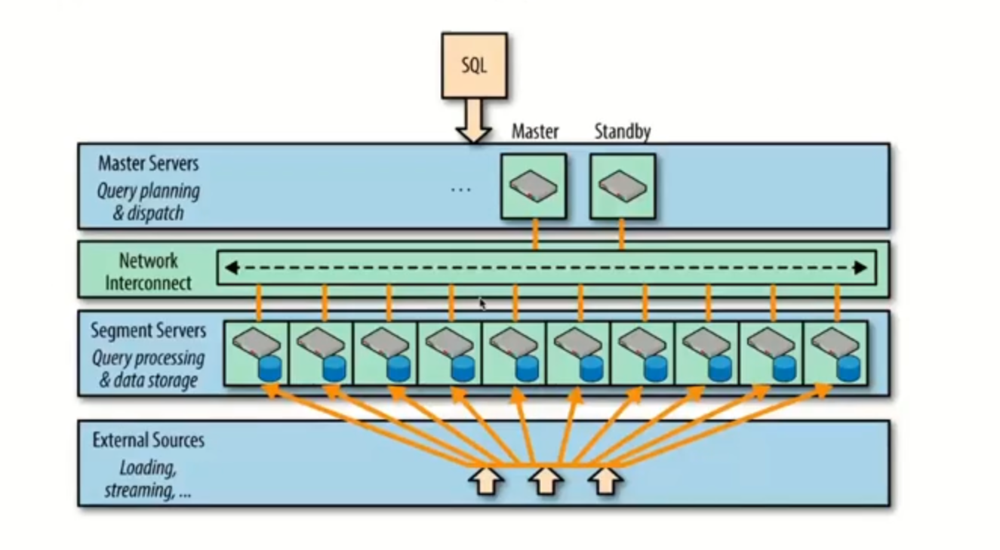
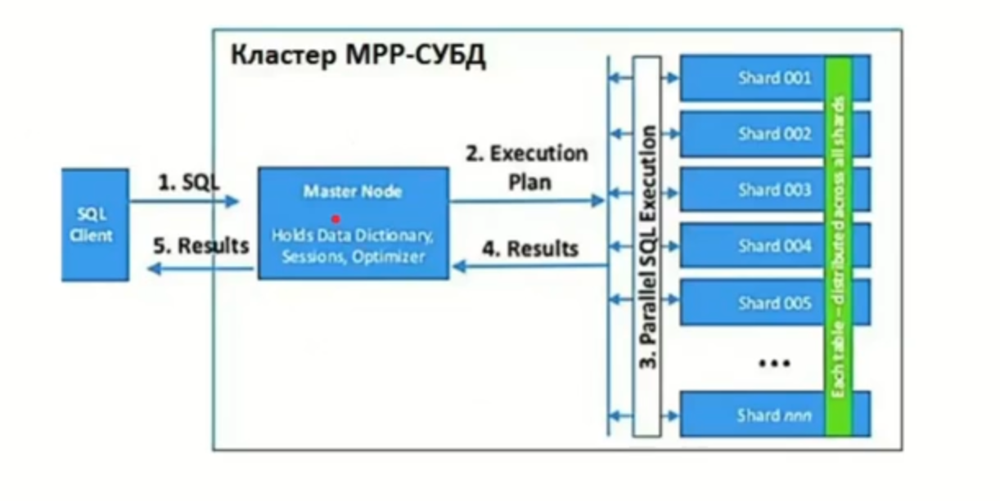
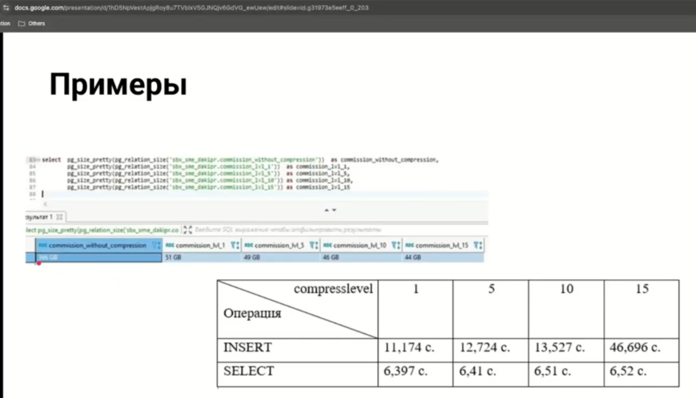
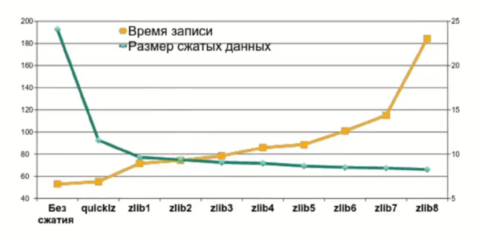

# Интеграция с Postgres/Greenplum

## Введение в PostgreSQL

Постгрес - отличное решение в качестве БД для какой то метаинфы, его часто используют для этого. 

Сам по себе постгрес имеет некоторое количество ограничений. У постгреса репликация мастер-реплика, плюс всего 2 вида репликации, логическая (pub-sub, уровень sql слоев) и физическая (есть wal файлики, от мастера они идут в реплику, это репликацию readonly - пишем только на одну ноду, с остальных только читаем).

На больших объемах, если у нас есть всего одна нода куда мы можем писать и горизонтальное масштабирование достаточно сильно ограничено (тк реплики ридонли) - нам важно найти те решения, которые может решить эти проблемы. Так появился гринплам.
- столбцовое хранение данных в гринпламе - это именно опция!
- в гринпламе допилен оптимизатор запросов (с учетом объемов гп)

Greenplum - Архитектура



Первый уровень ГП - это слой мастера и стэндбай (как правило, по одному). Это ноды постгреса, которые содержат только метаинформацию (глобальный системный каталог, статистики, системные представления). Дальше идет некоторая прослойка (network interconnect), соединяющая ноды ценной инфы и ноды вычислительные. Это 10-гб-тная сеть, udp+дополнительные штуки. Segment servers - на одной железяке может хранится от 2 до 8 сегментов (баз данных) постгреса (как правило, выбирают 4 или 6). Как правило, гринплам - это 200 железяк * количество сегментов. Помимо primary сегментов (primary нод постгреса) есть еще mirror ноды. Все это работает в параллели

- несколько взаимосвязанных экземпляров базы данных PostgreSQL
- объединенные в кластер по принципу массивно-параллельной архитектуры (Massive Parallel Processing, MPP)
- без разделения ресурсов (Shared Nothing)
- каждый узел кластера, взаимодействующий с другими для выполнения вычислительных операций, имеет собственную память, операционную систему и жесткие диски.

Для повышения надежности к типовой топологии master-slave добавлен резервный главный сервер. Между мастером и стэнд бай репликация физическая. Состав кластера Greenplum
- Мастер-сервер(Master host), где развернут главный инстанс PostgreSQL (Master instance). Это точка входа в Greenplum, куда подключаются клиенты, отправляя SQL-запросы. Мастер координирует свою работу с сегментами – другими экземплярами базы данных PostgreSQL. Мастер распределяет нагрузку между сегментами, но сам не содержит никаких пользовательских данных – они хранятся только на сегментах.
- Резервный мастер(Secondary master instance) — инстанс PostgreSQL, включаемый вручную при отказе основного мастера.
- Сервер-сегмент (Segment host), где хранятся и обрабатываются данные. На одном хост-сегменте содержится 2-8 сегментов Greenplum – независимых экземпляров PostgreSQL с частье данных. Сегменты Greenplum бывает основные (primary) и зеркальные (mirror). Primary-сегмент обрабатывает локальные данные и отдает результаты мастеру. Каждому primary-сегменту соответствует свое зеркало (Mirror segment instance), которое автоматически включается в работу при отказе primary.
- Интерконнект (interconnect) – быстрое обособленное сетевое соединение для связи между отдельными экземплярами PostgreSQL.-

При раскатке мы дополняем sh файлами. Работа происходит через ssh ключи. Количество нод прописывается через gp_initsystem.config, в нем указывается дата директория для мастера (куда писать файлики) и для сегментов

Выбор правильного ключа для секционирования/шардирования
- В Greenplum каждая таблица представлена в виде (N+1) таблиц на всех сегментах кластера, где N – число сегментов + 1 таблица на мастере, где нет пользовательских данных. На каждом сегменте хранится 1/N строк таблицы.*
- Логика разбиения таблицы на сегменты задаётся ключом (полем) дистрибуции, на основе которого любую строку можно отнести к одному из сегментов. Поскольку именно ключ дистрибуции задает распределение данных по сегментам кластера, выбирать это поле нужно по принципу равномерного распределения значений в нем

Как выполняются запросы:  


Применение ГП
- Cистемы предиктивной аналитики и регулярной отчетности по большими объемами данных;
- Построение озер (Data Lake) и корпоративных хранилищ данных (КХД);
- Разработка аналитических моделей по множеству разнообразных данных, например, для прогнозирования оттока клиентов (Churn Rate).

Недостатки
- Высокие требования к ресурсам ЦП, памяти и жестким дискам, а также к сетевой инфраструктуре
- Низкая производительность при большом объеме простых запросов, выполняющих одну операцию, т.к. каждая транзакция на мастере порождает множество зеркальных транзакций на сегментах
- Неоптимальное распределение сегментов, что может негативно отразиться на производительности кластера при его расширении.

Немного по сжатию:  


Сжатие 1 - самое эффективное по соотношению цена-качество! Эффективность алгоритмов сжатия:


## Интеграции с ClickHouse 53 00

Неплохо расписано в [доке](https://clickhouse.com/docs/en/engines/table-engines/integrations/postgresql), плюс есть ссылка на блог в 2 частях ([раз](https://clickhouse.com/blog/migrating-data-between-clickhouse-postgres), [два](https://clickhouse.com/blog/migrating-data-between-clickhouse-postgres-part-2)). Ооооочень хорошо расписано

Варианты интеграции
- движок БД PostgreSQL
- движок таблиц PostgreSQL
- табличная функция postgresql (когда хотим просто потрогать какие то данные)
- источник словарей PostgreSQL (очень активно используется)
- движок таблиц для репликации MaterializedPostgreSQL (приземляем данные мы только в случае таких движков)
- движок баз данных для репликации MaterializedPostgreSQL. Можем напрямую воссоздать постгресовую БД как она есть. Совет от лектора - не применять на проде ничего экспериментального.

Постгрес можно использовать и как источник, и как приемник! То есть мы не только можем читать из постгреса, но можем и писать в него. Но при этом все запросы идут по сети - то есть сетка должна быть достаточно хорошая чтобы все это передавать. Таблица с приведением типов есть [тут](https://clickhouse.com/docs/en/integrations/postgresql/data-type-mappings) (но таймстамп в дейттайм не всегда конвертируется - когда он с таймзоной, например. Тогда нужно делать на стороне пг `::temistamp(0)`)

С3 в качестве прослойки использовать не рекомендуется.

У ГП есть такая замечательная штука как PXF. Это некоторый набор предподготовленных коннекторов. PXF подразумевает создание некоторой внешней таблицы. Эта интеграция встречается достаточно часто когда нужно из гп сходить в клик (`create external table <table_name> location`), в location прописывается протокол, по которому мы подключаемся. ЗАпускается на каждом из сегментных хостов. Нюансы тут такие:
- pxf использует jdbc, который настраивается отвратительно + страдает ненадежностью.

Есть еще такая штука как gpfdist. Это уровень подкапотный, дата директории (PXF - уровень sql). Это протокол, который запускается на стороне приемщика данных, там поднимается и начинает перетягивать данные. Работает быстрее поскольку обращается напрямую к дата директориям. Но настраивается сложнее, поэтому используется сильно реже.

Из практики:
- если данных немного - используем airbyte
- можем использовать словари
- дбт
- эирфлоу (можем использовать баш и интегрировать консольные клиенты друг в дружку - через баш запускать psql и писать в clickhouse-client), нужно только правильно составить команду. Так данные будут тянуться напрямую через stdin эирфлоу в кликхаус и наоборот.

[Дефолтно](https://clickhouse.com/docs/en/engines/table-engines/integrations/postgresql#implementation-details) (через движки) данные тянутся через copy statement - это очень медленно. Копи - это не параллельная структура, работает через мастер. Терабайты данных через это передавать не получится.

Интеграция через ClickHouseAirflowOperator - самая легкая и самая легконастраиваемая.

ПГ в докере - есть нюансы, тк незащищен. 

1 30 00 небольшое демо. Поднимаес постгрес, поднимаем БД (заливаем данные). Дальше использовали табличную функцию. Главное чтобы совпали типы данных!
```sql
-- ch
select * from postgresql('0.0.0.0:5432', 'demo', 'aircraft_data', 'postrges', 'postgres123', 'bookings');
```

1 39 00 по дз ; если мы на разных машинах - нужно поправить настройки доступности постгреса (файл `/etc/postgresql/16/main/pg_hba.conf`), если пишет что файла нет или он пустой - это неправильно, он всегда должен быть, тк это один из конфигурационных файлов.
```
sudo nano /etc/postgresql/16/main/pg_hba.conf

    host    all             all              0.0.0.0/0                       trust
    host    all             all              ::/0                            trust

sudo nano /etc/postgresql/16/main/postgresql.conf
    
    listen_addresses = '*'

sudo pg_ctlcluster 16 main restart
```
Рестартовать обязательно - это сетевые настройки, требующие перезапуска.

ОЧЕНЬ ВАЖНО! Нужно не забыть поставить надежный пароль, тк иначе могут ломануть. Ходят сканеры которые смотрят открытые порты, а у пг порт достаточно распространенный, при этом из пг можно залезть в баш. Поэтому первая команда после запуска - `alter user postgres with password <pw>`