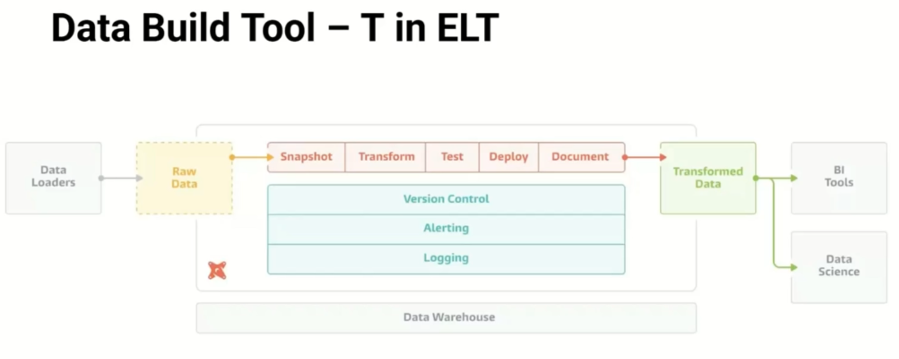
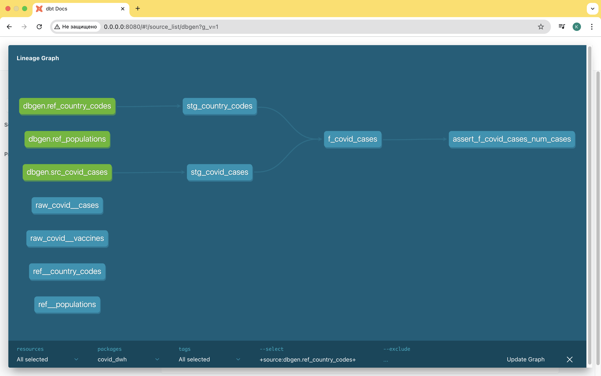

# Clickhouse и dbt

## dbt

Основное назначение - упрощение етл пайплайнов. Раньше часто применялись хранимые процедуры и udf, но тут проблема в том, что они именно хранимые, то есть находятся внутри БД. Поэтому с системой контроля версий, ci/cd пайплайнами их тяжело интегрировать. Другой вариант - оркестраторы (эирфлоу и тд).

dbt объединяет в себе возможности кода на sql и окрестраторов. При этом это именно инструмент для трансформаций (T в ETL)! Причем с учетом порядка, выстраиванием графа зависимостей между таблицами, которые в нем находятся. 
- тестирование - чтобы быть точно уверенным что после изменений ничего не поломается (проверки что в колонке нет нулей, значения входят в определенный диапазон и более сложные проверки). 
- документация - дбт генерирует на основе модели документацию + добавляет визуальное отображение.
- реализация концепции `database as code`



Алертинг и логирование осуществляются за счет prehook, posthook, которые выполняются после выполнения определенного шага пайплайна (например, когда данные прогрузились в табллицу - выполняется постхук). Можно делать снэпшоты данных - это point-in-time таблица, в которую добавляется история изменения данных с колонками из исходной таблицы, изменения в которой отслеживаются, и с колонками, которые отвечают за историчность (когда запись появилась и флажок версии).

Все есть модель - все таблицы, которые присутствуют в нашем зранилище, формируются за счет селект запроса (единственное исключение - входные данные), каждая таблица описывается с помощью селект запроса. Все модели выстраиваются в определенную последовательность, что позволяет избежать ситуаций попадания данных в таблицу следующего слоя, минуя предыдущий.

Гибкость обеспечивается за счет jinja templates, с помощью них можно добавлять различную пользовательскую логику чтобы по разному формировать sql запросы.
```sql
select *
from tbl

where created_at <= dateadd('day', -3, current_date)

```

Мы можем запустить формирование хранилища за счет команды `dbt run`. dbt - это command-line утилита, которая написана на python и может быть установлена как питоновская библиотека с помощью pip. Можно подключить к коду своего приложения, но в большинстве случаев достаточно интерфейса, который предоставляет command-line инструмент. В рабочих процессах это обычно вызов из эирфлоу определенных дбт-команд чтобы сформировать ту или иную модель или прогнать тесты. 
```bash
# multiple arguments can be provided to --models
dbt run --models model1 model2

# these arguments can be projects, models, directory paths, tags or sources
dbt run --models tag:nightly my_model finance.base.*

# use methods and intersections for more complex selectors
dbt run --models path:merts/finance,tag:nightly,config.materialized:table

dbt run --models my_model+  # select my_model and all children
dbt run --models +my_model  # select my_model and all parents
dbt run --models +my_model+  # select my_model and all children and parents
```

## Конфигурация дбт

Будет использоваться датасет по ковиду из с3. Данные перегоняются с помощью интеграционных движков с3 в кликхаус, оттуда - в stage слой, каждая таблица там будет соответствовать оперделенному файлу. Следующий слой - одс и затем витрины данных. DDS - слой, в котором данные структурируются в соответствии с моделью данных, которая удобна для анализа, агрегации и работы с данными. Данные в стейдж слой переносятся один-к-одному, а вот в ддс слое таблица может собираться из нескольких таблиц!  
s3 -> stg -> ods -> dds -> dm

Файлы с данными приложены к лекциям.

32 00 демо заготовки проекта дбт. Он состоит из конфигурационных файлов и непосредственно самого кода.

Конфигурационных файлов 3:
- `dbt_project.yml` - тут описываются структура и параметры проекта (где и в каких папках что находится, какой профиль используется при запуске, служебные параметры (название, версия), структура моделей (иерархия директорий в `models`)). здесь мы указываем, какие таблицы в какой вид материализации будут использоваться, какие теги будут использоваться и тд. Есть следующие виды материализаций:
  - view materialization - создает вью (подойдут для витрин данных)
  - table materialization - создает таблицу
  - incremental materialization - создает таблицу если ее еще не существует, а затем пишет туда только новое
  - ephemeral materialization - внутренняя штука для дбт, объектов в бд не созздает
  - также есть [экспериментальные](https://docs.getdbt.com/reference/resource-configs/clickhouse-configs) модели, специфичные для кликхауса
- `packages.yml` - нужен для менеджмента зависимостей. Далеко не все возможности есть в dbt-core, тут оможно докинуть другие пакеты, например, `dbt_utils` расширяет возможности тестирования (из коробки есть всего 6 варинтов тестов), работу с датами, строками, математикой. Тут можно также указать ссылку на гитхаб репозиторий.
- `profiles.yml` - описание подключений к двх. Здесь мы можем указать несколько параметров подключений для разных окружений.

Пример `packages.yml`:
```yaml
packeges:
    - package: dbt-labs/dbt_utils
      version: [">=1.0.0", "<1.6.0"]
```

Пример `profiles.yml`:
```yaml
config:
    send_anonymous_usage_stats: False
    use_colors: True
    partial_parse: True

covid_dwh:
    outputs:
        ci:
            type: clickhouse
            host: clickhouse  # у препода дбт был запущен в докере
            port: 8123
            schema: default
            threads: 4    
        ci:
            type: clickhouse
            host: clickhouse
            port: 8123
            schema: default
            threads: 4
        prod:
            host: "{{ env_vars('DBT_USER')}}"
            password: "{{ env_vars('DBT_PASSWORD')}}"
            secure: True
            verify: False         
```

По поводу `dbt_project.yml` - для таблиц (table materialization) в качестве параметров мы можем указать:
- materialized - How the model will be materialized into ClickHouse. Must be table to create a table model. (Required)
- engine -  The table engine to use when creating tables. See list of supported engines below. (Optional (default: MergeTree())) (поддерживаются не все - есть MergeTree, HDFS, MaterializedPostgreSQL, S3, EmbeddedRocksDB, Hive и несколько экспериментальных: Distributed, Dictionary)
- order_by - A tuple of column names or arbitrary expressions. This allows you to create a small sparse index that helps find data faster. (Optional (default: tuple()))
- partition_by - A partition is a logical combination of records in a table by a specified criterion. The partition key can be any expression from the table columns. (Optional)
```yaml
models:
  <resource-path>:
    +materialized: table
    +order_by: [ <column-name>, ... ]
    +engine: <engine-type>
    +partition_by: [ <column-name>, ... ]
```

Пример dbt_project.yml (тут мы указываем если модели будут применяться ко всему):
```yaml
models:
  covid_dwh:
    materialized: table  # все модели, которые у нас есть, будут создаваться как таблицы
    staging:  # переопределяем для стейдж слоя (по имени директории)
        +materialized: table
        +tags: ['staging']
```
альтернативный вариант, как мы можем указать конфигурацию - непосредственно в самой модели. Например, файл models/staging/staging.yml
```

```
еще в директории models/staging есть файл stg_covid_cases.sql, он будет содержать саму модель (какую таблицу создаем и чем заполняем). Первое что мы тут указываем - конфигурация (определенные параметры таблицы)
```sql
{{
    -- сами параметры указываются без кавычек!
    engine = 'MergeTree'  -- один из движков, которые поддерживаются
    order_by = 'date_rep'
}}
```

В директории seeds будут храниться всякие csv файлы, данные, которые мы будет вставлять.

55 00 кусок докер компоуза препода!

Проверить подключение мы можем с помощью команды `dbt debug`. Она проверяет 3 вещи:
- что у нас корректный файл `dbt_project.yml`, то есть корректные параметры проекта
- что у нас корректные профили
- само подключение - дбт подключается к кликхаусу в соответствии с выбранным профилем
```bash
cd /workspaces/covid_cases_dwh/
dbt debug
# 18:16:52  Running with dbt=1.4.0
# dbt version: 1.4.0
# python version: 3.9.9
# python path: /usr/local/bin/python
# os info: Linux-5.10.104-linuxkit-x86_64-with-glibc2.31
# Using profiles.yml file at /workspaces/covid_cases_dwh/profiles.yml
# Using dbt_project.yml file at /workspaces/covid_cases_dwh/dbt_project.yml

# Configuration:
#   profiles.yml file [OK found and valid]
#   dbt_project.yml file [OK found and valid]

# Required dependencies:
#  - git [OK found]

# Connection:
#   driver: None
#   host: clickhouse
#   port: 8123
#   user: default
#   schema: default
#   retries: 1
#   database_engine: None
#   cluster_mode: False
#   secure: False
#   verify: True
#   connect_timeout: 10
#   send_receive_timeout: 300
#   sync_request_timeout: 5
#   compress_block_size: 1048576
#   compression: 
#   check_exchange: True
#   custom_settings: None
#   use_lw_deletes: False
#   Connection test: [OK connection ok]

# All checks passed!
```

Далее установим зависимости - они указываются в файле `profiles.yml`. Берутся все библиотеки и производится их установка в директории `dbt_packages` (там служебные файлы, так что смело кидаем в гитигнор)
```bash
dbt deps
# 18:17:45  Running with dbt=1.4.0
# 18:17:47  Installing dbt-labs/dbt_utils
# 18:17:52    Installed from version 1.3.0
# 18:17:52    Up to date!
```
После установки зависимостей и проверки подключения - можно запускать непосредственно загрузку в хранилище. Для жтого нам нужно как то из с3 подгрузить данные. Но дбт с источниками данных работать особо не умеет. Есть команда `dbt seed` - она берет данные из csv файлов, которые находятся в директории, указанной в нашел файле настроек `dbt_project.yml` (секция `seed-paths`), отсюда берутся csv файлы, преобразуются в инсерт-запросы и выполняются в субд. Также на помощь могут прийти макросы + [интеграционные тесты](../clusters/ch_and_dbt/dbt-clickhouse-example/macros/init_s3_sources.sql)). По сути, интеграционные таблицы - это иниты, дбт может выполнить некоторый sql запрос, с помощью которого таблицы создадутся и данные подгрузятся. Макрос можно представить как функцию, которую мы можем вызывать либо из кода (внутри самих моделек), либо из командной строки с помощью команды `run-operation`:
```bash
dbt run-operation init_s3_sources  # название макроса - это не название файла! это название внутри файла, имя функции
# 18:28:25  Running with dbt=1.4.0
# Initialized source tables – Covid Cases (S3)
```
В jinja мы можем создать список и потом по нему проитерироваться и выполнить запросы , для выполнения запросов применяется `run_query`. 
```sql
    
        
    
```
При этом запросы выполнятся, данные появятся, а дбт про них ничего знать не будет, потому что макрос - это не модель. В граф зависимостей (граф моделей) это никак не попадет. Чтобы из моделей мы могли обращаться к созданным таблицам, описывается `sources.yml` - это еще один ямл файл, описание источников данных (из какой БД и каких таблиц дбт может брать исходные данные). Дальше мы уже можем обращаться к этим таблицам из наших моделей. Все модели - это результат выполнения селект запросов! Так что нам нужно обратиться к источнику. Обращаемся к таблицам, которые описаны в `sources.yml`, при этом можем использовать jinja подстановки:
```sql
{{
config (
   engine = 'MergeTree',
   order_by ='date_rep'
)
}}

select
 toDate(parseDateTimeBestEffort(date_rep)) as date_rep,
 cases, deaths, geo_id
 from {{source('dbgen', 'src_covid_cases')}}
```

Файлы в директории models (например, `models/marts/marts.yml`) нужны в первую очередь для документирования. Из этих ямл файлов дбт берет информацию чтобы автоматически составить документацию. В этих файлах указывается, какие модели находятся в этой директории, какие поля у этих моделей и что нужно проверить. Пример:
```yaml
version: 2

models:
  - name: stg_covid_cases
    columns:
      - name: date_rep
        tests:
        - not_null  # не должно быть пустых значений
```

Еще одна штука, которая очень широко используется в дбт - это cte. 
```sql
with cases as (
    select date_rep, cases, deaths, geo_id from {{ref('stg_covid_cases')}}
),
countries as (
    select  country, alpha_2code as code from {{ref('stg_country_codes')}}
),
result as (
    select cases.cases, cases.deaths, cases.date_rep as report_date, countries.country
    from cases
    join countries on cases.geo_id = countries.code
)
select * from result
```
здесь `{{ref('stg_covid_cases')}` - реф - это макроподстановка, указываем название модели, к которой хотим обратиться.

После того как все сконфигурировали - у нас есть 2 команды, которые мы можем запустить, `dbt run` и `dbt build`. Разница в том, что когда мы запускаем run, будет происходить непосредственно создание модели и наполнение хранилища. dbt build еще дополнительно прогоняет тесты, которые в ямл файлах указываются и которые мы при желании можем написать в папку tests. Попробуем запустить прогрузку в стейдж слой. Есть materialized incremental - единственный случай, когда у нас не пересоздается модель, а обновляется. Если у нас поменялся сам код, то нам нужно пересоздать, чтобы структура таблицы изменилась. В этом случае для инкрементальных моделей поможет опция `--full-refresh`:
```bash
dbt run --full-refresh
# 19:33:23  Running with dbt=1.4.0
# 19:33:24  Found 3 models, 10 tests, 0 snapshots, 0 analyses, 432 macros, 0 operations, 4 seed files, 3 sources, 0 exposures, 0 metrics
# 19:33:24  
# 19:33:25  Concurrency: 4 threads (target='dev')
# 19:33:25  
# 19:33:26  1 of 3 START sql table model default.stg_country_codes ......................... [RUN]
# 19:33:26  2 of 3 START sql table model default.stg_covid_cases ........................... [RUN]
# 19:33:28  1 of 3 OK created sql table model default.stg_country_codes .................... [OK in 2.05s]
# 19:33:28  2 of 3 OK created sql table model default.stg_covid_cases ...................... [OK in 2.09s]
# 19:33:28  3 of 3 START sql table model default.f_covid_cases ............................. [RUN]
# 19:33:28  3 of 3 OK created sql table model default.f_covid_cases ........................ [OK in 0.41s]
# 19:33:28  
# 19:33:28  Finished running 3 table models in 0 hours 0 minutes and 4.26 seconds (4.26s).
# 19:33:28  
# 19:33:28  Completed successfully
# 19:33:28  
# 19:33:28  Done. PASS=3 WARN=0 ERROR=0 SKIP=0 TOTAL=3
```
Проверяем в базе - все должно появиться.

Когда моделей становится много - очень полезными становятся [ямл-файлы](../clusters/ch_and_dbt/dbt-clickhouse-example/models/marts/marts.yml), которые содержат документацию описания, что у нас есть.

В завершение попробуем сгенерировать документацию для нашего проекта и посмотрим, как она выглядит.
```bash
dbt docs generate
# usage: dbt docs [-h] {generate,serve} ...
# dbt docs: error: argument {generate,serve}: invalid choice: 'gen' (choose from 'generate', 'serve')
# root@b17efcb9f012:/workspaces/covid_cases_dwh# dbt docs generate
# 19:46:28  Running with dbt=1.4.0
# 19:46:30  Found 3 models, 10 tests, 0 snapshots, 0 analyses, 432 macros, 0 operations, 4 seed files, 3 sources, 0 exposures, 0 metrics
# 19:46:30  
# 19:46:31  Concurrency: 4 threads (target='dev')
# 19:46:31  
# 19:46:32  Done.
# 19:46:33  Building catalog
# 19:46:33  Catalog written to /workspaces/covid_cases_dwh/target/catalog.json
dbt docs serve  
```
`dbt docs serve` - эта команда позволит посмотреть документацию в браузере. Нижний правый угол, синяя кнопка - позволяет посмотреть линейдж.



Также можем посмотреть, что непосредственно в проект входит. В дбген (слева sources -> {{ имя таблицы}} ) чем больше мы инфы забьем в ямл файлики, тем больше инфы здесь отобразится. Полезная графа - Depends on, от чего данная таблица зависит (а еще есть referenced by)